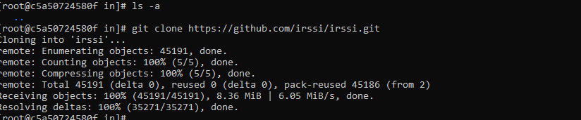

# Sprawozdanie 1

---

## Laboratorium 1

---

#### 1. Zainstaluj klienta Git i obsługę kluczy SSH

(Wszystkie kroki wykonano na systemie Fedora)  
(Po najechaniu na obraz wyświetla się tooltip z opisem)  
Najpierw zainstalowano klienta git, korzystając z polecenia: **yum install git -y**  
Obsługa kluczy SSH była już zainstalowana ponieważ podczas instalacji wybrano wersję Server Edition systemu  

#### 2. Sklonuj repozytorium przedmiotowe za pomocą HTTPS i personal access token

Aby sklonować repo za pomocą HTTPS użyto polecenia: **git clone https://github.com/InzynieriaOprogramowaniaAGH/MDO2025_INO.git** 

  

Z kolei aby sklonować repo za pomocą personal access token, najpierw wygenerowano PAT w ustawieniach githuba.  

  

#### 3. Upewnij się w kwestii dostępu do repozytorium jako uczestnik i sklonuj je za pomocą utworzonego klucza SSH, zapoznaj się dokumentacją.

  

* Utwórz dwa klucze SSH, inne niż RSA, w tym co najmniej jeden zabezpieczony hasłem 

  

* Skonfiguruj klucz SSH jako metodę dostępu do GitHuba  

  

* Sklonuj repozytorium z wykorzystaniem protokołu SSH  

  

* Skonfiguruj 2FA  

  

#### 4. Przełącz się na gałąź main, a potem na gałąź swojej grupy (pilnuj gałęzi i katalogu!)

Przełączać się między gałęziami można za pomocą polecenia git checkout  

#### 5. Utwórz gałąź o nazwie "inicjały & nr indeksu" np. KD232144. Miej na uwadze, że odgałęziasz się od brancha grupy!

  

#### 6. Rozpocznij pracę na nowej gałęzi

* W katalogu właściwym dla grupy utwórz nowy katalog, także o nazwie "inicjały & nr indeksu" np. KD232144  
Można osiągnąć to poleceniem **mkdir**
* Napisz Git hooka - skrypt weryfikujący, że każdy Twój "commit message" zaczyna się od "twoje inicjały & nr indexu". (Przykładowe githook'i są w .git/hooks.)  
* Dodaj ten skrypt do stworzonego wcześniej katalogu.  

  

*Skopiuj go we właściwe miejsce, tak by uruchamiał się za każdym razem kiedy robisz commita.  

Aby hook działał został stworzony w lokalizacji .git/hooks/ o nazwie commit-msg  
Należało też nadać mu uprawnienia do uruchamiania:  

  

* Umieść treść githooka w sprawozdaniu.  

**#!/usr/bin/bash**
**commit_msg_file=$1**
**#cat $commit_msg_file**
**count=$(grep -c '^JK403999' "$commit_msg_file")**
**#echo $count**
**if [ "$count" -eq 0 ]; then**
        **echo >&2 Commit musi zaczynac sie od inicjałów i numeru albumu**
        **exit 1**
**fi**

* W katalogu dodaj plik ze sprawozdaniem  
* Dodaj zrzuty ekranu (jako inline)  

Powyższy hook, sprawi że tylko commit zaczynający się od "JK403999" będzie mógł zostać dodany  

  

* Wyślij zmiany do zdalnego źródła  

  

* Spróbuj wciągnąć swoją gałąź do gałęzi grupowej  

  

* Zaktualizuj sprawozdanie i zrzuty o ten krok i wyślij aktualizację do zdalnego źródła (na swojej gałęzi)  

---

## Laboratorium 2

---

1. Zainstaluj Docker w systemie linuksowym
   - użyj repozytorium dystrybucji, jeżeli to możliwe (zamiast Community Edition)

          

   - rozważ niestosowanie rozwiązania Snap (w Ubuntu)

3. Zarejestruj się w [Docker Hub](https://hub.docker.com/) i zapoznaj z sugerowanymi obrazami

  

4. Pobierz obrazy `hello-world`, `busybox`, `ubuntu` lub `fedora`, `mysql`

Obrazy dockera można pobrać poleceniem: **docker pull <nazwa_obrazu>**

  

5. Uruchom kontener z obrazu `busybox`
   - Pokaż efekt uruchomienia kontenera

          
        
        Gdy po prostu uruchomimy busyboxa włączy się on, sprawdzi że nie podaliśmy żadnej dodatkowej komendy, a następnie wyłączy

   - Podłącz się do kontenera **interaktywnie** i wywołaj numer wersji

          

6. Uruchom "system w kontenerze" (czyli kontener z obrazu `fedora` lub `ubuntu`)
   - Zaprezentuj `PID1` w kontenerze i procesy dockera na hoście

          

          

   - Zaktualizuj pakiety

          

   - Wyjdź
   
7. Stwórz własnoręcznie, zbuduj i uruchom prosty plik `Dockerfile` bazujący na wybranym systemie i sklonuj nasze repo.
   - Kieruj się [dobrymi praktykami](https://docs.docker.com/develop/develop-images/dockerfile_best-practices/)

          

   - Upewnij się że obraz będzie miał `git`-a
   - Uruchom w trybie interaktywnym i zweryfikuj że jest tam ściągnięte nasze repozytorium

        

8. Pokaż uruchomione ( != "działające" ) kontenery, wyczyść je.

       

9. Wyczyść obrazy

       

10. Dodaj stworzone pliki `Dockefile` do folderu swojego `Sprawozdanie1` w repozytorium.

---

## Laboratorium 3

---

1. Wykonaj kroki `build` i `test` wewnątrz wybranego kontenera bazowego. Tj. wybierz "wystarczający" kontener, np ```ubuntu``` dla aplikacji C lub ```node``` dla Node.js
	* uruchom kontener
	* podłącz do niego TTY celem rozpoczęcia interaktywnej pracy
	* zaopatrz kontener w wymagania wstępne (jeżeli proces budowania nie robi tego sam)
	* sklonuj repozytorium
	* Skonfiguruj środowisko i uruchom *build*

       

	* uruchom testy

       
     
2. Stwórz dwa pliki `Dockerfile` automatyzujące kroki powyżej, z uwzględnieniem następujących kwestii:
	* Kontener pierwszy ma przeprowadzać wszystkie kroki aż do *builda*

     Zawartość pliku Dockerfile.bld:

     '''    
     **FROM fedora**

     **RUN dnf -y install git meson gcc glib2-devel openssl-devel ncurses-devel perl-ExtUtils-Embed**
     **RUN git clone http://github.com/irssi/irssi.git**
     **WORKDIR /irssi**
     **RUN meson Build**
     **RUN ninja -C Build**
     '''    

     Efekt wykonania polecenia: **docker build -t irssibld -f Dockerfile.bld .** :

       

	* Kontener drugi ma bazować na pierwszym i wykonywać testy (lecz nie robić *builda*!)

     Zawartość pliku Dockerfile.test:

     '''     
     **FROM irssibld**
     **RUN ninja -C Build test**
     '''     

     Efekt wykonania polecenia: **docker build -t irssitest -f Dockerfile.test .** :

       


3. Wykaż, że kontener wdraża się i pracuje poprawnie. Pamiętaj o różnicy między obrazem a kontenerem. Co pracuje w takim kontenerze?

     

---

## Laboratorium 4

---

### Zachowywanie stanu
* Zapoznaj się z dokumentacją:
  * https://docs.docker.com/storage/volumes/
  * https://docs.docker.com/engine/storage/bind-mounts/
  * https://docs.docker.com/engine/storage/volumes/
  * https://docs.docker.com/reference/dockerfile/#volume
  * https://docs.docker.com/reference/dockerfile/#run---mount
* Przygotuj woluminy wejściowy i wyjściowy, o dowolnych nazwach, i podłącz je do kontenera bazowego (np. tego, z którego rozpoczynano poprzednio pracę). Kontener bazowy to ten, który umie budować nasz projekt (ma zainstalowane wszystkie dependencje, `git` nią nie jest)

     

     

* Uruchom kontener, zainstaluj/upewnij się że istnieją niezbędne wymagania wstępne (jeżeli istnieją), ale *bez gita*
* Sklonuj repozytorium na wolumin wejściowy
  * Opisz dokładnie, jak zostało to zrobione
    * Wolumin/kontener pomocniczy?
    * *Bind mount* z lokalnym katalogiem?
    * Kopiowanie do katalogu z woluminem na hoście (`/var/lib/docker`)?
          
     Repozytorium zostało skopiowane na wolumin wejściowy używając polecenia **docker cp** będąc na hoście

     

* Uruchom build w kontenerze - rozważ skopiowanie repozytorium do wewnątrz kontenera

     

     

* Zapisz powstałe/zbudowane pliki na woluminie wyjściowym, tak by były dostępne po wyłączniu kontenera.

     

* Pamiętaj udokumentować wyniki.
* Ponów operację, ale klonowanie na wolumin wejściowy przeprowadź wewnątrz kontenera (użyj gita w kontenerze)

     

* Przedyskutuj możliwość wykonania ww. kroków za pomocą `docker build` i pliku `Dockerfile`. (podpowiedź: `RUN --mount`)

     Możemy użyć wieloetapowego budowania, aby dodatkowo mieć czyste zbudowane środowisko:

     '''
     FROM fedora # etap 1 (budowanie)
     ...
     *INSTALL DEPENDENCIES* ...
     RUN --mount=type=bind ...  # dzieki temu możemy tymczasowo przypiąć folder z repo z hosta, do obrazu
     *BUILD* ...
     ...
     FROM fedora # etap 2 (tworzenie kontenera, zaczynamy od czystego systemu, bez zbędnych narzędzi budowania)
     COPY ...
     VOLUME ...
     ...
     '''

     W ten sposób możemy wykonać wszystkie poprzednie kroki, z użyciem pliku Dockerfile, należy tylko wywołać odpowiednie komendy 
     Docker build (etap 1), a następnie Docker run (etap 2)


### Eksponowanie portu
* Zapoznaj się z dokumentacją https://iperf.fr/
* Uruchom wewnątrz kontenera serwer iperf (iperf3)

     Użyto polecenia: **docker run --rm -d --name iperf-server -p 5201:5201 networkstatic/iperf3 -s** w którym:
     **--rm** oznacza że kontener zostanie automatycznie usunięty po jego zatrzymaniu.
     **-d**   uruchomienie kontenera w tle.
     **-p**   przypisanie który port hosta ma przekazywać połączenie do którego portu kontenera.
     **-s**   argument perfa uruchamiający perf jako server.

     

* Połącz się z nim z drugiego kontenera, zbadaj ruch

         

* Zapoznaj się z dokumentacją `network create` : https://docs.docker.com/engine/reference/commandline/network_create/
* Ponów ten krok, ale wykorzystaj własną dedykowaną sieć mostkową (zamiast domyślnej). Spróbuj użyć rozwiązywania nazw

     Najpierw tworzymy sieć

    

     A następnie podobnym jak poprzednio poleceniem tworzymy kontener, jednak tym razem podajemy nazwę sieci:

          

* Połącz się spoza kontenera (z hosta i spoza hosta)

     Tym razem nie musimy podawać adresu ip do którego chcemy się połączyć ponieważ użycie własnej sieci umożliwia połączenie się na podstawie samej nazwy kontenera

          

     Aby połączyć musimy uruchomić serwer jeszcze raz, podając przekierowany port tak jak, w pierwszym przypadku.
     Z hosta następnie możemy połączyć się w następujący sposób (oczywiście uprzednio musimy zainstalować iperf3 także na hoście) :

          

* Przedstaw przepustowość komunikacji lub problem z jej zmierzeniem (wyciągnij log z kontenera, woluminy mogą pomóc)

     Przepustowość komunikacji z kontenera w stworzonej sieci (sposób drugi ) wynosi około 10 Gbit/s, a przepustowość z kontenera sposobem pierwszym, lub przepustowość z hosta wynosi około 7 Gbit/s

* Opcjonalnie: odwołuj się do kontenera serwerowego za pomocą nazw, a nie adresów IP

### Instancja Jenkins
* Zapoznaj się z dokumentacją  https://www.jenkins.io/doc/book/installing/docker/
* Przeprowadź instalację skonteneryzowanej instancji Jenkinsa z pomocnikiem DIND

     Zgodnie z dokumentacją najpierw należy uruchomić kontener DIND:

          

     Następnie należy zbudować obraz jenkinsa przy użyciu Dockerfila podanego w dokumentacji:

          

* Zainicjalizuj instację, wykaż działające kontenery, pokaż ekran logowania

     Następnie zostało już tylko stworzenie kontenera:

          

     Następnie pozostaje już tylko przekierowanie portu 8080 z maszyny wirtualnej do komputera hosta,
     można to zrobić za pomocą polecenia: ssh -L 8080:localhost:8080 root@127.0.0.1

     

