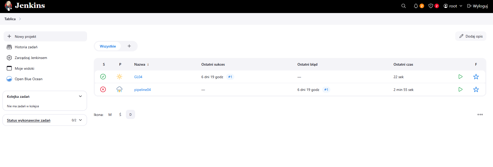
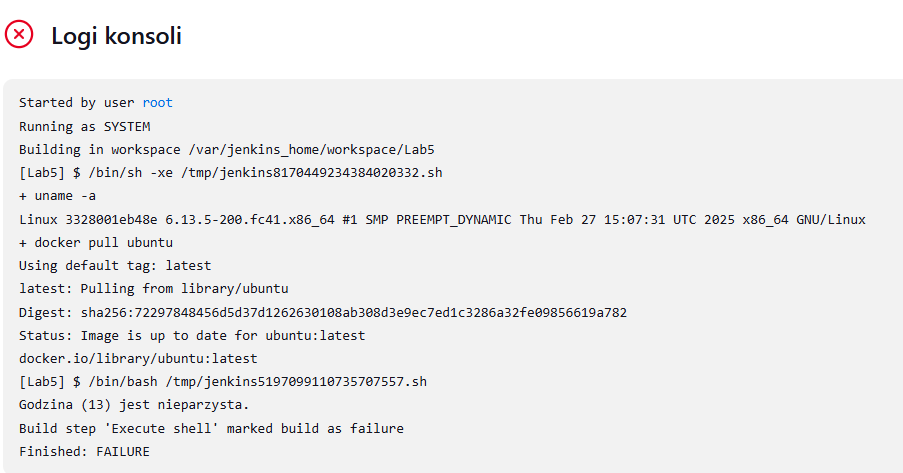
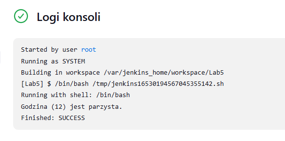
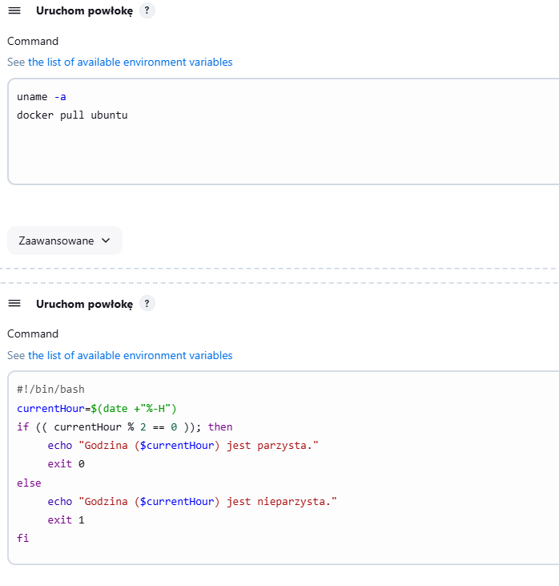
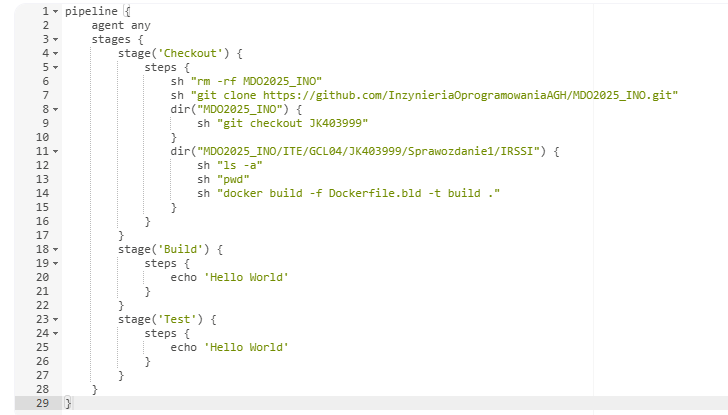
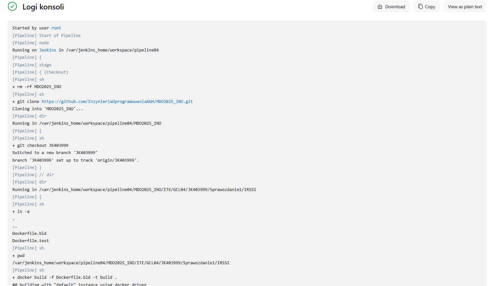
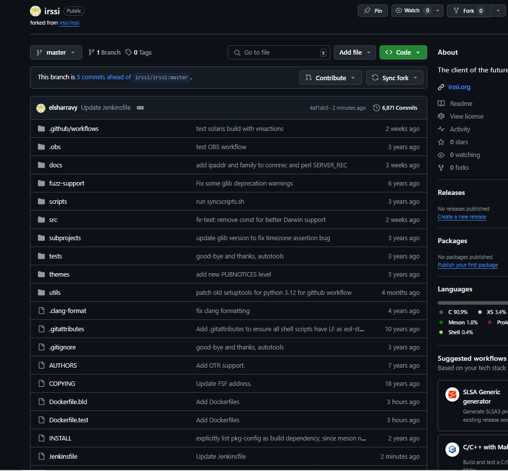
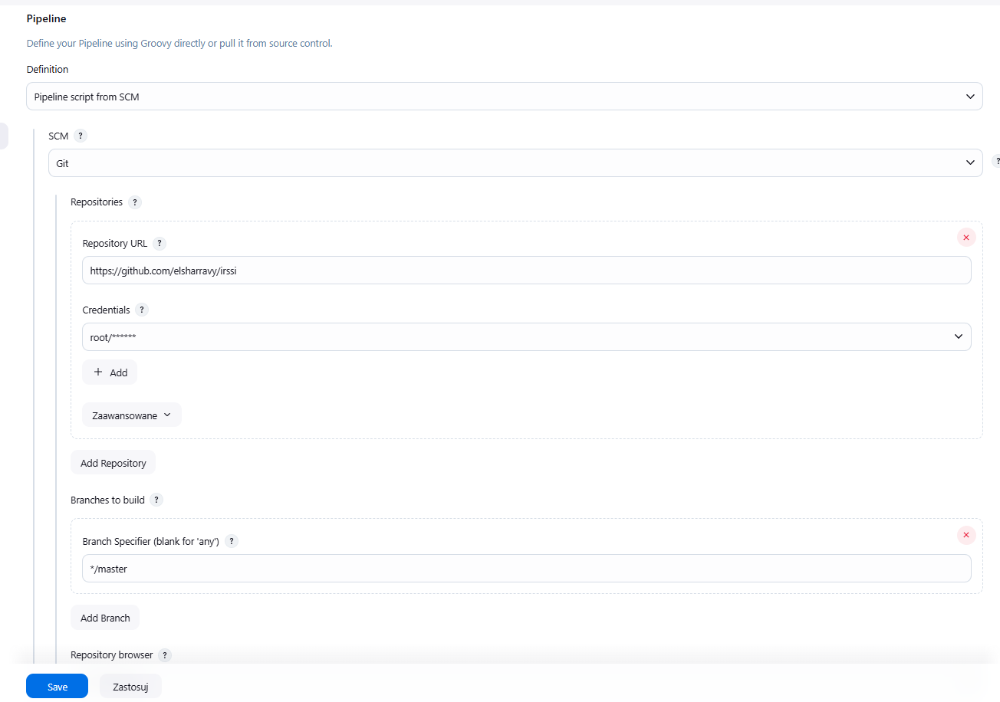
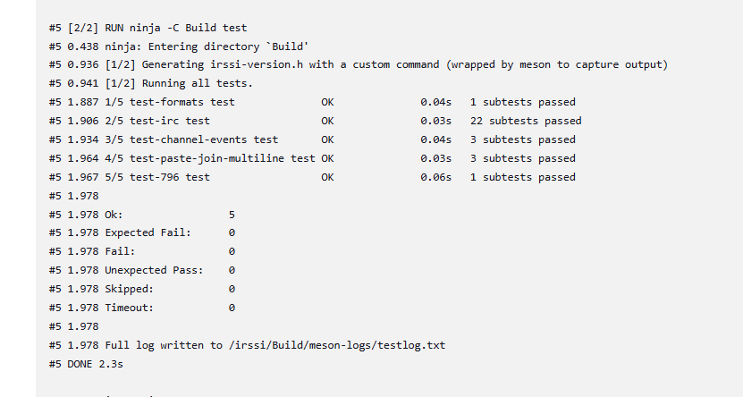

# Sprawozdanie 2

---

## Laboratorium 5, Pipeline, Jenkins, izolacja etapów

---
 
### Przygotowanie
🌵 Utwórz instancję Jenkins
* Upewnij się, że na pewno działają kontenery budujące i testujące, stworzone na poprzednich zajęciach
* Zapoznaj się z instrukcją instalacji Jenkinsa: https://www.jenkins.io/doc/book/installing/docker/
  * Uruchom obraz Dockera który eksponuje środowisko zagnieżdżone
  * Przygotuj obraz blueocean na podstawie obrazu Jenkinsa (czym się różnią?)
  * Uruchom Blueocean
  * Zaloguj się i skonfiguruj Jenkins
  * Zadbaj o archiwizację i zabezpieczenie logów

     Instancję Jenkins stworzyłem już podczas laboratorium numer 4. W sprawozdaniu 1, przedstawiłem proces stworzenia do momentu logowania do Jenkinsa.

     Podczas tego laboratorium przeprowadziłem tworzenie konta w jenkinsie, a w tym celu musiałem z kontenera z jenkinsem odczytać hasło do pierwszego uruchomienia.
     Hasło to zostało wyświetlone po zalogowaniu do kontenera.

     

  
### Zadanie wstępne: uruchomienie
🌵 Zadanie do wykonania na ćwiczeniach
* Konfiguracja wstępna i pierwsze uruchomienie
  * Utwórz projekt, który wyświetla `uname`

  * Utwórz projekt, który zwraca błąd, gdy... godzina jest nieparzysta


    ```#!/bin/bash

     currentHour=$(date +"%-H")

     if (( currentHour % 2 == 0 )); then
          echo "Godzina ($currentHour) jest parzysta."
          exit 0
     else
          echo "Godzina ($currentHour) jest nieparzysta."
          exit 1
     fi
    ```

  

  

  * Pobierz w projekcie obraz kontenera `ubuntu` (stosując `docker pull`)

  

### Zadanie wstępne: obiekt typu pipeline
🌵 Ciąg dalszy sprawozdania - zadanie do wykonania po wykazaniu działania Jenkinsa
* Utwórz nowy obiekt typu `pipeline`
* Wpisz treść *pipeline'u* bezpośrednio do obiektu (nie z SCM - jeszcze!)
  * https://www.jenkins.io/doc/book/pipeline/syntax/
  * https://www.jenkins.io/doc/pipeline/steps/git/
  * https://www.jenkins.io/doc/pipeline/examples/#unstash-different-dir
  * [https://www.jenkins.io/doc/book/pipeline/docker/](https://www.jenkins.io/doc/book/pipeline/docker/#building-containers)
* Spróbuj sklonować repo przedmiotowe (`MDO2025_INO`)
* Zrób *checkout* do swojego pliku Dockerfile (na osobistej gałęzi) właściwego dla *buildera* wybranego w poprzednim sprawozdaniu programu
* Zbuduj Dockerfile

  

  Po całych ośmiu minutach pipeline zakończył swoje działanie sukcesem!

  

  

* Uruchom stworzony *pipeline* drugi raz

  Po raz drugi pipeline wykonał się bez problemów, tym razem tylko w 3 minuty, ponieważ tym razem nie musiał ściągać obrazu do dockera, a także miał już zcachowane wykonane polecenia w kontenerze.

  
 
### Opis celu
Dla osób z wybranym projektem
* Opracuj dokument z diagramami UML, opisującymi proces CI. Opisz:
  * Wymagania wstępne środowiska
  * Diagram aktywności, pokazujący kolejne etapy (collect, build, test, report)
  * Diagram wdrożeniowy, opisujący relacje między składnikami, zasobami i artefaktami
* Diagram będzie naszym wzrocem do porównania w przyszłości

### Pipeline: składnia
Zadanie do wykonania, jeżeli poprawnie działa obiekt *pipeline* i udało się odnaleźć dostęp do plików Dockerfile
* Definiuj pipeline korzystający z kontenerów celem realizacji kroków `build -> test`
* Może, ale nie musi, budować się na dedykowanym DIND, ale może się to dziać od razu na kontenerze CI. Należy udokumentować funkcjonalną różnicę między niniejszymi podejściami
* Docelowo, `Jenkinsfile` definiujący *pipeline* powinien być umieszczony w repozytorium. Optymalnie: w *sforkowanym* repozytorium wybranego oprogramowania

 Zrobiłem forka Irssi do którego dorzuciłem stworzone poprzednio Dockerfile i nowy stworzony Jenkinsfile

  

 Napotkałem takie problemy jak: problemy ze ścieżkami, pull access denied, 

  

  

  Zawartość Jenskinsfila w zforkowanym repozytorium (Zawartość Dockerfilów bez zmian względem poprzedniego sprawozdania)

  ```Jenkinsfile

pipeline {
    agent any
    stages {
        stage('Checkout') {
            steps {
                sh "ls -a"
                //sh "rm -rf irssi"
                //sh "git clone https://github.com/elsharravy/irssi.git" // nie potrzeba klonować, pipeline sam klonuje repo podane w konfiguracji,
                                                                         // w zasadzie ten stage można usunąć bez konsekwencji
            }
        }
        stage('Build') {
            steps {
                    sh "docker build -f Dockerfile.bld -t irssibld ."
            }
        }
        stage('Test') {
            steps {
                    sh "docker build -f Dockerfile.test -t irssitest ."
            }
        }
    }
}

  ```

 Link do sforkowanego repozytorium: https://github.com/elsharravy/irssi

### Kompletny pipeline: wymagane składniki
Kompletny *pipeline* (wprowadzenie) - do wykonania po ustaleniu kształu kroków `deploy` i `publish`
*  Kontener Jenkins i DIND skonfigurowany według instrukcji dostawcy oprogramowania
*  Pliki `Dockerfile` wdrażające instancję Jenkinsa załączone w repozytorium przedmiotowym pod ścieżką i na gałęzi według opisu z poleceń README
*  Zdefiniowany wewnątrz Jenkinsa obiekt projektowy *pipeline*, realizujący następujące kroki:
  * Kontener `Builder`, który powinien bazować na obrazie zawierającym dependencje (`Dependencies`), o ile stworzenie takiego kontenera miało uzasadnienie. Obrazem tym może być np. baza pobrana z Docker Hub (jak obraz node lub 
dotnet) lub obraz stworzony samodzielnie i zarejestrowany/widoczny w DIND (jak np. obraz oparty o Fedorę, doinstalowujący niezbędne zależności, nazwany Dependencies). Jeżeli, jak często w przypadku Node, nie ma różnicy między runtimowym obrazem a obrazem z dependencjami, proszę budować się w oparciu nie o latest, ale o **świadomie wybrany tag z konkretną wersją**

```Dockerfile
FROM fedora

RUN dnf -y install git meson gcc glib2-devel openssl-devel ncurses-devel perl-ExtUtils-Embed
RUN git clone http://github.com/irssi/irssi.git
WORKDIR /irssi
RUN meson Build
RUN ninja -C Build
```

  * Obraz testujący, w ramach kontenera `Tester`
    * budowany przy użyciu ww. kontenera kod, wykorzystujący w tym celu testy obecne w repozytorium programu
    * Zadbaj o dostępność logów i możliwość wnioskowania jakie testy nie przechodzą

```Dockerfile

FROM irssibld
RUN ninja -C Build test

```

  * `Deploy`
    *  Krok uruchamiający aplikację na kontenerze docelowym
    *  Jeżeli kontener buildowy i docelowy **wydają się być te same** - być może warto zacząć od kroku `Publish` poniżej
    *  Jeżeli to kontener buildowy ma być wdrażany - czy na pewno nie trzeba go przypadkiem posprzątać?
    *  Przeprowadź dyskusję dotyczącą tego, jak powinno wyglądać wdrożenie docelowe wybranej aplikacji. Odpowiedz (z uzasadnieniem i dowodem) na następujące kwestie:
        * czy program powinien zostać *„zapakowany”* do jakiegoś przenośnego pliku-formatu (DEB/RPM/TAR/JAR/ZIP/NUPKG)
        * czy program powinien być dystrybuowany jako obraz Docker? Jeżeli tak – czy powinien zawierać zawartość sklonowanego repozytorium, logi i artefakty z *builda*?
        * Przypomnienie: czym się różni (i jakie ma zastosowanie) obraz `node` od `node-slim`
    *  Proszę opisać szczegółowo proces który zostanie opisany jako `Deploy`, ze względu na mnogość podejść

```Dockerfile

FROM irssibld as builder

FROM fedora
RUN microdnf install -y glib2 openssl-libs ncurses perl && \
    microdnf clean all
WORKDIR /irssi
COPY --from=builder /irssi/Build/src/fe-text/irssi /usr/local/bin/irssi
CMD ["irssi"]

```

  Wypisany powyżej plik Dockerfile bazuje na systemie fedora, instaluje zależności konieczne do uruchomienia Irsii a następnie
  ,przeprowadza krok deploy "bazując" na obrazie builda, z którego kopiuje zbudowaną aplikację. Na koniec Dockerfile za pomocą komendy CMD określna co ma zostać uruchomione automatycznie
  w przypadku utworzenia kontenera.
  Jako bazy tego kontenera chciałbym użyć innego obrazu niż fedora, ponieważ ten stosunkowo dużo waży, jednak nie mogłem znaleźć specjalnej lżejszej wersji fedory.
  Docelowo obrazem tym mógłby być na przykład debian-slim, jednak nie chciałem zmieniać systemu w trakcie ćwiczenia.
  

  * `Publish`
    * Przygotowanie wersjonowanego artefaktu, na przykład:
      * Instalator
      * NuGet/Maven/NPM/JAR
      * ZIP ze zbudowanym runtimem
    * Opracuj odpowiednią postać redystrybucyjną swojego artefaktu i/lub obrazu (przygotuj instalator i/lub pakiet, ewentualnie odpowiednio uporządkowany obraz kontenera Docker)
      * Musi powstać co najmniej jeden z tych elementów
      * Jeżeli ma powstać artefakt, dodaj go jako pobieralny obiekt do rezultatów „przejścia” *pipeline’u* Jenkins (https://www.jenkins.io/doc/pipeline/steps/core/).
    * Opcjonalnie, krok `Publish` (w przypadku podania parametru) może dokonywać promocji artefaktu na zewnętrzne *registry*

```Jenkinsfile

pipeline {
    agent any
    stages {
        stage('Checkout') {
            steps {
                sh "ls -a"
            }
        }
        stage('Build') {
            steps {
                    sh "docker build -f Dockerfile.bld -t irssibld ."
            }
        }
        stage('Test') {
            steps {
                    sh "docker build -f Dockerfile.test -t irssitest ."
                
            }
        }
        stage('Deploy'){
            steps {
                    sh "docker build -f Dockerfile.dep -t irssidep ."   
                    sh "docker run -dit irssidep"
            }
        }
        stage('Archive') {
            steps {
                sh 'docker cp $(docker ps -q --filter ancestor=irssidep | head -n 1):/usr/local/bin/irssi ${WORKSPACE}/irssi'
                sh 'ls -la ${WORKSPACE}/irssi'
                archiveArtifacts artifacts: 'irssi/irssi', allowEmptyArchive: false, fingerprint: true   
            }
        }
    }
    post {
        always {
                    sh 'docker ps -q --filter ancestor=irssidep | xargs docker stop | xargs docker rm'
        }
    }
}

```

Powyżej znajduje się ostateczna wersja jenkinsfila, wraz z tworzeniem artefaktu, poprzez skopiowanie binarnego pliku irssi z uruchomionego kontenera, do workspace'a jenkinsowego, a następnie wskazanie tego artefaktu
jenkinsowi do zarchiwizowania. Na zakończenie skrypt niezależnie czy pipeline zakończył się sukcesem czy nie, zatrzymuje stworzony kontener a następnie go usuwa. (dodałem to, żeby nie zaśmiecać sobie niepotrzebnie maszyny).

#### Wskazówka
Po opracowaniu formy redystrybucyjnej, stwórz obraz runtime’owy (bez dependencji potrzebnych wyłącznie do builda!), zasilony artefaktem, zainstaluj w nim program z niego i uruchom. Jeżeli formą redystrybucyjną jest kontener, uruchom kontener – w sposób nieblokujący: pozwól pipeline’owi kontynuować po uruchomieniu, ale wykaż, że program uruchomiony w owym kontenerze działa.

---

## Laboratorium 6

---

