# Sprawozdanie 3

---

## Laboratorium 8: Automatyzacja i zdalne wykonywanie poleceń za pomocą Ansible

---
 
### Instalacja zarządcy Ansible
* 🌵 Utwórz drugą maszynę wirtualną o **jak najmniejszym** zbiorze zainstalowanego oprogramowania
  * Zastosuj ten sam system operacyjny, co "główna" maszyna (najlepiej też w tej samej wersji)

    Wykorzystałem ten sam obraz do instalacji tego systemu co do instalacji głównej maszyny

  * Zapewnij obecność programu `tar` i serwera OpenSSH (`sshd`)

    Sshd został zainstalowany automatycznie po wybraniu instalacji Server Edition, a tar zainstalowałem poleceniem: `dnf install tar`

  * Nadaj maszynie *hostname* `ansible-target` (najlepiej jeszcze podczas instalacji)

    Nadałem maszynie nazwę: ansible-target

    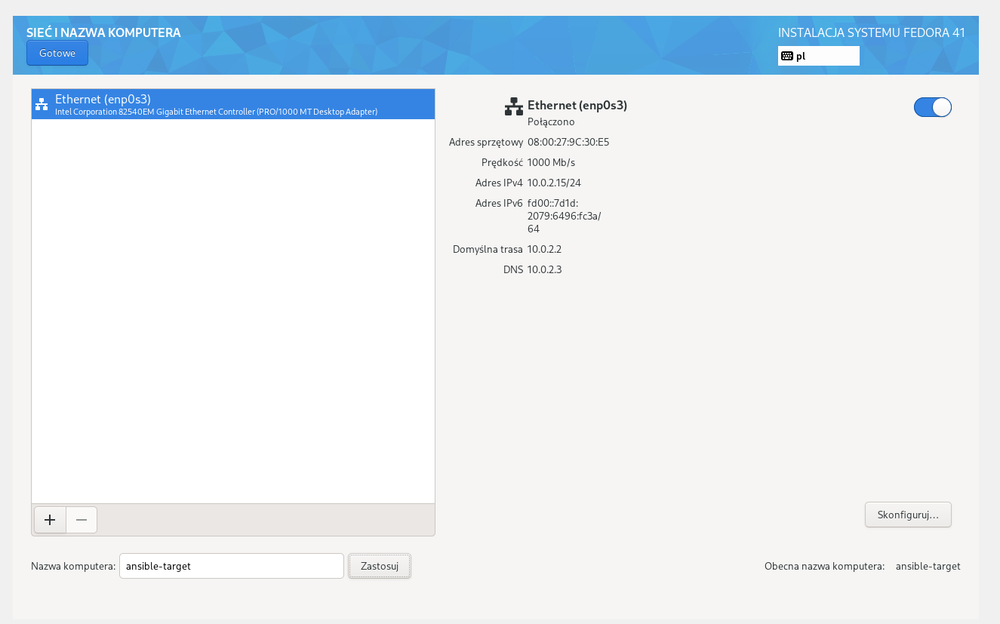

  * Utwórz w systemie użytkownika `ansible` (najlepiej jeszcze podczas instalacji)

    Podczas instalacji stworzyłem użytkownika o nazwie ansible.

    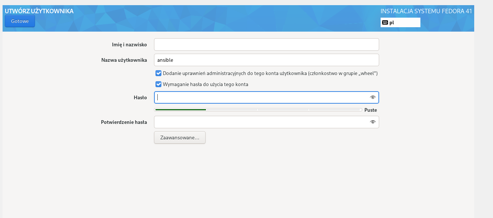

  * Zrób migawkę maszyny (i/lub przeprowadź jej eksport)

    W virtual boxie, klikając prawym przyciskiem na wirtulnej maszynie i wybierając opcję: "Eksportuj do OCI..." można wyeksportować maszynę do formatu .ovi

    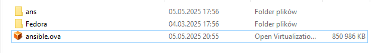

* 🌵 Na głównej maszynie wirtualnej (nie na tej nowej!), zainstaluj [oprogramowanie Ansible](https://docs.ansible.com/ansible/latest/installation_guide/index.html), najlepiej z repozytorium dystrybucji

    Ansible zainstalowałem na głównej maszynie poleceniem: `dnf install ansible`

    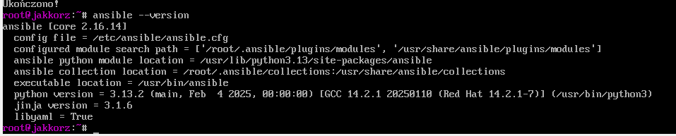

* Wymień klucze SSH między użytkownikiem w głównej maszynie wirtualnej, a użytkownikiem `ansible` z nowej tak, by logowanie `ssh ansible@ansible-target` nie wymagało podania hasła
  
    Najpierw w celu rozpoznawania nazwy hostname dodałem odpowiednie wpisy do pliku etc/hosts na głównej maszynie:

    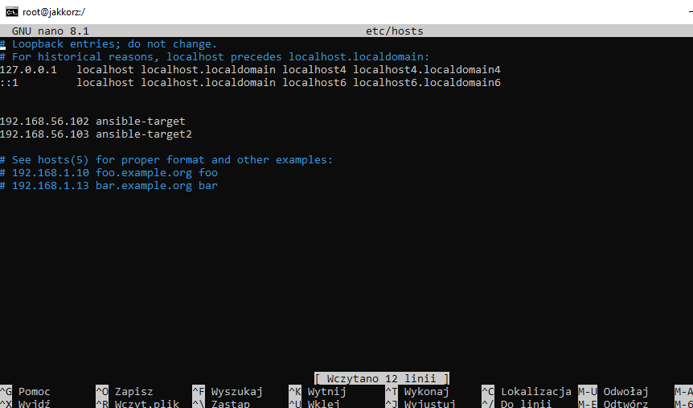

    Dzięki temu mogłem łatwo wygenerować i wymienić klucze, a następnie widać że byłem w stanie zalogować się przez ssh bez hasła

    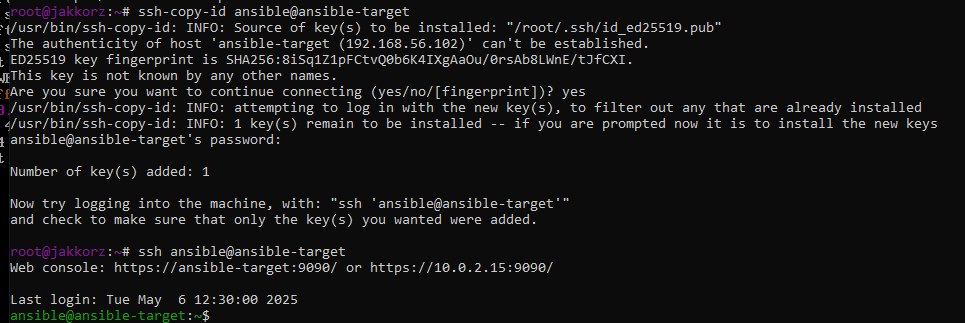

### Inwentaryzacja
* 🌵 Dokonaj inwentaryzacji systemów
  * Ustal przewidywalne nazwy komputerów (maszyn wirtualnych) stosując `hostnamectl`, Unikaj `localhost`.

    Za pomocą polecenia hostnamectl, zmieniłem hostname trzeciej maszyny ( sklonowana druga maszyna, PPM-> Klonuj w virtual boxie )

    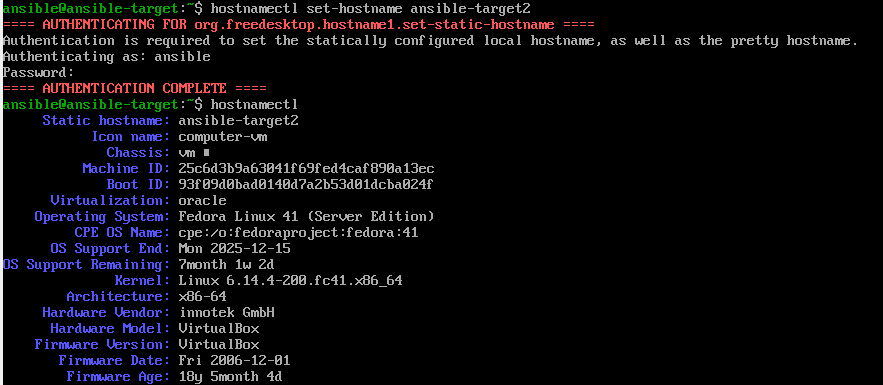

  * Wprowadź nazwy DNS dla maszyn wirtualnych, stosując `systemd-resolved` lub `resolv.conf` i `/etc/hosts` - tak, aby możliwe było wywoływanie komputerów za pomocą nazw, a nie tylko adresów IP

    Dodałem odpowiednie wpisy do etc/hosts:

    

  * Zweryfikuj łączność

    Po wykonaniu wszystkich powyższych czynności jestem w stanie, pingować maszyny używając tylko ich hostname'y

    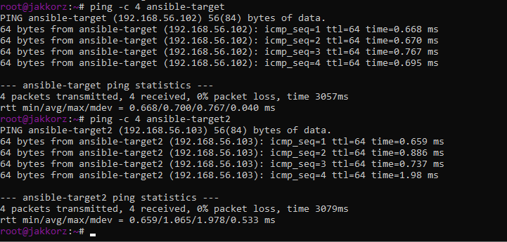

  * Stwórz [plik inwentaryzacji](https://docs.ansible.com/ansible/latest/getting_started/get_started_inventory.html)
  * Umieść w nim sekcje `Orchestrators` oraz `Endpoints`. Umieść nazwy maszyn wirtualnych w odpowiednich sekcjach

    Stworzyłem odpowiedni plik inwentaryzacji, wpisując same hostname'y

    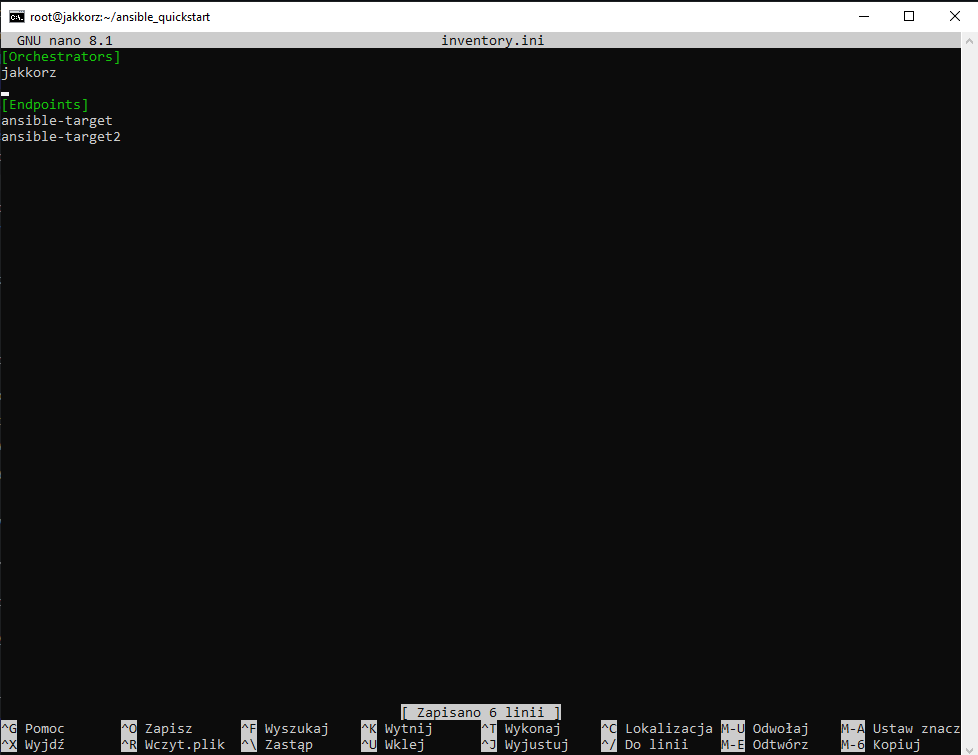

  * 🌵 Wyślij żądanie `ping` do wszystkich maszyn

    Tym razem wykonałem pingowanie, korzystając z Ansible, pingując całą sekcję jednym poleceniem:

    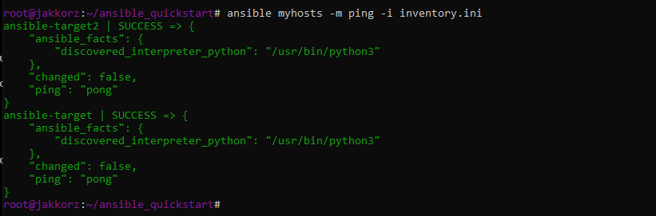   

* Zapewnij łączność między maszynami
  * Użyj co najmniej dwóch maszyn wirtualnych (optymalnie: trzech)

    Zainstalowaną maszynę sklonowałem w virtual boxie, następnie musiałem tylko na sklonowanej maszynie zmienić hostname, oraz upewnić się że adresy sieciowe zostały przydzielone inne niż klonowana maszyna.

  * Dokonaj wymiany kluczy między maszyną-dyrygentem, a końcówkami (`ssh-copy-id`)

    Przeprowadzone tak jak wyżej
  
  * Upewnij się, że łączność SSH między maszynami jest możliwa i nie potrzebuje haseł

    Nie potrzeba haseł, tak jak widać na jednym ze screenów.
  
### Zdalne wywoływanie procedur
Za pomocą [*playbooka*](https://docs.ansible.com/ansible/latest/getting_started/get_started_playbook.html) Ansible:
  * Wyślij żądanie `ping` do wszystkich maszyn
  * Skopiuj plik inwentaryzacji na maszyny/ę `Endpoints`
  * Ponów operację, porównaj różnice w wyjściu
  * Zaktualizuj pakiety w systemie
  * Zrestartuj usługi `sshd` i `rngd`

    Treść playbooka wykonującego te operacje:

```yaml
    - name: My first play
  hosts: Endpoints
  tasks:
   - name: Pinguj maszyny
     ansible.builtin.ping:

   - name: Skopiuj plik  inwentaryzacji na maszyny
     ansible.builtin.copy:
        src: inventory.ini
        dest: /home/ansible/inventory.ini
        owner: ansible
        group: ansible
        mode: '0644'

   - name: Ponownie skopiuj plik inwentaryzacji na maszyny
     ansible.builtin.copy:
        src: inventory.ini
        dest: /home/ansible/inventory.ini
        owner: ansible
        group: ansible
        mode: '0644'

   - name: Zaktualizuj wszystkie pakiety w systemie
     ansible.builtin.package:
        name: "*"
        state: latest

   - name: Zrestartuj usługę sshd
     ansible.builtin.service:
        name: sshd
        state: restarted

   - name: Zrestartuj usługę rngd
     ansible.builtin.service:
        name: rngd
        state: restarted
```

    A efektem jego uruchomienia jest:

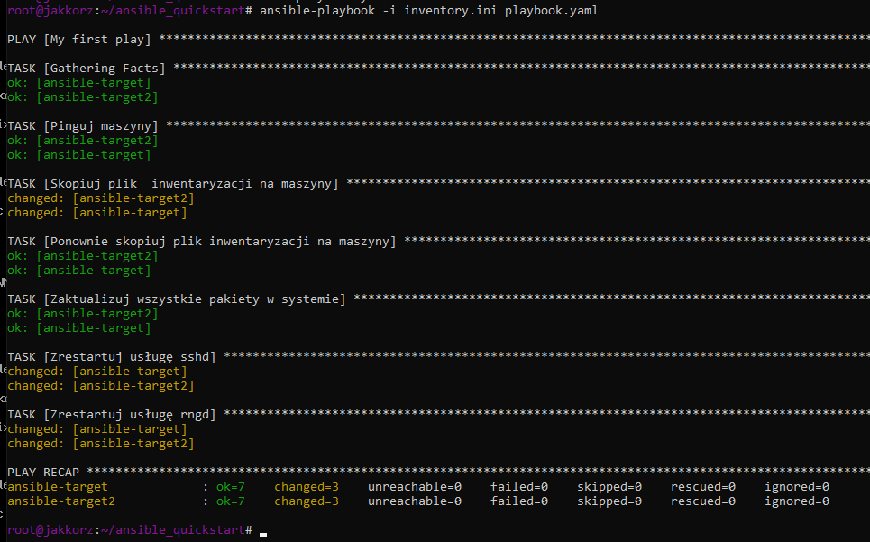

Po pierwszym skopiowaniu pliku inwentaryzacji na maszyny status zadania to 'changed', ponieważ w efekcie maszyny zmieniały swój stan.
Podczas drugiej próby kopiowania, status to 'ok' ponieważ tym razem nie nastąpiła żadna zmiana na maszynie, ponieważ ten plik już istniał w docelowej lokalizacji.

  * Przeprowadź operacje względem maszyny z wyłączonym serwerem SSH, odpiętą kartą sieciową

    Na jednej z maszyn wyłączyłem sshd, w efekcie playbook nie mógł się z tą maszyną połączyć:

    
  
### Zarządzanie stworzonym artefaktem
Za pomocą [*playbooka*](https://docs.ansible.com/ansible/latest/getting_started/get_started_playbook.html) Ansible:

* Jeżeli artefaktem z Twojego *pipeline'u* był kontener:
  * Zbuduj i uruchom kontener sekcji `Deploy` z poprzednich zajęć
  * Pobierz z Docker Hub aplikację "opublikowaną" w ramach kroku `Publish`
  * Na maszynie docelowej, **Dockera zainstaluj Ansiblem!**
  * Zweryfikuj łączność z kontenerem
  * Zatrzymaj i usuń kontener

* Jeżeli artefaktem z Twojego *pipeline'u* był plik binarny (lub ich zestaw):
  * Wyślij plik aplikacji na zdalną maszynę
  * Stwórz kontener przeznaczony do uruchomienia aplikacji (zaopatrzony w zależności)
  * Umieść/udostępnij plik w kontenerze, uruchom w nim aplikację
  * Zweryfikuj poprawne uruchomienie (a nie tylko wykonanie *playbooka*)
    
  Treść tego playbooka:

```Yaml
- name: My second play
  hosts: Endpoints
  vars:
    remote_binary_path: /usr/bin/irssi
    container_name: irssiDep
    docker_image: fedora:latest 
  tasks:
   - name: Instalacja Dockera
     ansible.builtin.package:
        name: docker
        state: present

   - name: Start Dockera
     ansible.builtin.service:
        name: docker
        state: started
        enabled: true

   - name: Skopiowanie Binarki na maszyny
     ansible.builtin.copy:
        src: ./irssi
        dest: "{{ remote_binary_path }}"
        mode: '0755'
    
   - name: Stworzenie kontenera
     community.docker.docker_container:
        name: "{{ container_name }}"
        image: "{{ docker_image }}"
        state: started
        tty: true
        interactive: true
        command: "./irssi"
        volumes:
          - "{{ remote_binary_path }}:/irssi"
        restart_policy: unless-stopped

   - name: Pobranie listy procesów w dockerze ( w poszukiwaniu irssi )
     community.docker.docker_container_exec:
       container: "{{ container_name }}"
       command: "sh -c 'ls -l /proc/*/exe 2>/dev/null || true'"
     register: container_processes

   - name: Wypisanie procesów w dockerze ( w poszukiwaniu irssi )
     debug:
       var: container_processes.stdout_lines
```
Efektem działania mojego pipeline'a był plik binarny.

Na początku chciałem pokazać działanie irssi przez użycie zwykłej komendy ps, ale obraz fedory w kontenerze domyślnie tego polecenia nie zawiera, dlatego należało wyświetlić zawartość folderu /proc który zawiera linki do aktualnie działających procesów.

Efekt działania powyższego playbooka:

  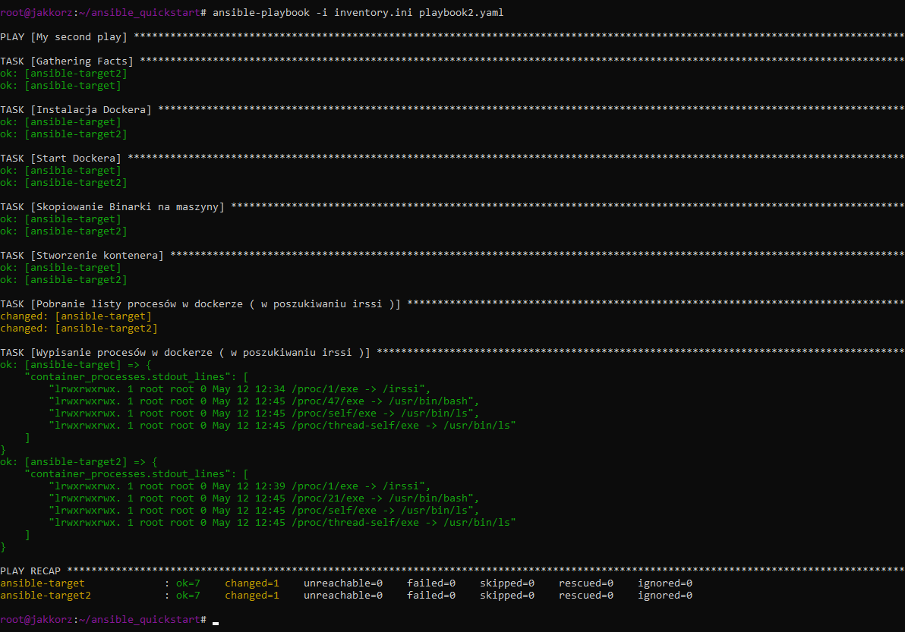

Ubierz powyższe kroki w [*rolę*](https://docs.ansible.com/ansible/latest/playbook_guide/playbooks_reuse_roles.html), za pomocą szkieletowania `ansible-galaxy`

Poniżej są polecenia które wykonałem w celu stworzenia i skonfigurowania roli ( do plików main.yml dodawałem odpowiednie części powyższego pliku playbooka odpowiednio : w folderze defaults: zmienne vars. W folderze tasks: zadania określone w sekcji tasks. plik binarny irssi skopiowwałem do folderu 'files' )

  

  Poniżej znajduje się treść trzeciego playbooka który korzysta ze stworzonej powyżej roli:

  ```
- hosts: Endpoints
  roles:
    - irssiDep
  ```

  Jest on bardzo któtki ponieważ praktycznie całą treść przenieśliśmy do roli.

  Poniżej znajduje się efekt wywołania playbooka korzystającego z roli :

  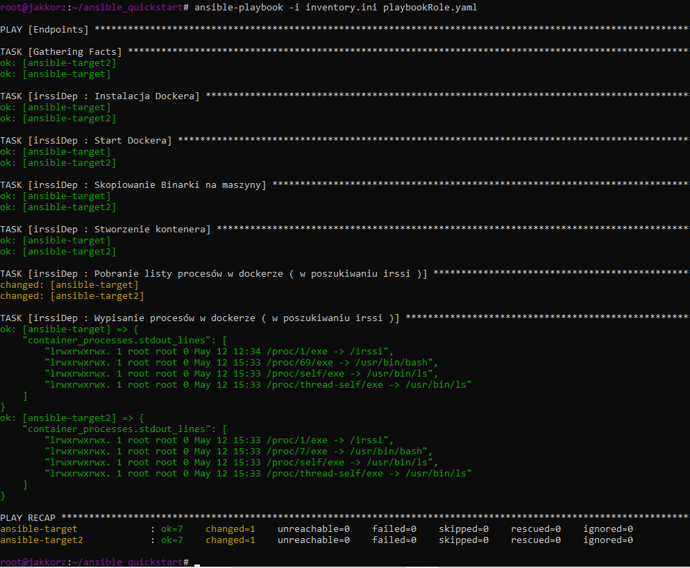

## Laboratorium 9 - Pliki odpowiedzi dla wdrożeń nienadzorowanych

### Zagadnienie
Niniejszy temat jest poświęcony przygotowaniu źródła instalacyjnego systemu dla maszyny wirtualnej/fizycznego serwera/środowiska IoT. Źródła takie stosowane są do zautomatyzowania instalacji środowiska testowego dla oprogramowania, które nie pracuje w całości w kontenerze

### Cel zadania
* Utworzyć źródło instalacji nienadzorowanej dla systemu operacyjnego hostującego nasze oprogramowanie
* Przeprowadzić instalację systemu, który po uruchomieniu rozpocznie hostowanie naszego programu

## Zadania do wykonania

🌵 Przeprowadź instalację nienadzorowaną systemu Fedora z pliku odpowiedzi z naszego repozytorium

* Zainstaluj [system Fedora](https://download.fedoraproject.org/pub/fedora/linux/releases/)
  * zastosuj instalator sieciowy (*Server Netinst*) lub
  * zastosuj instalator wariantu *Everything* z wbudowanymi pakietami, przyjmujący plik odpowiedzi (dobra opcja dla osób z ograniczeniami transferu internetowego)
* Pobierz plik odpowiedzi `/root/anaconda-ks.cfg`

  skopiowałem ze ścieżki /root/anaconda-ks.cfg plik odpowiedzi do naszego repozytorium, ścieżka: https://raw.githubusercontent.com/InzynieriaOprogramowaniaAGH/MDO2025_INO/refs/heads/JK403999/ITE/GCL04/JK403999/Sprawozdanie3/anaconda-ks.cfg

* Plik odpowiedzi może nie zawierać wzmianek na temat potrzebnych repozytoriów. Na przykład, dla systemu Fedora 38:
  * `url --mirrorlist=http://mirrors.fedoraproject.org/mirrorlist?repo=fedora-38&arch=x86_64`
  * `repo --name=update --mirrorlist=http://mirrors.fedoraproject.org/mirrorlist?repo=updates-released-f38&arch=x86_64`
* Plik odpowiedzi może zakładać pusty dysk. Zapewnij, że zawsze będzie formatować całość, stosując `clearpart --all`

  Ja z kolei spotkałem się z innym błędem, a mianowicie przy tworzeniu maszyny w virtual boxie, przydzieliłem jej mniej dysku niż tej oryginalnej, i przez to instalator próbował przydzielić 30 GB, podczas gdy 
  dostępne było tylko 10 GB. Wszystko byłoby w porządku gdyby nie to że komunikat instalatora brzmiał: "Niewystarczający plik odpowiedzi".
  Gdy już zrozumiałem jaki jest błąd, to należało tylko stworzyć od nowa maszynę i przydzielić przynajmniej tyle miejsca ile oryginalnej maszynie( albo zmniejszyć ręcznie ilość potrzebnych danych w pliku odpowiedzi )

* Ustaw *hostname* inny niż domyślny `localhost`

  Komenda do podania pliku odpowiedzi podczas instalacji to w moim przypadku (można użyć też skracacza linków) :
   ```
   inst.ks=https://raw.githubusercontent.com/InzynieriaOprogramowaniaAGH/MDO2025_INO/refs/heads/JK403999/ITE/GCL04/JK403999/Sprawozdanie3/anaconda-ks.cfg
   ```

* Rozszerz plik odpowiedzi o repozytoria i oprogramowanie potrzebne do uruchomienia programu, zbudowanego w ramach projektu - naszego *pipeline'u*. 
  * W przypadku kontenera, jest to po prostu Docker.
    * Utwórz w sekcji `%post` mechanizm umożliwiający pobranie i uruchomienie kontenera
    * Jeżeli efektem pracy pipeline'u nie był kontener, a aplikacja samodzielna - zainstaluj ją
    * Pamiętaj, że **Docker zadziała dopiero na uruchomionym systemie!** - nie da się wdać w interakcję z Dockerem z poziomu instalatora systemu: polecenia `docker run` nie powiodą się na tym etapie. Nie zadziała też `systemctl start` (ale `systemctl enable` już tak)
  * Gdy program pracuje poza kontenerem, potrzebny jest cały łańcuch dependencji oraz sam program.
    * Użyj sekcji `%post`, by pobrać z Jenkinsa zbudowany artefakt

        Mój url do pobrania z jenkinsa: http://192.168.56.1:8080/job/SCM_Pipeline/lastSuccessfulBuild/artifact/irssi/irssi

    * Rozważ stworzenie repozytorium ze swoim programem i dodanie go dyrektywą `repo` oraz zainstalowanie pakietu sekcją `%packages`
    * Jeżeli nie jest to możliwe/wykonalne, użyj dowolnego serwera SFTP/FTP/HTTP aby "zahostować" program - następnie pobierz go z tak hostującego serwera (stosując np. `wget`)
    * Umieść program w ścieżce stosownej dla binariów `/usr/local/bin/`
    * Zadbaj w sekcji `%packages`, by system zainstalował wszystkie dependencje potrzebne do działania programu
  * Wybierz oprogramowanie na podstawie poprzedniego sprawozdania.
  * Zapoznaj się z [dokumentacją pliku odpowiedzi](https://pykickstart.readthedocs.io/en/latest/kickstart-docs.html)
  * Użyj pliku odpowiedzi do przeprowadzenia [instalacji nienadzorowanej](https://docs.fedoraproject.org/en-US/fedora/f36/install-guide/advanced/Kickstart_Installations/)
* Zadbaj o automatyczne ponowne uruchomienie na końcu instalacji
* Zapewnij, by od razu po pierwszym uruchomieniu systemu, oprogramowanie zostało uruchomione (w dowolny sposób)

  Ostateczny plik anaconda-ks.cfg:
```
# Generated by Anaconda 41.35
# Generated by pykickstart v3.58
#version=DEVEL

# Keyboard layouts
keyboard --vckeymap=pl --xlayouts='pl'
# System language
lang pl_PL.UTF-8

# Network information
network  --bootproto=dhcp --device=enp0s3 --ipv6=auto --activate
network  --hostname=jakkorz

%packages
@^server-product-environment
glib2
openssl-libs
ncurses
perl

%end

%post
wget --user=root --password=aaaa \
http://192.168.56.1:8080/job/SCM_Pipeline/lastSuccessfulBuild/artifact/irssi/irssi -O irssi
mv irssi /usr/local/bin/irssi

cat <<EOF > /etc/systemd/system/irssi.service
[Unit]
Description=Irssi autostart service
After=network.target

[Service]
ExecStart=/usr/local/bin/irssi
Restart=always
User=root

[Install]
WantedBy=multi-user.target
EOF

systemctl enable irssi.service

echo "systemctl reboot" >> /etc/rc.d/rc.local
chmod +x /etc/rc.d/rc.local

%end

# Run the Setup Agent on first boot
firstboot --enable

# Generated using Blivet version 3.11.0
ignoredisk --only-use=sda
# Partition clearing information
clearpart --all --initlabel
# Disk partitioning information
part /boot --fstype="ext4" --ondisk=sda --size=1024
part pv.48 --fstype="lvmpv" --ondisk=sda --size=35837
part biosboot --fstype="biosboot" --ondisk=sda --size=1
volgroup fedora_jakkorz --pesize=4096 pv.48
logvol / --fstype="ext4" --grow --maxsize=71680 --size=1024 --name=root --vgname=fedora_jakkorz

# System timezone
timezone Europe/Warsaw --utc

# Root password
rootpw --iscrypted --allow-ssh $y$j9T$oGuE12lf4pzUttXSQZqrN3GB$RhftiA11WvLnHUGl5UkwPoLp50qFVsaxROzyDidWJr4
```

## Laboratorium 10 - Wdrażanie na zarządzalne kontenery: Kubernetes

### Instalacja klastra Kubernetes
 * 🌵 Zaopatrz się w implementację stosu k8s: [minikube](https://minikube.sigs.k8s.io/docs/start/)
 * Przeprowadź instalację, wykaż poziom bezpieczeństwa instalacji
 * Zaopatrz się w polecenie `kubectl` w wariancie minikube, może być alias `minikubctl`, jeżeli masz już "prawdziwy" `kubectl`
 * Uruchom Kubernetes, pokaż działający kontener/worker
 * Zmityguj problemy wynikające z wymagań sprzętowych lub odnieś się do nich (względem dokumentacji)
 * 🌵 Uruchom Dashboard, otwórz w przeglądarce, przedstaw łączność

      

 * Zapoznaj się z koncepcjami funkcji wyprowadzanych przez Kubernetesa (*pod*, *deployment* itp)
 
### Analiza posiadanego kontenera
 * Zdefiniuj krok "Deploy" swojego projektu jako "Deploy to cloud":
   * Deploy zbudowanej aplikacji powinien się odbywać "na kontener"
   * Przygotuj obraz Docker ze swoją aplikacją - sprawdź, że Twój kontener Deploy na pewno **pracuje**, a nie natychmiast kończy pracę! 😎
   * Jeżeli wybrana aplikacja nie nadaje się do pracy w kontenerze i nie wyprowadza interfejsu funkcjonalnego przez sieć, wymień projekt na potrzeby tego zadania:
     * Optimum:
       * obraz-gotowiec (czyli po prostu inna aplikacja, np. `nginx`, ale **z dorzuconą własną konfiguracją**)
       * samodzielnie wybrany program i obraz zbudowany na jego bazie, niekoniecznie via *pipeline*
     * Plan max: obraz wygenerowany wskutek pracy *pipeline'u*
   * Wykaż, że wybrana aplikacja pracuje jako kontener

       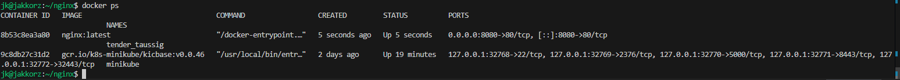  

       I poniżej wynik dostępu do nginx z przeglądarki

       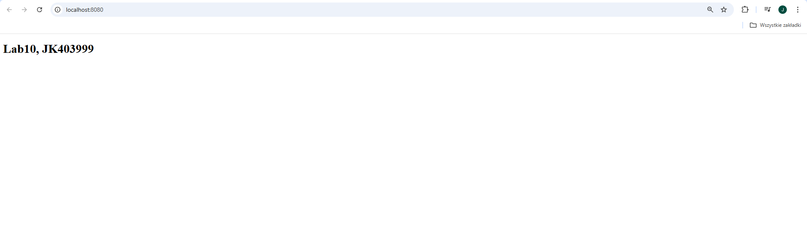
   
### Uruchamianie oprogramowania
 * 🌵 Uruchom kontener ze swoją/wybraną aplikacją na stosie k8s
 * Kontener uruchomiony w minikubie zostanie automatycznie "ubrany" w *pod*.

 * ```minikube kubectl run -- <nazwa-jednopodowego-wdrożenia> --image=<obraz-docker> --port=<wyprowadzany port> --labels app=<nazwa-jednopodowego-wdrożenia>```

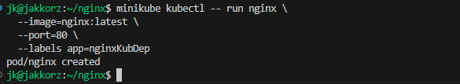  

 * Przedstaw że *pod* działa (via Dashboard oraz `kubectl`)

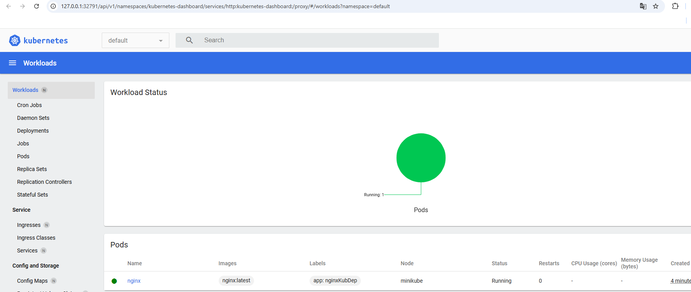  

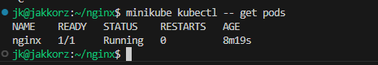  


 * Wyprowadź port celem dotarcia do eksponowanej funkcjonalności
 * ```kubectl port-forward pod/<nazwa-wdrożenia> <LO_PORT>:<PODMAIN_CNTNR_PORT> ```

        Miałem problem aby kubernetes rzeczywiście korzystał ze stworzonego nginxowego obrazu zamiast z tego domyślnego z docker-hub.
        Ostatecznie zastosowałem następujące rozwiązanie: https://stackoverflow.com/questions/42564058/how-can-i-use-local-docker-images-with-minikube#42564211, 
        czyli:
        eval $(minikube docker-env)
        I dzięki temu mogłem zbudować obraz na daemonie minikuba.
        Później już tylko wystarczy pamiętać żeby ustawić ```imagePullPolicy=Never``` żeby minikube nie pobierał z repozytorium.
        Ostatecznie polecenie kubectl run miało postać:
        ```minikube kubectl -- run nginx   --image=jknginx:latest   --port=80   --labels app=nginxKubDep --image-pull-policy=Never```

  

 * Przedstaw komunikację z eskponowaną funkcjonalnością

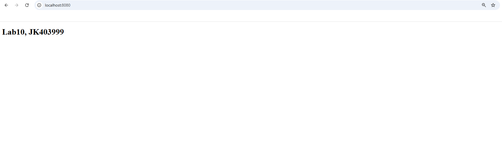  
 
### Przekucie wdrożenia manualnego w plik wdrożenia (wprowadzenie)
 * Zapisz [wdrożenie](https://kubernetes.io/docs/concepts/workloads/controllers/deployment/) jako plik YML

Plik wdrożenia prezentuje się następująco:

  ```yml
apiVersion: apps/v1
kind: Deployment
metadata:
  name: nginx-deployment
  labels:
    app: nginx
spec:
  replicas: 4
  selector:
    matchLabels:
      app: nginx
  template:
    metadata:
      labels:
        app: nginx
    spec:
      containers:
      - name: nginx
        image: nginx:latest
        ports:
        - containerPort: 80
  ```

 * Przeprowadź próbne wdrożenie przykładowego *deploymentu* (może być `nginx`)
   * Wykonaj ```kubectl apply``` na pliku

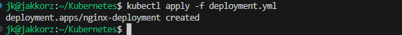 

   * Upewnij się, że posiadasz wdrożenie zapisane jako plik
   * Wzbogać swój *deployment* o 4 repliki
   * Rozpocznij wdrożenie za pomocą ```kubectl apply```

 

   * Zbadaj stan za pomocą ```kubectl rollout status```

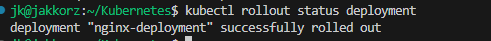 

 * Wyeksponuj wdrożenie jako serwis
 * Przekieruj port do serwisu (tak, jak powyżej)

## Zajęcia 11 - Wdrażanie na zarządzalne kontenery: Kubernetes (2)

### Przygotowanie nowego obrazu
 * Zarejestruj nową wersję swojego obrazu `Deploy` (w Docker Hub lub lokalnie+przeniesienie)

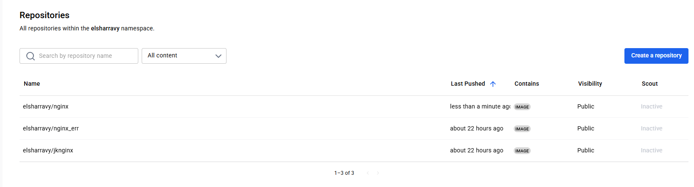 
 
 * Upewnij się, że dostępne są dwie co najmniej wersje obrazu z wybranym programem
 * Jeżeli potrzebny jest "gotowiec" z powodu problemów z `Deploy`, można użyć np `httpd`, ale powinien to być **własny** kontener: zmodyfikowany względem oryginału i opublikowany na własnym koncie Docker Hub.
 * Będzie to wymagać 
   * przejścia przez *pipeline* dwukrotnie, lub
   * ręcznego zbudowania dwóch wersji, lub
   * przepakowania wybranego obrazu samodzielnie np przez ```commit```
 * Przygotuj kolejną wersję obrazu, którego uruchomienie kończy się błędem

 Aby uruchomienie kontenera kończyło się błędem dodałem następującą linijkę na koniec pliku Dockerfile:

 ``` CMD sh -c "echo 'Starting jknginx...' && exec nginxabcd -g 'daemon off;'" ``` - Powinno wypisać że nie może uruchomić nginxabcd.
  
### Zmiany w deploymencie
 * 🌵 Aktualizuj plik YAML z wdrożeniem i przeprowadzaj je ponownie po zastosowaniu następujących zmian:
   * zwiększenie replik np. do 8

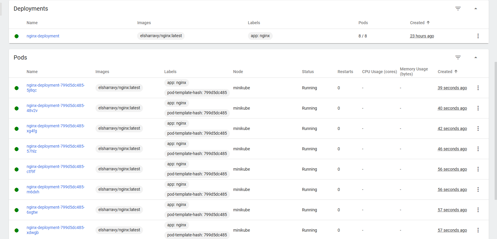 

   * zmniejszenie liczby replik do 1

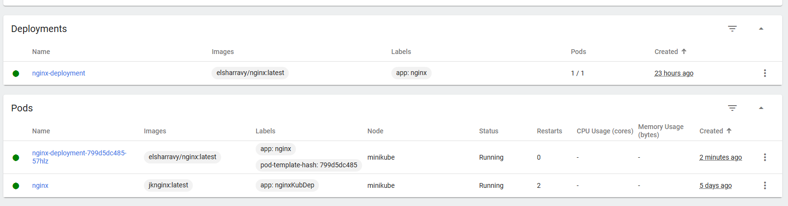 

   * zmniejszenie liczby replik do 0

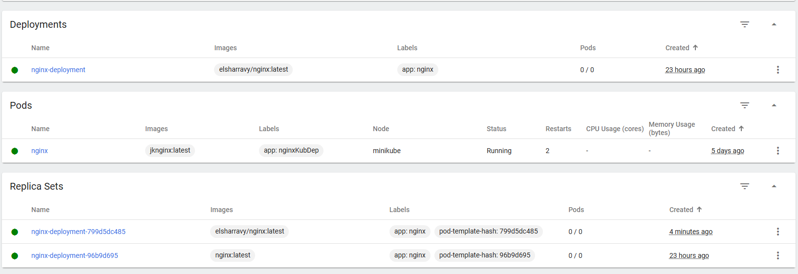 

   * ponowne przeskalowanie w górę do 4 replik (co najmniej)
   * Zastosowanie nowej wersji obrazu

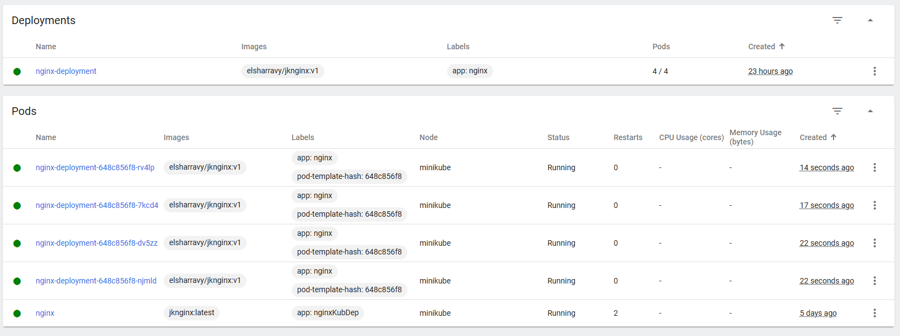 

   * Zastosowanie starszej wersji obrazu
   * Zastosowanie "wadliwego" obrazu

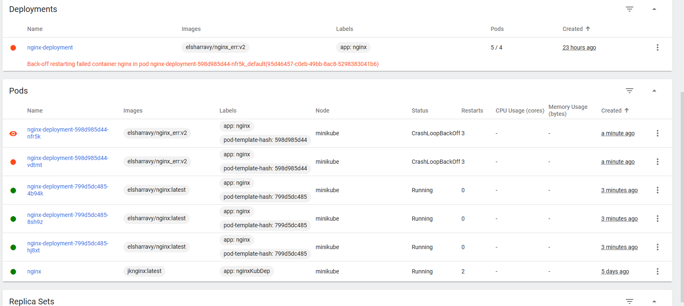 

 * Przywracaj poprzednie wersje wdrożeń za pomocą poleceń
   * ```kubectl rollout history```
   * ```kubectl rollout undo```

### Kontrola wdrożenia
 * Zidentyfikuj historię wdrożenia i zapisane w niej problemy, skoreluj je z wykonywanymi czynnościami

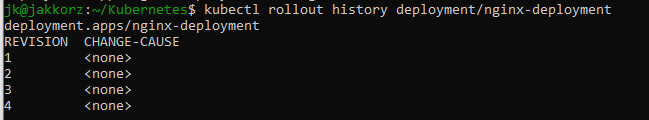 

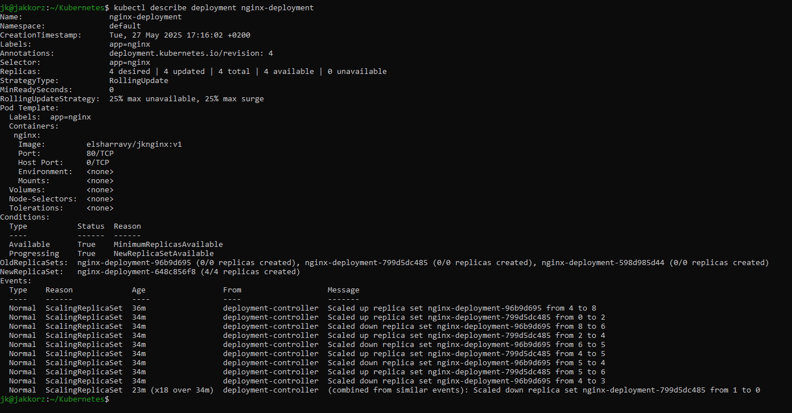 
 
 