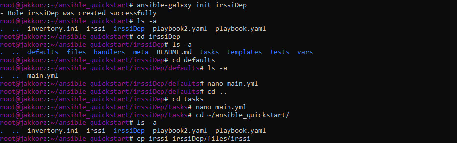

# Sprawozdanie 3

---

## Laboratorium 8: Automatyzacja i zdalne wykonywanie poleceń za pomocą Ansible

---
 
### Instalacja zarządcy Ansible
* 🌵 Utwórz drugą maszynę wirtualną o **jak najmniejszym** zbiorze zainstalowanego oprogramowania
  * Zastosuj ten sam system operacyjny, co "główna" maszyna (najlepiej też w tej samej wersji)

    Wykorzystałem ten sam obraz do instalacji tego systemu co do instalacji głównej maszyny

  * Zapewnij obecność programu `tar` i serwera OpenSSH (`sshd`)

    Sshd został zainstalowany automatycznie po wybraniu instalacji Server Edition, a tar zainstalowałem poleceniem: `dnf install tar`

  * Nadaj maszynie *hostname* `ansible-target` (najlepiej jeszcze podczas instalacji)

    Nadałem maszynie nazwę: ansible-target

    

  * Utwórz w systemie użytkownika `ansible` (najlepiej jeszcze podczas instalacji)

    Podczas instalacji stworzyłem użytkownika o nazwie ansible.

    

  * Zrób migawkę maszyny (i/lub przeprowadź jej eksport)

    W virtual boxie, klikając prawym przyciskiem na wirtulnej maszynie i wybierając opcję: "Eksportuj do OCI..." można wyeksportować maszynę do formatu .ovi

    

* 🌵 Na głównej maszynie wirtualnej (nie na tej nowej!), zainstaluj [oprogramowanie Ansible](https://docs.ansible.com/ansible/latest/installation_guide/index.html), najlepiej z repozytorium dystrybucji

    Ansible zainstalowałem na głównej maszynie poleceniem: `dnf install ansible`

    

* Wymień klucze SSH między użytkownikiem w głównej maszynie wirtualnej, a użytkownikiem `ansible` z nowej tak, by logowanie `ssh ansible@ansible-target` nie wymagało podania hasła
  
    Najpierw w celu rozpoznawania nazwy hostname dodałem odpowiednie wpisy do pliku etc/hosts na głównej maszynie:

    

    Dzięki temu mogłem łatwo wygenerować i wymienić klucze, a następnie widać że byłem w stanie zalogować się przez ssh bez hasła

    

### Inwentaryzacja
* 🌵 Dokonaj inwentaryzacji systemów
  * Ustal przewidywalne nazwy komputerów (maszyn wirtualnych) stosując `hostnamectl`, Unikaj `localhost`.

    Za pomocą polecenia hostnamectl, zmieniłem hostname trzeciej maszyny ( sklonowana druga maszyna, PPM-> Klonuj w virtual boxie )

    

  * Wprowadź nazwy DNS dla maszyn wirtualnych, stosując `systemd-resolved` lub `resolv.conf` i `/etc/hosts` - tak, aby możliwe było wywoływanie komputerów za pomocą nazw, a nie tylko adresów IP

    Dodałem odpowiednie wpisy do etc/hosts:

    

  * Zweryfikuj łączność

    Po wykonaniu wszystkich powyższych czynności jestem w stanie, pingować maszyny używając tylko ich hostname'y

    

  * Stwórz [plik inwentaryzacji](https://docs.ansible.com/ansible/latest/getting_started/get_started_inventory.html)
  * Umieść w nim sekcje `Orchestrators` oraz `Endpoints`. Umieść nazwy maszyn wirtualnych w odpowiednich sekcjach

    Stworzyłem odpowiedni plik inwentaryzacji, wpisując same hostname'y

    

  * 🌵 Wyślij żądanie `ping` do wszystkich maszyn

    Tym razem wykonałem pingowanie, korzystając z Ansible, pingując całą sekcję jednym poleceniem:

       

* Zapewnij łączność między maszynami
  * Użyj co najmniej dwóch maszyn wirtualnych (optymalnie: trzech)

    Zainstalowaną maszynę sklonowałem w virtual boxie, następnie musiałem tylko na sklonowanej maszynie zmienić hostname, oraz upewnić się że adresy sieciowe zostały przydzielone inne niż klonowana maszyna.

  * Dokonaj wymiany kluczy między maszyną-dyrygentem, a końcówkami (`ssh-copy-id`)

    Przeprowadzone tak jak wyżej
  
  * Upewnij się, że łączność SSH między maszynami jest możliwa i nie potrzebuje haseł

    Nie potrzeba haseł, tak jak widać na jednym ze screenów.
  
### Zdalne wywoływanie procedur
Za pomocą [*playbooka*](https://docs.ansible.com/ansible/latest/getting_started/get_started_playbook.html) Ansible:
  * Wyślij żądanie `ping` do wszystkich maszyn
  * Skopiuj plik inwentaryzacji na maszyny/ę `Endpoints`
  * Ponów operację, porównaj różnice w wyjściu
  * Zaktualizuj pakiety w systemie
  * Zrestartuj usługi `sshd` i `rngd`

    Treść playbooka wykonującego te operacje:

    ```yaml
    - name: My first play
  hosts: Endpoints
  tasks:
   - name: Pinguj maszyny
     ansible.builtin.ping:

   - name: Skopiuj plik  inwentaryzacji na maszyny
     ansible.builtin.copy:
        src: inventory.ini
        dest: /home/ansible/inventory.ini
        owner: ansible
        group: ansible
        mode: '0644'

   - name: Ponownie skopiuj plik inwentaryzacji na maszyny
     ansible.builtin.copy:
        src: inventory.ini
        dest: /home/ansible/inventory.ini
        owner: ansible
        group: ansible
        mode: '0644'

   - name: Zaktualizuj wszystkie pakiety w systemie
     ansible.builtin.package:
        name: "*"
        state: latest

   - name: Zrestartuj usługę sshd
     ansible.builtin.service:
        name: sshd
        state: restarted

   - name: Zrestartuj usługę rngd
     ansible.builtin.service:
        name: rngd
        state: restarted
    ```

    A efektem jego uruchomienia jest:

    

    Po pierwszym skopiowaniu pliku inwentaryzacji na maszyny status zadania to 'changed', ponieważ w efekcie maszyny zmieniały swój stan.
    Podczas drugiej próby kopiowania, status to 'ok' ponieważ tym razem nie nastąpiła żadna zmiana na maszynie, ponieważ ten plik już istniał w docelowej lokalizacji.

  * Przeprowadź operacje względem maszyny z wyłączonym serwerem SSH, odpiętą kartą sieciową

    Na jednej z maszyn wyłączyłem sshd, w efekcie playbook nie mógł się z tą maszyną połączyć:

    
  
### Zarządzanie stworzonym artefaktem
Za pomocą [*playbooka*](https://docs.ansible.com/ansible/latest/getting_started/get_started_playbook.html) Ansible:

* Jeżeli artefaktem z Twojego *pipeline'u* był kontener:
  * Zbuduj i uruchom kontener sekcji `Deploy` z poprzednich zajęć
  * Pobierz z Docker Hub aplikację "opublikowaną" w ramach kroku `Publish`
  * Na maszynie docelowej, **Dockera zainstaluj Ansiblem!**
  * Zweryfikuj łączność z kontenerem
  * Zatrzymaj i usuń kontener

* Jeżeli artefaktem z Twojego *pipeline'u* był plik binarny (lub ich zestaw):
  * Wyślij plik aplikacji na zdalną maszynę
  * Stwórz kontener przeznaczony do uruchomienia aplikacji (zaopatrzony w zależności)
  * Umieść/udostępnij plik w kontenerze, uruchom w nim aplikację
  * Zweryfikuj poprawne uruchomienie (a nie tylko wykonanie *playbooka*)
    
  Treść tego playbooka:

```Yaml
- name: My second play
  hosts: Endpoints
  vars:
    remote_binary_path: /usr/bin/irssi
    container_name: irssiDep
    docker_image: fedora:latest 
  tasks:
   - name: Instalacja Dockera
     ansible.builtin.package:
        name: docker
        state: present

   - name: Start Dockera
     ansible.builtin.service:
        name: docker
        state: started
        enabled: true

   - name: Skopiowanie Binarki na maszyny
     ansible.builtin.copy:
        src: ./irssi
        dest: "{{ remote_binary_path }}"
        mode: '0755'
    
   - name: Stworzenie kontenera
     community.docker.docker_container:
        name: "{{ container_name }}"
        image: "{{ docker_image }}"
        state: started
        tty: true
        interactive: true
        command: "./irssi"
        volumes:
          - "{{ remote_binary_path }}:/irssi"
        restart_policy: unless-stopped

   - name: Pobranie listy procesów w dockerze ( w poszukiwaniu irssi )
     community.docker.docker_container_exec:
       container: "{{ container_name }}"
       command: "sh -c 'ls -l /proc/*/exe 2>/dev/null || true'"
     register: container_processes

   - name: Wypisanie procesów w dockerze ( w poszukiwaniu irssi )
     debug:
       var: container_processes.stdout_lines
```
Efektem działania mojego pipeline'a był plik binarny.

Na początku chciałem pokazać działanie irssi przez użycie zwykłej komendy ps, ale obraz fedory w kontenerze domyślnie tego polecenia nie zawiera, dlatego należało wyświetlić zawartość folderu /proc który zawiera linki do aktualnie działających procesów.

Efekt działania powyższego playbooka:

  

Ubierz powyższe kroki w [*rolę*](https://docs.ansible.com/ansible/latest/playbook_guide/playbooks_reuse_roles.html), za pomocą szkieletowania `ansible-galaxy`

Poniżej są polecenia które wykonałem w celu stworzenia i skonfigurowania roli ( do plików main.yml dodawałem odpowiednie części powyższego pliku playbooka odpowiednio : w folderze defaults: zmienne vars. W folderze tasks: zadania określone w sekcji tasks. plik binarny irssi skopiowwałem do folderu 'files' )

  

  Poniżej znajduje się treść trzeciego playbooka który korzysta ze stworzonej powyżej roli:

  ```
- hosts: Endpoints
  roles:
    - irssiDep
  ```

  Jest on bardzo któtki ponieważ praktycznie całą treść przenieśliśmy do roli.

  Poniżej znajduje się efekt wywołania playbooka korzystającego z roli :

    

## Laboratorium 9 - Pliki odpowiedzi dla wdrożeń nienadzorowanych

### Zagadnienie
Niniejszy temat jest poświęcony przygotowaniu źródła instalacyjnego systemu dla maszyny wirtualnej/fizycznego serwera/środowiska IoT. Źródła takie stosowane są do zautomatyzowania instalacji środowiska testowego dla oprogramowania, które nie pracuje w całości w kontenerze

### Cel zadania
* Utworzyć źródło instalacji nienadzorowanej dla systemu operacyjnego hostującego nasze oprogramowanie
* Przeprowadzić instalację systemu, który po uruchomieniu rozpocznie hostowanie naszego programu

## Zadania do wykonania

 🌵 Przeprowadź instalację nienadzorowaną systemu Fedora z pliku odpowiedzi z naszego repozytorium

* Zainstaluj [system Fedora](https://download.fedoraproject.org/pub/fedora/linux/releases/)
  * zastosuj instalator sieciowy (*Server Netinst*) lub
  * zastosuj instalator wariantu *Everything* z wbudowanymi pakietami, przyjmujący plik odpowiedzi (dobra opcja dla osób z ograniczeniami transferu internetowego)
* Pobierz plik odpowiedzi `/root/anaconda-ks.cfg`
* Plik odpowiedzi może nie zawierać wzmianek na temat potrzebnych repozytoriów. Na przykład, dla systemu Fedora 38:
  * `url --mirrorlist=http://mirrors.fedoraproject.org/mirrorlist?repo=fedora-38&arch=x86_64`
  * `repo --name=update --mirrorlist=http://mirrors.fedoraproject.org/mirrorlist?repo=updates-released-f38&arch=x86_64`
* Plik odpowiedzi może zakładać pusty dysk. Zapewnij, że zawsze będzie formatować całość, stosując `clearpart --all`
* Ustaw *hostname* inny niż domyślny `localhost`
* Rozszerz plik odpowiedzi o repozytoria i oprogramowanie potrzebne do uruchomienia programu, zbudowanego w ramach projektu - naszego *pipeline'u*. 
  * W przypadku kontenera, jest to po prostu Docker.
    * Utwórz w sekcji `%post` mechanizm umożliwiający pobranie i uruchomienie kontenera
    * Jeżeli efektem pracy pipeline'u nie był kontener, a aplikacja samodzielna - zainstaluj ją
    * Pamiętaj, że **Docker zadziała dopiero na uruchomionym systemie!** - nie da się wdać w interakcję z Dockerem z poziomu instalatora systemu: polecenia `docker run` nie powiodą się na tym etapie. Nie zadziała też `systemctl start` (ale `systemctl enable` już tak)
  * Gdy program pracuje poza kontenerem, potrzebny jest cały łańcuch dependencji oraz sam program.
    * Użyj sekcji `%post`, by pobrać z Jenkinsa zbudowany artefakt
    * Rozważ stworzenie repozytorium ze swoim programem i dodanie go dyrektywą `repo` oraz zainstalowanie pakietu sekcją `%packages`
    * Jeżeli nie jest to możliwe/wykonalne, użyj dowolnego serwera SFTP/FTP/HTTP aby "zahostować" program - następnie pobierz go z tak hostującego serwera (stosując np. `wget`)
    * Umieść program w ścieżce stosownej dla binariów `/usr/local/bin/`
    * Zadbaj w sekcji `%packages`, by system zainstalował wszystkie dependencje potrzebne do działania programu
  * Wybierz oprogramowanie na podstawie poprzedniego sprawozdania.
  * Zapoznaj się z [dokumentacją pliku odpowiedzi](https://pykickstart.readthedocs.io/en/latest/kickstart-docs.html)
  * Użyj pliku odpowiedzi do przeprowadzenia [instalacji nienadzorowanej](https://docs.fedoraproject.org/en-US/fedora/f36/install-guide/advanced/Kickstart_Installations/)
* Zadbaj o automatyczne ponowne uruchomienie na końcu instalacji
* Zapewnij, by od razu po pierwszym uruchomieniu systemu, oprogramowanie zostało uruchomione (w dowolny sposób)

## Zakres rozszerzony
* Zapewnij, aby działa z sekcji `%post` wyświetlały się na ekranie
* Połącz plik odpowiedzi z nośnikiem instalacyjnym lub zmodyfikuj nośnik tak, by wskazywał na plik odpowiedzi w sieci (plan minimum: wskaź nośnikowi, aby użył pliku odpowiedzi)
* Zautomatyzuj proces tworzenia maszyny wirtualnej i uruchomienia instalacji nienadzorowanej. Użyj np. [wiersza poleceń VirtualBox](https://www.virtualbox.org/manual/ch08.html) lub [cmdletów Hyper-V](https://learn.microsoft.com/en-us/virtualization/hyper-v-on-windows/quick-start/try-hyper-v-powershell)
* Wykaż, że system zainstalował się, a wewnątrz pracuje odpowiedni program