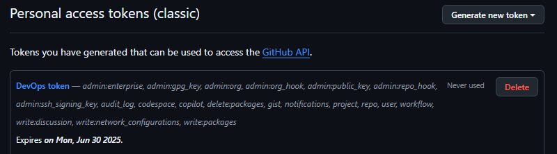
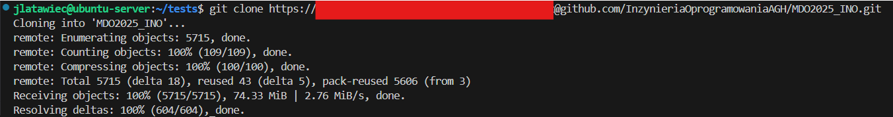
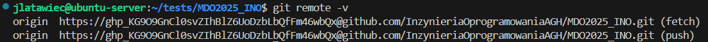
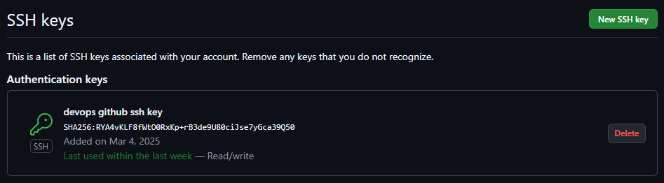
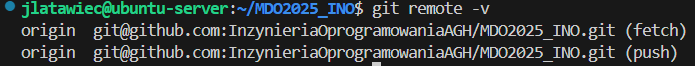
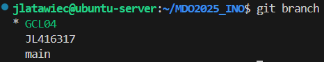
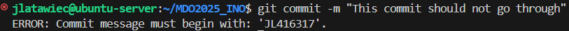
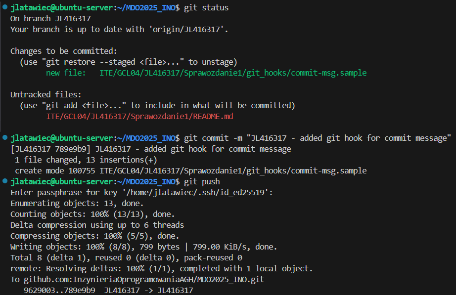
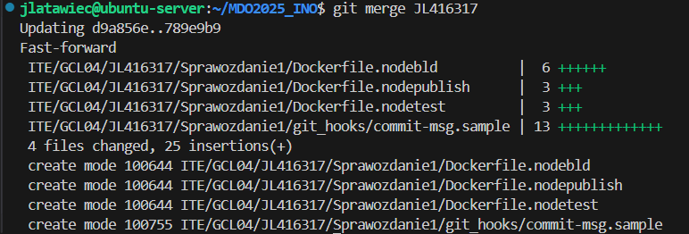

# Sprawozdanie 1

## Instalacja klienta Git i SSH
Instalując system operacyjny `Ubuntu Server 24.04` narzędzia takie jak `Git` i `SSH-Server` są domyślnie zainstalowane (przy standardowej konfiguracji instalatora). Jednak gdy nie mamy ich zainstalowanych możemy skorzystać z paczek znajdujących się w standardowych repozytoriach:

Instalacja `Git`:
```
sudo apt install git
```

Instalacja `SSH-Server`
```
sudo apt install openssh-server
```
Aby upewnić się, że `ssh` działa poprawnie, możemy sprawdzić jej status:
```
sudo systemctl status ssh
```
Jeśli zobaczymy status `active (running)` możemy założyć, że wszystko działa poprawnie.

Następnie łączymy się z naszego klienta do serwera, wpisując:
```
ssh USER_NAME@REMOTE_SERVER_ADDRESS
```

## Tworzenie Personal Access Token
Jeśli korzystamy z platformy `GitHub` musimy wykonać następujące kroki:

Logujemy się do swojego konta, następnie klikamy w ikonę swojego avatara i przechodzimy do ustawień. Przechodzmy do ustawień `developer settings` i następnie do `Personal access tokens` > `Tokens (classic)`. Dodajemy nowy token z interesującymi nas ustawieniami.

Przykładowy token powinien wyglądać tak:



## Klonowanie repozytorium za pomocą HTTPS i PAT
Wcześniej utworzony `Personal Access Token` pozwoli nam na autentyfikację przy klonowaniu repozytorum. Gdyby repozytorium było prywatne, pozwoliłby on również na autoryzację czy mamy dostęp do zasobu.

Klonowanie repozytorium przy użyciu `PAT` i `HTTPS`:
```
git clone https://PAT@github.com/InzynieriaOprogramowaniaAGH/MDO2025_INO.git
```
Po wywołaniu powyższej komendy, repozytorium powinno zacząć się pobierać na naszą maszynę.



Aby sprawdzić w jaki sposób jesteśmy połączeni z repozytorium na `GitHub` możemy wpisać komende:
```
git remote -v
```
Jeśli widzimy `HTTPS` to poprawnie sklonowaliśmy repozytorium tą metodą.



## Tworzenie kluczy SSH i dodawanie do konta GitHub
Aby stworzyć klucze do bezpiecznego połączenia `SSH` należy skorzystać z komendy:
```
ssh-keygen -t ed25519 -C "your_github_email@example_domain.com"
```
Korzystamy z szyfrowania `ed25519`. Domyślnie klucze zapisywane są w folderze `~/.ssh`, ale program pozwala na zmianę ich miejsca. Należy przy tym pamiętać że musimy je później dodać do `ssh-agent`. Możemy również dodać `passphrase` co jest zalecane. Kopiujemy całą treść klucza publicznego.

Logujemy się do serwisu `GitHub` i przechodzimy do ustawień. W zakładce `SSH and GPG keys` klikamy przycisk `New SSH key` i wklejamy zawartość wcześniej skopiowanego klucza publicznego.

Prawidłowo dodany klucz powinien wyglądać tak:



## Klonowanie repozytorium za pomocą SSH
We wcześniejszym kroku połączyliśmy nasz klusz `SSH` z kontem na `GitHub`. Oznacza to, że z każdej maszyny która będzie zawierała prywatny klucz `SSH` jesteśmy w stanie autoryzować się do naszych repozytoriów.

Aby sklonować repozytorium za pomocą `SSH` używamy:
```
git clone git@github.com:InzynieriaOprogramowaniaAGH/MDO2025_INO.git
```

Żeby zweryfikować czy jesteśmy połączeni z repozytorium za pomocą `SSH`, możemy wpisać:
```
git remote -v
```
Jeśli zobaczymy `SSH` to znaczy że pomyślnie sklonowaliśmy repozytorium tym sposobem.



## Praca na gałęziach w Git
Praca na osobnych gałęziach jest jedną z podstaw pracowania w środowisku `git`. Umożliwia to pracowanie nad konkretnym zadaniem, bez przeszkadzania innym developerom, piszących swoje części kodu.

Domyślną gałęzią w `git` jest `main` (dawnej `master`). Klonując repozytorium powinniśmy domyślnie znajdować się w tej gałęzi. Jednak gdy tak nie jest, możemy się na nią przełączyć korzystając z komendy: 
```
git checkout main
```

Identycznie wygląda przełączanie się na inne gałęzie np. gałąź GCL04:
```
git checkout GCL04
```

Aby upewnić się, że znajdujemy się na dobrej gałęzi, możemy wpisać komende:
```
git branch
```
Podświetlona gałąź na zielono to ta na której się aktualnie znajdujemy.



Aby otworzyć nową gałąź (która będzie się odgałęziać od aktualnie wybranej gałęzi, czyli w naszym przpadku GCL04) korzystamy z komendy `git checkout` z parametrem `-b`:
```
git checkout -b JL416317
```

## Przygotowanie miejsca na pracę z laboratoriów
Nasze pliki ze sprawozdaniami, zrzutami ekranu i plikami z zajęć, będą znajdować się w odpowiednim katalogu kierunku, grupy i danych ucznia np. `ITE/GCL04/JL416317`. Aby to zrobić, należy wpisać poniższą komendę przenoszącą nas do odpowieniego miejsca i tworzącą nowy katalog:
```
cd ~/MDO2025_INO/ITE/GCL04 && mkdir JL416317
```
Warto zwrócić uwagę na to że tworzenie katalogu nie wpływa na zmiany w git, tzn. git nie śledzi strukturę katalogów a pliki i ich ścieżki.

## Tworzenie Git Hooks
Git Hooks to nic innego jak skrypty, które w zależności od ich nazwy, uruchamiają się na odpowiednich etapach `git pipeline`. Pozwalają na skonfigurowanie repozytorium (lokalne git hooks) lub klienta git na danej maszynie dla wszytkich klonowanych repozytoriów (globalne git hooks). Umożliwiają pisanie zasad, według których repozytorium powinno działać np. unikanie znaków specjanych w `commit message`.

Domyślne lokalne git hooks, znajdują się w folderze `.git/hooks` danego repozytorium. Aby zadziałały, należy zmienić ich nazwe usuwając `.sample`.

Żeby napisać hooke'a sprawdzajacego czy każdy `commit message` zaczyna się od odpowiednich inicjałów, należy wybrać plik o odpowiedniej nazwie, aby skrypt wykonał się po odpowiedniej komendzie. W tym przypadku to `commit-msg.sample`. Teraz trzeba napisać odpowiedni skrypt i zmienić nazwę na `commit-msg`, pamiętając że plik ma znajdować się w katalogu `.git/hooks`.

Przykład jak może wyglądać ten skrypt:
``` bash
#!/bin/bash

EXPECTED_PREFIX="JL416317"

COMMIT_MSG_FILE=$1
COMMIT_MSG=$(head -n 1 "$COMMIT_MSG_FILE")

if [[ ! "$COMMIT_MSG" =~ ^$EXPECTED_PREFIX ]]; then
  echo "ERROR: Commit message must begin with: '$EXPECTED_PREFIX'."
  exit 1
fi

exit 0
```

Teraz commit bez prefixu w wiadomości nie przejdzie:



## Tworzenie commit'ów i wysyłanie na GitHub
Gdy mamy już gotowe zmiany i chcemy je zaakceptować, tworzymy `commit`. Aby sprawdzić które pliki zostały zmienione i/lub dodane, możemy skorzystać z komendy:
```
git status
```
Jeśli zobaczymy pliki o czerwonym kolorze tekstu, oznacza to że te zmiany nie są dodane tzn. nie zostaną uwzględnione gdy będziemy tworzyć `commit`. Aby je dodać korzystamy z komendy:
```
git add .
```
W tym przypadku `.` oznacza że chcemy dodać wszystkie zmienione pliki. Jeśli chcemy dodać tylko konkretny plik to należy `.` zamienić na nazwę pliku.

Teraz stworzymy `commit` zawierający dodane zmiany:
```
git commit -m "JL416317 message_explaining_changes_in_commit"
```
Parametr `-m` oznacza wiadomość dla commita i jest wymagany przez `git`.

Commit został stworzony ale należy pamiętać o tym że jest on póki co tylko lokalnie na naszej maszynie. Aby wysłać go na serwer (w naszym przypadku serwer GitHub) do odpowiedniej gałęzi na której pracujemy, należy wypchnąć zmiany za pomocą komendy:
```
git push
```
Jednak gdy utworzyliśmy gałąź lokalnie a nie pobierając ją z serwera, trzeba ustawić `upstream`, czyli miejsce gdzie zostanie wysłany nasza gałąź:
```
git push --set-upstream origin JL416317
```
`origin` to miejsce z którego repozytorium zostało sklonowane, czyli w tym przypadku to serwery GitHub.



Teraz wchodząc na stronę repozytorium w GitHub i naszą wypchniętą gałąź, powinniśmy znaleźć dodane zmiany.

## Łączenie zmian miedzy gałęziami
Nasze wypchnięte zmiany możemy teraz włączyć do innej gałęzi. Najpierw musimy przełączyć się na gałąź do której chcemy wciągnąć te zmiany, np:
```
git checkout GCL04
```

Teraz za pomocą komendy `git merge` pobieramy zmiany z wybranej przez nas gałęzi:
```
git merge JL416317
```

Przykładowy wynik wciągniętych zmian (bez występujących konfliktów) powinien wyglądać tak:

