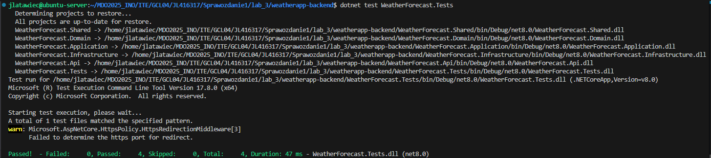

# Sprawozdanie 1

## Instalacja klienta Git i SSH
Instalując system operacyjny `Ubuntu Server 24.04` narzędzia takie jak `Git` i `SSH-Server` są domyślnie zainstalowane (przy standardowej konfiguracji instalatora). Jednak gdy nie mamy ich zainstalowanych możemy skorzystać z paczek znajdujących się w standardowych repozytoriach:

Instalacja `Git`:
```
sudo apt install git
```

Instalacja `SSH-Server`
```
sudo apt install openssh-server
```
Aby upewnić się, że `ssh` działa poprawnie, możemy sprawdzić jej status:
```
sudo systemctl status ssh
```
Jeśli zobaczymy status `active (running)` możemy założyć, że wszystko działa poprawnie.

Następnie łączymy się z naszego klienta do serwera, wpisując:
```
ssh USER_NAME@REMOTE_SERVER_ADDRESS
```

## Tworzenie Personal Access Token
Jeśli korzystamy z platformy `GitHub` musimy wykonać następujące kroki:

Logujemy się do swojego konta, następnie klikamy w ikonę swojego avatara i przechodzimy do ustawień. Przechodzmy do ustawień `developer settings` i następnie do `Personal access tokens` > `Tokens (classic)`. Dodajemy nowy token z interesującymi nas ustawieniami.

Przykładowy token powinien wyglądać tak:


## Klonowanie repozytorium za pomocą HTTPS i PAT
Wcześniej utworzony `Personal Access Token` pozwoli nam na autentyfikację przy klonowaniu repozytorum. Gdyby repozytorium było prywatne, pozwoliłby on również na autoryzację czy mamy dostęp do zasobu.

Klonowanie repozytorium przy użyciu `PAT` i `HTTPS`:
```
git clone https://PAT@github.com/InzynieriaOprogramowaniaAGH/MDO2025_INO.git
```
Po wywołaniu powyższej komendy, repozytorium powinno zacząć się pobierać na naszą maszynę.


Aby sprawdzić w jaki sposób jesteśmy połączeni z repozytorium na `GitHub` możemy wpisać komende:
```
git remote -v
```
Jeśli widzimy `HTTPS` to poprawnie sklonowaliśmy repozytorium tą metodą.


## Tworzenie kluczy SSH i dodawanie do konta GitHub
Aby stworzyć klucze do bezpiecznego połączenia `SSH` należy skorzystać z komendy:
```
ssh-keygen -t ed25519 -C "your_github_email@example_domain.com"
```
Korzystamy z szyfrowania `ed25519`. Domyślnie klucze zapisywane są w folderze `~/.ssh`, ale program pozwala na zmianę ich miejsca. Należy przy tym pamiętać że musimy je później dodać do `ssh-agent`. Możemy również dodać `passphrase` co jest zalecane. Kopiujemy całą treść klucza publicznego.

Logujemy się do serwisu `GitHub` i przechodzimy do ustawień. W zakładce `SSH and GPG keys` klikamy przycisk `New SSH key` i wklejamy zawartość wcześniej skopiowanego klucza publicznego.

Prawidłowo dodany klucz powinien wyglądać tak:


## Klonowanie repozytorium za pomocą SSH
We wcześniejszym kroku połączyliśmy nasz klusz `SSH` z kontem na `GitHub`. Oznacza to, że z każdej maszyny która będzie zawierała prywatny klucz `SSH` jesteśmy w stanie autoryzować się do naszych repozytoriów.

Aby sklonować repozytorium za pomocą `SSH` używamy:
```
git clone git@github.com:InzynieriaOprogramowaniaAGH/MDO2025_INO.git
```

Żeby zweryfikować czy jesteśmy połączeni z repozytorium za pomocą `SSH`, możemy wpisać:
```
git remote -v
```
Jeśli zobaczymy `SSH` to znaczy że pomyślnie sklonowaliśmy repozytorium tym sposobem.


## Praca na gałęziach w Git
Praca na osobnych gałęziach jest jedną z podstaw pracowania w środowisku `git`. Umożliwia to pracowanie nad konkretnym zadaniem, bez przeszkadzania innym developerom, piszących swoje części kodu.

Domyślną gałęzią w `git` jest `main` (dawnej `master`). Klonując repozytorium powinniśmy domyślnie znajdować się w tej gałęzi. Jednak gdy tak nie jest, możemy się na nią przełączyć korzystając z komendy: 
```
git checkout main
```

Identycznie wygląda przełączanie się na inne gałęzie np. gałąź GCL04:
```
git checkout GCL04
```

Aby upewnić się, że znajdujemy się na dobrej gałęzi, możemy wpisać komende:
```
git branch
```
Podświetlona gałąź na zielono to ta na której się aktualnie znajdujemy.


Aby otworzyć nową gałąź (która będzie się odgałęziać od aktualnie wybranej gałęzi, czyli w naszym przpadku GCL04) korzystamy z komendy `git checkout` z parametrem `-b`:
```
git checkout -b JL416317
```

## Przygotowanie miejsca na pracę z laboratoriów
Nasze pliki ze sprawozdaniami, zrzutami ekranu i plikami z zajęć, będą znajdować się w odpowiednim katalogu kierunku, grupy i danych ucznia np. `ITE/GCL04/JL416317`. Aby to zrobić, należy wpisać poniższą komendę przenoszącą nas do odpowieniego miejsca i tworzącą nowy katalog:
```
cd ~/MDO2025_INO/ITE/GCL04 && mkdir JL416317
```
Warto zwrócić uwagę na to że tworzenie katalogu nie wpływa na zmiany w git, tzn. git nie śledzi strukturę katalogów a pliki i ich ścieżki.

## Tworzenie Git Hooks
Git Hooks to nic innego jak skrypty, które w zależności od ich nazwy, uruchamiają się na odpowiednich etapach `git pipeline`. Pozwalają na skonfigurowanie repozytorium (lokalne git hooks) lub klienta git na danej maszynie dla wszytkich klonowanych repozytoriów (globalne git hooks). Umożliwiają pisanie zasad, według których repozytorium powinno działać np. unikanie znaków specjanych w `commit message`.

Domyślne lokalne git hooks, znajdują się w folderze `.git/hooks` danego repozytorium. Aby zadziałały, należy zmienić ich nazwe usuwając `.sample`.

Żeby napisać hooke'a sprawdzajacego czy każdy `commit message` zaczyna się od odpowiednich inicjałów, należy wybrać plik o odpowiedniej nazwie, aby skrypt wykonał się po odpowiedniej komendzie. W tym przypadku to `commit-msg.sample`. Teraz trzeba napisać odpowiedni skrypt i zmienić nazwę na `commit-msg`, pamiętając że plik ma znajdować się w katalogu `.git/hooks`.

Przykład jak może wyglądać ten skrypt:
``` bash
#!/bin/bash

EXPECTED_PREFIX="JL416317"

COMMIT_MSG_FILE=$1
COMMIT_MSG=$(head -n 1 "$COMMIT_MSG_FILE")

if [[ ! "$COMMIT_MSG" =~ ^$EXPECTED_PREFIX ]]; then
  echo "ERROR: Commit message must begin with: '$EXPECTED_PREFIX'."
  exit 1
fi

exit 0
```

Teraz commit bez prefixu w wiadomości nie przejdzie:


## Tworzenie commit'ów i wysyłanie na GitHub
Gdy mamy już gotowe zmiany i chcemy je zaakceptować, tworzymy `commit`. Aby sprawdzić które pliki zostały zmienione i/lub dodane, możemy skorzystać z komendy:
```
git status
```
Jeśli zobaczymy pliki o czerwonym kolorze tekstu, oznacza to że te zmiany nie są dodane tzn. nie zostaną uwzględnione gdy będziemy tworzyć `commit`. Aby je dodać korzystamy z komendy:
```
git add .
```
W tym przypadku `.` oznacza że chcemy dodać wszystkie zmienione pliki. Jeśli chcemy dodać tylko konkretny plik to należy `.` zamienić na nazwę pliku.

Teraz stworzymy `commit` zawierający dodane zmiany:
```
git commit -m "JL416317 message_explaining_changes_in_commit"
```
Parametr `-m` oznacza wiadomość dla commita i jest wymagany przez `git`.

Commit został stworzony ale należy pamiętać o tym że jest on póki co tylko lokalnie na naszej maszynie. Aby wysłać go na serwer (w naszym przypadku serwer GitHub) do odpowiedniej gałęzi na której pracujemy, należy wypchnąć zmiany za pomocą komendy:
```
git push
```
Jednak gdy utworzyliśmy gałąź lokalnie a nie pobierając ją z serwera, trzeba ustawić `upstream`, czyli miejsce gdzie zostanie wysłany nasza gałąź:
```
git push --set-upstream origin JL416317
```
`origin` to miejsce z którego repozytorium zostało sklonowane, czyli w tym przypadku to serwery GitHub.


Teraz wchodząc na stronę repozytorium w GitHub i naszą wypchniętą gałąź, powinniśmy znaleźć dodane zmiany.

## Łączenie zmian miedzy gałęziami
Nasze wypchnięte zmiany możemy teraz włączyć do innej gałęzi. Najpierw musimy przełączyć się na gałąź do której chcemy wciągnąć te zmiany, np:
```
git checkout GCL04
```

Teraz za pomocą komendy `git merge` pobieramy zmiany z wybranej przez nas gałęzi:
```
git merge JL416317
```

Przykładowy wynik wciągniętych zmian (bez występujących konfliktów) powinien wyglądać tak:


## Instalacja platformy Docker i narzędzia Docker Compose

Do zarządzania kontenerami wykorzystamy platformę `Docker`. Aby ją zainstalować w systemie `Ubuntu Server 24.04`, wykorzystując repozytorium dystrybucji i bez wykorzystania `snap` dostępnego w `Ubuntu`, należy wpisać komende:
```
sudo apt install docker.io
```

Dodatkowo doinstalujemy `docker compose`:
```
sudo apt install docker-compose
```

Aby być pewnym że instalacja przeszła pomyślnie możemy wpisać
```
docker --version
```

I powinniśmy dostać wynik w stylu:


Możemy teraz się zalogować lub zarejestrować do serwisu [Docker Hub](https://hub.docker.com/), aby w pełni móc korzystać z platformy `Docker`.

## Pobieranie obrazów kontenerów z DockerHub
Docker Hub zawiera wiele gotowych obrazów z których będziemy korzystać. Aby je pobrać na lokalną maszynę należy skorzystać z komendy `docker pull`. Przykładowo aby pobrać obrazy: `hello-world`, `busybox`, `ubuntu` i `mysql`, musimy wywołać odpowiednio komendy:
```
docker pull hello-world
docker pull busybox
docker pull ubuntu:latest
docker pull mysql
```

Aby zobaczyć czy obrazy poprawnie zostały pobrane, możemy wpisać komendę:
```
docker images
```

Przykładowy wynik powinien wyglądać następująco:


## Uruchamianie kontenerów z obrazów
Do zaprezentowania uruchamiania kontenerów z obrazów, posłużymy się wcześniej pobranym obrazem `busybox`.

Aby uruchomić kontener, korzystamy z komendy:
```
docker run IMAGE_NAME
```

Czyli aby uruchomić nasz `busybox`, wpisujemy:
```
docker run busybox
```

Kontener został uruchomiony ale został od razu zamkniety dlatego po wpisniu:
```
docker ps
```
Nie zobaczymy go w uruchiomonych kontenerach. Nie jest to błąd, ponieważ kod zakończenia jest równy 0. Dzieje się tak, ponieważ nie przypisaliśmy mu żadnego terminalu a to dla `busybox` oznacza koniec działania.

Aby to naprawić, możemy skorzystać z parametru `-t` przypisującego terminal, oraz parametru `-i` oznaczającego uruchomienie kontenera w trybie interaktywnym, czyli będziemy znajdować się "w środku" kontenera po jego uruchomieniu. Cała komenda wygląda następująco:
```
docker run -it busybox
```

Teraz pracując w kontenerze, możemy np. wywołać jego wersję:
```
busybox --help
```


W podobny sposób możemy uruchamiać inne obrazu np. `ubuntu`.
```
docker run -it ubuntu
```

Dla testu możemy zaktualizować pakiety:


Możemy też zobaczyć działające procesy takie jak `PID 1`:


Widzimy, że `PID 1` jest `bash` a nie tak jak na hoście `init`. Oznacza to że kontener nie jest pełnoprawnym systemem, ale wszystko co na nim pracuje o tym nie wie. Potwierdzają to wpisy z `ps` na hoście, które pokazują uruchomiony kontener jako zwykły proces.

## Tworzenie własnych obrazów

Docker umożliwia tworzenie własnych, przygotowanych pod nasze potrzeby, obrazów z których możemy włączyć kontenery. Robimy to poprzez utworzenie pliku konfiguracyjnego naszego obrazu, przeważnie plik ten nazywa się `Dockerfile`.

Aby utworzyć kontener, który pobierze repozytorium naszego przedmiotu z `GitHub`, możemy stworzyć następujący plik:

``` dockerfile
#Bazujemy na gotowym obrazie ubuntu 22.04
FROM ubuntu:22.04 

#Aktualizujemy pakiety i pobieramy git
RUN apt update && apt install -y git && apt clean 

#Ustawiamy katalog roboczy
WORKDIR /app

#Klonujemy repozytorium
RUN git clone https://github.com/InzynieriaOprogramowaniaAGH/MDO2025_INO.git
```

Następnie musimy zbudować obraz. Przechodzimy do katalogu w którym znajduje się nasz `Dockerfile` i wpisujemy komende:
```
docker build -t mdo2025-image .
```
Parametr `-t` oznacza `tag` naszego obrazu, czyli jego nazwę i ewentualnie wersję.

Po poprawnym zbudowaniu, uruchamiamy obraz i sprawdzamy czy nasze pobrane repozytorium znajduje się w katalogu `/app`:
```
docket run -it mdo2025-image
```
```
ls /app
```

Powinniśmy zobaczyć katalog z naszym repozytorium:


## Usuwanie kontenerów i obrazów
Aby zobaczyć wszystkie kontenery (te uruchomione i zatrzymane) wpisujemy:
```
docker ps -a
```
Do usunięcia ich wykorzystujemy komendę `docker rm` i ID kontenera, np.
```
docker rm 82baef09382a
```

Do wyświetlenia obrazów, wykorzystujemy komendę:
```
docker images
```

A do usuwania `docker rmi` i ID obrazu lub jego nazwy, np.
```
docker rmi ubuntu:latest
```

Przykładowe usuwanie kontenerów i obrazów wygląda następująco:


## Uruchamiane aplikacji .net8 na maszynie lokalnej
Do uruchomienia aplikacji `.net8` na maszynie, potrzebujemy zainstalować środowisko `dotnet`:
```
sudo apt install dotnet-sdk-8.0
```

Następnie pobieramy nasze repozytorium. W moim przypadku:
```
git clone https://github.com/JakubLatawiec/weatherapp-backend.git
```

W katalogu repozytorium wywołujemy komende:
```
dotnet restore
```

A następnie przechodzimy do katalogu `WeatherForecast.Api` i wpisujemy:
```
dotnet run
```

Aplikacja powinna działać:


Testy również:
```
dotnet test WeatherForecast.Tests
```



## Uruchamiane aplikacji .net8 na obrazie Docker

Aby uruchomić aplikację `.net8` na obrazie `Docker` przez terminal, należy pobrać odpowiedni obraz:
```
docker pull mcr.microsoft.com/dotnet/sdk:8.0
```

Uruchomienie z obrazu z terminalem odbywa się przez komendę (z przekierowaniem portów):
```
docker run -it -p 5099:5099 mcr.microsoft.com/dotnet/sdk:8.0 bash
```

Tworzymy folder `/app` i pobieramy w nim repozytorium:
```
mkdir /app
git clone https://github.com/JakubLatawiec/weatherapp-backend.git
```

Podobnie jak w poprzednim kroku, uruchamiamy `dotnet restore`.

Aby kontener działał poprawnie, musimy podać adres IP na 0.0.0.0 przy uruchamianiu aplikacji:
```
dotnet run --urls=http://0.0.0.0:5099
```

Testy uruchamiamy w identyczny sposób: `dotnet test WeatherForecast.Api`.

Wyniki powinny być identyczne:


## Uruchamiane aplikacji .net8 budując Dockerfile
Do uruchomienia aplikacji przez budowanie obrazów `Dockerfile` wykorzytamy 3 pliki:
- Dockerfile.build - pobierający repozytorium i budujący projekt
- Docker.test - uruchamiający testy projektu
- Docker.publish - uruchamiający serwer z gotową aplikacją

Dockerfile.build:
``` dockerfile
FROM mcr.microsoft.com/dotnet/sdk:8.0 AS build

WORKDIR /src

# Klonowanie repozytorium
RUN git clone https://github.com/JakubLatawiec/weatherapp-backend.git

WORKDIR /src/weatherapp-backend

# Przywrócenie zależności
RUN dotnet restore WeatherForecast.Api/WeatherForecast.Api.csproj

# Budowanie
RUN dotnet build WeatherForecast.Api/WeatherForecast.Api.csproj -c Release -o /app/build
```
```
docker build -f Dockerfile.build -t weatherapp-build .
```

Dockerfile.test:
``` dockerfile
FROM weatherapp-build AS test

WORKDIR /src/weatherapp-backend

# Uruchomienie testów
RUN dotnet test WeatherForecast.Tests
```
```
docker build -f Dockerfile.test -t weatherapp-test .
```

Dockerfile.publish:
``` dockerfile
FROM weatherapp-build AS publish

WORKDIR /src/weatherapp-backend

RUN dotnet publish WeatherForecast.Api/WeatherForecast.Api.csproj -c Release -o /app/publish /p:UseAppHost=false

FROM mcr.microsoft.com/dotnet/aspnet:8.0 AS runtime

WORKDIR /app
COPY --from=publish /app/publish .

EXPOSE 5099
ENTRYPOINT ["dotnet", "WeatherForecast.Api.dll"]
```
```
docker build -f Dockerfile.publish -t weatherapp-publish .
```

Zbudowanie obrazu dla testów powinno zwrócić ich poprawne wykonanie:


A uruchomienie obrazu dla publish powinno dać nam dostęp do aplikacji:
```
docker run -p 8080:8080  weatherapp-publish
```


## Obsługiwanie Docker Volumes
Woluminy to miejsca wyznaczone przez `Docker` w których dane będą się znajdowały nawet po zakonćzeniu pracy przez kontener.

Aby utworzyć wolumin, należy skorzystać z komendy `docker volume create`. W naszym przypadku tworzymy wolumin zawierający pliki pobrane z `GitHub` i wolumin zawierający zbudowany projekt:
```
docker volume create vol-source
docker volume create vol-output
```

Do pobrania projektu z repozytorium, użyjemy kontenera pomocniczego, który pobierze dane i zapisze w woluminie `vol-source`:
```
docker run --rm -v vol-source:/repo alpine/git clone https://github.com/JakubLatawiec/weatherapp-backend.git /repo
```

Teraz pliki projektu znajdują się w ścieżce `/var/lib/docker/volumes/vol-source/_data`.


Modyfikujemy `Dockerfile.build` tak aby nie pobierał danych z `GitHub`:
``` dockerfile
FROM mcr.microsoft.com/dotnet/sdk:8.0

WORKDIR /src

ENTRYPOINT dotnet build WeatherForecast.Api/WeatherForecast.Api.csproj -c Release -o /out
```

I budujemy obraz:
```
docker build -f Dockerfile.build -t weatherapp-build-no-git .
```

Uruchamiamy kontener z przypisanymi woluminami:
```
docker run --rm -v vol-source:/src -v vol-output:/out weatherapp-build-no-git
```

Zbudowany projekt znajduje się teraz w woluminie `vol-output` pod ścieżką `/var/lib/docker/volumes/vol-output/_data`.


Klonowanie danych można też zrobić w trybie interaktywnym z kontenera:
```
docker run -it --rm -v vol-source:/src mcr.microsoft.com/dotnet/sdk:8.0 bash
```

I w kontenerze wpisać komendy:
```
cd /src
git clone https://github.com/JakubLatawiec/weatherapp-backend.git .
```

Teraz w wolumine `vol-source` znajduje się pobrane repozytorium.

Przy wykorzystaniu `BuildKit` i `RUN --mount` jest możliwe zrobienie obu kroków za pomocą jednego `Dockerfile`:
``` dockerfile
FROM mcr.microsoft.com/dotnet/sdk:8.0 AS builder

RUN --mount=type=bind,source=/mnt/data/source,target=/src \
    --mount=type=bind,source=/mnt/data/output,target=/out \
    git clone https://github.com/JakubLatawiec/weatherapp-backend.git /src && \
    dotnet build /src/WeatherForecast.Api/WeatherForecast.Api.csproj -c Release -o /out
```

Wymagany do tego kroku jest `buildx`. Aby go zainstalować korzystamy z komendy:
```
sudo apt install docker-buildx-plugin
```

## Badanie sieci za pomocą iperf3
`iperf3` to narzędzie do testowania wydajności sieci.

Aby uruchomić kontener z serwerem `iperf3` wykorzstujemy komende `docker run` z parametrem `-s` aby uruchomić jako serwer:
```
docker run -d --rm --name iperf-server networkstatic/iperf3 -s
```

Sprawdzamy jaki adres IP został przypisany do kontenera:
```
docker inspect -f '{{range .NetworkSettings.Networks}}{{.IPAddress}}{{end}}' iperf-server
```
W tym przypadku to `172.17.0.2`.

Teraz uruchamiamy klienta `iperf3`:
```
docker run --rm networkstatic/iperf3 -c 172.17.0.2
```

Przykładowy wynik testu wygląda następujaco:


Zamiast odwoływać się po adresach IP, możemy odwoływać się po nazwach kontenerów za pomocą wbudowanego `DNS` w `Docker`. Aby to zrobić, musimy utworzyć własną sieć np.
```
docker network create iperf-net
```

Uruchamiamy teraz serwer `iperf3` na stworzonej sieci:
```
docker run -d --rm --name iperf-server --network iperf-net networkstatic/iperf3 -s
```

I uruchamiamy klienta `iperf3` na utworzonej sieci, tym razem podając nazwę kontenera:
```
docker run --rm --network iperf-net networkstatic/iperf3 -c iperf-server
```

Powinniśmy otrzymać poprawne wyniki:


Aby przetestować połączenie między hostem a kontenerem, należy podać adres IP kontenera. Między hostem i kontenerem nie działa DNS.
```
iperf3 -c 172.18.0.2
```


Możemy wyciągnąć wyniki z testu połączenia do logów za pomocą `docker logs`, np.
```
docker logs iperf-server > iperf3_logs.log
```

Możemy łączyć się do serwera `iperf3` również spoza hosta. Aby to zrobić należy na hoscie otworzyć port np.
```
sudo ufw allow 5201
```

I uruchomić serwer `iperf3` na otwartym porcie np.
```
docker run -d --rm --name iperf-server --network iperf-net   -p 5201:5201 networkstatic/iperf3 -s
```

A następnie połączyć się z innej maszyny znajdującej się w tej samej sieci co host, np.
```
iperf3 -c 192.168.0.207 -p 5201
```


## Uruchamianie Jenkins przez DIND
`DIND`, czyli `Docker in docker` pozwala uruchamiać kontenery `Docker` wewnątrz tego kontenera. Wykorzystujemy go do `Jenkinsa`, ponieważ `Jenkins` może budować własne obrazy dockera.

Tworzymy sieć aby kontenery mogły się między sobą łączyć:
```
docker network create jenkins-net
```

Aby uruchomić kontener `DIND` wykorzystujemy komendę:
```
docker run -d --rm --name jenkins-docker \
  --network jenkins-net --privileged \
  -v jenkins-docker-certs:/certs/client \
  -v jenkins-docker-data:/var/lib/docker \
  -e DOCKER_TLS_CERTDIR=/certs \
  docker:dind
```

Do uruchomienia kontenera `Jenkins` korzystamy z komendy:
```
docker run -d --rm --name jenkins \
  --network jenkins-net \
  -p 8080:8080 -p 50000:50000 \
  -v jenkins-data:/var/jenkins_home \
  -v jenkins-docker-certs:/certs/client:ro \
  -e DOCKER_HOST=tcp://jenkins-docker:2376 \
  -e DOCKER_CERT_PATH=/certs/client \
  -e DOCKER_TLS_VERIFY=1 \
  jenkins/jenkins:lts
```

Gdy oba kontenery działają, możemy przejść do strony `Jenkins` na `localhost:8080` i się zalogować. Domyślne hasło możemy zdobyć wpisując komendę:
```
docker exec jenkins cat /var/jenkins_home/secrets/initialAdminPassword
```

