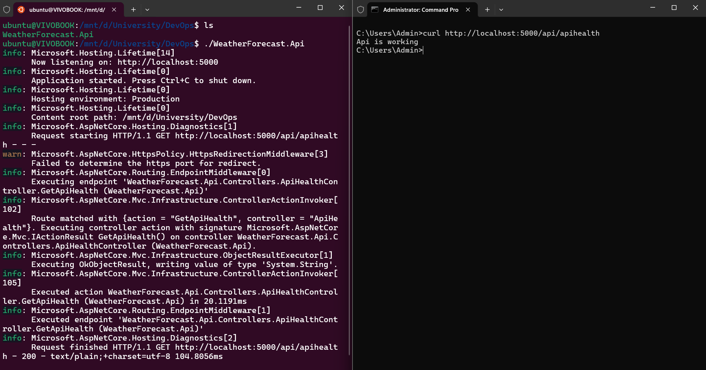

# Sprawozdanie 2

## Uruchamianie instancji Jenkins
Jenkins to narzędzie do automatyzacji procesów związanych z tworzeniem, testowaniem i wdrażaniem oprogramowania. Aby przeprowadzać proces CI/CD na naszej aplikacji, możemy z niego korzystać.

Dobrą praktyką jest korzystanie z Jenkins w środowisku zagnieżdzonym. Można to uzyskać poprzez uruchiomienie koneternera DIND (Docker-in-Docker). Jest to kontener z własną powłoką uruchamiającą kontenery, nie jest związany z naszym dockerem na hoście.

Aby uruchomić kontener DIND, należy:

Utworzyć sieć, przez którą będą komunikowały się kontener z DIND i kontener z Jenkins:
```
docker network create jenkins
```

Następnie korzystając z gotowego obrazu `docker:dind`, uruchamiamy kontener:
```
docker run \
  --name jenkins-docker \
  --rm \
  --detach \
  --privileged \
  --network jenkins \
  --network-alias docker \
  --env DOCKER_TLS_CERTDIR=/certs \
  --volume jenkins-docker-certs:/certs/client \
  --volume jenkins-data:/var/jenkins_home \
  --publish 2376:2376 \
  docker:dind \
  --storage-driver overlay2
```

Gdy mamy już działający kontener DIND, tworzymy obraz Jenkins Blue Ocean. Jest to wersja Jenkins która cechuje się bardziej nowoczesnym interfejsem graficznym, preinstalowanymi pluginami i łatwiejszym workflow.

Przykładowy plik Dockerfile dla obrazu Jenkins Blue Ocean:
``` dockerfile
FROM jenkins/jenkins:2.492.3-jdk21
USER root
RUN apt-get update && apt-get install -y lsb-release ca-certificates curl && \
    install -m 0755 -d /etc/apt/keyrings && \
    curl -fsSL https://download.docker.com/linux/debian/gpg -o /etc/apt/keyrings/docker.asc && \
    chmod a+r /etc/apt/keyrings/docker.asc && \
    echo "deb [arch=$(dpkg --print-architecture) signed-by=/etc/apt/keyrings/docker.asc] \
    https://download.docker.com/linux/debian $(. /etc/os-release && echo \"$VERSION_CODENAME\") stable" \
    | tee /etc/apt/sources.list.d/docker.list > /dev/null && \
    apt-get update && apt-get install -y docker-ce-cli && \
    apt-get clean && rm -rf /var/lib/apt/lists/*
USER jenkins
RUN jenkins-plugin-cli --plugins "blueocean docker-workflow"
```

Po uzupełnieniu Dockerfile, tworzymy obraz:
```
docker build -t myjenkins-blueocean:2.492.3-1 .
```

Teraz możemy uruchomić kontener z Jenkins:
```
docker run \
  --name jenkins-blueocean \
  --restart=on-failure \
  --detach \
  --network jenkins \
  --env DOCKER_HOST=tcp://docker:2376 \
  --env DOCKER_CERT_PATH=/certs/client \
  --env DOCKER_TLS_VERIFY=1 \
  --publish 8080:8080 \
  --publish 50000:50000 \
  --volume jenkins-data:/var/jenkins_home \
  --volume jenkins-docker-certs:/certs/client:ro \
  myjenkins-blueocean:2.492.3-1
  ```

  Po zakończonym procesie, powinniśmy mieć dwa uruchomone kontenery:

  

  ## Konfiguracja Blueocean i tworzenie nowego projektu

  Aby skonfigurować naszego Jenkinsa, musimy przejść pod adres: http://localhost:8080. Zostaniemy tam zapytani o wpisanie hasła. Aby je znaleźć, należy skorzystać z plików kontenera w którym znajduje się Jenkins:
  ```
  docker exec jenkins-blueocean cat /var/jenkins_home/secrets/initialAdminPassword
  ```

  Wyświetlone hasło należy skopiować i podać na stronie. Tworzymy nowego użytkownika i instalujemy podstawowe pluginy.

  Po instalacji tworzymy nowy projekt typu pipeline
  


  ## Architektura CI aplikacji
  Wybrana aplikacja to REST Api, działająca w środowisku uruchomieniowym .net8.

  Jest ona napisana przeze mnie, przez co kwestie licencyjne są pominięte.

  Planowane etapy wykonywania się pipeline'u zostały przedstawione na poniższym diagramie:

  

  ## Etap pobierania repozytorium z GitHub
  Etap ten nie znajduje się w pliku Jenkinsfile, ponieważ zarządzany jest przez sam Jenkins.

  Po utworzeniu nowego projektu pipeline, mamy możliwość pobierania kodu z GitHub. Aby to zrobić należy w sekcji `Pipeline` zaznaczyć opcję `Pipeline script from SCM`. Następnie wybieramy `SCM`, w naszym przypadku jest to `git`. Wpisujemy URL repozytorium przedmiotu i wybieramy nasz `branch`.

  Przy wybieraniu brancha, najlepiej jest pobrać tylko nasz, ponieważ ze względu na dużą ilość `forków` znajdującą się w repozytrium, czas pobierania całego repozytorium będzie bardzo długi.

  Pozostało jeszcze uzupełnić ścieżkę, gdzie znajduje się nasz Jenkinsfile.

  Cały ten etap zapewnił nam, że gdy repozutrium zostanie pobrane, będzie ono automatycznie naszym `workspace` (nie musimy pobierać go na nowo i musimy wchodzić do katalogu MDO2025_INO).

  Dodatkowo zaznaczenie `GitHub hook trigger for GITScm polling` w sekcji `Triggers` sprawi, że przy każdym poprawnym `git push` nasz pipeline uruchomi się na nowo.

  

  ## Zmienne w skrypcie
  Do łatwiejszego zarządzania etapami, zostały dodane zmienne w skrypcie. Odnoszą się one do kluczowych nazw lub URL, tak aby przyszłe zmiany były jak najbardziej proste i przejrzyste:

  ``` Groovy
  environment {
      //Dockerfiles
      DOCKERFILES_PATH = 'ITE/GCL04/JL416317/Sprawozdanie2/dockerfiles'
      DOCKERFILE_BUILD = 'Dockerfile.build'
      DOCKERFILE_TEST = 'Dockerfile.test'
      DOCKERFILE_DEPLOY = 'Dockerfile.deploy'
      
      //Images
      IMAGE_BUILD = 'weatherapp-build'
      IMAGE_TEST = 'weatherapp-test'
      IMAGE_DEPLOY = 'weatherapp-deploy'
      
      //Containers
      APP_CONTAINER = 'weatherapp'
      
      //Health check
      API_HEALTHCHECK_URL = 'http://localhost:8080/api/apihealth'
      
      //Publish
      ARTIFACTS_PATH = 'artifacts'

      //Flags
      DEBUG_FLAG = 'true'
  }
  ```

  ## Etap czyszczenia środowiska
  W tym etapie upewniamy się że nasze środowisko jest wyczyszczone. Usuwamy działające kontenery związane z naszą aplikacją, oraz usuwamy stare obrazy, które mogą wpłynąć na cache'owanie budowania nowych obrazów z nowym kodem.

  ``` Groovy
  stage('Workspace cleanup') {
      steps {
          echo 'Cleaning containers...'
          sh """
              docker container prune -f
              docker rm -f ${APP_CONTAINER} || true
          """
          echo 'Cleaning images...'
          sh """
              docker image prune -f
              docker rmi -f ${IMAGE_BUILD} ${IMAGE_TEST} ${IMAGE_DEPLOY} || true
          """
      }
  }
  ```

  ## Etap budowania aplikacji
  Ten etap uruchamia Dockerfile.build, którego zadaniem jest pobrać kod aplikacji z brancha `main`. Pobiera on zależności potrzebne do zbudowania aplikacji i buduje pliki wyjściowe w odpowienim katalogu. Bazuje on na obrazie `dotnet/sdk:8.0`, który zawiera narzędzia potrzebne do debugu builda i dodatkowe narzędzia takie jak `git`.

  Dockerfile.build:
  ``` Dockerfile
  FROM mcr.microsoft.com/dotnet/sdk:8.0 AS build

  WORKDIR /src

  # Klonowanie repozytorium
  RUN git clone https://github.com/JakubLatawiec/weatherapp-backend.git

  WORKDIR /src/weatherapp-backend

  # Przywrócenie zależności
  RUN dotnet restore WeatherForecast.Api/WeatherForecast.Api.csproj

  # Budowanie
  RUN dotnet build WeatherForecast.Api/WeatherForecast.Api.csproj -c Release -o /app/build
  ```

  Etap Build w Jenkinsfile:
  ``` Groovy
  stage('Build') {
      steps {
          dir("${DOCKERFILES_PATH}") {
              sh "docker build --no-cache -t ${IMAGE_BUILD} -f ${DOCKERFILE_BUILD} ."
          }
      }
  }
  ```

  ## Przeprowadzanie testów aplikacji
  Aplikacja zawiera testy, które trzeba uruchomić aby mieć pewność że nasza aplikacja zachowuje się w zdefiniowany przez nas sposób. Wykorzytujemy do tego przygotowany wcześniej Dockerfile.test, który za pomocą .net8 runtime, uruchamia zdefioniowane testy i w razie niepowodzenia, kończy nasz pipeline.

  Dockerfile.test:
  ``` Dockerfile
  FROM weatherapp-build AS test

  WORKDIR /src/weatherapp-backend

  # Uruchomienie testów
  RUN dotnet test WeatherForecast.Tests
  ```

  Etap Test w Jenkinsfile:
  ``` Groovy
  stage('Test') {
      steps {
          dir("${DOCKERFILES_PATH}") {
              sh "docker build --no-cache -t ${IMAGE_TEST} -f ${DOCKERFILE_TEST} ."
          }
      }
  }
  ```

  ## Etap Deploy
  Etap ten jest odpowiedzialny za stworzenie artefaktu, który będziemy chcieli uzyskać pod koniec naszego pipeline'u. Tworzony jest obraz bazujący na Dockerfile.deploy. Korzysta on z obrazu tworzonego w etapie Build, aby zapewnić te same pliki pobrane z repozytorium aplikacji. 
  
  Tworzony jest w nim artefakt za pomocą `dotnet publish` i atrybutu `self-contained`. Oznacza to że nasza aplikacja, zawierać się będzie w jednym pliku. Plik ten zawiera zbudowane obiekty naszej aplikacji, potrzebne biblioteki oraz sam runtime. Dzięki temu możliwe będzie uruchomienie aplikacji na systemie bez `.net8`.

  Ponieważ aplikacja uruchamiana jest na bardzo minimalistycznym obrazie `bitnami/minideb:bullseye`, ważącym tylko ok. 50MB (co oznacza że nie ma on runtime .net8), musimy doinstalować bibliotekę `libicu67`. Jest ona potrzebna, ponieważ aplikacja obsługuję Unicode oraz formatuje liczby w zależności od lokalizacji.

  Dodatkowo do obrazu instalowany jest program `curl`. Pozwala on na wysyłanie zapytań do naszej aplikacji, co potrzebne będzie w następnym kroku. Ta biblioteka byłaby zbędna, gdyby nasz pipeline nie sprawdzał poprawności uruchomienia aplikacji.

  Usuwamy również plik `appsettings.Development.json`. Jest to plik konfiguracyjny REST Api w środowisku `.net`, który brany jest tylko pod uwagę jeżeli uruchamiamy aplikację w profilu `Development`, czyli podczas pisania kodu, np. w IDE.

  Dockerfile.deploy:
  ``` Dockerfile
  FROM weatherapp-build AS publish

  WORKDIR /src/weatherapp-backend

  RUN dotnet publish WeatherForecast.Api/WeatherForecast.Api.csproj \
      -c Release \
      -r linux-x64 \
      --self-contained true \
      -p:PublishSingleFile=true \
      -p:IncludeNativeLibrariesForSelfExtract=true \
      -p:PublishTrimmed=false \
      -p:DebugType=none \
      -o /app/publish

  FROM bitnami/minideb:bullseye AS runtime

  RUN install_packages curl libicu67

  WORKDIR /app

  COPY --from=publish /app/publish ./
  RUN rm -f appsettings.Development.json

  ENV ASPNETCORE_URLS=http://+:8080

  EXPOSE 8080

  ENTRYPOINT ["./WeatherForecast.Api"]
  ```

  Etap Deploy w Jenkinsfile:
  ``` Groovy
  stage('Deploy') {
      steps {
          dir("${DOCKERFILES_PATH}") {
              sh """
                  docker build --no-cache -t ${IMAGE_DEPLOY} -f ${DOCKERFILE_DEPLOY} .
                  docker run -d --name ${APP_CONTAINER} ${IMAGE_DEPLOY}
              """
          }
      }
  }
  ```

  ## Badanie uruchomienia się aplikacji
  Aby zobaczyć czy aplikacja poprawnie się uruchomiła, został do kodu dodany endpoint `/api/apihealth`. Jest to prosty endpoint zwracający message i status 200.
  
  W większych aplikacjach taki endpoint powinien zwracać listę kontrolną połączeń z innymi serwisami/adapterami np. baza danych, serwis odpowiedzialny za logi, serwis cache itp. Deployowana aplikacja korzysta z dwóch adapterów: `OpenMeteo` i `OpenCage`. Niestety `OpenCage` wymaga zmiennej środowiskowej, jaką jest klucz prywatny do wysyłania zapytań a aplikacja napisana jest w taki sposób, że wymagane jest działanie obu adapterów do przeprowadzenia poprawnego zapytania. Problem ten można rozwiązać, korzystając z pluginu `cridentials` w Jenkins i bloku `enviroment` w Jenkinsfile a następnie przesyłać zmienną do utworzonego kontenera. Jednak ze względu na to, że pipeline będzie uruchamiany również przez prowadzącego zajęcia, postanowiłem pominąć ten krok aby nie zmuszać do utworzenia swojego własnego `API_KEY` ani nie upubliczniać swojego prywatnego `API_KEY`. Problem ten może zostać rozwiązany poprzez zmiany w kodzie, które nie będą wymagały obydwojga adapterów do poprawnego działania.

  Etap ten, odputuje co 5 sekund aplikację i czeka na status 200. Zapytanie wywoływane jest wewnątrz kontenera na którym działa aplikacja a nie z zewnątrz. Uruchomienie aplikacji z zewnątrz wiązałoby się z doinstalowywaniem biblioteki `curl` w kontenerze DIND, co nie jest optymalne jeżeli pipeline ma działać na innym kontenerze Jenkins z domyślnie skonfigurowanym obrazem DIND.

  Nie możemy również wysyłać zapytania w konsoli z kontenerem Jenkins, ponieważ nie ma on informacji o procesach działających w kontenerze DIND (gdzie uruchomiona jest nasza aplikacja). Jedyny sposób komunikacji między tymi kontenerami, zapewniają polecenia `docker`.

  Dodatkowo etap `Healh Check` wyświetla ciało zwróconego zapytania.

  Etapy `App Starup` i `Health Check` w Jenkinsfile:
  ``` Groovy
  stage('App startup') {
      steps {
          sh '''
              for i in {1..30}; do
                  STATUS=$(docker exec ${APP_CONTAINER} curl -s -o /dev/null -w "%{http_code}" ${API_HEALTHCHECK_URL})
                  if [ "$STATUS" -eq 200 ]; then
                      exit 0
                  fi
                  sleep 5
              done
              echo "Application is not running!"
              exit 1
          '''
      }
  }

  stage('Health check') {
      steps {
          sh '''
              set -e
              STATUS=$(docker exec ${APP_CONTAINER} curl -s -o /tmp/response.txt -w "%{http_code}" ${API_HEALTHCHECK_URL})
              docker exec ${APP_CONTAINER} cat /tmp/response.txt
              [ "$STATUS" -eq 200 ]
          '''
      }
  }
  ```

  ## Etap Publish
  W tym etapie tworzony jest katalog wyjściowy do którego kopiowany jest nasz artefakt działającej aplikacji. Będzie on dostępny do pobrania po zakończeniu pipeline'u.

  ``` Groovy
  stage('Publish') {
      steps {
          sh """
              mkdir -p ${ARTIFACTS_PATH}
              docker cp ${APP_CONTAINER}:/app ${ARTIFACTS_PATH}
          """
          archiveArtifacts artifacts: "${ARTIFACTS_PATH}/**", fingerprint: true
      }
  }
  ```

  ## Ponowne czyszczenie
  Niezależnie od tego czy nasz pipeline zakończył się sukcesem czy nie, zawsze wykonywane jest usuwanie kontenerów i obrazów z nim związanych, oraz usuwanie plików pobranych w etapie SCM. Dzieje się tak aby przy następnym uruchomieniu pipeline'u zapenwnić nowe zmiany z brancha, jeśli takie nastąpiły, oraz usunąć rzeczy związane z konteneryzacją tak aby inne projekty miały miejsce na swoje.

  ## Dodatkowy Debug
  W bloku `enviroment` została dodana flaga `DEBUG_FLAG`. Gdy jest aktywna, wykonują się poniższe kroki w celu łatwiejszego znajdywania błędów:
  ``` Groovy
  stage('[Debug]: Build') {
      when {
          expression { env.DEBUG_FLAG == 'true' }
      }
      steps {
          sh 'docker images'
      }
  }

  stage('[Debug]: Test') {
      when {
          expression { env.DEBUG_FLAG == 'true' }
      }
      steps {
          sh 'docker images'
      }
  }

  stage('[Debug]: Deploy') {
      when {
          expression { env.DEBUG_FLAG == 'true' }
      }
      steps {
          sh '''
              docker images
              docker ps -a
          '''
      }
  }

  stage('[Debug]: App startup') {
      when {
          expression { env.DEBUG_FLAG == 'true' }
      }
      steps {
          sh "docker logs ${APP_CONTAINER}"
      }
  }
  ```

  ## Cały Jenkinsfile
  ```Groovy
  pipeline {
    agent any

    environment {
        //Dockerfiles
        DOCKERFILES_PATH = 'ITE/GCL04/JL416317/Sprawozdanie2/dockerfiles'
        DOCKERFILE_BUILD = 'Dockerfile.build'
        DOCKERFILE_TEST = 'Dockerfile.test'
        DOCKERFILE_DEPLOY = 'Dockerfile.deploy'
        
        //Images
        IMAGE_BUILD = 'weatherapp-build'
        IMAGE_TEST = 'weatherapp-test'
        IMAGE_DEPLOY = 'weatherapp-deploy'
        
        //Containers
        APP_CONTAINER = 'weatherapp'
        
        //Health check
        API_HEALTHCHECK_URL = 'http://localhost:8080/api/apihealth'
        
        //Publish
        ARTIFACTS_PATH = 'artifacts'

        //Flags
        DEBUG_FLAG = 'true'
    }

    stages {
        stage('Workspace cleanup') {
            steps {
                echo 'Cleaning containers...'
                sh """
                    docker container prune -f
                    docker rm -f ${APP_CONTAINER} || true
                """
                echo 'Cleaning images...'
                sh """
                    docker image prune -f
                    docker rmi -f ${IMAGE_BUILD} ${IMAGE_TEST} ${IMAGE_DEPLOY} || true
                """
            }
        }

        stage('Build') {
            steps {
                dir("${DOCKERFILES_PATH}") {
                    sh "docker build --no-cache -t ${IMAGE_BUILD} -f ${DOCKERFILE_BUILD} ."
                }
            }
        }
        
        stage('[Debug]: Build') {
            when {
                expression { env.DEBUG_FLAG == 'true' }
            }
            steps {
                sh 'docker images'
            }
        }

        stage('Test') {
            steps {
                 dir("${DOCKERFILES_PATH}") {
                    sh "docker build --no-cache -t ${IMAGE_TEST} -f ${DOCKERFILE_TEST} ."
                }
            }
        }

        stage('[Debug]: Test') {
            when {
                expression { env.DEBUG_FLAG == 'true' }
            }
            steps {
                sh 'docker images'
            }
        }
        
        stage('Deploy') {
            steps {
                dir("${DOCKERFILES_PATH}") {
                    sh """
                        docker build --no-cache -t ${IMAGE_DEPLOY} -f ${DOCKERFILE_DEPLOY} .
                        docker run -d --name ${APP_CONTAINER} ${IMAGE_DEPLOY}
                    """
                }
            }
        }

        stage('[Debug]: Deploy') {
            when {
                expression { env.DEBUG_FLAG == 'true' }
            }
            steps {
                sh '''
                    docker images
                    docker ps -a
                '''
            }
        }
        

        stage('App startup') {
            steps {
                sh '''
                    for i in {1..30}; do
                        STATUS=$(docker exec ${APP_CONTAINER} curl -s -o /dev/null -w "%{http_code}" ${API_HEALTHCHECK_URL})
                        if [ "$STATUS" -eq 200 ]; then
                            exit 0
                        fi
                        sleep 5
                    done
                    echo "Application is not running!"
                    exit 1
                '''
            }
            
        }

        stage('[Debug]: App startup') {
            when {
                expression { env.DEBUG_FLAG == 'true' }
            }
            steps {
                sh "docker logs ${APP_CONTAINER}"
            }
        }
        
        stage('Health check') {
            steps {
                sh '''
                    set -e
                    STATUS=$(docker exec ${APP_CONTAINER} curl -s -o /tmp/response.txt -w "%{http_code}" ${API_HEALTHCHECK_URL})
                    docker exec ${APP_CONTAINER} cat /tmp/response.txt
                    [ "$STATUS" -eq 200 ]
                '''
            }
        }
        
        stage('Publish') {
            steps {
                sh """
                    mkdir -p ${ARTIFACTS_PATH}
                    docker cp ${APP_CONTAINER}:/app ${ARTIFACTS_PATH}
                """
                archiveArtifacts artifacts: "${ARTIFACTS_PATH}/**", fingerprint: true
            }
        }
    }

    post {
        always {
            echo 'Cleaning containers...'
            sh """
                docker container prune -f
                docker rm -f ${APP_CONTAINER} || true
            """
            echo 'Cleaning images...'
            sh """
                docker image prune -f
                docker rmi -f ${IMAGE_BUILD} ${IMAGE_TEST} ${IMAGE_DEPLOY} || true
            """
            echo 'Cleaning workspace...'
            cleanWs()
        }
    }
  }
  ```

  ## Uruchomienie aplikacji na innym systemie
  Aby sprawdzić czy nasz artefakt działa na systemie spełniającym wymagania, został on pobrany i uruchiomiony przez WSL2:

  