# Sprawozdanie 3

## Przygotowanie maszyn do pracy z Ansible
`Ansible` to narzędzie typu `Infrastructure as Code (IaC`), które służy do automatyzacji konfiguracji systemów, zarządzania infrastrukturą oraz wdrażania aplikacji. Jest proste w użyciu, nie wymaga instalowania agenta na maszynach zdalnych i działa głównie przez `SSH`.

Do realizacji wdrożenia aplikacji przez `Ansible`, należy stworzyć nową maszynę wirtualną. Z racji tego, że główna maszyna działa na `Ubuntu Server 20.04`, postanowiłem użyć tego samego systemu operacyjnego na nowej VM. Nie zostały zainstalowane inne dodatkowe pakiety, jest to czysty system z działającym `SSH` i programem `tar`. Podczas instalacji stworzono użytkownika z uprawnieniami administratora: `ansible`, oraz ustawiono hostname na: `ansible-target`. Po instalacji zostały utworzone `klucze SSH`, aby zapewnić bezproblemowe połączenie między maszynami.

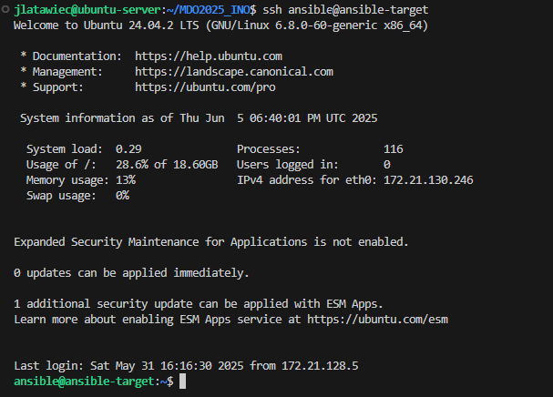

Na głównej maszynie wirtualnej zostało zainstalowane oprogramowanie `Ansible` z repozytorium dystrybucji:
```
sudo apt install software-properties-common
sudo add-apt-repository --yes --update ppa:ansible/ansible
sudo apt install ansible
```

## Tworzenie infrastruktury
Aby utworzyć infrastrukture gotową do deployowania aplikacji, należało skonfigurować `hostname` dla obu maszyn, aby lepiej identyfikowały się w sieci.

```
# Dla głównej maszyny
sudo hostnamectl set-hostname ubuntu-server

# Dla maszyny docelowej
sudo hostnamectl set-hostname ansible-target
```

Dodatkowo żeby nie musieć posługiwać się adresami IP (które mogą zmieniać się po restartowaniu maszyny) należy skonfigurować `DNS`. Obie maszyny wirtualizowane są poprzez `Hyper-V` i działają na domyślnym switchu, który sam w sobie rozwiązuje nazwy hostów na adresy IP, dlatego mogłem pominąć krok z konfigurowaniem pliku `/etc/hosts` na obu maszynach.

Do zweryfikowania poprawności działania infrastruktury, wywołano polecenie `ping` z obu maszyn. 

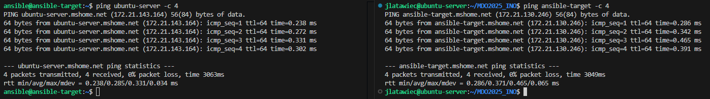

Do określenia jak wygląda infrastruktura, stworzono plik `inventory.yml`. Opisuje on z której maszyny będą wywoływane polecenia, do których maszyn będą trafiać, oraz którzy użytkownicy na danej maszynie są uprawnieni do wywoływania poleceń.

``` yml
all:
  children:
    orchestrators:
      hosts:
        ubuntu-server:
          ansible_user: jlatawiec
    endpoints:
      hosts:
        ansible-target:
          ansible_user: ansible

```

Poprawność infrastruktury sprawdzono wysyłając polecenie `ping`:
```
ansible all -i inventory.yml -m ping
```

Gdzie:
 - `all` - oznacza że polecenie wysyłamy zarówno do `endpoints` jak i `orchestrators`
 - `-i` - wskazuje na plik inwentaryzacji
 - `-m` - to nazwa modułu ansible z którego korzystamy

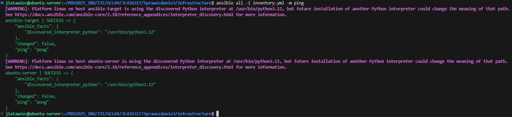

## Podstawowy pipeline poleceń zdalnych
`Ansible` umożliwia tworzenie plików `playbook`, które opisują etapy jakie mają wykonać się na maszynach zdalnych. Przykładowy `playbook.yml` wygląda następująco:

``` yml
- name: Example playbook
hosts: endpoints
become: true
tasks:

- name: Ping
    ansible.builtin.ping:

- name: Copy
    copy:
    src: inventory.yml
    dest: /tmp/inventory.yml

- name: Update
    apt:
    update_cache: yes
    upgrade: dist

- name: SSH Restart
    service:
    name: ssh
    state: restarted

- name: RNGD Restart
    service:
    name: rngd
    state: restarted
```

Gdzie `name` to nazwa playbooka który ma się wykonać, `hosts` informuje na jakiej grupie mają wykonywać się zadania (w naszym przypadku jest to grupa endpoints w której znajduje się maszyna ansible-target). `become` informuje o uruchamianiu zadań z podniesionymi uprawnieniami np. jako root. Sekcja `tasks` definuje zadania jakie mają się wykonać. W zadaniu definiowana jest jego nazwa i moduł który ma się wykonać.

Taki pipeline uruchamiany jest za pomocą `ansible-playbook`:
```
ansible-playbook -i inventory.yml example_playbook.yml -K
```

Parametr `-K` informuje, że konieczne będzie podanie hasła aby wykonywać polecenia jako root.

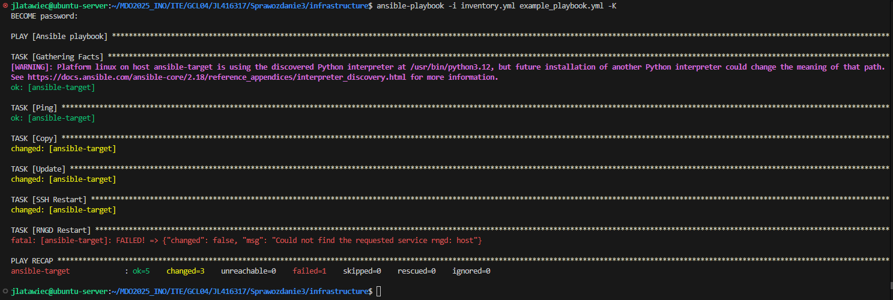

`Ansible` zawiera parę statusów informujących o dokonanych zmianach. `ok` oznacza że operacja się powiodła ale nie wpłyneła na stan maszyny w przeciwieństwie do `changed`. Po ponownym uruchomieniu pipeline'u można zauważyć, że zadanie `Copy` kończy się statusem `ok` a nie tak jak wcześniej `changed`. Dzieje się tak, ponieważ plik został skopiowany wcześniej i nie zmieniła się jego zawartość, `ansible` nie kopiuje go jeszcze raz tylko sprawdza czy istnieje co nie wpływa na stan maszyny.

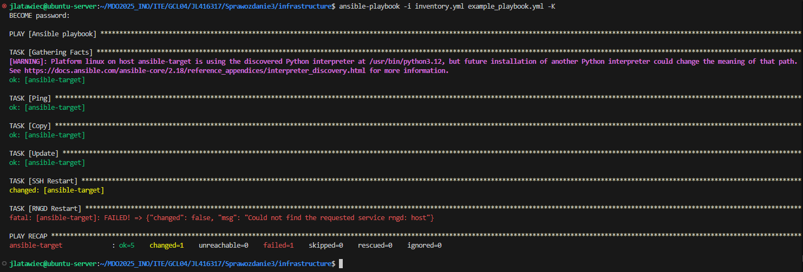

Aby potwierdzić, że `ansible` działa przez `ssh`, możemy wyłączyć usługę na maszynie `ansible-target`:

```
sudo systemctl stop ssh
```

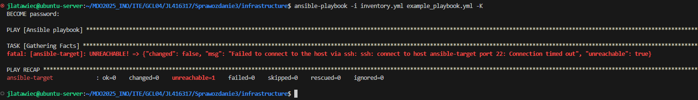

## Wdrożenie aplikacji za pomocą Ansible
Za pomocą `ansible` możliwe jest wdrożenie aplikacji z poprzednich sprawozdań. Wykorzystany do tego został artefakt stworzony przez pipeline `jenkins`.

Do wdrożenia aplikacji, zostały użyte role w ansible. W folderze `roles` zostały stworzone dwie role: app_deploy i docker_setup.

```
ansible-galaxy init app_deploy
ansible-galaxy init docker_setup
```

Powyższe komendy stworzyły strukturę plików zrozumiałą przez `ansible`.

Dla roli `app_deploy` w pliku `/defaults/main.yml` zostały dodane zmienne ułatwiające zarządzanie wdrożeniem:

``` yml
app_name: WeatherForecastApi
app_port: 5000
app_remote_path: "/opt/{{ app_name }}"
image_name: "{{ app_name | lower }}_image"
container_name: "{{ app_name | lower }}_container"
```

A w `/files` umieszczono Dockerfile tworzący obraz na którym zostanie uruchomiony artefakt i sam artefakt (znajduje się on w repozytorum GitHub co jest niepoprawnym podejściem. W repozytorium nie powinny znajdować się pliki uruchomieniowe a sam kod źródłowy. Zastosowano to podejście ze względu na mały rozmiar pliku ok. 70MB i możliość uruchomienia pipeline'u na każdej maszynie z `git` i `ansible` bez konieczności hostowania pliku w innych serwisach do tego przeznaczonych).

W pliku `/tasks/main.yml` napisano pipeline kopiujący pliki na maszynę zdalną, uruchomienie kontenera z aplikacją i sprawdzenie jej działania:

``` yml
- name: Create app directory
  file:
    path: "{{ app_remote_path }}"
    state: directory

- name: Copy app files
  copy:
    src: .
    dest: "{{ app_remote_path }}/"
    mode: '0755'

- name: Build image
  command: docker build -t {{ image_name }} .
  args:
    chdir: "{{ app_remote_path }}"

- name: Run container
  docker_container:
    name: "{{ container_name }}"
    image: "{{ image_name }}"
    ports:
      - "{{ app_port }}:{{ app_port }}"
    restart_policy: always
    state: started

- name: Run healthcheck
  uri:
    url: "http://localhost:{{ app_port }}/api/apihealth"
    method: GET
    return_content: yes
  register: healthcheck

- name: Healthcheck result
  debug:
    msg: "Response: {{ healthcheck.content }}"
```

Rola `docker_setup` została wydzielona dla rozróżnienia instalacji `docker` na maszynie zdalnej a wdrożenia aplikacji. W pliku `/tasks/main.yml` znajduję się pipeline komplentej instalacji `docker`:

``` yml
- name: Install required packets
  apt:
    name:
      - apt-transport-https
      - ca-certificates
      - curl
      - software-properties-common
    state: present
    update_cache: yes

- name: Add GPG key
  apt_key:
    url: https://download.docker.com/linux/ubuntu/gpg
    state: present

- name: Add Docker repository
  apt_repository:
    repo: deb [arch=amd64] https://download.docker.com/linux/ubuntu focal stable
    state: present
    filename: docker
  when: ansible_distribution == "Ubuntu"

- name: Install Docker
  apt:
    name:
      - docker.io
      - python3-docker
    state: present
    update_cache: yes

- name: Setup user
  user:
    name: "{{ ansible_user }}"
    groups: docker
    append: yes
  become: true

- name: Run Docker
  systemd:
    name: docker
    state: started
    enabled: yes

```

Został utworzony nowy plik `playbook.yml` uruchamiający obie role:
``` yml
- name: Docker setup
  hosts: endpoints
  become: true
  roles:
    - docker_setup

- name: Weatherapp deploy
  hosts: endpoints
  become: true
  roles:
    - app_deploy
```

Uruchomienie wdrożenia następuje poprzez komendę:
```
ansible-playbook -i inventory.yml playbook.yml -K
```

Niektóre statusy przy pierwszym uruchomieniu będą się różnić od poniższych wyników. Wynika to z wcześniejszego uruchomienia pipeline'u, przez co np. `docker` był już zainstalowany.

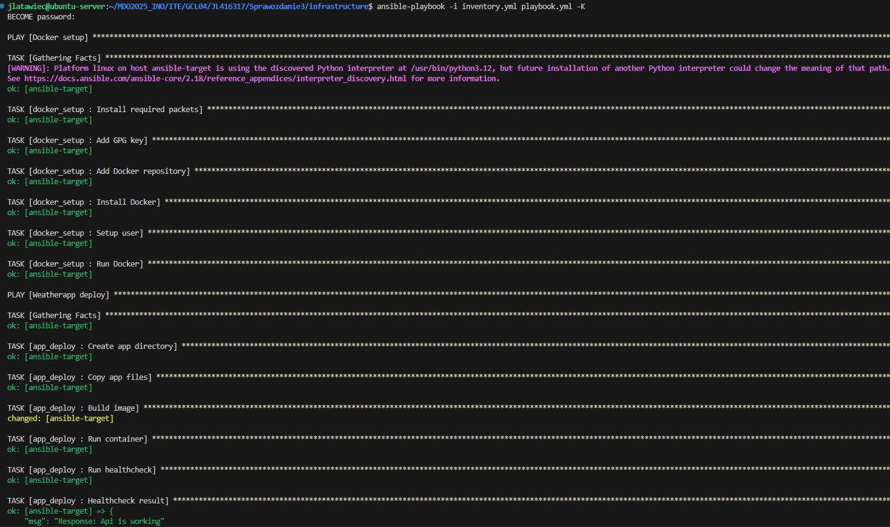

## Wdrożenie aplikacji za pomocą instalacji nienadzorowanej
Wiele systemów operacyjnych z jądrem bazującym na `Linux`, pozwala na zastosowanie pliku konfiguracyjnych, dzięki którym za pomocą kodu można opisać warunki na jakiej ma przebiegać instalacja.

We wdrożeniu, skorzystano z systemu operacyjnego Fedora w wersji 41 z instalatorem sieciowym `Everything Netinst`.

Do wdrożenia aplikacji, konieczne było stworzenie pliku konfigurayjnego `fedora-autoinstall.ks`:

```
#version=DEVEL

lang en_US.UTF-8
keyboard pl

network --bootproto=dhcp --hostname=fedora-deploy

rootpw --iscrypted $6$7j0iWmtubLvk9.zk$mXT0qFhWW4QMQGWktIUvXvjOBZbifer/5P/d59Yk8z99L8vjoR8HUPUAWodBSnDtXWXGWhVocFBaHLQRB8iOm1

user --name=deploy_user --password=$6$7j0iWmtubLvk9.zk$mXT0qFhWW4QMQGWktIUvXvjOBZbifer/5P/d59Yk8z99L8vjoR8HUPUAWodBSnDtXWXGWhVocFBaHLQRB8iOm1 --iscrypted --gecos="Deploy User" --groups=wheel

timezone Europe/Warsaw --isUtc

clearpart --all --initlabel
autopart

url --mirrorlist=https://mirrors.fedoraproject.org/metalink?repo=fedora-41&arch=x86_64
repo --name=updates --mirrorlist=https://mirrors.fedoraproject.org/metalink?repo=updates-released-f41&arch=x86_64

reboot

%packages
@^server-product-environment
curl
firewalld
%end

%post --log=/root/ks-post.log

mkdir -p /opt/WeatherForecastApi

curl -L https://raw.githubusercontent.com/InzynieriaOprogramowaniaAGH/MDO2025_INO/JL416317/ITE/GCL04/JL416317/Sprawozdanie3/artefact/WeatherForecast.Api -o /opt/WeatherForecastApi/WeatherForecast.Api

chmod +x /opt/WeatherForecastApi/WeatherForecast.Api

cat <<EOF > /etc/systemd/system/weatherforecastapi.service
[Unit]
Description=My REST API
After=network.target

[Service]
ExecStart=/opt/WeatherForecastApi/WeatherForecast.Api
Restart=always
User=root
Environment=ASPNETCORE_URLS=http://+:5000

[Install]
WantedBy=multi-user.target
EOF

systemctl enable weatherforecastapi.service

firewall-offline-cmd --add-port=5000/tcp
systemctl enable firewalld

%end
```

Gdzie:
- `#version=DEVEL` - To określenie wersji składni Kickstart (deweloperska).
- `lang en_US.UTF-8` - Ustawienie języka systemu na angielski z kodowaniem UTF-8.
- `keyboard pl` - Polski układ klawiatury.
- `network --bootproto=dhcp --hostname=fedora-deploy` - Konfiguruje sieć w trybie DHCP z nazwą hosta: `fedora-deploy`.
- `rootpw --iscrypted ...` - Ustawia zaszyfrowane hasło dla użytkownika root.
- `user --name=deploy_user ...`  
   - Tworzy użytkownika `deploy_user` z takim samym zaszyfrowanym hasłem jak root,
   - Dodany do grupy `wheel` (może używać sudo).
- `timezone Europe/Warsaw --isUtc` - Ustawienie strefy czasowej na `Europe/Warsaw` i czasu systemowego jako UTC.
- `clearpart --all --initlabel` - Usunięcie wszystkich istniejących partycji i inicjalizacja nowej tablicy partycji.
- `autopart` - Automatycznie tworzy partycje systemowe (/, /home, /boot).
- `url --mirrorlist=...` - Informuje że instalacja systemu będzie odbywała się przez repozytoria Fedory.
- `repo --name=updates --mirrorlist=...` - Dodanie repozytorium z aktualizacjami systemu.
- `reboot` - Automatyczny restart systemu po zakończeniu instalacji.
- `%packages` - Lista pakietów do zainstalowania:
    - `@^server-product-environment` – środowisko serwera,
    - `curl` – narzędzie do odpytywania aplikacji,
    - `firewalld` – zapora sieciowa.
- `%post --log=/root/ks-post.log` - Skrypt post-instalacyjny z zapisem logu do `/root/ks-post.log`:
    - Tworzy katalog `/opt/WeatherForecastApi`,
    - Pobiera artefakt z GitHuba do tego katalogu,
    - Ustawia plik jako wykonywalny,
    - Tworzy serwis uruchamiający aplikację `weatherforecastapi.service`,
    - Ustawia zmienną środowiskową `ASPNETCORE_URLS=http://+:5000`,
    - Włącza automatyczne uruchamianie usługi po starcie,
    - Otwiera port 5000 w zaporze,
    - Włącza zaporę `firewalld` przy starcie systemu.

\
Powyższe kroki pozwalają na bezinteraktywną instalację systemu Fedora 41, która po instalacji uruchomi aplikację.

Instalację można uruchomić poprzez uruchomienie instalacji z płyty i wpisania w `GRUB` polecenia:
```
inst.ks=link_do_pliku_konfiguracyjnego
```

Jednak ten krok również można zautomatyzować, modyfikując pliki pobranego wcześniej obrazu. Należy w pliku `EFI/BOOT/grub.cfg` dodać powyższą komendę. Po zbudowaniu nowego obrazu, automatycznie zaciągnięty zostanie plik konfiguracyjny o ile podany URL działa. Stworzony plik ISO nie znajduje się na repozytorium ze względu na jego duży rozmiar (ok. 750MB).

Cały proces może być jeszcze bardziej zoptymalizowany. Można stworzyć skrypt w `PowerShell` który automatycznie stworzy maszynę wirtualną `Hyper-V` i podepnie do niej nowy obraz systemu. Nowe ISO można również wykorzystać w serwisach cloudowych takich jak `AWS` lub `Azure`.

Opisane kroki umożliwiają wdrożenie czystego systemu z wdrożoną aplikacją. Plusem jest to że plik konfiguracyjny znajduje się na repozytorium, przez co wystarczy wypchnąć zmiany na gałąź i ponownie zainstalować system dla nowej konfiguracji. Minusem tego podejścia jest konieczność przeinstalowywania systemu, gdy np. wyszła nowa wersja aplikacji gotowa do wdrożenia.

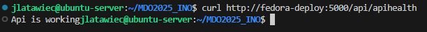

## Przygotowanie systemu do wdrożeń przez Kubernetes
Kubernetes to system do automatyzacji wdrażania, skalowania i zarządzania aplikacjami kontenerowymi (głównie na bazie Dockera lub kompatybilnych runtime’ów).

Została zainstalowana wersja Minikube. Pozwala ona na testowanie klastrów lokalnie.

```
curl -LO https://github.com/kubernetes/minikube/releases/latest/download/minikube-linux-amd64
sudo install minikube-linux-amd64 /usr/local/bin/minikube && rm minikube-linux-amd64
```

Dodany został również alias `minikubectl` ułatwiający zapis oryginalnej komendy `minikube kubectl --`.

Abu uruchomić `kubernetes`, należy wpisać polecenie:
```
minikube start
```

Dodatkowo pakiet `minikube` zawiera dashboard, dzięki któremu interesujące nas dane są łatwo dostępne.
```
minikube dashboard
```

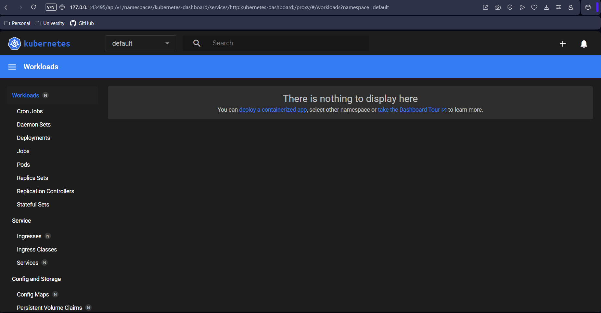


## Podstawowe pojęcia wykorzystane podczas wdrożenia

### 1. Pod (Pod)
- Najmniejsza jednostka w Kubernetes.
- Reprezentuje jeden lub więcej kontenerów uruchamianych razem.
- Kontenery w Podzie współdzielą:
  - adres IP,
  - wolumeny (dyski),
  - przestrzeń nazw.
- Najczęściej jeden Pod = jedna aplikacja.

---

### 2. ReplicaSet
- Zapewnia, że określona liczba Podów jest cały czas uruchomiona.
- Automatycznie tworzy nowe Pody, jeśli jakiś przestanie działać.

---

### 3. Deployment
- Definiuje sposób uruchamiania i zarządzania aplikacją.
- Główne funkcje:
  - Tworzenie i skalowanie Podów,
  - Aktualizacje bez przestojów (rolling updates),
  - Automatyczne cofanie zmian (rollback).
- Wykorzystuje ReplicaSet do zarządzania Podami.

---

### 4. Service
- Umożliwia trwały dostęp do zestawu Podów (ich adresy IP mogą się zmieniać).
- Typy:
  - `ClusterIP` – tylko wewnątrz klastra,
  - `NodePort` – dostęp przez port węzła,
  - `LoadBalancer` – zewnętrzny adres IP (w chmurze).
- Zapewnia równoważenie obciążenia (load balancing).

## Przygotowanie obrazów Docker
`Kubernetes` bardzo dobrze współpracuje z obrazami `Docker`, dlatego zostały stworzone 3 obrazy aplikacji która zostanie wdrożona.
- weatherforecast-api:latest - obraz z podstawową wersją aplikacji
- weatherforecast-api:v2 - obraz z modyfikacjami symulującymi nową wersję programu, która ma być wdrożona (w tym przypadku to zwykła zmiana portu na jakim działa aplikacja, ale w warunkach produkcyjnych mogą być to np. nowe funkcjonalności)
- weatherforecast-api:broken - wadliwy obraz, służy do prezentacji wdrożenia gdy są błędy

\
Wszystkie obrazy znajdują się na `Dockerhub` i zostały pobrane na serwer z `minikube`.

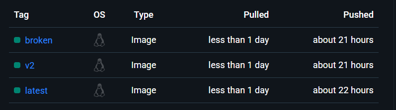

## Uruchomienie aplikacji przez kubernetes
Żeby zobaczyć czy podstawowy obraz działa i środowisko kubernetes jest poprawnie skonfigurowane, uruchomiono jeden pod z obrazem aplikacji poprzez `kubernetes cli`:
```
minikubectl run weatherforecast-api --image=latawiecjakub/weatherforecast-api:latest --port=5000 --labels app=weatherforecast-api
```

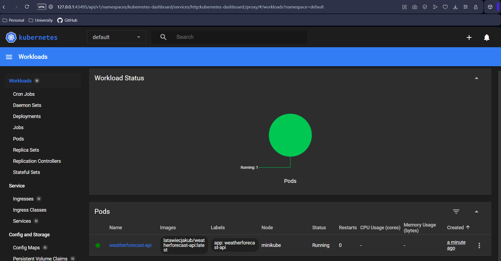

Aby sprawdzić poprawność działania aplikacji możemy otworzyć port w `kubernetes` i wysłać zapytanie do aplikacji.
```
minikubectl port-forward pod/weatherforecast-api 5000:5000
```

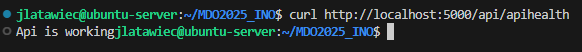

## Tworzenie Deploymentu i Serwisu
`Kubernetes` pozwala na stworzenie pliku w formacie `yml`, dzięki któremu można skonfigurować wdrożenie aplikacji.

``` yml
apiVersion: apps/v1
kind: Deployment
metadata:
  name: weatherforecast-api-deployment
spec:
  replicas: 4
  selector:
    matchLabels:
      app: weatherforecast-api
  template:
    metadata:
      labels:
        app: weatherforecast-api
    spec:
      containers:
      - name: weatherforecast-api
        image: latawiecjakub/weatherforecast-api:latest
        ports:
        - containerPort: 5000

---
apiVersion: v1
kind: Service
metadata:
  name: weatherforecast-api-service
spec:
  type: NodePort
  selector:
    app: weatherforecast-api
  ports:
  - protocol: TCP
    port: 5000
    targetPort: 5000
```

Gdzie:
- **apiVersion: apps/v1**  
  Wersja API używana do zdefiniowania Deploymentu.

- **kind: Deployment**  
  Typ zasobu – odpowiada za uruchamianie i zarządzanie wieloma Podami.

- **metadata.name: weatherforecast-api-deployment**  
  Nazwa Deploymentu w klastrze Kubernetes.

- **spec.replicas: 4**  
  Określa liczbę podów, które mają być jednocześnie uruchomione.

- **spec.selector.matchLabels.app: weatherforecast-api**  
  Wskazuje, do jakich Podów ma się odnosić ten Deployment – wybierane są tylko te z etykietą `app=weatherforecast-api`.

- **spec.template.metadata.labels.app: weatherforecast-api**  
  Ustawia etykietę, która będzie przypisana nowo tworzonym Podom.

- **spec.template.spec.containers**  
  Lista kontenerów uruchamianych w Podzie.

  - **name: weatherforecast-api**  
    Nazwa kontenera.

  - **image: latawiecjakub/weatherforecast-api:latest**  
    Obraz aplikacji

  - **ports.containerPort: 5000**  
    Port wewnętrzny kontenera, na którym nasłuchuje aplikacja.
---
- **apiVersion: v1**  
  Wersja API dla zasobu typu Service.

- **kind: Service**  
  Typ zasobu – zapewnia dostęp do aplikacji uruchomionej w Podach.

- **metadata.name: weatherforecast-api-service**  
  Nazwa usługi w klastrze.

- **spec.type: NodePort**  
  Usługa będzie dostępna spoza klastra na porcie otwartym na węźle (Node) – zakres portów: 30000–32767.

- **spec.selector.app: weatherforecast-api**  
  Service kieruje ruch do Podów oznaczonych etykietą `app=weatherforecast-api`.

- **spec.ports**  
  Definicja portów:

  - **protocol: TCP**  
    Protokół komunikacji.

  - **port: 5000**  
    Port usługi widoczny wewnątrz klastra.

  - **targetPort: 5000**  
    Port, na który trafi ruch w kontenerze aplikacji.

\
Uruchomienie wdrożenia naastępuje poprzez komendę `apply` i podanie ścieżki pliku konfiguracyjnego.
```
minikubectl apply -f weatherforecast-api.yml
```

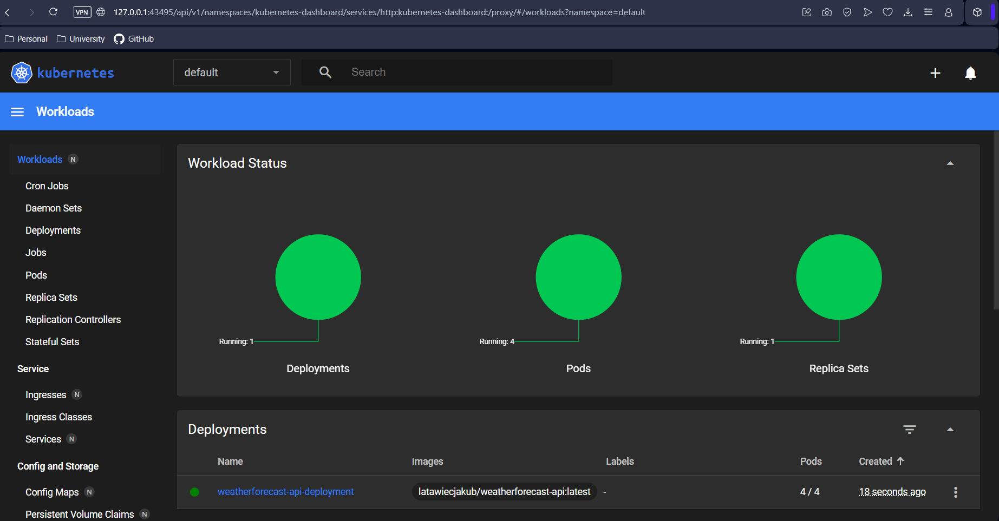

## Skalowalność w kubernetes
Jedną z większych zalet `kubernetes` jest jego skalowalność. Bez problemu możemy zmieniać ilość podów lub wersję aplikacji. Wystarczy tylko zmodyfikować konfigurację i zaakceptować zmiany. `Kubernetes` sam usunie poprzednie pody i stworzy nowe na podstawie zmienionych danych. Dodatkowo zawiera on system kontroli wersji, w historii możemy zobaczyć jakie były dokonywane zmiany i wrócić do interesującego nas momentu we wdrożeniu.

Przy zwiększeniu replik z 4 do 8, `kubernetes` nie usuwał już działających tylko dodał nowe.

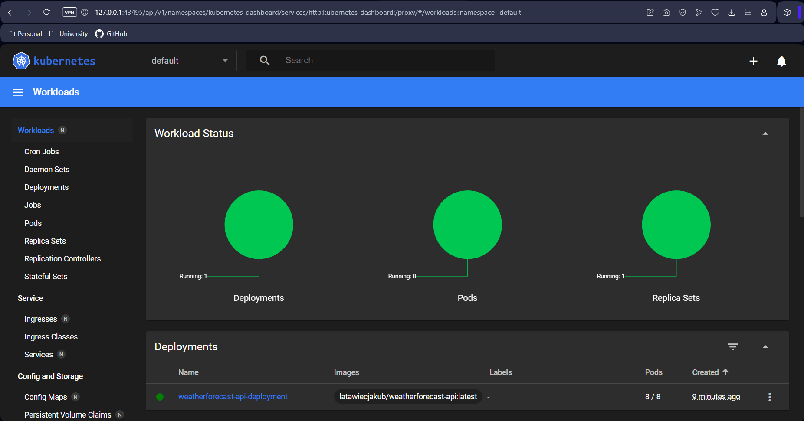

Przy zmniejszeniu z 8 do 1 repliki, `kubernetes` pozostawił jeden działający już wcześniej pod.


Gdy ilość replik zostanie ustawiona na 0, aplikacja jest wyłączana.

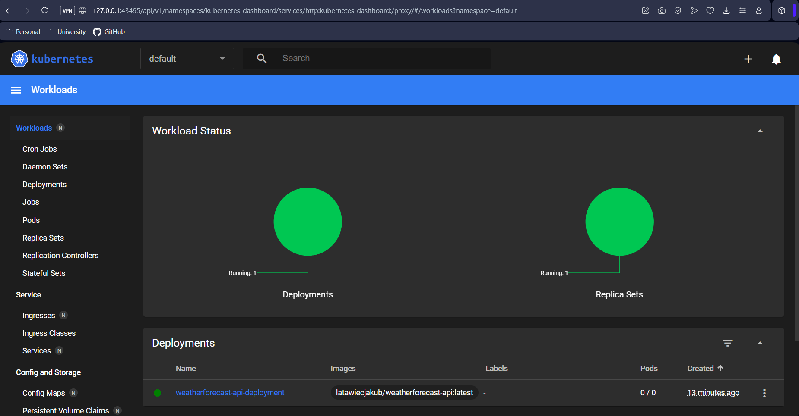

Po powrocie do 4 replik, ale zmianie obrazu, zostały utworzone cztery nowe repliki z nowym obrazem.

![Screen z dashboard dla obrazu v2](screenshots/kube_v2_image.png
Następnie zastosowano pierwszy obraz i zaakceptowano zmiany. Poźniej wgrany został uszkodzony obraz. Można zauważyć że `kubernetes` po wdrożeniu nowego obrazu do pierwszego poda i zobaczeniu błędu, nie próbował zmieniać innych podów. Jest to bardzo korzystne dla zapewnienia ciągłego działania aplikacji. W tym momencie użytkownik łączący się do serwisu nie zauważyłby nawet że coś nie działa, ponieważ aplikacja dostępna jest z innych podów.

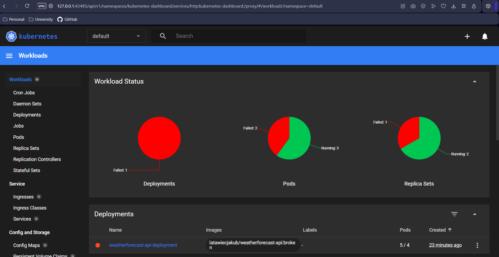

Kubernetes zapisuje całą historie wdrożeń, w tym momencie możemy użyć polecenia `undo` do cofnięcia zmian i posiadania 4 działających podów.
```
minikubectl rollout undo deployment weatherforecast-api-deployment
```

Dodatkowo napisany został skrypt który sprawdza czy aplikacja została wdrożona w 60 sekund. Jest to możliwe za pomocą sprawdzania statusów replik.

``` bash
#!/bin/bash

DEPLOYMENT_NAME="weatherforecast-api-deployment"
NAMESPACE="default"
TIMEOUT=60
INTERVAL=5
ELAPSED=0

echo "Checking if deployment: '$DEPLOYMENT_NAME' is successful..."

while [ $ELAPSED -lt $TIMEOUT ]; do
  STATUS=$(minikube kubectl -- get deployment $DEPLOYMENT_NAME -n $NAMESPACE -o jsonpath='{.status.readyReplicas}')
  DESIRED=$(minikube kubectl -- get deployment $DEPLOYMENT_NAME -n $NAMESPACE -o jsonpath='{.spec.replicas}')

  if [ "$STATUS" == "$DESIRED" ] && [ ! -z "$STATUS" ]; then
    echo "Deployment '$DEPLOYMENT_NAME' is successful!"
    exit 0
  fi

  sleep $INTERVAL
  ELAPSED=$((ELAPSED + INTERVAL))
  echo "Waiting... ($ELAPSED s)"
done

echo "Deployment was not successful"
exit 1
```

## Strategie wdrożenia
`Kubernetes` pozwala na parę strategi wdrożenia np.:

### 1. Recreate

**Opis:**

Strategia `Recreate` polega na **całkowitym usunięciu wszystkich istniejących Podów**, a następnie uruchomieniu nowych z nową wersją obrazu.

**Zalety:**
- Prosta do zrozumienia i wdrożenia.
- Całkowita pewność, że wszystkie nowe Pody działają na nowej wersji.

**Wady:**
- Występuje **czasowy brak dostępności** aplikacji (downtime).
- Niebezpieczna w środowiskach produkcyjnych.

``` yml
apiVersion: apps/v1
kind: Deployment
metadata:
  name: weatherforecast-api-recreate
  labels:
    strategy: recreate
spec:
  replicas: 4
  strategy:
    type: Recreate
  selector:
    matchLabels:
      app: weatherforecast-api
  template:
    metadata:
      labels:
        app: weatherforecast-api
    spec:
      containers:
      - name: weatherforecast-api
        image: latawiecjakub/weatherforecast-api:v2
        ports:
        - containerPort: 5000
```

---

### 2. Rolling Update

**Opis:**

Strategia `RollingUpdate` polega na **stopniowym zastępowaniu starych Podów nowymi**. Proces aktualizacji odbywa się bez zatrzymywania całej aplikacji.

**Parametry konfiguracyjne:**
- `maxUnavailable`: liczba lub procent Podów, które mogą być niedostępne podczas aktualizacji.
- `maxSurge`: liczba lub procent dodatkowych Podów, które mogą zostać uruchomione ponad żądaną liczbę replik.

**Zalety:**
- Brak przerwy w działaniu aplikacji (zero downtime).
- Możliwość precyzyjnego sterowania aktualizacją.

**Wady:**
- Bardziej złożona logika aktualizacji.
- W przypadku błędnej wersji obrazu – może powodować niejednorodność środowiska podczas wdrażania.

``` yml
apiVersion: apps/v1
kind: Deployment
metadata:
  name: weatherforecast-api-rolling
  labels:
    strategy: rolling
spec:
  replicas: 4
  strategy:
    type: RollingUpdate
    rollingUpdate:
      maxUnavailable: 2
      maxSurge: 25%
  selector:
    matchLabels:
      app: weatherforecast-api
  template:
    metadata:
      labels:
        app: weatherforecast-api
    spec:
      containers:
      - name: weatherforecast-api
        image: latawiecjakub/weatherforecast-api:v3
        ports:
        - containerPort: 5000
---
apiVersion: v1
kind: Service
metadata:
  name: weatherforecast-api-rolling-service
spec:
  type: NodePort
  selector:
    app: weatherforecast-api
  ports:
  - protocol: TCP
    port: 5000
    targetPort: 5000
```
---

### 3. Canary Deployment

**Opis:**

Strategia `Canary` polega na **uruchomieniu nowej wersji aplikacji tylko na części replik** (np. 1 z 4), podczas gdy reszta działa w starej wersji. Umożliwia stopniowe testowanie nowej wersji i ocenę jej stabilności.

**Mechanizm:**
- Wymaga osobnych Deploymentów dla wersji "canary" i "stable".
- Ruch rozkładany jest przez wspólny Service między wersjami.

**Zalety:**
- Minimalizuje ryzyko błędów – w razie problemów wpływ dotyczy tylko części użytkowników.
- Pozwala na testowanie w środowisku produkcyjnym.

**Wady:**
- Wymaga więcej konfiguracji.
- Trudniejsza analiza i monitorowanie, jeśli nie ma systemu metryk.

``` yml
apiVersion: apps/v1
kind: Deployment
metadata:
  name: weatherforecast-api-canary
  labels:
    strategy: canary
spec:
  replicas: 1
  selector:
    matchLabels:
      app: weatherforecast-api
      version: canary
  template:
    metadata:
      labels:
        app: weatherforecast-api
        version: canary
    spec:
      containers:
      - name: weatherforecast-api
        image: latawiecjakub/weatherforecast-api:v4
        ports:
        - containerPort: 5000
```
``` yml
apiVersion: apps/v1
kind: Deployment
metadata:
  name: weatherforecast-api-stable
  labels:
    strategy: stable
spec:
  replicas: 3
  selector:
    matchLabels:
      app: weatherforecast-api
      version: stable
  template:
    metadata:
      labels:
        app: weatherforecast-api
        version: stable
    spec:
      containers:
      - name: weatherforecast-api
        image: latawiecjakub/weatherforecast-api:v3
        ports:
        - containerPort: 5000
```