## Zajęcia 01

### 1. Instalacja Gita i konfiguracja kluczy SSH
Zainstalowałem Gita w systemie i wygenerowałem klucze SSH:
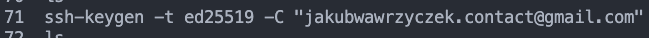

Klucze publiczne dodałem w ustawieniach GitHuba (zakładka **SSH and GPG keys**).
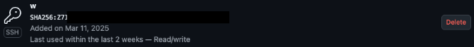

Skonfigurowałem 2FA na koncie GitHub.
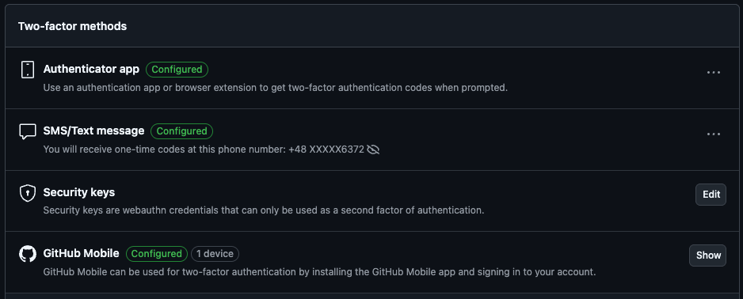

---

### 2. Klonowanie repozytorium
Klonowanie bez uzycia ssh wymagało zalogowania się do konta na githubie.

Klonowanie przez SSH:
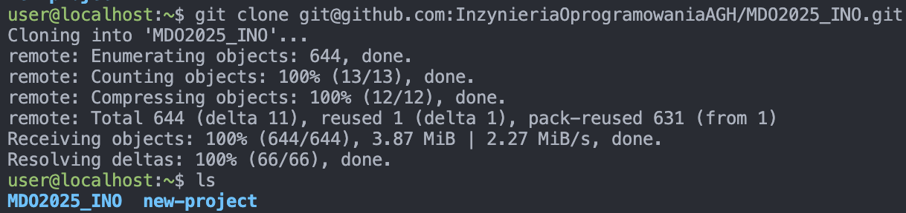

### 3. Przełączanie się na gałęzie
Przełączyłem się na gałąź `main`, a następnie na gałąź grupową `GCL04`. Następnie utworzyłem gałąź składającą się z moich inicjałów i numeru indeksu (`JW414829`):

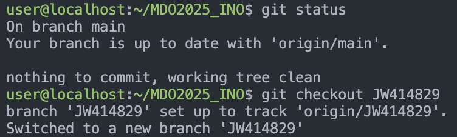

---

### 4. Utworzenie katalogu i napisanie Git hooka
W katalogu **ITE/GCL04** stworzyłem folder `JW414829`.
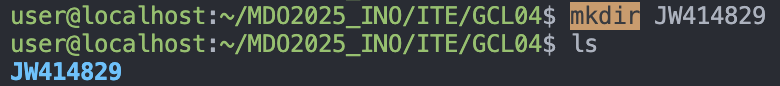

W tym folderze umieściłem plik **sprawozdanie-1.md**.

Pracowałem na hooku bezpośrednio w katalogu `.git/hooks/`, więc nie musiałem nadawać mu uprawnień. Następnie skopiowałem go do mojego katalogu.

#### Treść hooka (`commit-msg`)

```bash
#!/usr/bin/sh

required_prefix="JW414829"
first_line=$(head  -n1  "$1")

case  "$first_line"  in
"$required_prefix"*)
;;
*)
echo  "Błąd: commit musi zaczynać się od '$required_prefix'." >&2
exit  1
;;

esac
```

Następnie przetestowałem działanie hooka.

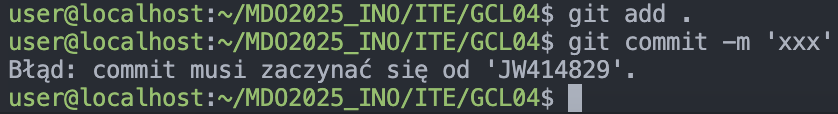

---

### 5. Dodanie sprawozdania, zrzutów ekranu i wysłanie zmian
Utworzyłem/zmodyfikowałem pliki, dodałem je i zrobiłem commit:
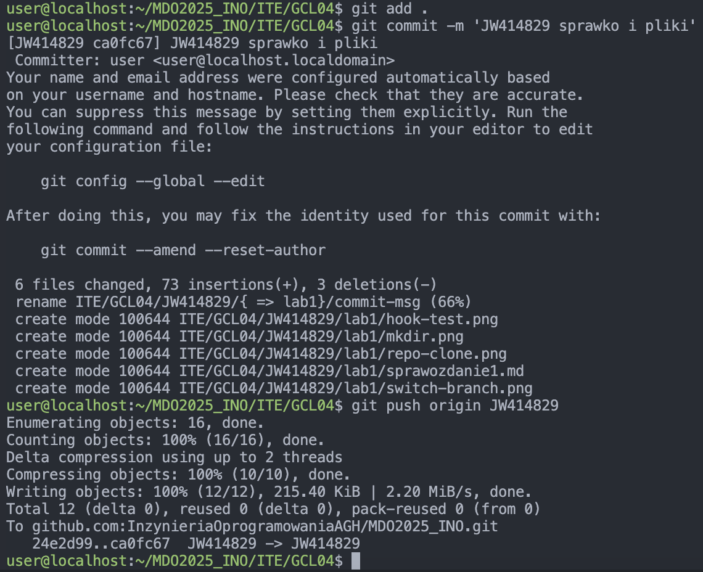

Wykonałem próbę wciągnięcia mojej gałęzi do gałęzi grupowej aczkolwiek nie pushowalem tego na remote.
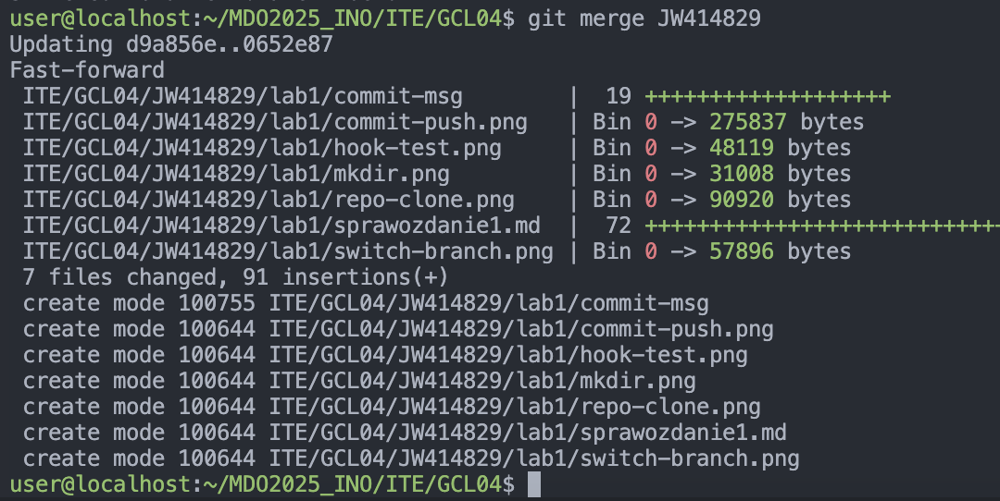

---

## Zajęcia 02

### 1. Instalacja dockera i rejestracja w dockerhub
Ten krok wykonałem jeszcze na poprzednich zajęciach po poleceniu prowadzącego.
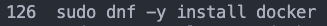

---

### 2. Pobranie obrazów `hello-world`, `busybox`, `ubuntu`, `fedora` i `mysql`
Pobrałem wszystkie obrazy z polecenia. Na zrzuce ekranu zamieszczam tylko przykład z fedorą.
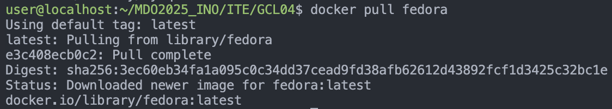

---

### 3. Uruchomienie busybox
Uruchomiłem kontener busybox z poleceniem echo, a następnie uruchomiłem ten sam kontener interaktywnie i sprawdzilem numer wersji oraz z niego wyszedłem.
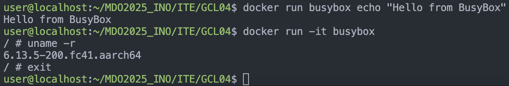

---

### 4. Uruchomienie ubuntu w kontenerze
Uruchomiłem ubuntu w kontenerze a następnie pokazałem PID1 w tym kontenerze, zaaktualizowałem pakiety i z niego wyszedłem.
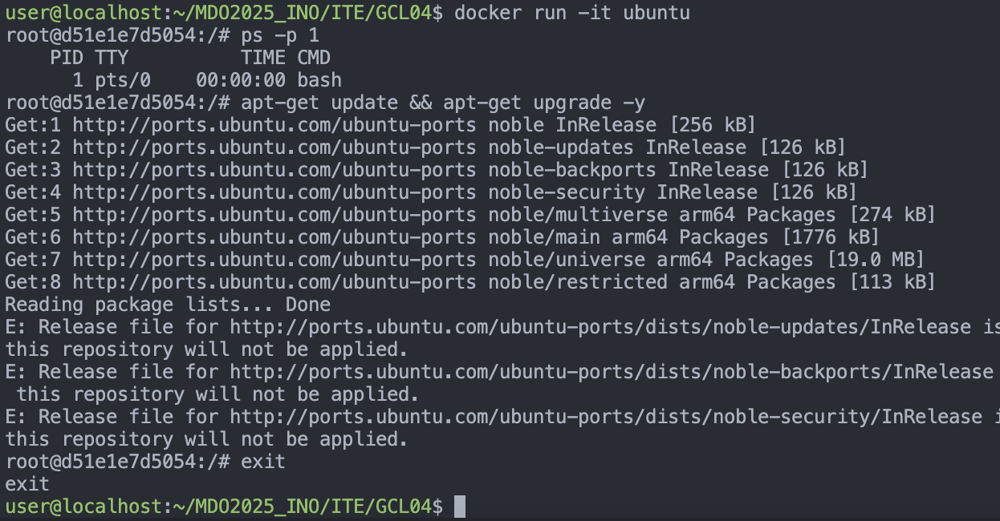

---

### 5. Stworzyłem, zbudowałem i uruchomiłem prosty plik Dockerfile.
W dockerfile upewniłem się, ze kontener będzie miał gita
```bash
RUN apt-get update && \
    apt-get install -y git curl && \
    rm -rf /var/lib/apt/lists/*
```
oraz ze repozytorium będzie sklonowane

```bash
RUN git clone https://github.com/InzynieriaOprogramowaniaAGH/MDO2025_INO.git /app
```

ponizej znajduje się cały plik Dockerfile

```bash
FROM ubuntu:latest

LABEL maintainer="JW414829"

RUN apt-get update && \
    apt-get install -y git curl && \
    rm -rf /var/lib/apt/lists/*

RUN git clone https://github.com/InzynieriaOprogramowaniaAGH/MDO2025_INO.git /app

WORKDIR /app

CMD ["/bin/bash"]
```

Zbuildowałem Dockerfile:
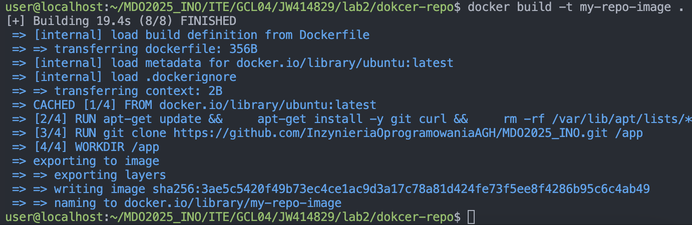

A następnie go uruchomiłem oraz aby sprawdzić działanie gita jeszcze raz, sklonowałem drugi raz repozytorium.
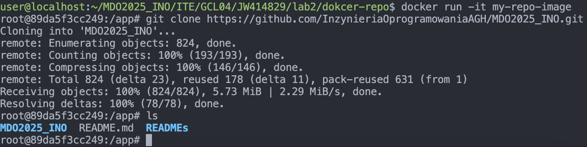


---

### 6. Sprawdziłem uruchomione kontenery i wyczyściłem je

Polecenie `docker ps -aq` generuje listę identyfikatorów wszystkich kontenerów, a `docker rm` usuwa te kontenery. 

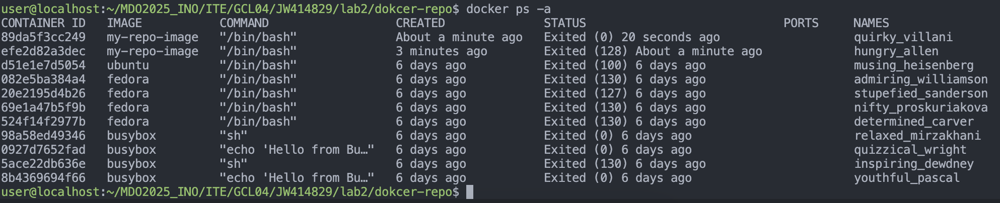


---

Polecenie `docker images -aq` generuje listę identyfikatorów wszystkich obrazów, a `docker rmi` usuwa te obrazy.

### 7. Wyczyściłem obrazy
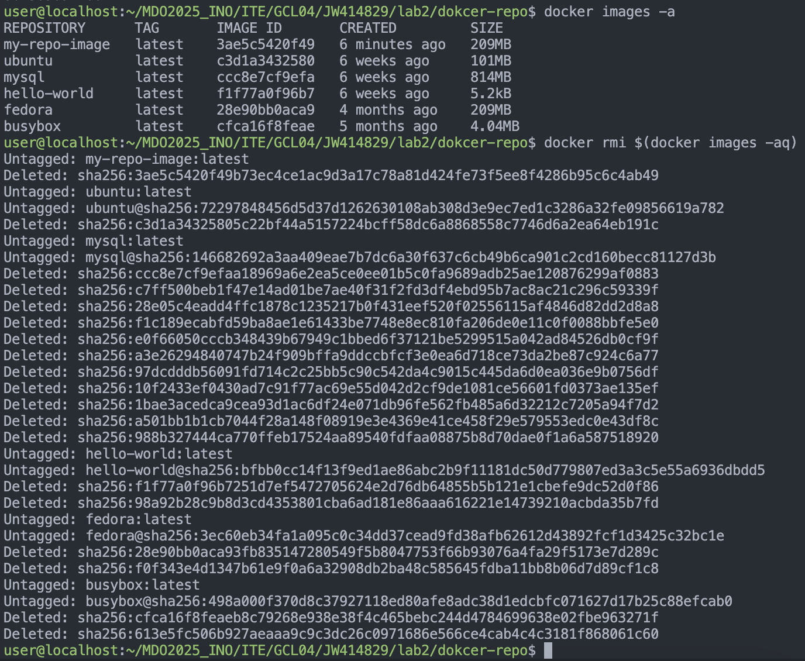

---

### 8. Dockerfile dodałem do sprawozdania i do repozytorium w /lab2/docker-repo/Dockerfile

---
## Zajęcia 03

### 1. Wybór oprogramowania

Jako oprogramowanie wybrałem repozytorium irssi.

Sklonowałem repozytorium z aplikacją i zbuildowałem program.
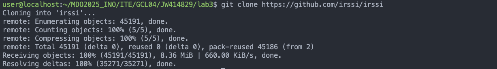


A następnie doinstalowałem wymagane pakiety i uruchomiłem testy.

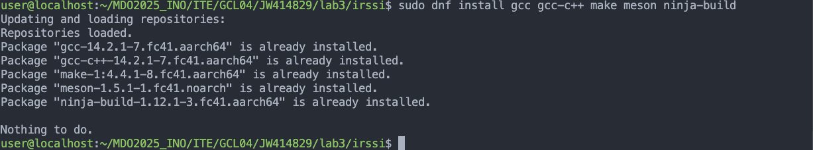
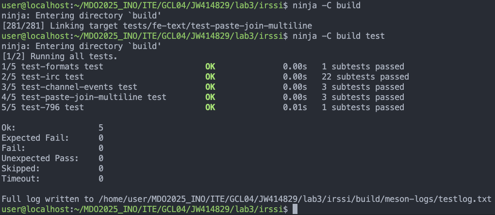


### 2. Przeprowadzenie buildu w kontenerze

Jako bazowy obraz uruchomiłem kontener ubuntu z interaktywnym terminalem.
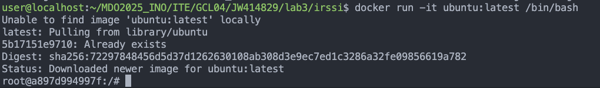

Zaaktualizowałem zalezności i upewniłem się, ze git jest zainstalowany.
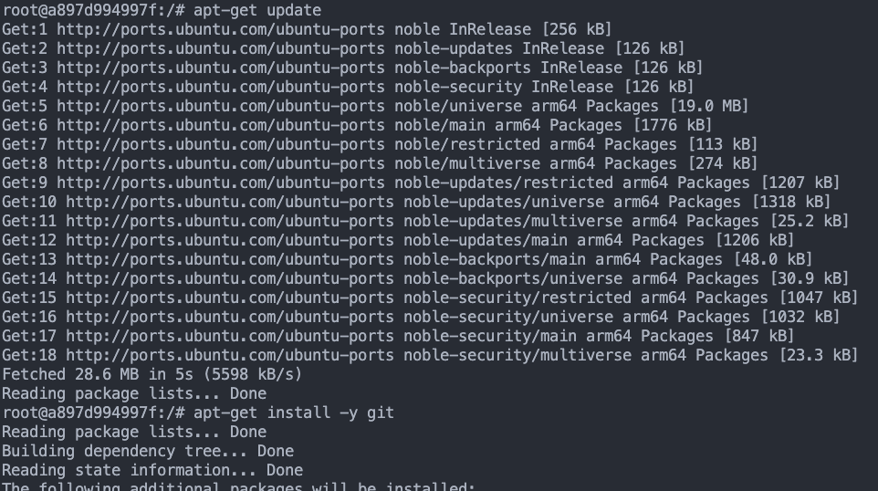

Następnie sklonowałem repozytorium wewnątrz kontenera.
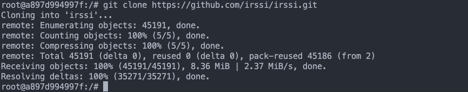

Przeszedłem do katalogu z aplikacją i pobrałem wymagane zalezności a następnie zbudowałem aplikację.
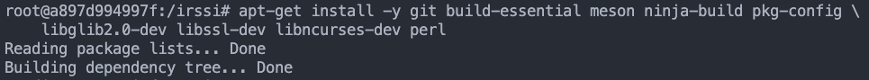
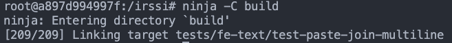

Uruchomiłem testy
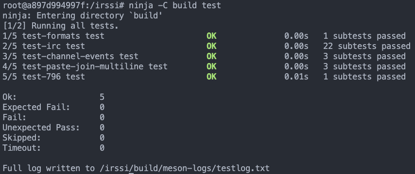

### 2. Utworzenie plików Dockerfile w celu zautomatyzowania wcześniejszych kroków

Utworzyłem dwa pliki:
* `Dockerfile.build`
```
FROM ubuntu:latest

RUN apt-get update && apt-get install -y \
    git \
    build-essential \
    meson \
    ninja-build \
    pkg-config \
    libglib2.0-dev \
    libssl-dev \
    libncurses-dev \
    perl \
    && rm -rf /var/lib/apt/lists/*

WORKDIR /irssi

RUN git clone https://github.com/irssi/irssi .

RUN meson setup build && ninja -C build
```

* `Dockerfile.test`
```
FROM irssi-build

WORKDIR /irssi

CMD ["ninja", "-C", "build", "test"]
```

`Dockerfile.build` opiera się na obrazie Ubuntu. Instaluje on wszystkie wymagane zalezności, klonuje repozytorium projektu do odpowiedniego folderu a następnie konfiguruje środowisko builda wykorzystując do tego Meson i kompiluje projekt przy uzyciu Ninja.

Do zbudowania obraz builda wykorzystałem `docker build`:
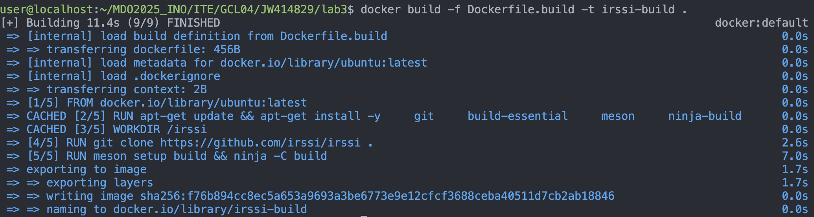


`Dockerfile.test` bazuje na obrazie utworzonym przez poprzedni Dockerfile i wykonuje jedynie testy bez ponownego budowania projektu.

Do zbudowania obrazu testującego aplikację takze wykorzystałem `docker build`. W Dockerfile uwzględniłem nazwę poprzedniego obrazu `irssi-build`.
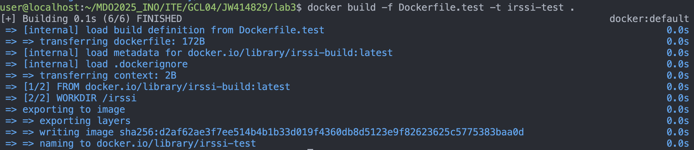

Aby upewnić się, ze kontener z buildem pracuje poprawnie uruchomiłem go w trybie interaktywnym i upewniłem się, ze w katalogu build znajduje się zbudowany projekt
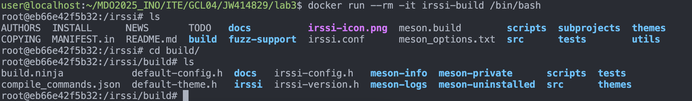

Następnie uruchomiłem kontener z testami, który takze zadziałał w oczekiwany sposób.
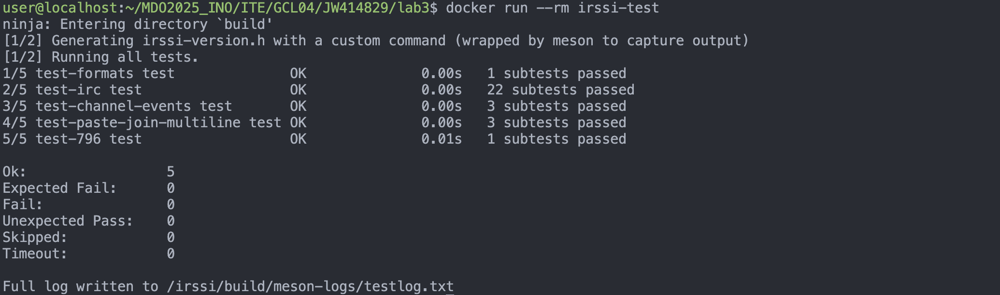

## Zajęcia 04
### 1. Zachowywanie stanu
Zacząłem od utworzenia woluminu wejściowego `input_vol`, oraz wyjściowego `output_vol`.
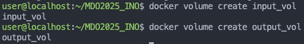

Następnie utworzyłem Dockerfile do tworzenia obrazu bazowego i go zbudowałem. Jest on oparty na ubuntu i zawiera zainstalowane wszystkie potrzebne pakiety ale bez gita.
```
FROM ubuntu:latest

RUN apt-get update && apt-get install -y \
    build-essential \
    meson \
    ninja-build \
    pkg-config \
    libglib2.0-dev \
    libssl-dev \
    libncurses-dev \
    perl \
    && rm -rf /var/lib/apt/lists/*

WORKDIR /irssi

CMD ["/bin/bash"]
```
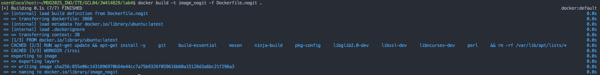

Następnie sklonowałem repozytorium z irssi. Klonowanie zostało wykonane na hoście bezpośrednio do lokalizacji przypisanej do woluminu.
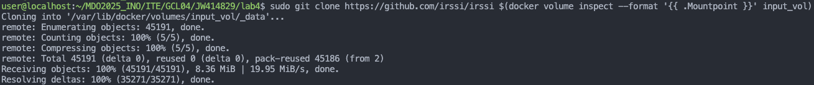

Skorzystałem z komendy `sudo git clone https://github.com/irssi/irssi $(docker volume inspect --format '{{ .Mountpoint }}' input_vol)`
- `docker volume inspect input_vol` - pobiera informacje o wolumenie wejściowym
- `--format '{{.MountPoint}}'` - flaga, która sprawia, ze pobieramy ściezkę do miejsca w którym znajduję się wolumen na hoście
- `sudo git clone ...` - klonuje repo

Normalnie po `git clone` mozemy określić w jakim miejscu sklonowane ma zostać repozytorium - tutaj dzięki uyciu `$(...)` mozemy dynamicznie dodać jako ściezkę wynik komendy `docker volume inspect`

Następnym krokiem było uruchomienie kontenera z zamontowanymi woluminami w celu zbudowania aplikacji. Wewnątrz tego kontenera skopiowałem repozytorium do katalogu `/build`, oraz zbuildowałem go.
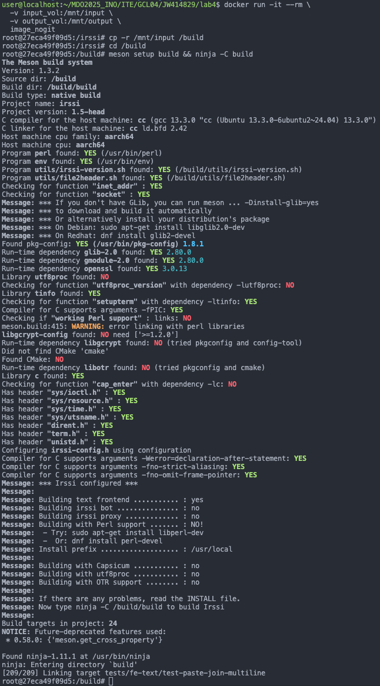

Po pomyślnym zbudowaniu zapisałem build do woluminu wyjściowego.
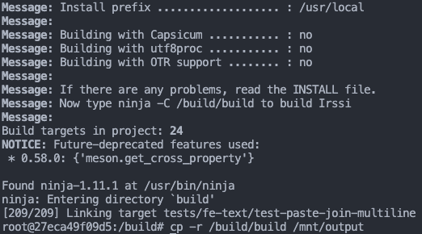

Całą operację wykonałem jeszcze raz, ale tym razem uzyłem gita w kontenerze. Zrobiłem to za pomocą `docker build` i pliku `Dockerfile.git`

```
FROM ubuntu:latest

RUN apt-get update && apt-get install -y \
    git \
    build-essential \
    meson \
    ninja-build \
    pkg-config \
    libglib2.0-dev \
    libssl-dev \
    libncurses-dev \
    perl \
    && rm -rf /var/lib/apt/lists/*

WORKDIR /irssi

RUN --mount=type=cache,target=/git_cache \
    git clone https://github.com/irssi/irssi .

RUN meson setup build && ninja -C build

RUN mkdir -p /output && cp -r build /output

CMD ["/bin/bash"]
```

Dzięki wykorzystaniu `RUN --mount` repozytorium jest klonowane z uzyciem cache co przyspiesza kolejne buildy. Uwzględniłem tez automatycznie kopiowanie wynikowych artefaktów builda do `/output`, dzięki czemu są one dostępne po zakończeniu pracy.

Zbudowałem obraz a następnie na jego bazie uruchomiłem kontener
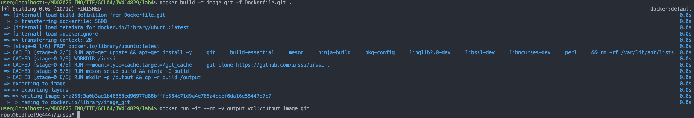

Aby sprawdzić poprawność działania zweryfikowałem, ze katalog build znajduje się w woluminie /output.
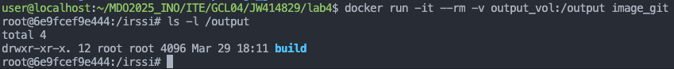

### 2. Eksponowanie portu
Rozpocząłem od uruchomienia kontenera na bazie fedory, a następnie zainstalowałem tam iperf i uruchomiłem serwer na domyślnym porcie.
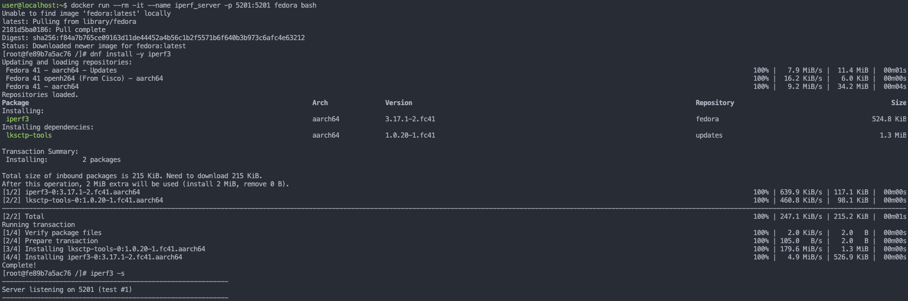

Następnie otworzyłem nowe okno terminala i uruchomiłem kontener z którego będę się łączył do poprzedniego.
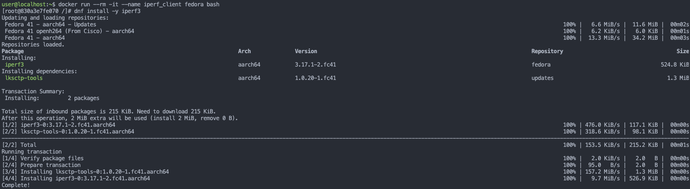

Na hoście sprawdziłem kontenera serwerowego.
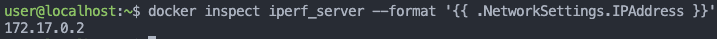

A następnie na kliencie wykonałem test połączenia z serwerem z kontenera klienta.
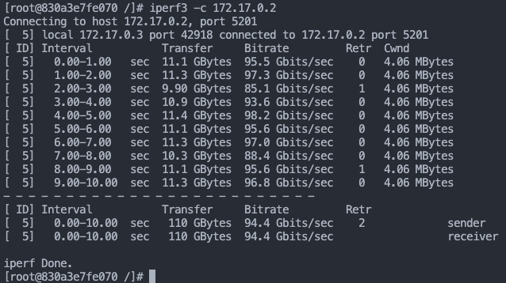


Po zapoznaniu się z dokumentacją `network create` utworzyłem dedykowaną sieć mostkową w której kontenery będą mogły komunikować się za pomocą nazw hostów zamiast IP.
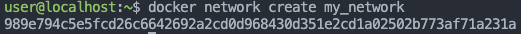

Uruchomiłem serwer i klienta w utworzonej sieci.
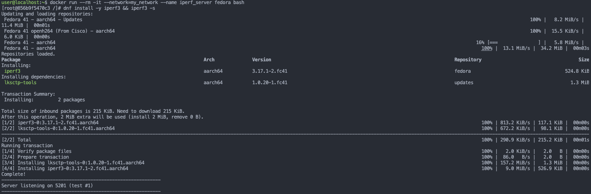


A następnie przetestowałem połączenie się wewnątrz klienta do serwera poprzez nazwę `iperf_server`.
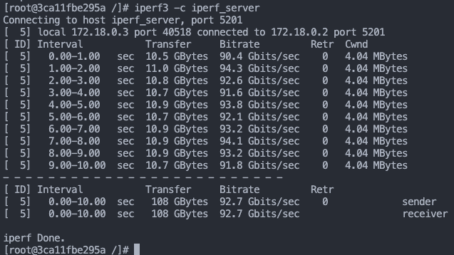

Wykonałem połączenie spoza kontenera z hosta.
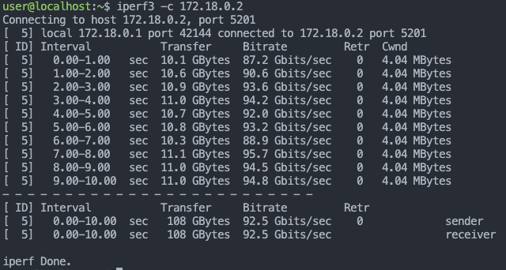

Aby wykonać połączenie spoza hosta uruchomiłem nowy serwer z mapowaniem portów i wykonałem połączenie z terminala z komputera. Niestety pomimo wielu prób, mapowania portów, restartowania serwera i wielokrotnych prób nie udało mi się połączyć z serwerem spoza hosta.
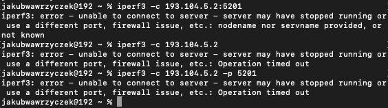

Przepustowość komunikacji wynosiła dla połączenia z hosta oraz z kontenera klienta odpowiednio 92.7 i 92.5 Gbits/sec.
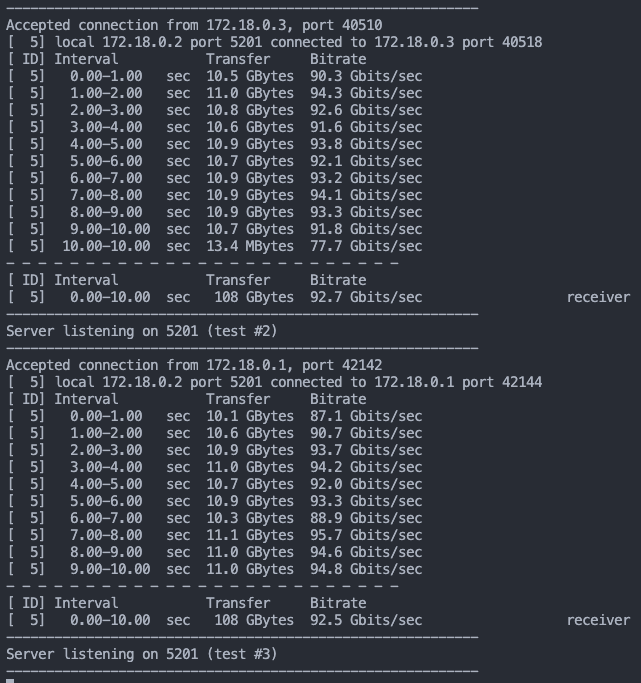

### 3. Instancja Jenkins
Zainstalowałem skonteneryzowaną instancję jenkinsa z pomocnikiem DIND. Uruchomiłem kontener w tle i zmapowałem porty oraz zamontowałem wolumen do trwałego przechowywania danych. Dzięki fladze -v umoliwiłem tez Jenkinsowi uruchamianie zadań wykorzystujących dockera. Wykazałem, ze Jenkins jest działającym kontenerem.
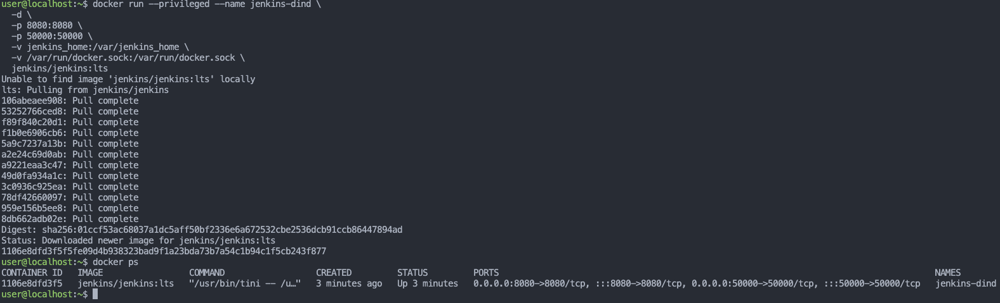

Przy próbie połączenia się z homepage Jenkinsa okazało się, ze na moim komputerze takze Apache nasłuchuje na porcie 8080. Zmieniłem port na 8081 i uruchomiłem kontener jeszcze raz.
Następnie w przeglądarce przeszedłem pod adres `http://localhost:8081/` i otrzymałem dostęp do ekranu logowania.
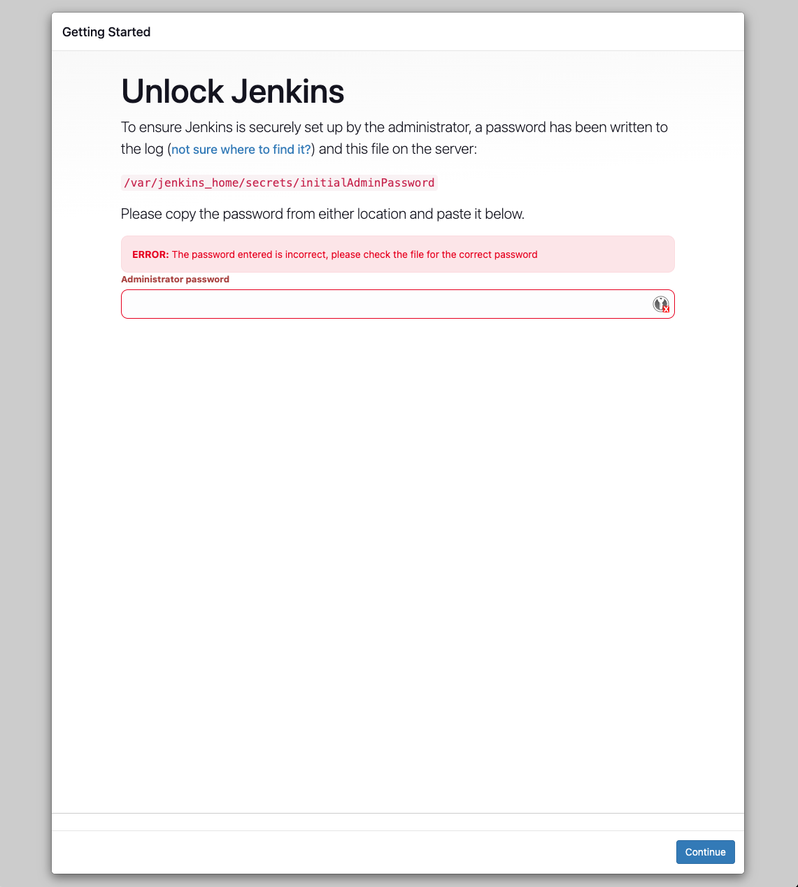
