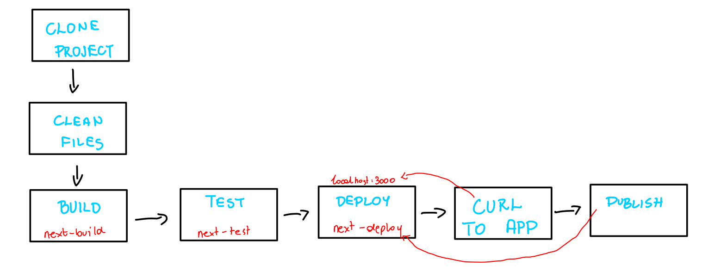

### Lab 5

Celem sprawozdania jest przedstawienie opisu uruchomienia CI aplikacji Next.js przy uzyciu Jenkinsa. 

Zacząłem od sprawdzenia, czy wszystkie poprzednie kontenery działają.


Następnie po zapoznaniu się z instrukcją instalacji Jenkinsa uruchomiłem obraz Dockera który eksponuje środowisko zagniezdzone i przygotowałem oraz uruchomiłem Blueocean. 


Zalogowałem się i skonfigurowałem Jenkins, oraz zapisałem logi.


Następnie przeszedłem do wykonaniu kilku przykładowych projektów wstępnych.
Projekt 1 - `uname`


Projekt 2 - `godzina`


Projekt 3 - `pull-ubuntu`


Po wykonaniu tych kroków utworzyłem wstępny pipeline tylko z Buildem. Wykorzystałem mimo wszystko swoje repozytorium z forkiem (bo utworzyłem je wcześniej i z tego juz korzystałem).

Dodatkowo aby projekt zbuildował się poprawnie musiałem dodać tworzenie pliku `.env.local` ze zmiennymi środowiskowymi.

W tym celu dodałem dodatkowy krok w Jenkinsfile i przy tworzeniu pliku wykorzystałem dodane credentiale w ustawieniach Jenkinsa.

Zrobiłem to w `Dashboard -> Manage Jenkins -> Credentials -> System -> Global Credentials`

```jenkinsfile
pipeline {
  agent any

  environment {
    IMAGE_NAME_BUILD = 'nextjs-app-build'
    BUILD_TAG        = "${env.BUILD_NUMBER}"
  }

  stages {
      
    stage('Prepare .env') {
      steps {
        withCredentials([file(credentialsId: 'env-local-file', variable: 'ENV_FILE')]) {
          sh '''
            rm -f .env.local
            cp "$ENV_FILE" ./.env.local
          '''
        }
      }
    }
      
    stage('Clone') {
      steps {
        git branch: 'main', url: 'https://github.com/jakubwawrzyczek/Next.js-Boilerplate.git'
      }
    }

    stage('Build') {
      steps {
        sh """
          docker build \
            -f Dockerfile.build \
            -t ${IMAGE_NAME_BUILD}:${BUILD_TAG} \
            .
        """
      }
    }
  }
}
```

Uruchomiłem utworzony pipeline dwukrotnie, mimo tego czas builda nie zmienił się znacznie (1 sekunda róznicy).


Mimo wszystko dodałem dodatkowo czyszczenie cache'u do Jenkinsfile.

```jenkinsfile
pipeline {
  agent any

  environment {
    IMAGE_NAME_BUILD = 'nextjs-app-build'
    BUILD_TAG        = "${env.BUILD_NUMBER}"
  }

  stages {
      
    stage('Prepare .env') {
      steps {
        withCredentials([file(credentialsId: 'env-local-file', variable: 'ENV_FILE')]) {
          sh '''
            rm -f .env.local
            cp "$ENV_FILE" ./.env.local
          '''
        }
      }
    }
      
    stage('Clone') {
      steps {
        git branch: 'main', url: 'https://github.com/jakubwawrzyczek/Next.js-Boilerplate.git'
      }
    }
    
    stage('Clean Previous Images') {
      steps {
        sh """
          echo '🗑 Removing previous build images…'
          docker images ${IMAGE_NAME_BUILD} --format '{{.ID}}' | xargs -r docker rmi -f || true
        """
      }
    }

    stage('Build') {
      steps {
        sh """
          docker build \
            -f Dockerfile.build \
            -t ${IMAGE_NAME_BUILD}:${BUILD_TAG} \
            .
        """
      }
    }

  }
}
```


Następnie przeszedłem do wybrania projektu. Z uwagi na pracę na codzień w technologiach webowych wybrałem aplikację opartą na Next.js. (https://github.com/gdwmw/Next.js-Boilerplate)


Wymagania wstępne środowiska

- Jenkins z zainstalowanym BlueOcean i pluginem Docker Pipeline

- Agent z dostępem do Dockera (najlepiej Docker-in-Docker)

- Credentials typu „Secret file” w Jenkins (ID: env-local-file), zawierający .env.local

- Plugin Git do klonowania repozytorium

- Środowisko buildowe: obraz bazowy z Node.js oraz menedżerem pakietów Yarn (lub npm) dostępne wewnątrz kontenera Dockerfile.build.





Następnie przeszedłem do utworzenia pełnego pipeline'u z SCM.

Zacząłem od utworzenia , oraz  dla projektu.

`Dockerfile.build`
Ten Dockerfile używa lekkiego obrazu node:18-alpine, przechodzi do katalogu /app, instaluje zależności przy pomocy yarn install, kopiuje cały kod źródłowy wraz z plikiem .env.local, następnie uruchamia yarn build, by wygenerować build Next.js w katalogu .next, i na koniec pakuje ten katalog do archiwum build.tar.gz.

`Dockerfile.test`
Ten Dockerfile tworzy etap tester, bazując na obrazie nextjs-app-build:latest, który już zawiera skompilowany kod i wszystkie zależności. Jako domyślne polecenie (CMD) uruchamia yarn jest, czyli wykonuje wszystkie testy jednostkowe skonfigurowane w projekcie.


Następnie utworzyłem 

`Dockerfile.deploy`
Ten Dockerfile jest na bazie node:18-alpine, ustawia katalog roboczy na /app, kopiuje package.json i .env.local, a następnie instaluje tylko zależności produkcyjne (yarn install --production). Następnie pobiera zbudowany wcześniej artefakt build.tar.gz z etapu nextjs-app-build, rozpakowuje go do katalogu, eksponuje port 3000 i jako komendę startową ustawia yarn start, uruchamiając gotową aplikację.

Po utworzeniu tych plików spróbowałem utworzyć ju pipeline. Zabrakło mi pliku `.env.local` wymaganego w projekcie więc dodałem go tak jak przy budowaniu testowego pipeline'a i uwzględniłem w Jenkinsfile.

```jenkinsfile
pipeline {
  agent any

  environment {
    IMAGE_NAME_BUILD   = "nextjs-app-build"
    IMAGE_NAME_TEST    = "nextjs-app-test"
    IMAGE_NAME_DEPLOY  = "nextjs-app-deploy"
    CONTAINER_NAME     = "nextjs-app"

    // versioned tag: YYYYMMDD-<build number>
    BUILD_DATE = new Date().format("yyyyMMdd")
    BUILD_TAG  = "${BUILD_DATE}-${env.BUILD_NUMBER}"
  }

  stages {
    stage('Checkout') {
      steps {
        checkout scm
      }
    }

    stage('Prepare .env') {
      steps {
        withCredentials([file(credentialsId: 'env-local-file', variable: 'ENV_FILE')]) {
          sh '''
            rm -f .env.local
            cp "$ENV_FILE" ./.env.local
          '''
        }
      }
    }

    stage('Build') {
      steps {
        sh """
          docker build \
            -f Dockerfile.build \
            -t ${IMAGE_NAME_BUILD}:${BUILD_TAG} \
            -t ${IMAGE_NAME_BUILD}:latest \
            .
        """
      }
    }

    stage('Test') {
      steps {
        sh """
          docker build -f Dockerfile.test \
            -t ${IMAGE_NAME_TEST}:${BUILD_TAG} .
          docker run --rm ${IMAGE_NAME_TEST}:${BUILD_TAG}
        """
      }
    }

    stage('Deploy') {
      steps {
        sh """
          # Build the production image
          docker build -f Dockerfile.deploy \
            -t ${IMAGE_NAME_DEPLOY}:${BUILD_TAG} .

          echo "🗑 Removing any old deploy containers by image…"
          docker ps -aq --filter ancestor=${IMAGE_NAME_DEPLOY} | xargs -r docker rm -f

          echo "🗑 Removing any old container named ${CONTAINER_NAME}…"
          docker rm -f ${CONTAINER_NAME} >/dev/null 2>&1 || true

          echo "🚀 Starting fresh container ${CONTAINER_NAME}"
          docker run -d \
            --name ${CONTAINER_NAME} \
            -p 3000:3000 \
            ${IMAGE_NAME_DEPLOY}:${BUILD_TAG}
        """
      }
    }

  post {
    always {
      sh 'docker system prune -f'
    }
  }
}
```

`Healthcheck`
W tym kroku wykorzystujemy kontener curlimages/curl, ponieważ to niewielki, oficjalny obraz zawierający tylko narzędzie curl – dzięki temu nie musimy instalować czegokolwiek na hoście Jenkins ani w agencie CI, a jednocześnie mamy pewność, że używamy zawsze tej samej, zweryfikowanej wersji curl. Używając opcji --network container:${CONTAINER_NAME}, podłączamy kontener testujący do tej samej sieci, co kontener z naszą aplikacją, co sprawia, że punkt http://localhost:3000/ wewnątrz kontenera curl odwołuje się bezpośrednio do procesu Next.js w kontenerze docelowym. Opcja --rm dba o to, by po zakończeniu testu kontener został automatycznie usunięty i nie zalegał nam w systemie. Flaga --fail powoduje, że curl zwraca status niezerowy, jeżeli serwer odpowie kodem błędu (4xx lub 5xx), a --max-time 5 ogranicza maksymalny czas oczekiwania na odpowiedź do 5 sekund – dzięki temu, jeśli aplikacja się nie „obudzi” albo zawiesi, od razu otrzymamy błąd zamiast czekać w nieskończoność. Krótki sleep 5 przed wywołaniem healthchecku daje Next.js chwilę na uruchomienie się i otwarcie portu, co minimalizuje fałszywe negatywy, gdy aplikacja potrzebuje kilku sekund na inicjalizację.

```jenkinsfile
    stage('Healthcheck') {
      steps {
        sh '''
          echo "🩺 Waiting 5 seconds for the application to start…"
          sleep 5

          echo "🔍 Running healthcheck using curlimages/curl…"
          docker run --rm \
            --network container:${CONTAINER_NAME} \
            curlimages/curl:latest \
            curl --fail --max-time 5 http://localhost:3000/ \
            || (echo "❌ Healthcheck failed: application did not respond" && exit 1)

          echo "✅ Healthcheck passed"
        '''
      }
    }
```

`Publish`
W etapie Publish najpierw generujemy plik TAR z obrazem Docker, wykorzystując polecenie docker save, ponieważ chcemy mieć gotowy, przenośny artefakt zawierający całą warstwę obrazu deploy. Dzięki temu można go łatwo pobrać, przechować lub przenieść do innego środowiska bez konieczności dostępu do rejestru. Następnie używamy wbudowanej funkcji Jenkins archiveArtifacts, aby zapisać ten plik jako artefakt joba — opcja fingerprint: true dodaje unikalny hash pliku, co pozwala śledzić, w których buildach i gdzie dokładnie został on wykorzystany. Na koniec, komunikat „✅ Published artifact” informuje w logu, że archiwizacja przebiegła pomyślnie i podaje nazwę wygenerowanego pliku.

```jenkinsfile
    stage('Publish') {
      steps {
        script {
          def fullTag = "${IMAGE_NAME_DEPLOY}:${BUILD_TAG}"
          echo "💾 Saving image to ${IMAGE_NAME_DEPLOY}-${BUILD_TAG}.tar"
          sh "docker save ${fullTag} -o ${IMAGE_NAME_DEPLOY}-${BUILD_TAG}.tar"
        }
        archiveArtifacts artifacts: "${IMAGE_NAME_DEPLOY}-${BUILD_TAG}.tar", fingerprint: true
        echo "✅ Published artifact: ${IMAGE_NAME_DEPLOY}-${BUILD_TAG}.tar"
      }
    }
  }
```

`Wersjonowanie i tagowanie obrazów`
- BUILD_DATE – data w formacie YYYYMMDD, pobierana w momencie uruchomienia pipeline’u (np. 20250427).

- BUILD_TAG – połączenie BUILD_DATE i numeru builda ${BUILD_NUMBER}, np. 20250427-42. Każdy build otrzymuje unikalny tag, co ułatwia odtwarzanie konkretnej wersji i śledzenie historii wydań.

- latest – wskaźnik na ostatnio zbudowany obraz. Umożliwia szybkie testy ad hoc lub ręczne uruchamianie kontenera bez konieczności podawania konkretnego tagu.

- Fingerprinting – dzięki opcji archiveArtifacts fingerprint: true Jenkins zapisuje unikalny hash artefaktu .tar z obrazem, co pozwala zidentyfikować, w którym buildzie i pod jakim tagiem został on wygenerowany.