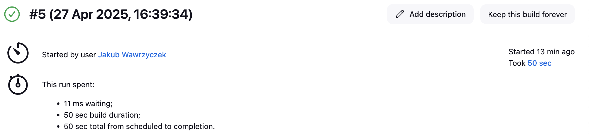
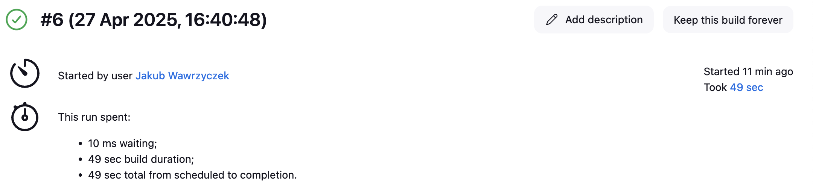
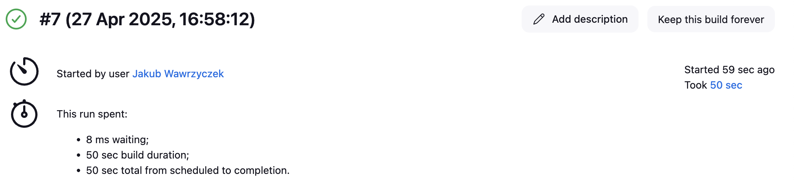

### Lab 5

Celem sprawozdania jest przedstawienie opisu uruchomienia CI aplikacji Next.js przy uzyciu Jenkinsa. 

## Jenkins
Zacząłem od sprawdzenia, czy wszystkie poprzednie kontenery działają.


Następnie po zapoznaniu się z instrukcją instalacji Jenkinsa uruchomiłem obraz Dockera który eksponuje środowisko zagniezdzone i przygotowałem oraz uruchomiłem Blueocean. 


Zalogowałem się i skonfigurowałem Jenkins, oraz zapisałem logi.


Następnie przeszedłem do wykonaniu kilku przykładowych projektów wstępnych.
Projekt 1 - `uname`


Projekt 2 - `godzina`


Projekt 3 - `pull-ubuntu`


Po wykonaniu tych kroków utworzyłem wstępny pipeline tylko z Buildem. Wykorzystałem mimo wszystko swoje repozytorium z forkiem (bo utworzyłem je wcześniej i z tego juz korzystałem).

Dodatkowo aby projekt zbuildował się poprawnie musiałem dodać tworzenie pliku `.env.local` ze zmiennymi środowiskowymi.

W tym celu dodałem dodatkowy krok w Jenkinsfile i przy tworzeniu pliku wykorzystałem dodane credentiale w ustawieniach Jenkinsa.

Zrobiłem to w `Dashboard -> Manage Jenkins -> Credentials -> System -> Global Credentials`

```jenkinsfile
pipeline {
  agent any

  environment {
    IMAGE_NAME_BUILD = 'nextjs-app-build'
    BUILD_TAG        = "${env.BUILD_NUMBER}"
  }

  stages {
      
    stage('Prepare .env') {
      steps {
        withCredentials([file(credentialsId: 'env-local-file', variable: 'ENV_FILE')]) {
          sh '''
            rm -f .env.local
            cp "$ENV_FILE" ./.env.local
          '''
        }
      }
    }
      
    stage('Clone') {
      steps {
        git branch: 'main', url: 'https://github.com/jakubwawrzyczek/Next.js-Boilerplate.git'
      }
    }

    stage('Build') {
      steps {
        sh """
          docker build \
            -f Dockerfile.build \
            -t ${IMAGE_NAME_BUILD}:${BUILD_TAG} \
            .
        """
      }
    }
  }
}
```

Uruchomiłem utworzony pipeline dwukrotnie, mimo tego czas builda nie zmienił się znacznie (1 sekunda róznicy).





Mimo wszystko dodałem dodatkowo czyszczenie cache'u do Jenkinsfile.

```jenkinsfile
pipeline {
  agent any

  environment {
    IMAGE_NAME_BUILD = 'nextjs-app-build'
    BUILD_TAG        = "${env.BUILD_NUMBER}"
  }

  stages {
      
    stage('Prepare .env') {
      steps {
        withCredentials([file(credentialsId: 'env-local-file', variable: 'ENV_FILE')]) {
          sh '''
            rm -f .env.local
            cp "$ENV_FILE" ./.env.local
          '''
        }
      }
    }
      
    stage('Clone') {
      steps {
        git branch: 'main', url: 'https://github.com/jakubwawrzyczek/Next.js-Boilerplate.git'
      }
    }
    
    stage('Clean Previous Images') {
      steps {
        sh """
          echo '🗑 Removing previous build images…'
          docker images ${IMAGE_NAME_BUILD} --format '{{.ID}}' | xargs -r docker rmi -f || true
        """
      }
    }

    stage('Build') {
      steps {
        sh """
          docker build \
            -f Dockerfile.build \
            -t ${IMAGE_NAME_BUILD}:${BUILD_TAG} \
            .
        """
      }
    }

  }
}
```

