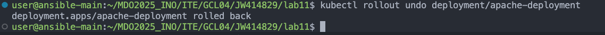

### Lab 8
## Instalacja zarządcy Ansible
Zacząłem od postawienia nowej maszyny z systemem Fedora, w dokładnie takiej samej wersji jak poprzednia. Utworzylem uytkownika o nazwie `ansible`, zmieniłem hostname na `ansible-target` i zainstalowałem `tar` a następnie potwierdziłem obecność `sshd`. 


Utworzyłem snapshot maszyny.


Na głównej maszynie zainstalowałem `ansible`


A następnie wymieniłem klucze SSH między `userem` na głównej maszynie a `ansible` na nowej, oraz przetestowałem łączność bez hasła.


## Inwentaryzacja

Zmieniłem hostname's maszyn na `ansible-main` i `ansible-target`, oraz wpisałem je do `/etc/hosts/`. Zweryfikowałem łączność po nazwach przez `ping`.


Utworzyłem i uzupełniłem plik `inventory.ini`, oraz sprawdziłem działanie inventory ansible.


## Zdalne wywoływanie procedur

Utworzyłem playbook w pliku `ping_all.yml`, który pinguje wszystkie maszyny i sprawdziłem jego działanie.


Utworzyłem playbook do kopiowania pliku `inventory` na maszyny z `endpoints`. Pierwsze uruchomienie:


Podczas drugiego uruchomienia ansible sprawdził tylko czy kopiowany plik istnieje i jak zobaczył, ze tak to nie wprowadził w nim zadnych zmian.


Utworzyłem playbook do zaaktualizowania pakietów w systemie. Problemem były wymagane uprawnienia, rozwiązałem to dodając do uzytkownika `ansible` regułę `NOPASSWD: ALL`. Jest to rozwiązanie BARDZO niebezpieczne w środowisku produkcyjnym, lecz na potrzebę laboratoriów wystarczające.


Utworzyłem playbook do zrestartowania usług `sshd` i `rngd`. Pierwsza usługa została zrestartowana ale `rngd` nie jest zainstalowane.


Na koniec sprawdziłem jak ansible zachowa się gdy w targecie wyłączone będzie ssh, lub odłączona będzie karta sieciowa. Po teście uruchomiłem sshd ponownie i ponownie podlaczylem karte sieciowa.


## Zarządzanie stworzonym artefaktem

Deployment mojego poprzedniego projektu nie zadziałał, więc jako alternatywę wybrałem `apache server`. Na maszynie docelowej zainstalowałem dockera za pomocą playbooka.

```yml
- name: Install Docker
  hosts: endpoints
  become: yes
  tasks:
    - name: Install dependencies
      dnf:
        name:
          - dnf-plugins-core
          - yum-utils
          - device-mapper-persistent-data
          - lvm2
        state: present

    - name: Add Docker repo
      get_url:
        url: https://download.docker.com/linux/fedora/docker-ce.repo
        dest: /etc/yum.repos.d/docker-ce.repo

    - name: Install Docker engine
      dnf:
        name:
          - docker-ce
          - docker-ce-cli
          - containerd.io
        state: latest

    - name: Enable and start Docker
      systemd:
        name: docker
        enabled: yes
        state: started

```


Następnie utworzyłem kolejnego playbooka do pobrania `httpd`, uruchomienia kontenera, sprawdzenia dostępności a na koniec zatrzymania i usunięcia kontenera. Konieczne było tez doinstalowanie wymaganych pakietów.

``` yml
- name: Run and test Apache container
  hosts: endpoints
  become: true

  tasks:
    - name: Install pip
      package:
        name: python3-pip
        state: present

    - name: Install packaging module (required by Docker collection)
      package:
        name: python3-packaging
        state: present

    - name: Install required Python packages (requests, docker)
      pip:
        name:
          - requests
          - docker
        executable: pip3

    - name: Pull Apache image
      community.docker.docker_image:
        name: httpd
        source: pull

    - name: Run Apache container
      community.docker.docker_container:
        name: apache
        image: httpd
        state: started
        ports:
          - "8080:80"

    - name: Wait for Apache to respond
      uri:
        url: http://localhost:8080
        return_content: yes
        status_code: 200
      register: apache_response
      retries: 5
      delay: 2
      until: apache_response.status == 200

    - name: Stop Apache container
      community.docker.docker_container:
        name: apache
        state: stopped

    - name: Remove Apache container
      community.docker.docker_container:
        name: apache
        state: absent
```


Przeniosłem logikę z playbooka `run_apache` do roli za pomocą `ansible-galaxy`.

do `main.yml` w katalogu tasks:

``` yml
---
- name: Install pip
  package:
    name: python3-pip
    state: present

- name: Install packaging module (required by Docker collection)
  package:
    name: python3-packaging
    state: present

- name: Install required Python packages (requests, docker)
  pip:
    name:
      - requests
      - docker
    executable: pip3

- name: Pull Apache image
  community.docker.docker_image:
    name: httpd
    source: pull

- name: Run Apache container
  community.docker.docker_container:
    name: apache
    image: httpd
    state: started
    ports:
      - "8080:80"

- name: Wait for Apache to respond
  uri:
    url: http://localhost:8080
    return_content: yes
    status_code: 200
  register: apache_response
  retries: 5
  delay: 2
  until: apache_response.status == 200

- name: Stop Apache container
  community.docker.docker_container:
    name: apache
    state: stopped

- name: Remove Apache container
  community.docker.docker_container:
    name: apache
    state: absent
```


do `deploy_apache.yml`:

```yml
- name: Deploy Apache via role
  hosts: endpoints
  become: yes

  roles:
    - deploy_apache
```


---

# Lab 9

Pobrałem plik `anaconda-ks.cfg` i dodałem do niego url do mirrora, nazwe hosta i sekcję post.

```ini
# Generated by Anaconda 41.35
# Generated by pykickstart v3.58
#version=DEVEL

# Keyboard layouts
keyboard --vckeymap=pl --xlayouts='pl'
# System language
lang pl_PL.UTF-8

%packages
@^custom-environment

%end

# Run the Setup Agent on first boot
firstboot --enable

# Generated using Blivet version 3.11.0
ignoredisk --only-use=sda
autopart
# Partition clearing information
clearpart --all

# System timezone
timezone Europe/Warsaw --utc

# Root password
rootpw --iscrypted --allow-ssh $y$j9T$sv/NneP/7bvCksr3Grj4eGYC$LKhLLz56YRopOiEtn2.E57I4y9cxBJ1bHs31sMo3mZ0
user --groups=wheel --name=user --password=$y$j9T$dEbPZxjAOm6DrXW0pHkYvc8i$9DB42o70wUkWqzoEfeYVrYlICxB7GiFUvJz7R3SatO9 --iscrypted --gecos="user"

# ISO url
url --mirrorlist=http://mirrors.fedoraproject.org/mirrorlist?repo=fedora-41&arch=aarch64
repo --name=update --mirrorlist=http://mirrors.fedoraproject.org/mirrorlist?repo=updates-released-f41&arch=aarch64

# Hostname
network --hostname=Fedora

# Post
%post

dnf -y install dnf-plugins-core
dnf config-manager --add-repo=https://download.docker.com/linux/fedora/docker-ce.repo

dnf install -y docker-ce docker-ce-cli containerd.io

systemctl enable docker

usermod -aG docker user

cat << 'EOF' > /etc/rc.d/rc.local

docker pull cumil/apache-basic:latest
docker run -d --name apache_container cumil/apache-basic:latest
EOF

%end
```

Uruchomiłem instalator i wrzuciłem plik odpowiedzi jako argument.


Po uruchomieniu kontener zadziałał i zwrócił plik index.html.


---

# Lab 10

## Instalacja klastra Kubernetes

Zaopatrzyłem się w minikube. Przeprowadziłem instalację i wykazałem poziom bezpieczeństwa instalacji a następnie uruchomiłem dashboard.


Zainstalowałem `kubectl`.


## Analiza posiadanego kontenera / Uruchamianie oprogramowania

Podczas realizacji tych laboratoriów zdecydowałem sie korzystać z obrazu `nginx` z powodu problemów z poprzednio wybranym projektem. Przy pomocy uprzednio zainstalowanego `kubectl` uruchomiłem pojedynczego poda. Musiałem przekierować tez port, aby umozliwić połączenie się z kontenerem.


## Przekucie wdrożenia manualnego w plik wdrożenia (wprowadzenie)

Utworzyłem plik `nginx-deployment.yaml` z wdrozeniem i przeprowadziłem próbę wdrozenia. Zastosowałem deployment i sprawdziłem status wdrozenia. Sprawdziłem, ze zgodnie z oczekiwaniami powstały 4 nowe pody.

```yaml
apiVersion: apps/v1
kind: Deployment
metadata:
  name: nginx-deployment
spec:
  replicas: 4
  selector:
    matchLabels:
      app: nginx
  template:
    metadata:
      labels:
        app: nginx
    spec:
      containers:
        - name: nginx
          image: nginx:latest
          ports:
            - containerPort: 80
```


Utworzyłem serwis `nginx-service.yaml` i uruchomiłem go a następnie przeforwardowałem porty.


W dashboardzie widać pody w ilości 5, wynika to z faktu, ze pierwszy pod z wykonywanych laboratoriów nadal jest aktywny. Widać tez deployment `nginx-deployment`.


---

# Lab 11

## Przygotowanie nowego obrazu / Zmiany w deploymencie

Przygotowałem trzy dockerfiles do zbudowania obrazów. Jeden z nich powoduje failure a dwa pozostałe róznią się pomiędzy sobą zawartością pliku `index.html`. Po zbudowaniu obrazów zpushowałem je na `dockerhub` (wrzucam same wykonane polecenia z uwagi na ilość linii w konsoli i screenów które musiałbym zrobić).

```Dockerfile
FROM httpd:alpine
RUN echo '<html><body><h1>Apache Version 1</h1></body></html>' > /usr/local/apache2/htdocs/index.html
```
```Dockerfile
FROM httpd:alpine
RUN echo '<!DOCTYPE html><html><body><h1>Apache Version 2</h1></body></html>' > /usr/local/apache2/htdocs/index.html
```
```Dockerfile
FROM httpd:alpine
RUN echo "exit 1" > /start.sh && chmod +x /start.sh
CMD ["/start.sh"]
```


```bash
docker build -t jakubwawrzyczek/apache:v1 -f Dockerfile.v1 .
docker push jakubwawrzyczek/apache:v1

docker build -t jakubwawrzyczek/apache:v2 -f Dockerfile.v2 .
docker push jakubwawrzyczek/apache:v2

docker build -t jakubwawrzyczek/apache:broken -f Dockerfile.broken .
docker push jakubwawrzyczek/apache:broken

```


Następnie zedytowałem plik `yaml` z poprzednich zajęć i wykonałem pierwsze wdrozenie.

```yaml
apiVersion: apps/v1
kind: Deployment
metadata:
  name: apache-deployment
  labels:
    app: apache
spec:
  replicas: 4
  selector:
    matchLabels:
      app: apache
  template:
    metadata:
      labels:
        app: apache
    spec:
      containers:
        - name: apache
          image: jakubwawrzyczek/apache:v1
          ports:
            - containerPort: 80
```


Zmiana ilości podów:


Zmiana obrazów:

Dwa działające obrazy zadziałały.


Przy rolloucie obrazu `broken` proces zatrzymał się na tym etapie:


Pody weszły w stan `CrashLoopBackOff` co oznaczało, ze ciągle się restartowały.
`kubectl rollout undo` pozwoliło mi cofnąć wdrozenie do najblizszej poprzedniej działającej wersji.




## Kontrola wdrożenia

Rollout history zawiera kilka rewizji co oznacza, ze deployment byl kilkukrony i modyfikowany. Poszczegolne rekordy w hisorii odpowiadają zmianom obrazów lub liczby replik. Mogłem podejrzeć konkretną rewizję korzystając z flagi `--revision=`.


Dodałem skrypt weryfikujący wdrozenie i nadałem mu odpowiednie uprawnienia.

```bash
#!/bin/bash
DEPLOYMENT=apache-deployment
NAMESPACE=default
TIMEOUT=60
INTERVAL=5
ELAPSED=0

echo "Checking rollout status for $DEPLOYMENT..."

while [ $ELAPSED -lt $TIMEOUT ]; do
  STATUS=$(kubectl rollout status deployment/$DEPLOYMENT -n $NAMESPACE 2>&1)
  echo "$STATUS"
  if echo "$STATUS" | grep -q "successfully rolled out"; then
    echo "Deployment completed successfully."
    exit 0
  fi
  sleep $INTERVAL
  ELAPSED=$((ELAPSED + INTERVAL))
done

echo "Timeout reached. Deployment did not complete in time."
exit 1
```


## Strategie wdrożenia

W strategii `Recreate` stare pody są usuwane zanim utworzone zostaną nowe.

```yaml
apiVersion: apps/v1
kind: Deployment
metadata:
  name: apache-deployment
  labels:
    app: apache
spec:
  replicas: 4
  strategy:
    type: Recreate
    rollingUpdate:
      maxSurge: 2
      maxUnavailable: 2
  selector:
    matchLabels:
      app: apache
  template:
    metadata:
      labels:
        app: apache
    spec:
      containers:
        - name: apache
          image: jakubwawrzyczek/apache:v2
          ports:
            - containerPort: 80
```

W strategii `RollingUpdate` nowe pody są uruchamiane stopniowo i stara wersja działa równolegle dzięki czemu nie ma przerwy w ich działaniu. To wazne w przypadku aplikacji w których nie mozemy sobie pozwolic na przerwe w działaniu.

```
strategy:
  type: RollingUpdate
  rollingUpdate:
    maxUnavailable: 2
    maxSurge: 30%
```

* maxUnavailable – maksymalna liczba replik, które mogą być niedostępne w trakcie aktualizacji,
* maxSurge – maksymalna liczba dodatkowych replik, które mogą być uruchomione ponad zadeklarowaną liczbę.

W tym przypadku mogą być tymczasowo uruchomione aż 2 dodatkowe pody (30% z 4 = 1.2 i zaokrąglone do 2), a równocześnie mogą być wyłączone 2 istniejące. Dzięki temu cały czas dostępna jest większość instancji aplikacji.

```yaml
apiVersion: apps/v1
kind: Deployment
metadata:
  name: apache-rolling
  labels:
    app: apache
    strategy: rolling
spec:
  replicas: 4
  strategy:
    type: RollingUpdate
    rollingUpdate:
      maxUnavailable: 2
      maxSurge: 2
  selector:
    matchLabels:
      app: apache
      version: v1
  template:
    metadata:
      labels:
        app: apache
        version: v1
    spec:
      containers:
        - name: apache
          image: jakubwawrzyczek/apache:v1
          ports:
            - containerPort: 80
```

W strategii `Canary` tylko jakaś część podów jest aktualizowana do nowej wersji co umozliwia testowanie zmian na małych częściach uzytkowników zanim zostaną one wprowadzone globalnie. Robimy dwa wdrozenia i do tego serwis, który rozdziela traffic.

Wdrazane są 3 pody z wersją `v1` i 1 pod z wersją `v2` a do tego tworzony jest serwis, który kieruje ruch do wszystkich podów.

```yaml
apiVersion: apps/v1
kind: Deployment
metadata:
  name: apache-canary-v1
  labels:
    app: apache
    version: v1
spec:
  replicas: 3
  selector:
    matchLabels:
      app: apache
      version: v1
  template:
    metadata:
      labels:
        app: apache
        version: v1
    spec:
      containers:
        - name: apache
          image: jakubwawrzyczek/apache:v1
          ports:
            - containerPort: 80
```

```yaml
apiVersion: apps/v1
kind: Deployment
metadata:
  name: apache-canary-v2
  labels:
    app: apache
    version: v2
spec:
  replicas: 1
  selector:
    matchLabels:
      app: apache
      version: v2
  template:
    metadata:
      labels:
        app: apache
        version: v2
    spec:
      containers:
        - name: apache
          image: jakubwawrzyczek/apache:v2
          ports:
            - containerPort: 80
```

```yaml
apiVersion: v1
kind: Service
metadata:
  name: apache-service
spec:
  selector:
    app: apache
  ports:
    - protocol: TCP
      port: 80
      targetPort: 80
```