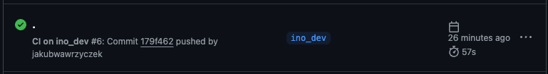
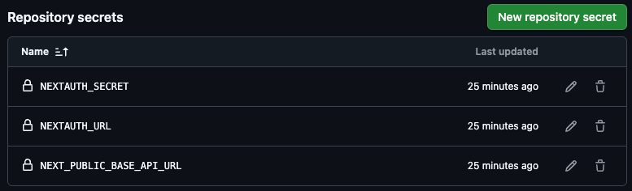
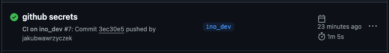

## Zajęcia 13 - Shift-left: GitHub Actions

Koncepcja GitHub Actions była mi znana juz przed zajęciami, więc rzuciłem tylko okiem na dokumentację i z ciekawości na cennik (10-krotny mnoznik przy MacOS troche mnie zaskoczył).

Uzylem utworzonego juz wcześniej forka projektu `Next.js`, którego uzywałem przy okazji pracy z Jenkinsem ([link](https://github.com/jakubwawrzyczek/Next.js-Boilerplate)).

Na początku chciałem skorzystać z gotowego workflow dla `Next.js`, który przy okazji oferował deploy do github pages. Niestety nie chciał on współpracować z packet managerem zawartym w projekcie (bun).

Sklonowałem repo lokalnie na komputerze, bo uznałem, ze praca w ten sposób będzie wygodniejsza. Przy próbie pusha z nowym workflow okazało się, ze w projekcie uzywany jest tez `husky`, który odpala własne skrypty przed pushem i buduje całą aplikacje - miałem z nim problemy więc się go pozbyłem.

Po przygotowaniu projektu lokalnie utworzyłem pierwszy, prosty workflow:

```yaml
name: CI on ino_dev

on:
  push:
    branches: ['ino_dev']
  workflow_dispatch:

jobs:
  build:
    runs-on: ubuntu-latest
    steps:
      - name: Checkout code
        uses: actions/checkout@v3

      - name: Setup Bun
        uses: oven-sh/setup-bun@v1

      - name: Install dependencies
        run: bun install

      - name: Run lint
        run: bun run lint

      - name: Build
        run: bun run build

      - name: Upload build output
        uses: actions/upload-artifact@v4
        with:
          name: nextjs-build
          path: .next/**
```

Po pushu i włączeniu się, szybko okazało się, ze brakuje mi pliku z env variables. Na początek dodałem je na sztywno do pliku i w jednym z kroków dodałem tworzenie pliku `.env.local`, oraz wypełnianie go zmiennymi. Takie rozwiązanie oczywiście nie jest ani trochę bezpieczne bo to tak jakby wrzucić enva do repozytorium, było to tylko dla testu i wrzuciłem zamockowane dane.

```yaml
name: CI on ino_dev

on:
  push:
    branches: ['ino_dev']
  workflow_dispatch:

jobs:
  build:
    runs-on: ubuntu-latest
    env:
      NEXTAUTH_URL: https://nextjs-boilerplate-demo.vercel.app
      NEXTAUTH_SECRET: G7f9K2mN4pL8xQ0sW1vY3tZ6uJ5hR0dE
      NEXT_PUBLIC_BASE_API_URL: https://api.example.com/v1

    steps:
      - name: Checkout code
        uses: actions/checkout@v3

      - name: Setup Bun
        uses: oven-sh/setup-bun@v1

      - name: Install dependencies
        run: bun install

      - name: Prepare .env.local
        run: |
          bun cpenv
          echo "NEXTAUTH_URL=${NEXTAUTH_URL}"     >> .env.local
          echo "NEXTAUTH_SECRET=${NEXTAUTH_SECRET}" >> .env.local
          echo "NEXT_PUBLIC_BASE_API_URL=${NEXT_PUBLIC_BASE_API_URL}" >> .env.local

      - name: Run lint
        run: bun run lint

      - name: Build
        run: bun run build
```


(tak, nazwa commita jest wybitna)

Po sukcesie w tym action dodałem secrety w ustawieniach repo w GitHubie (Settings -> Secrets and Variables -> Actions -> Repository Secrets) i zmieniłem w workflow sztywno ustawione wartości właśnie na te z GitHub secrets.



```yaml
name: CI on ino_dev

on:
  push:
    branches: ['ino_dev']
  workflow_dispatch:

jobs:
  build:
    runs-on: ubuntu-latest
    env:
      NEXTAUTH_URL: ${{ secrets.NEXTAUTH_URL }}
      NEXTAUTH_SECRET: ${{ secrets.NEXTAUTH_SECRET }}
      NEXT_PUBLIC_BASE_API_URL: ${{ secrets.NEXT_PUBLIC_BASE_API_URL }}

    steps:
      - name: Checkout code
        uses: actions/checkout@v3

      - name: Setup Bun
        uses: oven-sh/setup-bun@v1

      - name: Install dependencies
        run: bun install

      - name: Prepare .env.local
        run: |
          bun cpenv
          echo "NEXTAUTH_URL=${NEXTAUTH_URL}"     >> .env.local
          echo "NEXTAUTH_SECRET=${NEXTAUTH_SECRET}" >> .env.local
          echo "NEXT_PUBLIC_BASE_API_URL=${NEXT_PUBLIC_BASE_API_URL}" >> .env.local

      - name: Run lint
        run: bun run lint

      - name: Build
        run: bun run build
```

Tutaj równiez workflow przebiegł pomyślnie:


Na koniec warto podkreślić, że praca z GitHub Actions okazała się znacznie bardziej płynna i intuicyjna niż wcześniejsze doświadczenia z Jenkins’em:

- Bezproblemowej integracji z GitHubem – workflow’y uruchamiają się od razu na push/PR
- Łatwemu definiowaniu w YAML i wizualnemu edytorowi w UI
- Bezobsługowej, skalowalnej infrastrukturze CI/CD
- Bezpiecznemu przechowywaniu sekretów w GitHub Secrets
- Workflow przeszedł mi po 7 próbie, gdzie pierwsze 4 to był zle skonfigurowany projekt, a przy Jenkinsie tych prób było naście, lub dziesiąt
