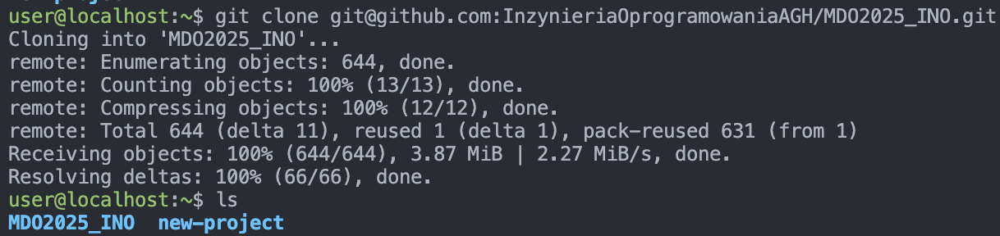
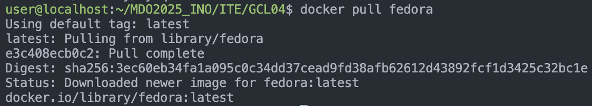
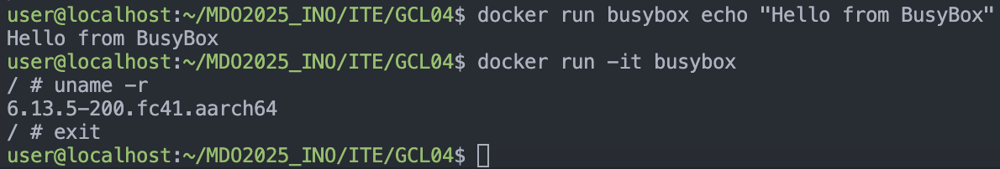
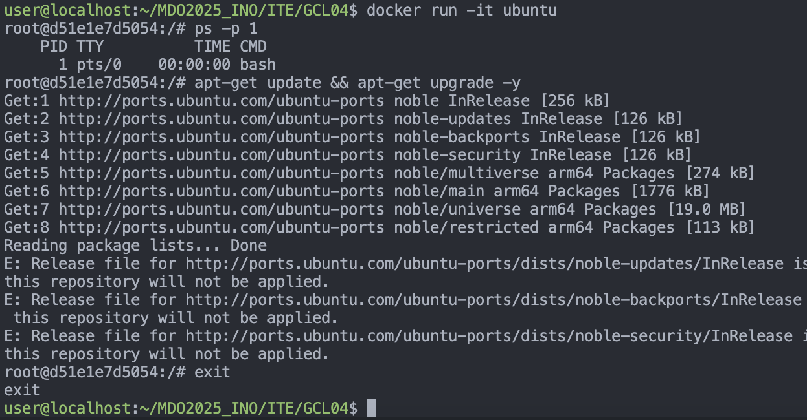
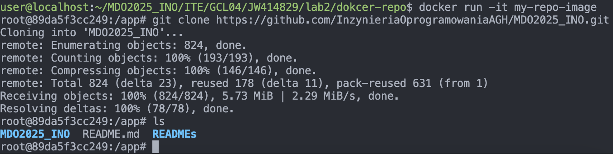
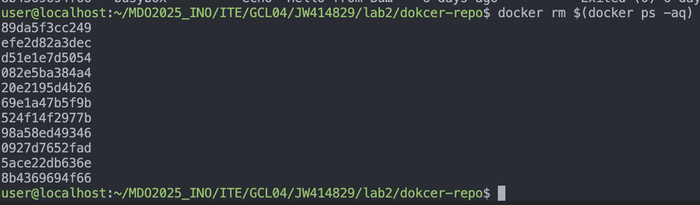
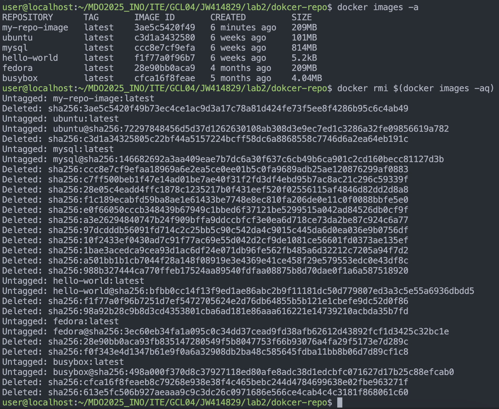

## Zajęcia 01

### 1. Instalacja Gita i konfiguracja kluczy SSH
- Zainstalowałem Gita w systemie 
- Wygenerowałem klucze SSH:  
- Klucze publiczne dodałem w ustawieniach GitHuba (zakładka **SSH and GPG keys**).
- Skonfigurowałem 2FA na koncie GitHub.

---

### 2. Klonowanie repozytorium
**Klon przez SSH** (po dodaniu klucza do GitHub i skonfigurowaniu agenta SSH):


---

### 3. Przełączanie się na gałęzie
- Przełączyłem się na gałąź `main`, a następnie na gałąź grupową `GCL04`. Następnie utworzyłem gałąź składającą się z moich inicjałów i numeru indeksu:
  

---

### 4. Utworzenie katalogu i napisanie Git hooka
1. W katalogu **ITE/GCL04** stworzyłem folder `JW414829`.
2. W tym folderze umieściłem plik **sprawozdanie.md** oraz skrypt hooka `commit-msg`.
3. Następnie skopiowałem skrypt hooka do `.git/hooks/commit-msg`, nadając mu prawa wykonywalne.

#### Treść hooka (`commit-msg`)

```bash
#!/usr/bin/sh
#
# Hook commit-msg: sprawdza, czy commit message zaczyna się od określonego prefiksu

# Wymagany prefiks
required_prefix="JW414829"

# Pobranie pierwszej linii komunikatu z pliku przekazanego jako pierwszy argument
first_line=$(head  -n1  "$1")

# Sprawdzenie, czy pierwsza linia zaczyna się od wymaganego prefiksu
case  "$first_line"  in
"$required_prefix"*)
;;
*)
echo  "Błąd: commit musi zaczynać się od '$required_prefix'." >&2
exit  1
;;

esac
```


---

### 5. Dodanie sprawozdania, zrzutów ekranu i wysłanie zmian
- Utworzyłem/zmodyfikowałem pliki, dodałem je i zrobiłem commit:
  ```bash
  git add .
  git commit -m 'JW414829 sprawko i pliki'
  git push origin JW414829
  ```
- Wykonałem próbę wciągnięcia mojej gałęzi do gałęzi grupowej aczkolwiek nie pushowalem tego na remote.


---

## Zajęcia 02

### 1. Instalacja dockera i rejestracja w dockerhub
Ten krok wykonałem jeszcze na poprzednich zajęciach po poleceniu prowadzącego.

---

### 2. Pobranie obrazów `hello-world`, `busybox`, `ubuntu`, `fedora` i `mysql`
Pobrałem wszystkie obrazy ale na screenie zamieszczam pull fedory


---

### 3. Uruchomienie busybox
Uruchomiłem kontener busybox z poleceniem echo, a następnie uruchomiłem ten sam kontener interaktywnie i sprawdzilem numer wersji oraz z niego wyszedłem.


---

### 4. Uruchomienie ubuntu w kontenerze
Uruchomiłem ubuntu w kontenerze oraz:
- pokazałem PID1 w kontenerze
- zaaktualizowałem pakiety
- wyszedłem z kontenera


---

### 5. Stworzyłem, zbudowałem i uruchomiłem prosty plik Dockerfile.
W dockerfile upewniłem się, ze kontener będzie miał gita
```bash
RUN apt-get update && \
    apt-get install -y git curl && \
    rm -rf /var/lib/apt/lists/*
```
oraz ze repozytorium będzie sklonowane

```bash
RUN git clone https://github.com/InzynieriaOprogramowaniaAGH/MDO2025_INO.git /app
```

ponizej znajduje się cały plik Dockerfile

```bash
FROM ubuntu:latest

LABEL maintainer="JW414829"

RUN apt-get update && \
    apt-get install -y git curl && \
    rm -rf /var/lib/apt/lists/*

RUN git clone https://github.com/InzynieriaOprogramowaniaAGH/MDO2025_INO.git /app

WORKDIR /app

CMD ["/bin/bash"]
```

Zbuildowałem Dockerfile:


A następnie uruchomiłem.



Aby sprawdzić działanie gita jeszcze raz, sklonowałem drugi raz repozytorium

---

### 6. Sprawdziłem uruchomione kontenery i wyczyściłem je



---

### 7. Wyczyściłem obrazy


---

### 8. Dockerfile dodałem do sprawozdania i do repozytorium w /lab2/docker-repo/Dockerfile

---

### 9. Wystawiłem PR do grupowego brancha