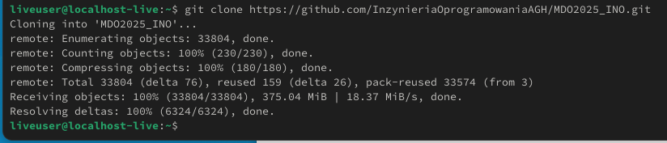
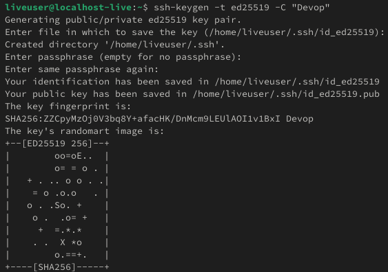
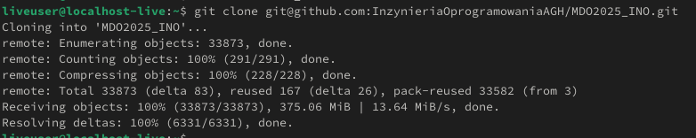
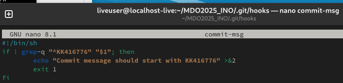
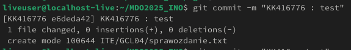
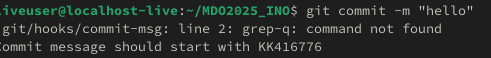
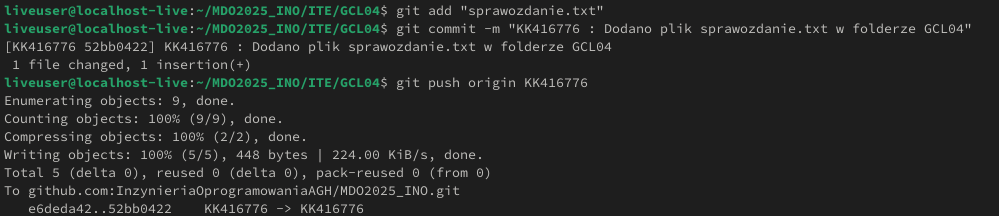

#Sprawozdanie 1

# Lab 1

### 1. Klonowanie repozytorium przez HTTPS

 

### 2. Wygenerowanie klucza SSH 

 

### 3. Sklonowanie repozytorium przez SHH 

 

### 4. Stworzenie git hook wymuszajacy format commit message

### 5. Dowod na dzialanie hooka

### 6. Dodanie przykladowego pliku tekstowego  

# Lab 2

### 1. Dodanie uzytkownika do grupy Docker i pobranie obrazu hello world

### 2. Pobranie pozostalych obrazow

### 3. Uruchominie kontenera BusyBox i sprawdzenie jego wersji

### 4. 

### 5. Uruchomienie Fedory w kontenerze

### 6. Pokazanie PID1 po zainstalowaniu procps

### 7. Aktualizacja pakietow

### 8. Przygotowanie Docerfile, ktory bedzize tworzyl kontener z fedora, instalowal gita i clonowal 
### repozytorium

### 9. Budowa obrazu 

### 10. Usuniecie wszystkich obrazow

# Lab 3

