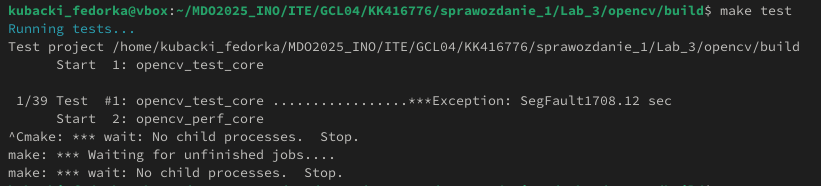

#Sprawozdanie 1

# Lab 1

### 1. Klonowanie repozytorium przez HTTPS

 

### 2. Wygenerowanie klucza SSH 

 

### 3. Sklonowanie repozytorium przez SHH 

 

### 4. Stworzenie git hook wymuszajacy format commit message

### 5. Dowod na dzialanie hooka

### 6. Dodanie przykladowego pliku tekstowego  

# Lab 2

### 1. Dodanie uzytkownika do grupy Docker i pobranie obrazu hello world

### 2. Pobranie pozostalych obrazow

### 3. Uruchominie kontenera BusyBox i sprawdzenie jego wersji

### 4. Uruchomienie Fedory w kontenerze

### 5. Pokazanie PID1 po zainstalowaniu procps

### 6. Aktualizacja pakietow

### 7. Przygotowanie Docerfile, ktory bedzize tworzyl kontener z fedora, instalowal gita i clonowal 
### repozytorium

### 8. Budowa obrazu 

### 9. Usuniecie wszystkich obrazow

# Lab 3

### 1. Sklonowanie repozytorium OpenCV 

### 2. Zainstalowanie potrzebnych narzedzi do builda

### 3. Proces kompilacji zakonczony sukcesem

### 4. Uruchumienie testu jednostkowego zakonczonego bledem segmentation fault 
### (z jakiegos powodu sie uparlem zeby wykonal sie ten test do konca ale ogolem te krotsze testy dziala)

### 5. Pobranie obrazu ubuntu i uruchomienie kontere interaktywnie, zainstalowanie git, cmake oraz build-essentials

### 6. Sklonowanie repozytorium openCV w kontenerze

### 7. Aktualizacja pakietow w kontenerze

### 8. Uruchomienie konfiguracji projektu OpenCV przy pomocy cmake w katalogu build

### 9. Uruchumiene procesu kompilacji przez make

### 10. Test jednostkowy przerwany przeze mnie 
### (krotsze testy dzialaja screeny w lab 4)

### 11. Plik Dockerfile.build, ktory bazuje na ubuntu, instaluje narzedzia, 
### klonuje repozytorium, tworzy katalog build i wykonuje budowe projektu

### 12. Zbudowanie Dockera OpenCV-builder na podstawie Dockerfile.build

### 13. Dockerfile.test bazuje na obrazie OpenCV-builder i uruchamia test opencv_test_core z katalogu build/bin

### 14. Zbudowanie obrazu Dockera OpenCV-builder na podstawie Dockerfile.test

### Budowa obrazu OpenCV-builder zakonczona pomyslnie

# Lab 4

