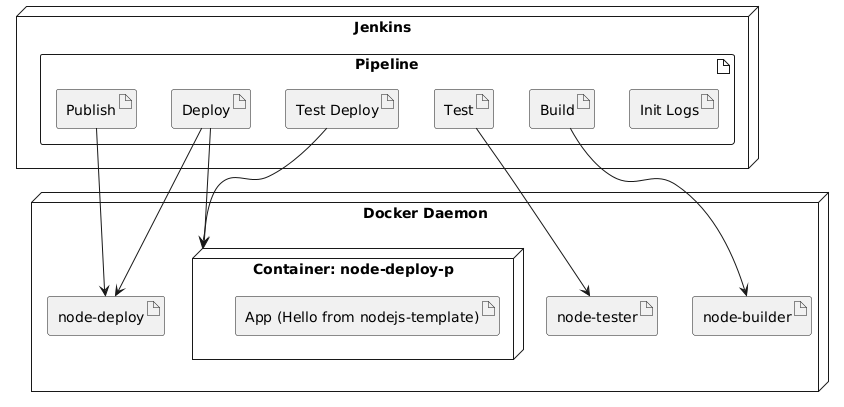
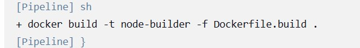
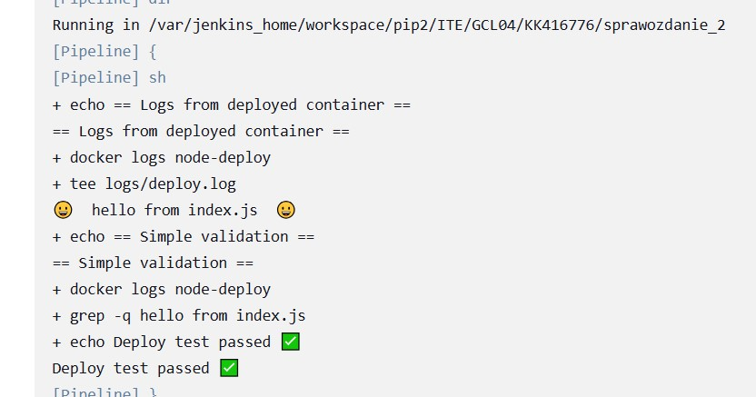

# Sprawozdanie 2

## Lab 5


```docker
FROM jenkins/jenkins:2.492.2-jdk17

USER root

RUN apt-get update && apt-get install -y lsb-release ca-certificates curl && install -m 0755 -d /etc/apt/keyrings && \
    curl -fsSL https://download.docker.com/linux/debian/gpg -o /etc/apt/keyrings/docker.asc && chmod a+r /etc/apt/keyrings/docker.asc && \
    echo "deb [arch=$(dpkg --print-architecture) signed-by=/etc/apt/keyrings/docker.asc] https://download.docker.com/linux/debian \
    $(. /etc/os-release && echo \"$VERSION_CODENAME\") stable" | tee /etc/apt/sources.list.d/docker.list > /dev/null && apt-get update && \
    apt-get install -y docker-ce-cli && apt-get clean && rm -rf /var/lib/apt/lists/*

USER jenkins

RUN jenkins-plugin-cli --plugins "blueocean docker-workflow"
```


```bash
uname -a
```


```bash
#!/bin/bash

godzina=$(date +%H)
g=${godzina#0}

if (( g % 2 )); then
    echo "slabo: $g nieparzysta"
    exit 1
else
    echo "elegancko: $g parzysta"
    exit 0
fi
```


```bash
docker pull ubuntu
```


```groovy
pipeline {
    agent any

    stages {
        stage('Checkout') {
            steps {
                sh '''
                    rm -rf MDO2025_INO || true
                    git clone --branch KK416776 --depth 1 https://github.com/InzynieriaOprogramowaniaAGH/MDO2025_INO.git
                '''
            }
        }
        
        stage('Build') {
            steps {
                dir('MDO2025_INO/ITE/GCL04/KK416776/sprawozdanie_2') {
                    sh '''
                        docker rmi -f node-builder || true
                        docker builder prune --force --all || true
                        docker build -t node-builder -f Dockerfile.build .
                    '''
                }
            }
        }
        
        stage('Test') {
            steps {
                dir('MDO2025_INO/ITE/GCL04/KK416776/sprawozdanie_2') {
                    sh '''
                        docker rmi -f node-tester || true
                        docker build -t node-tester -f Dockerfile.test .
                    '''
                }
            }
        }
    }
}
```


## Lab 6 i 7




```groovy
pipeline {
    agent any

    environment {
        DOCKER_HOST = "tcp://docker:2376"
        DOCKER_CERT_PATH = "/certs/client"
        DOCKER_TLS_VERIFY = "1"
        APP_DIR = "ITE/GCL04/KK416776/sprawozdanie_2"
        VERSION = sh(script: "git rev-parse --short HEAD", returnStdout: true).trim()
    }

    stages {
        stage('Init Logs') {
            steps {
                dir(env.APP_DIR) {
                    sh 'mkdir -p logs artifacts'
                }
            }
        }

        stage('Build') {
            steps {
                dir(env.APP_DIR){
                    catchError(buildResult: 'FAILURE', stageResult: 'FAILURE') {
                        sh 'docker build -t node-builder -f Dockerfile.build . > logs/build.log 2>&1'
                    }
                }
            }
        }

        stage('Test') {
            steps {
                dir(env.APP_DIR) {
                    catchError(buildResult: 'FAILURE', stageResult: 'FAILURE') {
                        sh 'docker build -t node-tester -f Dockerfile.test . > logs/test.log 2>&1'
                        sh 'docker run --rm node-tester >> logs/test.log 2>&1'
                    }
                }
            }
        }

        stage('Deploy') {
            steps {
                dir(env.APP_DIR) {
                    sh '''
                        docker build -t node-deploy -f Dockerfile.deploy .
                        docker run -d --name node-deploy node-deploy
                        sleep 5
                    '''
                }
            }
        }

        stage('Test Deploy') {
            steps {
                dir(env.APP_DIR) {
                    sh '''
                        echo "== Logs from deployed container =="
                        docker logs node-deploy | tee logs/deploy.log

                        echo "== Simple validation =="
                        if docker logs node-deploy | grep -q "hello from index.js"; then
                            echo "Deploy test passed ✅"
                        else
                            echo "Deploy test failed ❌"
                            exit 1
                        fi
                    '''
                }
            }
        }

        stage('Publish') {
            steps {
                dir(env.APP_DIR) {
                    sh "docker save node-deploy -o artifacts/node-deploy_${VERSION}.tar"
                    archiveArtifacts artifacts: "artifacts/node-deploy_${VERSION}.tar", fingerprint: true
                }
            }
        }
    }

    post {
        always {
            sh '''
                docker container rm -f node-deploy || true
                docker image rm node-builder node-tester node-deploy || true
                docker system prune -af || true
            '''
            dir(env.APP_DIR) {
                archiveArtifacts artifacts: 'logs/*.log', allowEmptyArchive: true
            }
        }
    }
}
```

`Dockerfile.build`:

```docker
FROM node:latest

RUN apt update && apt install -y git

WORKDIR /app

RUN git clone https://github.com/ChristianKienle/nodejs-template.git

WORKDIR /app/nodejs-template

RUN npm ci
RUN npm run build

CMD ["echo", "Build completed!"]
```

`Dockerfile.test`:

```docker
FROM node-builder

WORKDIR /app/nodejs-template

CMD ["npm", "run", "test"]
```

`Dockerfile.deploy`:

```docker
FROM node:latest

WORKDIR /app

COPY --from=node-builder /app/nodejs-template/dist ./dist

CMD ["node", "dist/index.js"]
```








### Logi

build.log

```log
#0 building with "default" instance using docker driver

#1 [internal] load build definition from Dockerfile.build
#1 transferring dockerfile:
#1 transferring dockerfile: 341B 0.3s done
#1 DONE 2.1s

#2 [internal] load metadata for docker.io/library/node:latest
#2 DONE 5.3s

#3 [internal] load .dockerignore
#3 transferring context:
#3 transferring context: 2B done
#3 DONE 0.8s

#4 [1/7] FROM docker.io/library/node:latest@sha256:d1db2ecd11f417ab2ff4fef891b4d27194c367d101f9b9cd546a26e424e93d31
#4 resolve docker.io/library/node:latest@sha256:d1db2ecd11f417ab2ff4fef891b4d27194c367d101f9b9cd546a26e424e93d31
#4 resolve docker.io/library/node:latest@sha256:d1db2ecd11f417ab2ff4fef891b4d27194c367d101f9b9cd546a26e424e93d31 0.5s done
#4 sha256:d1db2ecd11f417ab2ff4fef891b4d27194c367d101f9b9cd546a26e424e93d31 5.14kB / 5.14kB done
#4 sha256:c19dd429a216875343dac95f7b76b4f8158d680251dfdbb8f6606415f6ec76e1 2.49kB / 2.49kB done
#4 sha256:755ea2a01757be91284247988150cb347565f3b7151b6cbbe727261bf811985b 6.42kB / 6.42kB done
#4 sha256:0c01110621e0ec1eded421406c9f117f7ae5486c8f7b0a0d1a37cc7bc9317226 0B / 48.49MB 0.3s
#4 sha256:0c01110621e0ec1eded421406c9f117f7ae5486c8f7b0a0d1a37cc7bc9317226 9.44MB / 48.49MB 0.6s
#4 sha256:3b1eb73e993990490aa137c00e60ff4ca9d1715bafb8e888dbb0986275edb13f 0B / 24.02MB 0.6s
#4 sha256:0c01110621e0ec1eded421406c9f117f7ae5486c8f7b0a0d1a37cc7bc9317226 15.73MB / 48.49MB 0.7s
#4 sha256:0c01110621e0ec1eded421406c9f117f7ae5486c8f7b0a0d1a37cc7bc9317226 18.87MB / 48.49MB 0.8s
#4 sha256:0c01110621e0ec1eded421406c9f117f7ae5486c8f7b0a0d1a37cc7bc9317226 37.75MB / 48.49MB 1.0s
#4 sha256:b1b8a0660a31403a35d70b276c3c86b1200b8683e83cd77a92ec98744017684a 0B / 64.40MB 1.0s
#4 sha256:0c01110621e0ec1eded421406c9f117f7ae5486c8f7b0a0d1a37cc7bc9317226 46.14MB / 48.49MB 1.1s
#4 sha256:3b1eb73e993990490aa137c00e60ff4ca9d1715bafb8e888dbb0986275edb13f 2.10MB / 24.02MB 1.1s
#4 sha256:3b1eb73e993990490aa137c00e60ff4ca9d1715bafb8e888dbb0986275edb13f 8.39MB / 24.02MB 1.6s
#4 sha256:3b1eb73e993990490aa137c00e60ff4ca9d1715bafb8e888dbb0986275edb13f 16.78MB / 24.02MB 1.9s
#4 sha256:b1b8a0660a31403a35d70b276c3c86b1200b8683e83cd77a92ec98744017684a 6.29MB / 64.40MB 1.9s
#4 sha256:3b1eb73e993990490aa137c00e60ff4ca9d1715bafb8e888dbb0986275edb13f 23.07MB / 24.02MB 2.0s
#4 sha256:b1b8a0660a31403a35d70b276c3c86b1200b8683e83cd77a92ec98744017684a 12.15MB / 64.40MB 2.0s
#4 sha256:b1b8a0660a31403a35d70b276c3c86b1200b8683e83cd77a92ec98744017684a 31.68MB / 64.40MB 2.4s
#4 sha256:b1b8a0660a31403a35d70b276c3c86b1200b8683e83cd77a92ec98744017684a 38.80MB / 64.40MB 2.6s
#4 sha256:b1b8a0660a31403a35d70b276c3c86b1200b8683e83cd77a92ec98744017684a 48.23MB / 64.40MB 2.8s
#4 sha256:b1b8a0660a31403a35d70b276c3c86b1200b8683e83cd77a92ec98744017684a 53.75MB / 64.40MB 3.3s
#4 sha256:b1b8a0660a31403a35d70b276c3c86b1200b8683e83cd77a92ec98744017684a 58.63MB / 64.40MB 4.3s
#4 sha256:b1b8a0660a31403a35d70b276c3c86b1200b8683e83cd77a92ec98744017684a 63.79MB / 64.40MB 4.5s
#4 sha256:0c01110621e0ec1eded421406c9f117f7ae5486c8f7b0a0d1a37cc7bc9317226 48.49MB / 48.49MB 4.4s done
#4 sha256:3b1eb73e993990490aa137c00e60ff4ca9d1715bafb8e888dbb0986275edb13f 24.02MB / 24.02MB 6.3s done
#4 sha256:7d640a28f66767021cc5b1a4b4300ebe1395609adf0e010a949cf42682594a89 0B / 3.32kB 7.3s
#4 sha256:b1b8a0660a31403a35d70b276c3c86b1200b8683e83cd77a92ec98744017684a 64.40MB / 64.40MB 7.4s done
#4 extracting sha256:0c01110621e0ec1eded421406c9f117f7ae5486c8f7b0a0d1a37cc7bc9317226
#4 sha256:7d640a28f66767021cc5b1a4b4300ebe1395609adf0e010a949cf42682594a89 3.32kB / 3.32kB 8.0s
#4 sha256:07fea7834ac30bf873caef4d0ed795b73793c7ce9c88b2f9bd9ee9b515c18012 0B / 58.47MB 8.2s
#4 sha256:07fea7834ac30bf873caef4d0ed795b73793c7ce9c88b2f9bd9ee9b515c18012 8.39MB / 58.47MB 8.5s
#4 sha256:07fea7834ac30bf873caef4d0ed795b73793c7ce9c88b2f9bd9ee9b515c18012 18.87MB / 58.47MB 8.6s
#4 sha256:07fea7834ac30bf873caef4d0ed795b73793c7ce9c88b2f9bd9ee9b515c18012 36.70MB / 58.47MB 8.8s
#4 sha256:48b8862a18fa961ebfbac8484877dd4894e96ee88177d8c4f1f54d9727262b7d 0B / 211.37MB 8.8s
#4 sha256:7d640a28f66767021cc5b1a4b4300ebe1395609adf0e010a949cf42682594a89 3.32kB / 3.32kB 8.7s done
#4 sha256:07fea7834ac30bf873caef4d0ed795b73793c7ce9c88b2f9bd9ee9b515c18012 42.99MB / 58.47MB 9.0s
#4 sha256:07fea7834ac30bf873caef4d0ed795b73793c7ce9c88b2f9bd9ee9b515c18012 46.14MB / 58.47MB 9.3s
#4 sha256:07fea7834ac30bf873caef4d0ed795b73793c7ce9c88b2f9bd9ee9b515c18012 50.33MB / 58.47MB 9.3s
#4 sha256:07fea7834ac30bf873caef4d0ed795b73793c7ce9c88b2f9bd9ee9b515c18012 57.33MB / 58.47MB 9.7s
#4 sha256:48b8862a18fa961ebfbac8484877dd4894e96ee88177d8c4f1f54d9727262b7d 11.53MB / 211.37MB 9.7s
#4 sha256:57b0becc010f6ac2c62850ba90f1afd81a1b64f8e00941cbf6408bab573e9309 0B / 1.25MB 12.3s
#4 extracting sha256:0c01110621e0ec1eded421406c9f117f7ae5486c8f7b0a0d1a37cc7bc9317226 5.0s
#4 sha256:48b8862a18fa961ebfbac8484877dd4894e96ee88177d8c4f1f54d9727262b7d 24.56MB / 211.37MB 12.6s
#4 sha256:07fea7834ac30bf873caef4d0ed795b73793c7ce9c88b2f9bd9ee9b515c18012 58.47MB / 58.47MB 12.6s done
#4 sha256:57b0becc010f6ac2c62850ba90f1afd81a1b64f8e00941cbf6408bab573e9309 1.25MB / 1.25MB 12.8s
#4 sha256:48b8862a18fa961ebfbac8484877dd4894e96ee88177d8c4f1f54d9727262b7d 42.20MB / 211.37MB 13.1s
#4 sha256:19120b89d6208d242a6bb8585b3e896d24742633dd9404165e91133ac19afc16 0B / 449B 13.5s
#4 sha256:48b8862a18fa961ebfbac8484877dd4894e96ee88177d8c4f1f54d9727262b7d 55.56MB / 211.37MB 13.7s
#4 sha256:57b0becc010f6ac2c62850ba90f1afd81a1b64f8e00941cbf6408bab573e9309 1.25MB / 1.25MB 13.5s done
#4 sha256:19120b89d6208d242a6bb8585b3e896d24742633dd9404165e91133ac19afc16 449B / 449B 13.7s
#4 sha256:19120b89d6208d242a6bb8585b3e896d24742633dd9404165e91133ac19afc16 449B / 449B 13.9s done
#4 sha256:48b8862a18fa961ebfbac8484877dd4894e96ee88177d8c4f1f54d9727262b7d 66.74MB / 211.37MB 14.7s
#4 sha256:48b8862a18fa961ebfbac8484877dd4894e96ee88177d8c4f1f54d9727262b7d 83.89MB / 211.37MB 15.0s
#4 sha256:48b8862a18fa961ebfbac8484877dd4894e96ee88177d8c4f1f54d9727262b7d 109.05MB / 211.37MB 15.5s
#4 sha256:48b8862a18fa961ebfbac8484877dd4894e96ee88177d8c4f1f54d9727262b7d 127.93MB / 211.37MB 16.0s
#4 sha256:48b8862a18fa961ebfbac8484877dd4894e96ee88177d8c4f1f54d9727262b7d 141.93MB / 211.37MB 16.7s
#4 sha256:48b8862a18fa961ebfbac8484877dd4894e96ee88177d8c4f1f54d9727262b7d 155.05MB / 211.37MB 17.0s
#4 sha256:48b8862a18fa961ebfbac8484877dd4894e96ee88177d8c4f1f54d9727262b7d 171.38MB / 211.37MB 17.5s
#4 extracting sha256:0c01110621e0ec1eded421406c9f117f7ae5486c8f7b0a0d1a37cc7bc9317226 11.0s
#4 sha256:48b8862a18fa961ebfbac8484877dd4894e96ee88177d8c4f1f54d9727262b7d 187.70MB / 211.37MB 18.9s
#4 sha256:48b8862a18fa961ebfbac8484877dd4894e96ee88177d8c4f1f54d9727262b7d 199.23MB / 211.37MB 19.1s
#4 sha256:48b8862a18fa961ebfbac8484877dd4894e96ee88177d8c4f1f54d9727262b7d 211.37MB / 211.37MB 19.4s
#4 sha256:48b8862a18fa961ebfbac8484877dd4894e96ee88177d8c4f1f54d9727262b7d 211.37MB / 211.37MB 20.4s done
#4 extracting sha256:0c01110621e0ec1eded421406c9f117f7ae5486c8f7b0a0d1a37cc7bc9317226 15.0s done
#4 extracting sha256:3b1eb73e993990490aa137c00e60ff4ca9d1715bafb8e888dbb0986275edb13f
#4 extracting sha256:3b1eb73e993990490aa137c00e60ff4ca9d1715bafb8e888dbb0986275edb13f 3.6s done
#4 extracting sha256:b1b8a0660a31403a35d70b276c3c86b1200b8683e83cd77a92ec98744017684a
#4 extracting sha256:b1b8a0660a31403a35d70b276c3c86b1200b8683e83cd77a92ec98744017684a 5.2s
#4 extracting sha256:b1b8a0660a31403a35d70b276c3c86b1200b8683e83cd77a92ec98744017684a 10.3s
#4 extracting sha256:b1b8a0660a31403a35d70b276c3c86b1200b8683e83cd77a92ec98744017684a 10.5s done
#4 extracting sha256:48b8862a18fa961ebfbac8484877dd4894e96ee88177d8c4f1f54d9727262b7d
#4 extracting sha256:48b8862a18fa961ebfbac8484877dd4894e96ee88177d8c4f1f54d9727262b7d 5.5s
#4 extracting sha256:48b8862a18fa961ebfbac8484877dd4894e96ee88177d8c4f1f54d9727262b7d 11.1s
#4 extracting sha256:48b8862a18fa961ebfbac8484877dd4894e96ee88177d8c4f1f54d9727262b7d 16.1s
#4 extracting sha256:48b8862a18fa961ebfbac8484877dd4894e96ee88177d8c4f1f54d9727262b7d 21.2s
#4 extracting sha256:48b8862a18fa961ebfbac8484877dd4894e96ee88177d8c4f1f54d9727262b7d 26.2s done
#4 extracting sha256:7d640a28f66767021cc5b1a4b4300ebe1395609adf0e010a949cf42682594a89
#4 extracting sha256:7d640a28f66767021cc5b1a4b4300ebe1395609adf0e010a949cf42682594a89 0.0s done
#4 extracting sha256:07fea7834ac30bf873caef4d0ed795b73793c7ce9c88b2f9bd9ee9b515c18012
#4 extracting sha256:07fea7834ac30bf873caef4d0ed795b73793c7ce9c88b2f9bd9ee9b515c18012 5.3s
#4 extracting sha256:07fea7834ac30bf873caef4d0ed795b73793c7ce9c88b2f9bd9ee9b515c18012 9.3s done
#4 extracting sha256:57b0becc010f6ac2c62850ba90f1afd81a1b64f8e00941cbf6408bab573e9309
#4 extracting sha256:57b0becc010f6ac2c62850ba90f1afd81a1b64f8e00941cbf6408bab573e9309 0.7s done
#4 extracting sha256:19120b89d6208d242a6bb8585b3e896d24742633dd9404165e91133ac19afc16
#4 extracting sha256:19120b89d6208d242a6bb8585b3e896d24742633dd9404165e91133ac19afc16 done
#4 DONE 98.0s

#5 [2/7] RUN apt update && apt install -y git
#5 10.99 
#5 10.99 WARNING: apt does not have a stable CLI interface. Use with caution in scripts.
#5 10.99 
#5 13.01 Get:1 http://deb.debian.org/debian bookworm InRelease [151 kB]
#5 13.09 Get:2 http://deb.debian.org/debian bookworm-updates InRelease [55.4 kB]
#5 13.11 Get:3 http://deb.debian.org/debian-security bookworm-security InRelease [48.0 kB]
#5 14.11 Get:4 http://deb.debian.org/debian bookworm/main amd64 Packages [8793 kB]
#5 16.63 Get:5 http://deb.debian.org/debian bookworm-updates/main amd64 Packages [756 B]
#5 16.69 Get:6 http://deb.debian.org/debian-security bookworm-security/main amd64 Packages [263 kB]
#5 17.59 Fetched 9311 kB in 5s (1968 kB/s)
#5 17.59 Reading package lists...
#5 18.15 Building dependency tree...
#5 18.26 Reading state information...
#5 18.29 1 package can be upgraded. Run 'apt list --upgradable' to see it.
#5 18.30 
#5 18.30 WARNING: apt does not have a stable CLI interface. Use with caution in scripts.
#5 18.30 
#5 18.67 Reading package lists...
#5 19.13 Building dependency tree...
#5 19.25 Reading state information...
#5 21.37 git is already the newest version (1:2.39.5-0+deb12u2).
#5 21.37 0 upgraded, 0 newly installed, 0 to remove and 1 not upgraded.
#5 DONE 22.9s

#6 [3/7] WORKDIR /app
#6 DONE 4.5s

#7 [4/7] RUN git clone https://github.com/ChristianKienle/nodejs-template.git
#7 4.110 Cloning into 'nodejs-template'...
#7 DONE 10.1s

#8 [5/7] WORKDIR /app/nodejs-template
#8 DONE 2.7s

#9 [6/7] RUN npm ci
#9 9.601 npm warn old lockfile
#9 9.601 npm warn old lockfile The package-lock.json file was created with an old version of npm,
#9 9.601 npm warn old lockfile so supplemental metadata must be fetched from the registry.
#9 9.601 npm warn old lockfile
#9 9.601 npm warn old lockfile This is a one-time fix-up, please be patient...
#9 9.601 npm warn old lockfile
#9 56.47 npm warn deprecated w3c-hr-time@1.0.1: Use your platform's native performance.now() and performance.timeOrigin.
#9 56.72 npm warn deprecated urix@0.1.0: Please see https://github.com/lydell/urix#deprecated
#9 56.98 npm warn deprecated set-value@2.0.0: Critical bug fixed in v3.0.1, please upgrade to the latest version.
#9 56.98 npm warn deprecated rimraf@2.6.2: Rimraf versions prior to v4 are no longer supported
#9 57.07 npm warn deprecated request-promise-native@1.0.5: request-promise-native has been deprecated because it extends the now deprecated request package, see https://github.com/request/request/issues/3142
#9 57.23 npm warn deprecated resolve-url@0.2.1: https://github.com/lydell/resolve-url#deprecated
#9 57.32 npm warn deprecated source-map-url@0.4.0: See https://github.com/lydell/source-map-url#deprecated
#9 57.38 npm warn deprecated uuid@3.3.2: Please upgrade  to version 7 or higher.  Older versions may use Math.random() in certain circumstances, which is known to be problematic.  See https://v8.dev/blog/math-random for details.
#9 57.77 npm warn deprecated mixin-deep@1.3.1: Critical bug fixed in v2.0.1, please upgrade to the latest version.
#9 57.85 npm warn deprecated sane@2.5.2: some dependency vulnerabilities fixed, support for node < 10 dropped, and newer ECMAScript syntax/features added
#9 57.94 npm warn deprecated source-map-resolve@0.5.2: See https://github.com/lydell/source-map-resolve#deprecated
#9 57.99 npm warn deprecated left-pad@1.3.0: use String.prototype.padStart()
#9 58.04 npm warn deprecated kleur@2.0.1: Please upgrade to kleur@3 or migrate to 'ansi-colors' if you prefer the old syntax. Visit <https://github.com/lukeed/kleur/releases/tag/v3.0.0\> for migration path(s).
#9 58.42 npm warn deprecated istanbul-lib-hook@1.2.1: 1.2.0 should have been a major version bump
#9 58.92 npm warn deprecated is-data-descriptor@0.1.4: Please upgrade to v0.1.5
#9 58.95 npm warn deprecated is-accessor-descriptor@0.1.6: Please upgrade to v0.1.7
#9 58.95 npm warn deprecated inflight@1.0.6: This module is not supported, and leaks memory. Do not use it. Check out lru-cache if you want a good and tested way to coalesce async requests by a key value, which is much more comprehensive and powerful.
#9 59.41 npm warn deprecated har-validator@5.1.0: this library is no longer supported
#9 59.55 npm warn deprecated request@2.88.0: request has been deprecated, see https://github.com/request/request/issues/3142
#9 59.59 npm warn deprecated mkdirp@0.5.1: Legacy versions of mkdirp are no longer supported. Please update to mkdirp 1.x. (Note that the API surface has changed to use Promises in 1.x.)
#9 59.91 npm warn deprecated domexception@1.0.1: Use your platform's native DOMException instead
#9 59.93 npm warn deprecated glob@7.1.2: Glob versions prior to v9 are no longer supported
#9 59.98 npm warn deprecated circular-json@0.3.3: CircularJSON is in maintenance only, flatted is its successor.
#9 60.00 npm warn deprecated abab@2.0.0: Use your platform's native atob() and btoa() methods instead
#9 60.56 npm warn deprecated babel-eslint@9.0.0: babel-eslint is now @babel/eslint-parser. This package will no longer receive updates.
#9 60.61 npm warn deprecated fstream@1.0.11: This package is no longer supported.
#9 62.91 npm warn deprecated @babel/plugin-proposal-object-rest-spread@7.0.0: This proposal has been merged to the ECMAScript standard and thus this plugin is no longer maintained. Please use @babel/plugin-transform-object-rest-spread instead.
#9 65.10 npm warn deprecated @babel/plugin-proposal-optional-catch-binding@7.0.0: This proposal has been merged to the ECMAScript standard and thus this plugin is no longer maintained. Please use @babel/plugin-transform-optional-catch-binding instead.
#9 65.10 npm warn deprecated @babel/plugin-proposal-json-strings@7.0.0: This proposal has been merged to the ECMAScript standard and thus this plugin is no longer maintained. Please use @babel/plugin-transform-json-strings instead.
#9 65.10 npm warn deprecated @babel/plugin-proposal-async-generator-functions@7.0.0: This proposal has been merged to the ECMAScript standard and thus this plugin is no longer maintained. Please use @babel/plugin-transform-async-generator-functions instead.
#9 65.10 npm warn deprecated is-data-descriptor@1.0.0: Please upgrade to v1.0.1
#9 65.10 npm warn deprecated is-accessor-descriptor@1.0.0: Please upgrade to v1.0.1
#9 65.10 npm warn deprecated set-value@0.4.3: Critical bug fixed in v3.0.1, please upgrade to the latest version.
#9 65.10 npm warn deprecated is-data-descriptor@1.0.0: Please upgrade to v1.0.1
#9 65.10 npm warn deprecated is-data-descriptor@1.0.0: Please upgrade to v1.0.1
#9 65.10 npm warn deprecated is-data-descriptor@1.0.0: Please upgrade to v1.0.1
#9 65.10 npm warn deprecated is-accessor-descriptor@1.0.0: Please upgrade to v1.0.1
#9 65.10 npm warn deprecated is-accessor-descriptor@1.0.0: Please upgrade to v1.0.1
#9 65.10 npm warn deprecated is-accessor-descriptor@1.0.0: Please upgrade to v1.0.1
#9 65.10 npm warn deprecated @babel/polyfill@7.0.0: 🚨 This package has been deprecated in favor of separate inclusion of a polyfill and regenerator-runtime (when needed). See the @babel/polyfill docs (https://babeljs.io/docs/en/babel-polyfill) for more information.
#9 67.30 npm warn deprecated @babel/plugin-proposal-unicode-property-regex@7.0.0: This proposal has been merged to the ECMAScript standard and thus this plugin is no longer maintained. Please use @babel/plugin-transform-unicode-property-regex instead.
#9 75.46 npm warn deprecated eslint@5.5.0: This version is no longer supported. Please see https://eslint.org/version-support for other options.
#9 78.08 npm warn deprecated core-js@2.5.7: core-js@<3.23.3 is no longer maintained and not recommended for usage due to the number of issues. Because of the V8 engine whims, feature detection in old core-js versions could cause a slowdown up to 100x even if nothing is polyfilled. Some versions have web compatibility issues. Please, upgrade your dependencies to the actual version of core-js.
#9 92.04 
#9 92.04 added 882 packages, and audited 949 packages in 1m
#9 92.12 
#9 92.12 87 vulnerabilities (2 low, 31 moderate, 27 high, 27 critical)
#9 92.12 
#9 92.12 To address issues that do not require attention, run:
#9 92.12   npm audit fix
#9 92.12 
#9 92.12 To address all issues (including breaking changes), run:
#9 92.12   npm audit fix --force
#9 92.12 
#9 92.12 Run `npm audit` for details.
#9 92.19 npm notice
#9 92.19 npm notice New minor version of npm available! 11.3.0 -> 11.4.2
#9 92.19 npm notice Changelog: https://github.com/npm/cli/releases/tag/v11.4.2
#9 92.19 npm notice To update run: npm install -g npm@11.4.2
#9 92.19 npm notice
#9 DONE 99.1s

#10 [7/7] RUN npm run build
#10 18.37 
#10 18.37 > nodejs-template@1.0.1 build
#10 18.37 > npx babel --config-file ./.babelrc.js src/ --out-dir dist
#10 18.37 
#10 27.52 Successfully compiled 6 files with Babel.
#10 DONE 29.6s

#11 exporting to image
#11 exporting layers
#11 exporting layers 138.4s done
#11 writing image sha256:9c7a667da9f4e982ae04f8717ec652c6404b27a483a9e9c1b1fd0fc1edb952c2
#11 writing image sha256:9c7a667da9f4e982ae04f8717ec652c6404b27a483a9e9c1b1fd0fc1edb952c2 0.3s done
#11 naming to docker.io/library/node-builder
#11 naming to docker.io/library/node-builder 0.3s done
#11 DONE 140.2s
```

test.log

```log
#0 building with "default" instance using docker driver

#1 [internal] load build definition from Dockerfile.test
#1 transferring dockerfile:
#1 transferring dockerfile: 181B 0.4s done
#1 DONE 1.9s

#2 [internal] load metadata for docker.io/library/node-builder:latest
#2 DONE 0.0s

#3 [internal] load .dockerignore
#3 transferring context: 2B 0.0s done
#3 DONE 0.3s

#4 [1/2] FROM docker.io/library/node-builder:latest
#4 DONE 5.7s

#5 [2/2] WORKDIR /app/nodejs-template
#5 DONE 3.7s

#6 exporting to image
#6 exporting layers
#6 exporting layers 1.5s done
#6 writing image sha256:1a9bcbafcec283f7d25480a34e8421a57281a34f9ff7ed2bc2aca608c73f4392
#6 writing image sha256:1a9bcbafcec283f7d25480a34e8421a57281a34f9ff7ed2bc2aca608c73f4392 0.1s done
#6 naming to docker.io/library/node-tester
#6 naming to docker.io/library/node-tester 0.2s done
#6 DONE 2.5s

> nodejs-template@1.0.1 test
> jest --runInBand --config .jest.config.js src/

(node:18) [DEP0176] DeprecationWarning: fs.F_OK is deprecated, use fs.constants.F_OK instead
(Use `node --trace-deprecation ...` to show where the warning was created)
PASS src/sample.test.js (13.847s)
  ✓ that everything works (190ms)

  console.log src/lib/logger.js:6
    hello from sample.test.js

-----------|----------|----------|----------|----------|-------------------|
File       |  % Stmts | % Branch |  % Funcs |  % Lines | Uncovered Line #s |
-----------|----------|----------|----------|----------|-------------------|
All files  |      100 |      100 |      100 |      100 |                   |
 index.js  |      100 |      100 |      100 |      100 |                   |
 logger.js |      100 |      100 |      100 |      100 |                   |
-----------|----------|----------|----------|----------|-------------------|
Test Suites: 1 passed, 1 total
Tests:       1 passed, 1 total
Snapshots:   0 total
Time:        25.713s
Ran all test suites matching /src\//i.
```

deploy.log

```bash
😀  hello from index.js  😀
```