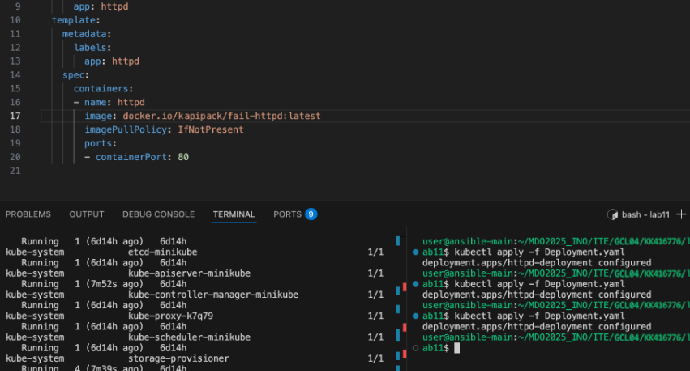

### 1. Stworzenie nowej wirtualnej maszyny z system Fedora i OpenSSH

### 3. Instalacja Ansible na glownej maszynie i zmiana nazwy hosta na ansible-main

### 5. Wygenerowanie klucza SSH i wymiana pomiedzy userami

### 6. Logowanie za pomoca ssh (nie jest wymagane haslo) 

### 8. Stworzenie plik "inventory.ini", ktory przeprowadza polecenie ping do wszystkich hostow w pliku

### 9. Utworzenie playbook w formacie YAML, ktory przeprowadza polecenie ping do wszystkich hostow w pliku 

### 10. Stworzenie pliku "copycat.yml", ktory kopiuje "inventory.ini" na zdale hosty. Uruchomienie pliku po raz kolejny, sprawdza czy plik juz istnieje

### 11. Plik restart.yml restartuje uslugi sshd oraz rngd

### 12. Uruchomienie z wylaczonym serwerem SSH

### 13. Utworzenie roli "deploy_docker_app", ktora pozwala na wdrozenie aplikacji

### 14. Uruchomienie roli w celu zdeployowania aplikacji

### 15. Pobranie pliku anaconda-ks.cfg z poprzedniej maszyny. Zmodyfikowano go, dodajac potrzebne pakiety i repozytorium. Nastepnie zainstalowano z tego pliku nowa maszyne

### 16. Automatyczna instalacja

### 17. Po instalacji uruchomiony kontener HTTP poprawnie serwowal plik index.html 

### 18. Uruchomiono pod i zweryfikowanie statusu

### 19. Zbudowane obrazy spushowane do Docker Hub

### 20. Deployement z 8 Podami

### 21. Deployment z zmieniona liczba podow z 8 na 1

### 22. Przeprowadzenie port-forwarding w celu uzyskania dostepu do serwowanej strony

### 23. Wesja druga obrazu

### 24. Port-forwarding

### 25. Wersja fail

### 26. Przywrocenie do poperzniej dzialajacej wersji

### 27. Kontrola wdrozenia

