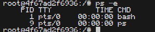
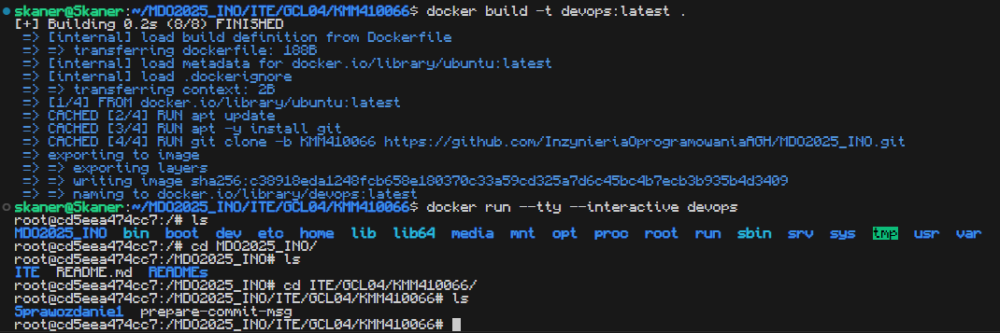
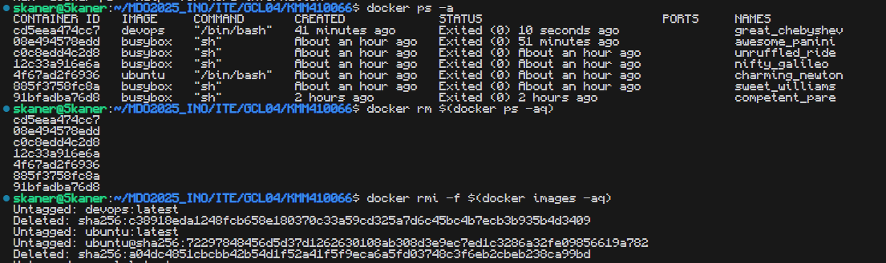

# Sprawozdanie z laboratorium 2
Celem zajęć była instalacja i zapoznanie się z programem Docker.

Wykonanie zadań zacząłem od instalacji Dockera z repozytorium `apt`.  
Aby zweryfikować poprawność instalacji użyłem polecenia `docker run hello-world`

W celu przygotowania do kolejnych części ćwiczenia pobrałem obrazy `busybox`, `ubuntu`, oraz `mysql` korzystając z polecenia `docker pull <obraz>`.

<hr>

Uruchomiłem obraz busybox w zwykłym trybie, oraz interaktywnym.  
Przy noramalnym uruchomieniu, nic nie zostało wzrócone do konsoli i kontener od razu się wyłączył.  
Przy włączeniu w trybie interaktywnym, dostajemy konsolę z której możemy korzystać tam samo, jak ze zwykłej konsoli Linuxa.


Następnie za pomoca polecenia `docker run --tty --interactive ubuntu` uruchomiłem obraz `ubuntu` w trybie interaktywnym. Pomimo działania w sposób przypominający Linuxa, pierwszym procesem w kontenerze nie jest `init`, ale `bash`.



Następnie zaktualizowałem zainstalowane w kontenerze pakiety i opuściłem kontener.

<hr>

W następnej części ćwiczeń, utworzyłem prosty `Dockerfile` korzystający z najnowszej wersji obrazu `ubuntu`. Kazałem w nim zaktualizować repozytoria, zainstalować gita i pobrać swoją gałąź z repozytorium przedmiotu.

```dockerfile
FROM ubuntu:latest

RUN apt update 
RUN apt -y install git
RUN git clone -b KMM410066 https://github.com/InzynieriaOprogramowaniaAGH/MDO2025_INO.git
```



Na koniec usunąłem wszystkie kontenery i obrazy.

