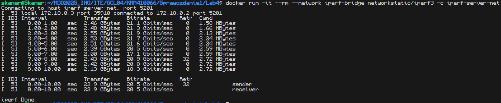

# Sprawozdanie z laboratorium 4
Celem zajęć było zapoznanie się ze sposobami przenoszenia danych pomiędzy kontenerami, oraz ze sposobami zarządzania sieciami.

Wykonanie ćwiczeń rozpocząłem od przygotowania 2 woluminów do przechowywania kodu, oraz zbudowanej plikacji.  
`docker volume create vol_in`  
`docker volume create vol_out`  

Następnie w celu umieszczenia kodu w woluminie `vol_in` użyłem obrazu `alpine/git` pozwalającego na uruchamianie poleceń git-a.  
`docker run -v vol_in:/input alpine/git:latest clone https://github.com/SkaneroOo/kagikachi /input`

Po sklonowaniu kodu do voluminu wejściowego, uruchomiłem w trybie interaktywnym kontener zawierający narzędzia do budowania kodu rusta z 2 podłączonymi woluminami.  
`docker run --rm --tty --interactive -v vol_in:/input -v vol_out:/output rust:1.85.0-slim`
Wewnątrz kontenera wywołałem następujące polecenia.
```sh
mkdir build_dir
cp -r /input/* /build_dir/
cd build_dir/
cargo build --release
cp target/release/kagikachi /output/
```
W efekcie otrzymałem wolumin zawierający gotowy do uruchomienia plik binarny mojej aplikacji.

Zautomatyzowanie z wykorzystaniem woluminów nie jest możliwe, ponieważ docker nie pozwala na podłączenie woluminów do kontenera podczas budowania. Można by to jedynie zrobić korzystając z systemu plików użytkownika, przenosząc pliki za pomocą polecenia `COPY`, albo dołączając katalogi za pomocą `RUN --mount`.

<hr>

W celu zapoznania się z sieciami w dockerze korzystaliśmy z aplikacji iperf3.  

Na początku utworzyłem kontener zawierający iperf3 uruchomiony jako serwer z udostępnionym na zewnątrz kontenera portem 5201.  
`docker run -d --name iperf-server -p 5201:5201 networkstatic/iperf3 -s`  

Następnie, aby sprawdzić poprawność działania utworzyłem drugi kontener z iperf3 w trybie klienta i podałem mu adres pod którym znajduje się serwer.  
Adres IP serwera znalazłem w polu `IPAddress` w szczegółach kontenera.  
`docker run -it --rm networkstatic/iperf3 -c 172.17.0.2 -p 5201`  
W efekcie zobaczyłem w konsoli poniższe logi.


Następnie utworzyłem w dockerze sieć i uruchomiłem w niej zarówno serwer, jak i klienta. Dzięki temu nie musiałem sprawdzać adresu IP serwera, a jedynie podałem nazwę kontenera, w którym serwer działa.
`docker network create -d bridge iperf-bridge`  
`docker run -d --name iperf-server-net --network iperf-bridge networkstatic/iperf3 -s`  
`docker run -it --rm --network iperf-bridge networkstatic/iperf3 -c iperf-server-net`  
Dostałem analogiczne wyniki.  


<hr>
W ostatniej części ćwiczeń mieliśmy za zadanie uruchomić w dockerze Jenkinsa.  
W tym celu wykonałem kroki zgodnie z instrukcją podaną na stronie Jenkinsa.

Zacząłem od utworzenia potrzebnej sieci  
`docker network create jenkins`  

Następnie uruchomiłem w utworzonej sieci obraz Docker in Docker mający za zadanie umożliwić Jenkinsowi wywoływanie poleceń Dockera działając wewnątrz Dockera.
```sh
docker run --name jenkins-docker --rm --detach \
  --privileged --network jenkins --network-alias docker \
  --env DOCKER_TLS_CERTDIR=/certs \
  --volume jenkins-docker-certs:/certs/client \
  --volume jenkins-data:/var/jenkins_home \
  --publish 2376:2376 \
  docker:dind --storage-driver overlay2
```

Utworzyłem Dockerfile przygotowujący środowisko dla Jenkinsa  
```dockerfile
FROM jenkins/jenkins:2.492.2-jdk17
USER root
RUN apt-get update && apt-get install -y lsb-release ca-certificates curl && \
    install -m 0755 -d /etc/apt/keyrings && \
    curl -fsSL https://download.docker.com/linux/debian/gpg -o /etc/apt/keyrings/docker.asc && \
    chmod a+r /etc/apt/keyrings/docker.asc && \
    echo "deb [arch=$(dpkg --print-architecture) signed-by=/etc/apt/keyrings/docker.asc] \
    https://download.docker.com/linux/debian $(. /etc/os-release && echo \"$VERSION_CODENAME\") stable" \
    | tee /etc/apt/sources.list.d/docker.list > /dev/null && \
    apt-get update && apt-get install -y docker-ce-cli && \
    apt-get clean && rm -rf /var/lib/apt/lists/*
USER jenkins
```
Zbudowałem przygotowany obraz  
`docker build -t custom_jenkins -f Dockerfile.jenkins .`

Oraz uruchomiłem go w sieci zgodnie z instrukcją z dokumentacji.  
```sh
docker run --name jenkins --restart=on-failure --detach \
  --network jenkins --env DOCKER_HOST=tcp://docker:2376 \
  --env DOCKER_CERT_PATH=/certs/client --env DOCKER_TLS_VERIFY=1 \
  --publish 8080:8080 --publish 50000:50000 \
  --volume jenkins-data:/var/jenkins_home \
  --volume jenkins-docker-certs:/certs/client:ro \
  custom_jenkins
```

W celu weryfikacji działania obu kontenerów za pomocą polecenia `docker ps` sprawdziłem czy kontenery działają i które porty udostępniają.  


Na koniec aby sprawdzić poprawność działania Jenkinsa połączyłem się z jego serwerem spoza maszyny wirtualnej i zgodnie z oczekiwaniami zobaczyłem ekran logowania.  


W celu pozyskania hasła pozwalającego na zarządzanie Jenkinsem mogę użyć polecenia  
`docker exec jenkins cat /var/jenkins_home/secrets/initialAdminPassword`
