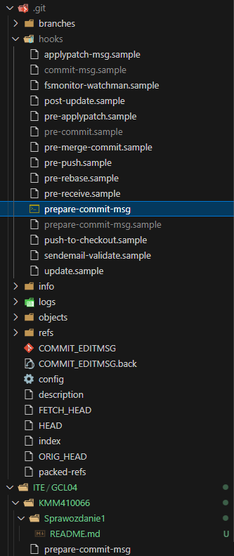

# Sprawozdanie z laboratorium 1
Celem zajęć było skonfigurowanie lokalnego środowiska pracy, polegające na sklonowaniu repozytorium z githuba i przygotowaniu hooka zapewniającego odpowiedni format wiadomości w commitach.

<hr>
Wykonanie zadania rozpocząłem od wygenerowania nowych kluczy ssh na maszynie wirtualnej i przesłania publicznego klucza na GitHub, co pozwala na autoryzację pull requestów.

Następnie sklonowałem repozytorium wykorzystując ssh, przełączyłem się na gałąź grupy, oraz utworzyłem na jej podstawie nową gałąź.

Następnie napisałem skrypt `prepare-commit-msg` dodający na początku wiadomości commita tekst `[KMM410066]: `, i umieściłem go w katalogu `.git/hooks/`.

Ponieważ gałąź na której pracuję nazywa się `KMM410066`, postanowiłem to wykorzystać i przygotować uniwersalny kod wstawiający do wiadomości nazwę gałęzi.

```sh
branch_name=$(git symbolic-ref --short HEAD)

sed -i.back "1s/^/[$branch_name]: /" $1
```



