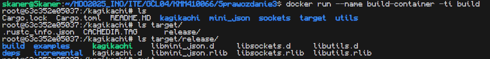

# Sprawozdanie z laboratorium 1
Celem zajęć było skonfigurowanie lokalnego środowiska pracy, polegające na sklonowaniu repozytorium z githuba i przygotowaniu hooka zapewniającego odpowiedni format wiadomości w commitach.

<hr>
Wykonanie zadania rozpocząłem od wygenerowania nowych kluczy ssh na maszynie wirtualnej i przesłania publicznego klucza na GitHub, co pozwala na autoryzację pull requestów.

Następnie sklonowałem repozytorium wykorzystując ssh, przełączyłem się na gałąź grupy, oraz utworzyłem na jej podstawie nową gałąź.

Następnie napisałem skrypt `prepare-commit-msg` dodający na początku wiadomości commita tekst `[KMM410066]: `, i umieściłem go w katalogu `.git/hooks/`.

Ponieważ gałąź na której pracuję nazywa się `KMM410066`, postanowiłem to wykorzystać i przygotować uniwersalny kod wstawiający do wiadomości nazwę gałęzi.

```sh
branch_name=$(git symbolic-ref --short HEAD)

sed -i.back "1s/^/[$branch_name]: /" $1
```


<hr><hr>

# Sprawozdanie z laboratorium 2
Celem zajęć była instalacja i zapoznanie się z programem Docker.

Wykonanie zadań zacząłem od instalacji Dockera z repozytorium `apt`.  
Aby zweryfikować poprawność instalacji użyłem polecenia `docker run hello-world`

W celu przygotowania do kolejnych części ćwiczenia pobrałem obrazy `busybox`, `ubuntu`, oraz `mysql` korzystając z polecenia `docker pull <obraz>`.

<hr>

Uruchomiłem obraz busybox w zwykłym trybie, oraz interaktywnym.  
Przy noramalnym uruchomieniu, nic nie zostało wzrócone do konsoli i kontener od razu się wyłączył.  
Przy włączeniu w trybie interaktywnym, dostajemy konsolę z której możemy korzystać tam samo, jak ze zwykłej konsoli Linuxa.


Następnie za pomoca polecenia `docker run --tty --interactive ubuntu` uruchomiłem obraz `ubuntu` w trybie interaktywnym. Pomimo działania w sposób przypominający Linuxa, pierwszym procesem w kontenerze nie jest `init`, ale `bash`.


Następnie zaktualizowałem zainstalowane w kontenerze pakiety i opuściłem kontener.

<hr>

W następnej części ćwiczeń, utworzyłem prosty `Dockerfile` korzystający z najnowszej wersji obrazu `ubuntu`. Kazałem w nim zaktualizować repozytoria, zainstalować gita i pobrać swoją gałąź z repozytorium przedmiotu.

```dockerfile
FROM ubuntu:latest

RUN apt update 
RUN apt -y install git
RUN git clone -b KMM410066 https://github.com/InzynieriaOprogramowaniaAGH/MDO2025_INO.git
```


Na koniec usunąłem wszystkie kontenery i obrazy.


<hr><hr>

# Sprawozdanie z laboratorium 3
Celem zajęć było zapoznanie się ze sposobami tworzenia kontenerów przy użyciu plików `Dockerfile`.

Wykonanie zadań rozpocząłem od uruchomienia obrazu `rust` w dockerze w trybie interaktywnym, pobrania kodu z GitHuba, oraz przeprowadzenia buildu i uruchomienia testów. 
```bash
docker run --tty --interactive rust:1.85.0
# git clone https://github.com/SkaneroOo/kagikachi
# cd kagikachi
# cargo build --release
# cargo test
```


Na powyższych zrzutach ekranu widać, że wszystko zadziałało tak jak powinno i testy wykonały się bezbłędnie.  
Wyniki z testów są podzielone na 2 zrzuty ekranu, ponieważ projekt jest podzielony na 4 moduły, których testy wykonują się niezależnie od siebie i ze względu na specyfikę projektu, tylko 2 moduły posiadają zaimplementowane testy.

<hr>

Następnie, został utworzony plik `Dockerfile.build` zawierający kroki, które zostały przeprowadzone w celu przygotowania środowiska i zbudowania aplikacji.

```Dockerfile
FROM rust:1.85.0

RUN git clone https://github.com/SkaneroOo/kagikachi
WORKDIR /kagikachi

RUN cargo build --release
```

Po zbudowaniu obrazu za pomocą polecenia `docker build -t build:latest -f Dockerfile.build .` i uruchomieniu kontenera w trybie interaktywnym można potwierdzić, że obraz został zbudowany poprawnie.


Następnie utworzony został plik `Dockerfile.test` bazujący na wcześniej zbudowanym obrazie uruchamiający testy oprogramowania
```Dockerfile
FROM build:latest

RUN cargo test
```

Uruchomienie kontenera zbudowanego obrazu w trybie interaktywnym ponownie potwierdza poprawność działania obrazu.


<hr>

Aby zautomatyzować proces wdrażania kontenerów, został przygotowany plik `compose.yaml` automatyzujący proces budowania kontenerów, dodatkowo zapewniający poprawność zależności.
```yaml
services:
  build:
    image: build
    build:
      dockerfile: Dockerfile.build
  test:
    image: test
    build:
      dockerfile: Dockerfile.test
      additional_contexts:
        build: "service:build"
```
W celu zbudowania kontenerów korzystając z `compose.yaml`, należy użyć polecenia `docker compose build`.

Ponieważ `test` wymaga wcześniejszego zbudowania obrazu `build`, podajemu jako dodatkowy kontekst, że `build` pochodzi z serwisu `build`. Inaczej Docker może próbować pobrać obraz `build` z repozytoriów.

<hr>

W przypadku aplikacji użytej podczas tych zajęć, aby móc opublikować gotowy obraz jako kontener, należałoby wykonać kilka dodatkowych kroków.  
Ponieważ aplikacja jest aplikacją sieciową, należałoby otworzyć w kontenerze port pozwalający na połączenie się z tą aplikacją.  
Zbudowane pliki należałoby również przenieść do nowego kontenera, aby zmniejszyć ostateczny rozmiar kontenera.

<hr><hr>

# Sprawozdanie z laboratorium 4
Celem zajęć było zapoznanie się ze sposobami przenoszenia danych pomiędzy kontenerami, oraz ze sposobami zarządzania sieciami.

Wykonanie ćwiczeń rozpocząłem od przygotowania 2 woluminów do przechowywania kodu, oraz zbudowanej plikacji.  
`docker volume create vol_in`  
`docker volume create vol_out`  

Następnie w celu umieszczenia kodu w woluminie `vol_in` użyłem obrazu `alpine/git` pozwalającego na uruchamianie poleceń git-a.  
`docker run -v vol_in:/input alpine/git:latest clone https://github.com/SkaneroOo/kagikachi /input`

Po sklonowaniu kodu do voluminu wejściowego, uruchomiłem w trybie interaktywnym kontener zawierający narzędzia do budowania kodu rusta z 2 podłączonymi woluminami.  
`docker run --rm --tty --interactive -v vol_in:/input -v vol_out:/output rust:1.85.0-slim`
Wewnątrz kontenera wywołałem następujące polecenia.
```sh
mkdir build_dir
cp -r /input/* /build_dir/
cd build_dir/
cargo build --release
cp target/release/kagikachi /output/
```
W efekcie otrzymałem wolumin zawierający gotowy do uruchomienia plik binarny mojej aplikacji.

Zautomatyzowanie z wykorzystaniem woluminów nie jest możliwe, ponieważ docker nie pozwala na podłączenie woluminów do kontenera podczas budowania. Można by to jedynie zrobić korzystając z systemu plików użytkownika, przenosząc pliki za pomocą polecenia `COPY`, albo dołączając katalogi za pomocą `RUN --mount`.

<hr>

W celu zapoznania się z sieciami w dockerze korzystaliśmy z aplikacji iperf3.  

Na początku utworzyłem kontener zawierający iperf3 uruchomiony jako serwer z udostępnionym na zewnątrz kontenera portem 5201.  
`docker run -d --name iperf-server -p 5201:5201 networkstatic/iperf3 -s`  

Następnie, aby sprawdzić poprawność działania utworzyłem drugi kontener z iperf3 w trybie klienta i podałem mu adres pod którym znajduje się serwer.  
Adres IP serwera znalazłem w polu `IPAddress` w szczegółach kontenera.  
`docker run -it --rm networkstatic/iperf3 -c 172.17.0.2 -p 5201`  
W efekcie zobaczyłem w konsoli poniższe logi.


Następnie utworzyłem w dockerze sieć i uruchomiłem w niej zarówno serwer, jak i klienta. Dzięki temu nie musiałem sprawdzać adresu IP serwera, a jedynie podałem nazwę kontenera, w którym serwer działa.
`docker network create -d bridge iperf-bridge`  
`docker run -d --name iperf-server-net --network iperf-bridge networkstatic/iperf3 -s`  
`docker run -it --rm --network iperf-bridge networkstatic/iperf3 -c iperf-server-net`  
Dostałem analogiczne wyniki.  


<hr>
W ostatniej części ćwiczeń mieliśmy za zadanie uruchomić w dockerze Jenkinsa.  
W tym celu wykonałem kroki zgodnie z instrukcją podaną na stronie Jenkinsa.

Zacząłem od utworzenia potrzebnej sieci  
`docker network create jenkins`  

Następnie uruchomiłem w utworzonej sieci obraz Docker in Docker mający za zadanie umożliwić Jenkinsowi wywoływanie poleceń Dockera działając wewnątrz Dockera.
```sh
docker run --name jenkins-docker --rm --detach \
  --privileged --network jenkins --network-alias docker \
  --env DOCKER_TLS_CERTDIR=/certs \
  --volume jenkins-docker-certs:/certs/client \
  --volume jenkins-data:/var/jenkins_home \
  --publish 2376:2376 \
  docker:dind --storage-driver overlay2
```

Utworzyłem Dockerfile przygotowujący środowisko dla Jenkinsa  
```dockerfile
FROM jenkins/jenkins:2.492.2-jdk17
USER root
RUN apt-get update && apt-get install -y lsb-release ca-certificates curl && \
    install -m 0755 -d /etc/apt/keyrings && \
    curl -fsSL https://download.docker.com/linux/debian/gpg -o /etc/apt/keyrings/docker.asc && \
    chmod a+r /etc/apt/keyrings/docker.asc && \
    echo "deb [arch=$(dpkg --print-architecture) signed-by=/etc/apt/keyrings/docker.asc] \
    https://download.docker.com/linux/debian $(. /etc/os-release && echo \"$VERSION_CODENAME\") stable" \
    | tee /etc/apt/sources.list.d/docker.list > /dev/null && \
    apt-get update && apt-get install -y docker-ce-cli && \
    apt-get clean && rm -rf /var/lib/apt/lists/*
USER jenkins
```
Zbudowałem przygotowany obraz  
`docker build -t custom_jenkins -f Dockerfile.jenkins .`

Oraz uruchomiłem go w sieci zgodnie z instrukcją z dokumentacji.  
```sh
docker run --name jenkins --restart=on-failure --detach \
  --network jenkins --env DOCKER_HOST=tcp://docker:2376 \
  --env DOCKER_CERT_PATH=/certs/client --env DOCKER_TLS_VERIFY=1 \
  --publish 8080:8080 --publish 50000:50000 \
  --volume jenkins-data:/var/jenkins_home \
  --volume jenkins-docker-certs:/certs/client:ro \
  custom_jenkins
```

W celu weryfikacji działania obu kontenerów za pomocą polecenia `docker ps` sprawdziłem czy kontenery działają i które porty udostępniają.  


Na koniec aby sprawdzić poprawność działania Jenkinsa połączyłem się z jego serwerem spoza maszyny wirtualnej i zgodnie z oczekiwaniami zobaczyłem ekran logowania.  


W celu pozyskania hasła pozwalającego na zarządzanie Jenkinsem mogę użyć polecenia  
`docker exec jenkins cat /var/jenkins_home/secrets/initialAdminPassword`
