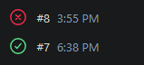
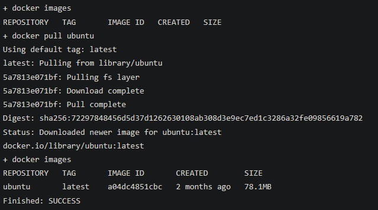
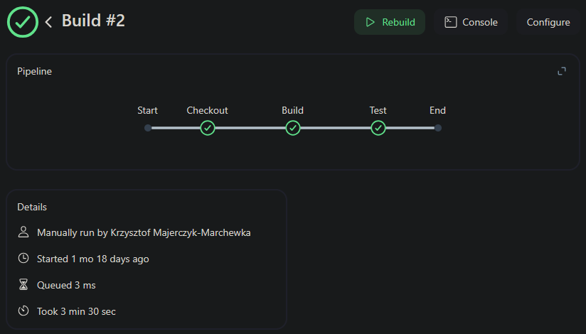

# Zajęcia 5

Wykonanie zajęć rozpocząłem od upewnienia się, że mam działające obrazy Jenkinsa, oraz DinD. Jenkins pozwala na automatyzowanie procesów zazwyczaj związanych z tworzeniem i dystrybucją oprogramowania, natomiast DinD pozwala na używanie kontenerów Dockera wewnątrz działającego kontenera.
<hr>

Pierwsza część zajęć polegała na stworzeniu prostych projektów Jenkinsa będących zwykłymi skryptami shell.

Pierwszy projekt miał za zadanie wyświetlić nazwę obecnie zalogowanego użytkownika. W tym celu w skrypcie umieściłem polecenie:
```sh
uname -a
```

Drugi projekt miał za zadanie wykonać się poprawnie gdy obecna godzina jest parzysta, oraz zwrócić błąd jeśli jest nieparzysta. Napisałem do tego poniższy skrypt.

```sh
#!/bin/bash

# Get the current hour (24-hour format)
hour=$(date +%H)

# Check if the hour is odd or even
if [ $((hour % 2)) -eq 1 ]; then
echo "Godzina jest nieparzysta"
    exit 1  # Odd hour
else
	echo "Godzina jest parzysta"
    exit 0  # Even hour
fi
```
Logi buildów potwierdzają działanie skryptu.


Ostatni projekt polegał na pobraniu obrazu kontenera `ubuntu` i zweryfikownaiu poprawności jego instalacji. Do tego napisałem poniższy skrypt:
```sh
docker images
docker pull ubuntu
docker images
```

Logi potwierdzają poprawność działania skryptu


<hr>

W drugiej części ćwiczeń mieliśmy za zadanie przygotować prosty pipeline pobierający repozytorium, przechodzący na naszą gałąż, oraz budujący obrazy do budowania i testowania wybranej aplikacji, które przygotowywaliśmy na wcześniejszych zajęciach.

W tym celu utworzyłem nowy projekt typu pipeline i napisałem poniższy skrypt:
```groovy
pipeline {
    agent any

    stages {
        
        // Stage 0: Checkout
        stage('Checkout') {
            steps {
                echo 'Cloning repo'
                // sh 'docker rmi build'
                // sh 'docker rmi test'
                sh 'rm -fr MDO2025_INO'
                sh 'git clone https://github.com/InzynieriaOprogramowaniaAGH/MDO2025_INO.git'
                dir("MDO2025_INO") {
                    sh 'git checkout KMM410066'
                }
            }
        }
        
        // Stage 1: Build
        stage('Build') {
            steps {
                echo 'Building the application...'
                dir("MDO2025_INO/ITE/GCL04/KMM410066/Sprawozdanie1/Lab3") {
                    sh 'docker build -t build:latest -f Dockerfile.build .'
                }
            }
        }

        // Stage 2: Test
        stage('Test') {
            steps {
                echo 'Running tests...'
                dir("MDO2025_INO/ITE/GCL04/KMM410066/Sprawozdanie1/Lab3") {
                    sh 'docker build -t test:latest -f Dockerfile.test .'
                }
            }
        }

    }
}
```

Pipeline wykonał się poprawnie.


<hr><hr>

# Zajęcia 6 + 7

Podczas 6 i 7 zajęć mieliśmy za zadanie przygotować Pipeline budujący naszą aplikację, sprawdzający jej faktyczne działanie, oraz publikujący aplikację w odpowiedni sposób.  
W przypadku aplikacji którą wybrałem, publikacja aplikacji polegała na przygotowaniu obrazu z minimalnym systemem, oraz zbudowanym plikiem binarnym aplikacji, oraz umieszczeniu go na platformie DockerHub.

Skrypt który do tego przygotowałem znajduje się w pliku Jenkinsfile i składa się z 4 kroków:
- Checkout  
Krok Checkout ma za zadanie usunąć ewentualne pozostałości po poprzednich buildach, oraz pobranie kodu aplikacji z repozytorium na GitHubie.

- Build  
Krok Build ma za zadanie zbudować aplikację, oraz zachować gotową binarkę do późniejszego użytku.  
Ze względu na prostotę budowy aplikacji, zdecydowałem się nie tworzyć pliku Dockerfile, tylko kontrolować kontener z poziomu pipelinu.

- Deploy  
Krok Deploy polega na zbudowaniu obrazu zawierającego minimalny system i wcześniej zbudowany plik binarny, oraz przetestowaniu działania aplikacji łącząc się z kontenerem z zewnątrz.  
Instrukcje do budowy obrazu znajdują się w pliku Dockerfile.

- Publish  
Krok Publish polega na zalogowaniu się do DockerHuba za pomocą danych przekazanych w ustawieniach Jenkinsa, oraz na przesłaniu na DockerHub zbudowanego i przetestowanego obrazu aplikacji.


W celu usunięcia wszelkich pozostałości po procesie budowania plikacji został zdefiniowany dodatkowy hook uruchamiający się zawsze na koniec pipelinu, niezależnie czy poprzednie kroki się powiodły, czy nie, mający na celu usunięcie wszystkich pobranych i utworzonych plików.

Wszystkie pliki potrzebne do działania pipelinu zostały umieszczone w oddzielnym [repozytorium](https://github.com/SkaneroOo/kagikachi_cicd).  