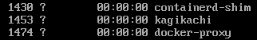

# Sprawozdanie z laboratorium 3
Celem zajęć było zapoznanie się ze sposobami tworzenia kontenerów przy użyciu plików `Dockerfile`.

Wykonanie zadań rozpocząłem od uruchomienia obrazu `Ubuntu` w dockerze, manualnego przygotowania systemu, pobrania [przykładowego kodu](https://github.com/SkaneroOo/kagikachi) z GitHuba, oraz przeprowadzenia buildu i uruchomienia testów. 


Na powyższych zrzutach ekranu widać, że wszystko zadziałało tak jak powinno i testy wykonały się bezbłędnie.  
Wyniki z testów są podzielone na 2 zrzuty ekranu, ponieważ projekt jest podzielony na 4 moduły, których testy wykonują się niezależnie od siebie i ze względu na specyfikę projektu, tylko 2 moduły posiadają zaimplementowane testy.

<hr>

Następnie, został utworzony plik `Dockerfile.build` zawierający kroki, które zostały przeprowadzone w celu przygotowania środowiska i zbudowania aplikacji.

```Dockerfile
FROM rust:1.85.0

RUN git clone https://github.com/SkaneroOo/kagikachi
WORKDIR /kagikachi

RUN cargo build --release
```

Po zbudowaniu obrazu i uruchomieniu kontenera w trybie interaktywnym można potwierdzić, że obraz został zbudowany poprawnie.


Następnie utworzony został plik `Dockerfile.test` bazujący na wcześniej zbudowanym obrazie uruchamiający testy oprogramowania
```Dockerfile
FROM build:latest

RUN cargo test
```

Uruchomienie kontenera zbudowanego obrazu w trybie interaktywnym ponownie potwierdza poprawność działania obrazu.


<hr>

Aby zautomatyzować proces wdrażania kontenerów, został przygotowany plik `compose.yaml` automatyzujący proces budowania kontenerów, dodatkowo zapewniający poprawność zależności.
```yaml
services:
  build:
    image: build
    build:
      dockerfile: Dockerfile.build
  test:
    image: test
    build:
      dockerfile: Dockerfile.test
      additional_contexts:
        build: "service:build"
```
Ponieważ `test` wymaga wcześniejszego zbudowania obrazu `build`, podajemu jako dodatkowy kontekst, że `build` pochodzi z serwisu `build`. Inaczej Docker może próbować pobrać obraz `build` z repozytoriów.

<hr>

W przypadku aplikacji użytej podczas tych zajęć, aby móc opublikować gotowy obraz jako kontener, należałoby wykonać kilka dodatkowych kroków.  
Po pierwsze, gotową binarkę należałoby przenieść do innej lokalizacji, np. `/` albo `/bin`, aby umożliwić prostsze uruchomienie programu.  
Dodatkowo, ponieważ aplikacja jest aplikacją sieciową, należałoby otworzyć w kontenerze port pozwalający na połączenie się z tą aplikacją.  
W celu zmiejszenia ostatecznego rozmiaru obrazu, trzeba by również usunąć pozostałości po buildzie, oraz narzędzia, które już nie są potrzebne (`curl`, `git`, `build-essential` i toolchain rusta).