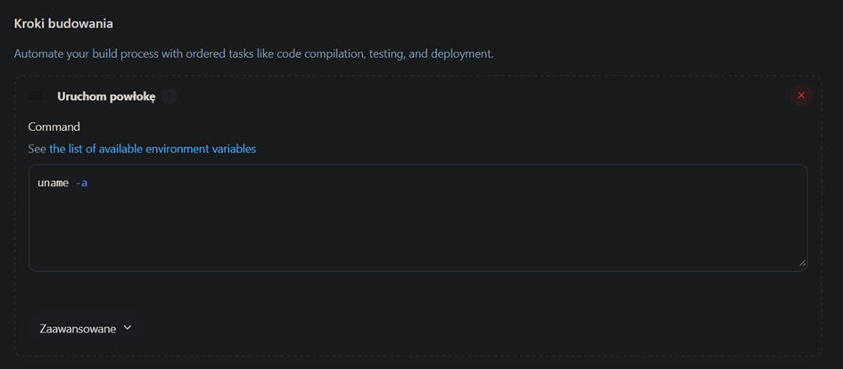
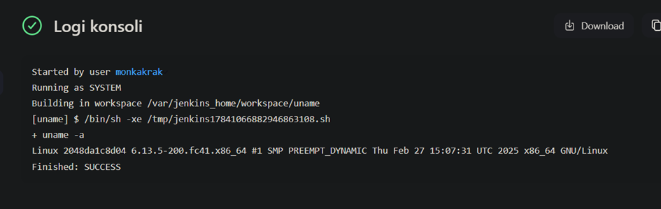
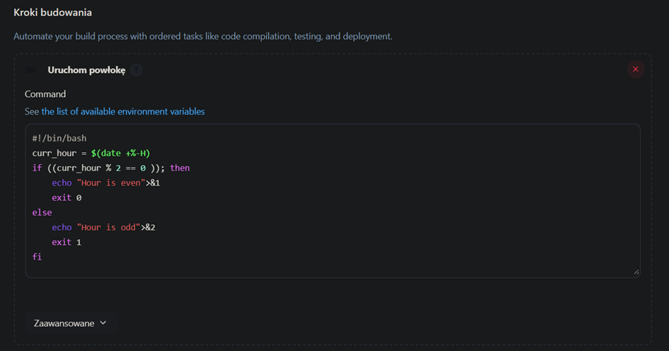
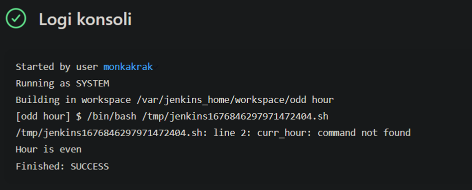
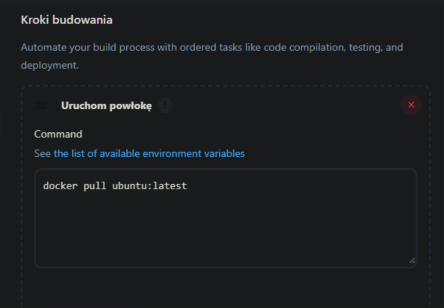
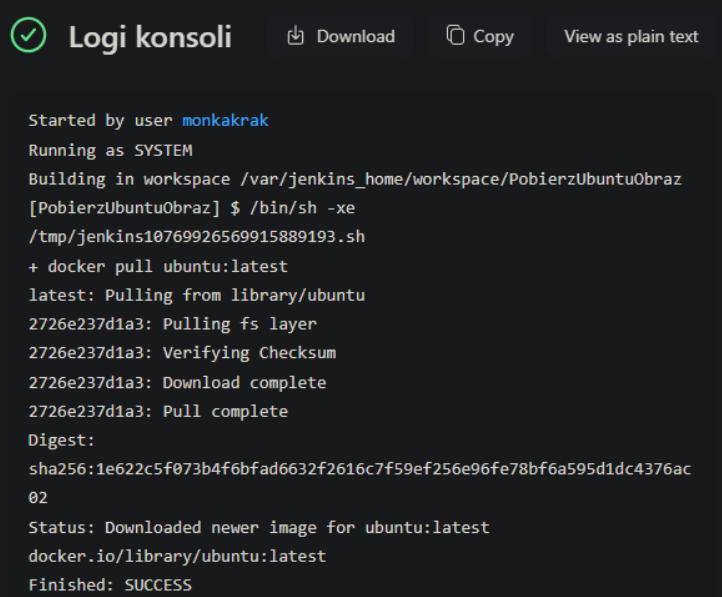
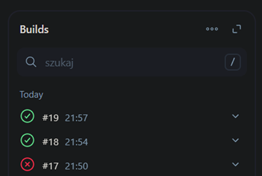
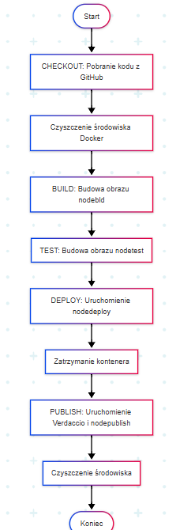
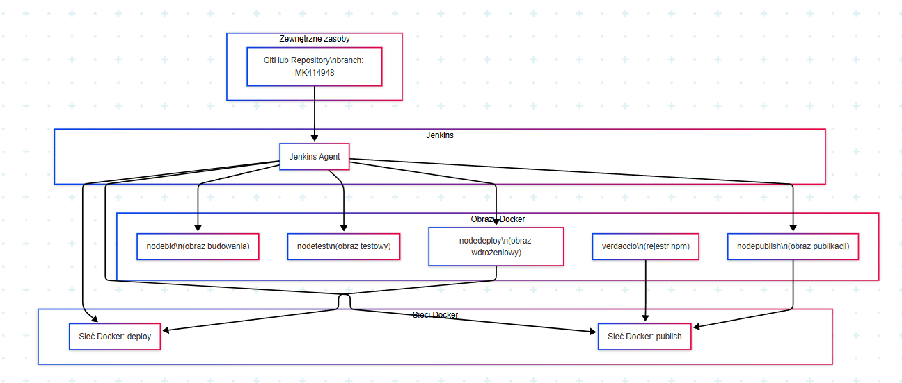

# Sprawozdanie 2

Do wykonywania zadań laboratoryjnych skorzystałam z programu "To do List", wykorzystywanego przeze mnie na poprzednich zajęciach.

Jenkins to  narzędzie do automatyzacji procesów tworzenia, testowania i wdrażania naszej aplikacji, natomiast BlueOcean to jego rozszerzenie, które daje nam bardziej nowoczensy i intuicyjny interfejs do zarządzania procesami CI/CD.


### Przygotowanie

Upewniłam się, że działają kontenery budujące i testujące, które tworzyłam na poprzednich zajęciach

Zapoznałam się z instrukcją instalacji Jenkinsa.

Pracę rozpoczęłam od utworzenia sieci dla Jenkinsa korzystając z następującego polecenia:

` docker network create jenkins `

Nastepnie uruchomiłam kontener dind (Docker-in-Docker) korzystając z gotowego obrazu:

``` docker run \
  --name jenkins-docker \
  --rm \
  --detach \
  --privileged \
  --network jenkins \
  --network-alias docker \
  --env DOCKER_TLS_CERTDIR=/certs \
  --volume jenkins-docker-certs:/certs/client \
  --volume jenkins-data:/var/jenkins_home \
  --publish 2376:2376 \
  docker:dind \
  --storage-driver overlay2 
  
  ```
 

Stworzłam Dockerfile dla własnego obrazu zawierającego Blue Ocean:

``` 
FROM jenkins/jenkins:2.440.3-jdk17
USER root
RUN apt-get update && apt-get install -y lsb-release
RUN curl -fsSLo /usr/share/keyrings/docker-archive-keyring.asc \
  https://download.docker.com/linux/debian/gpg
RUN echo "deb [arch=$(dpkg --print-architecture) \
  signed-by=/usr/share/keyrings/docker-archive-keyring.asc] \
  https://download.docker.com/linux/debian \
  $(lsb_release -cs) stable" > /etc/apt/sources.list.d/docker.list
RUN apt-get update && apt-get install -y docker-ce-cli
USER jenkins
RUN jenkins-plugin-cli --plugins "blueocean docker-workflow" 

```

Zbudowałam obraz:

docker build -t blueocean -f Blueocean.Dockerfile .

I uruchomiłam kontener:

``` 
docker run \
  --name jenkins-blueocean \
  --restart=on-failure \
  --detach \
  --network jenkins \
  --env DOCKER_HOST=tcp://docker:2376 \
  --env DOCKER_CERT_PATH=/certs/client \
  --env DOCKER_TLS_VERIFY=1 \
  --publish 8080:8080 \
  --publish 50000:50000 \
  --volume jenkins-data:/var/jenkins_home \
  --volume jenkins-docker-certs:/certs/client:ro \
  blueocean 
  
  ```

W celu przeprowadzenia konfiguracji Jenkinsa weszłam na stronę http://localhost:8080, wpisałam hasło (pozyskane zgodnie z opisem w poprzednim sprawozdaniu) i utworzyłam nowego użytkownika.


### Zadanie wstępne: uruchomienie

Rozpoczęłam pracę nad pierwszym projektem, którego celem było wyświetlenie wyniku polecenia uname. W konfiguracji projektu wybrałam opcję "Uruchomienie powłoki" i dodałam polecenie:

` uname -a `



Zrzut ekranu potwierdzający poprawne działanie projektu:



Drugi projekt miał na celu zwracanie błędu, gdy aktualna godzina jest nieparzyst. W powłoce użyłam następującego skryptu:

```

if [ $(( $(date +%H) % 2 )) -eq 1 ]; then
    echo "Godzina jest nieparzysta."
    exit 1
else
    echo "Godzina jest parzysta."
fi

```





Kolejno przeszłam do pobierania w projekcie obraz kontenera ubuntu stosując docker pull:





### Pipeline: 

Zaimplementowałam obiekt typu pipeline, który klonuje repozytorium, buduje i testuje obrazy Dockera, a następnie uruchamia aplikację i sprawdza jej działanie oraz publikuje ją w lokalnym rejestrze pakietów. Na końcu automatycznie czyści wszystkie kontenery, obrazy i pliki, żeby zostawić czyste środowisko.

Kod pipeline:

```
pipeline {
    agent any

    stages {
        stage('Checkout') {
            steps {
                sh '''
                #!/bin/bash
                docker system prune -f
                docker image prune -f
                docker container prune -f
                rm -rf ITE
                '''
                git branch: 'MK414948', url: 'https://github.com/InzynieriaOprogramowaniaAGH/MDO2025_INO.git'
            }
        }
        stage('Build') {
            steps {
                dir('ITE/GCL04/MK414948/Sprawozdanie1/pliki/Dockerfiles') {
                    script {
                        docker.build('nodebld', '-f Dockerfile.nodebld .')
                    }
                }
            }
        }
        stage('Test') {
            steps {
                dir('ITE/GCL04/MK414948/Sprawozdanie1/pliki/Dockerfiles') {
                    script {
                        docker.build('nodetest', '-f Dockerfile.nodetest .')
                    }
                }
            }
        }
        stage('Deploy') {
            steps {
                script {
                    sh 'docker network create deploy || true'

                    def node = docker.build('nodedeploy', '-f ITE/GCL04/MK414948/Sprawozdanie2/pliki/Dockerfile.nodedeploy .')
                    def container = node.run("--rm -d -p 3000:3000 --network=deploy --name node")

                    sh 'docker run --rm --network=deploy curlimages/curl:latest -L -v  http://node:3000'

                    sh "docker stop node"
                    sh 'docker network rm deploy'
                    sh 'docker rmi nodedeploy'
                }
            }
        }
        stage('Publish') {
            steps {
                script {
                    sh "docker network create publish || true"

                    sh '''
                    docker run --network=publish --name verdaccio -d -p 4873:4873 verdaccio/verdaccio || docker start verdaccio
                    '''

                    def publishImg = docker.build('nodepublish', '-f ITE/GCL04/MK414948/Sprawozdanie2/pliki/Dockerfile.nodepublish .')

                    def container = publishImg.run("--network=publish --name node")
                    sleep 5

                    sh 'docker stop node'
                    sh 'docker stop verdaccio'
                    sh "docker network rm publish"
                }
            }
        }
    }

    post {
        always {
            sh 'docker system prune -af'
            sh 'rm -rf ITE'
        }
    }
}
```



Wybrany projekt: "ToDoWebApp" bazujący na Node.js.

Pipeline składa się z następujących etapów:


### Checkout:

Czyszczenie środowiska Docker:

  usuwanie nieużywanych kontenerów- docker system prune -f
  
  usuwanie nieużywanych obrazów- docker image prune -f

  usuwanie zatrzymanych kontenerów- docker container prune -f
  
  usuwanie folderu ITE- rm -rf ITE

Pobranie kodu z repozytorium Github (gałąź MK414948)

### Build:

Budowanie obrazu Docker dla środowiska budowania- plik: Dockerfile.nodebld, obraz: nodebld (plik znajduje się w /MK414948/Sprawozdanie1/pliki/Dockerfiles)

### Test:

Budowanie obrazu Docker dla środowiska testowego- plik Dockerfile.nodetest, obraz: nodetest

### Deploy:

Tworzenie sieci Docker o nazwie "deploy"

Budowanie obrazu wdrożeniowego- plik: Dockerfile.nodedeploy, obraz: nodedeploy

Uruchomienie kontenera (port: 3000, sieć: deploy, nazwa kontenera: node)

Testowanie dostępności aplikacji za pomocą curla.

### Pubish:

Tworzenie sieci Docker "publish"

Uruchmienie serwera Verdaccio

Budowanie obrazu publikacyjnego, plik: Dockerfile.nodepublish, obraz: nodepublish

Uruchomienie kontenera w sieci publish

Zatrzymanie kontenerow i usunięcie sieci 

### Post 

Działa zawsze po zakończeniu pipeline'u niezależnie od tego, czy zakończył się sukcesem, czy nie.

Czyszczenie środowiska

Usunięcie wszystkich nieużywanych zasobów Docker- docker system prune -af 

Usunięcie katalogu projektu- rm -rf ITE

## Dokumentacja procesu CI 

Wymagania: 

Infrastruktura:

-Jenkins CI/CD Serwer

-Docker

-Repoztorium GitHub (gałąź MK414948)

-Verdaccio

Narzędzia:

-Docker

-Git

-Node.js

-Curl (do testowania)

Konfifuracja:

-Jenkinsfile

-Pliki Dockerfile:

  Dockerfile.nodebld (do etapu budowania, załączony przy poprzednim sprawozdaniu)
  
  Dockerfile.nodetest (do etapu testowania, również można go znaleźć w folderze Sprawozdanie 1)
  
  Dockerfile.nodedeploy (do etapu wdrożenia)
  
  Dockerfile.nodepublish (do etapu publikacji)

Diagram aktywności procesu CI/CD:



Diagram wdrożeniowy:



