# Sprawozdanie 3

## Laboratorium 8

Zainstalowałam drugą maszynę wirtualną z tym samym systemem operacyjnym co główna. Zmieniłam jej hostname na ansible-target i utworzyłam użytkownika o nazwie ansible. Zrobiłam migawke, sprawdziłam też w jaki sposób przeprowadzić eksport owej maszyny.

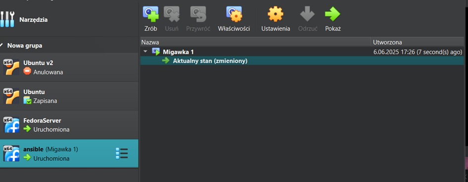

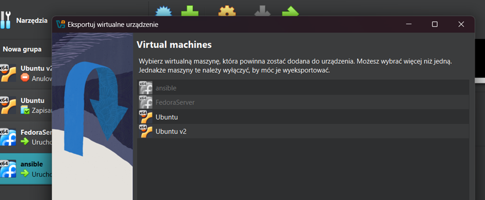

Sprawdziłam obecność programu tar i serwera OpenSSH

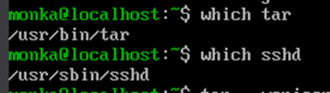

Na głównej maszynie zainstalowałam ansible.

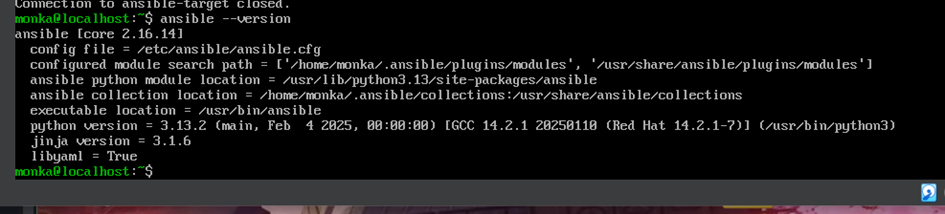

Wymieniłam klucze ssh i sprawdziłam połączenie bez hasła. 

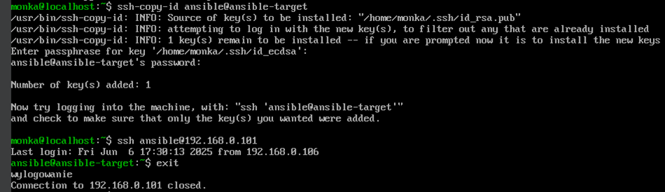

Następnie przeszłam do połączenia z użyciem nazwy hosta.

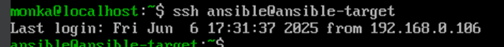

## Inwentaryzacja 

Zmieniłam nazwę hosta na glównej maszynie. 

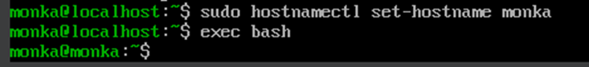

Na durgiej maszynie juz wcześniej zmieniłam ją na ansible-target, dlatego teraz taki pozostanie. Przeprwadziłam konfiguracje nazw dns w pliku /ect/hosts i sprawdziłam łączność:

Stworzyłam plik inwentaryzacji, w którym zawarłam sekcje Orchestrators oraz Endpoints:

```
all:
  children:
    orchestrators:
      hosts:
        orchestrator1:
          ansible_host: 192.168.0.105
          ansible_user: ansible

    endpoints:
      hosts:
        ansible-target:
          ansible_host: 192.168.0.105
          ansible_user: ansible

```

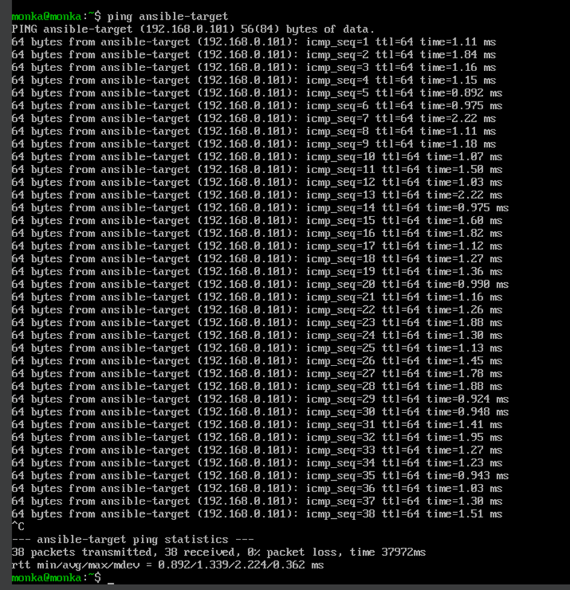

Ping do wszystkich maszy:

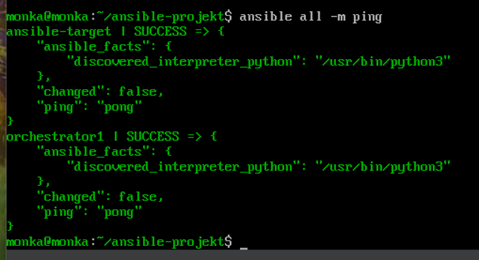

Ping jedynie do endpoints:

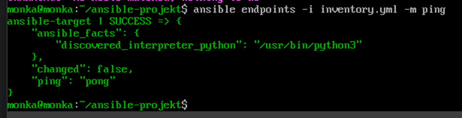

Wszystkie maszyny odpowiedziały komunikatem pong, co oznacza, że polecenie zostało nawiązane pomyślnie.

Dokonałam wymiany kluczy.

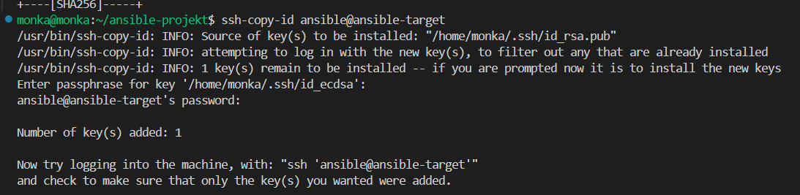

Upewniłam się, że łączność z maszyną jest możliwa bez hasła:

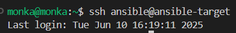

## Zdalne wykonywanie procedur

Stworzyłam playbook Ansible, który wysyła pinga do wszystkich maszyn, kopiuje plik inwentaryzacji na maszynę Endpoints. Ponawia operacje, aktualizuje pakiety, restartuje usługi sshd i rngd.

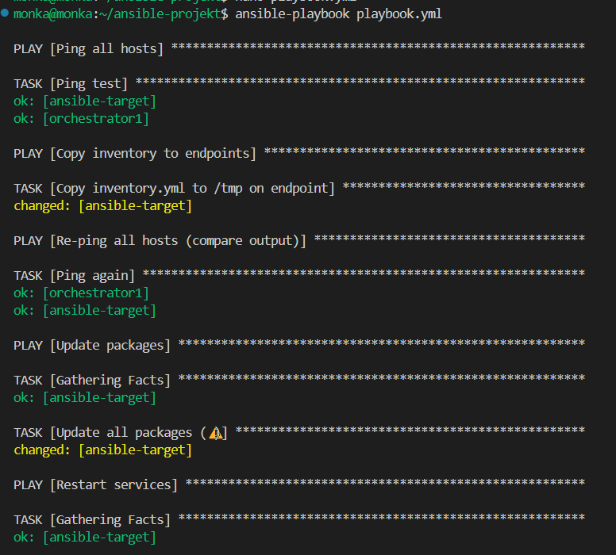
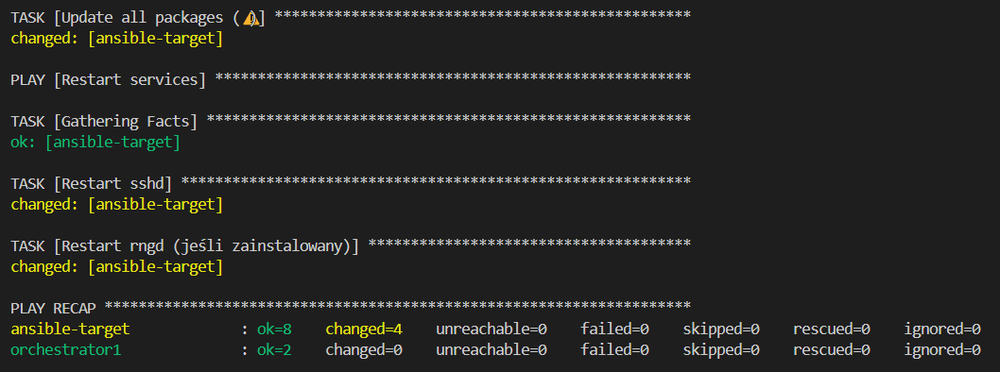

Operacja wzgłedem masyzny z wyłączonym serwerem ssh, (z odlączona kartą sieciową- proces nigdy się nie kończył):

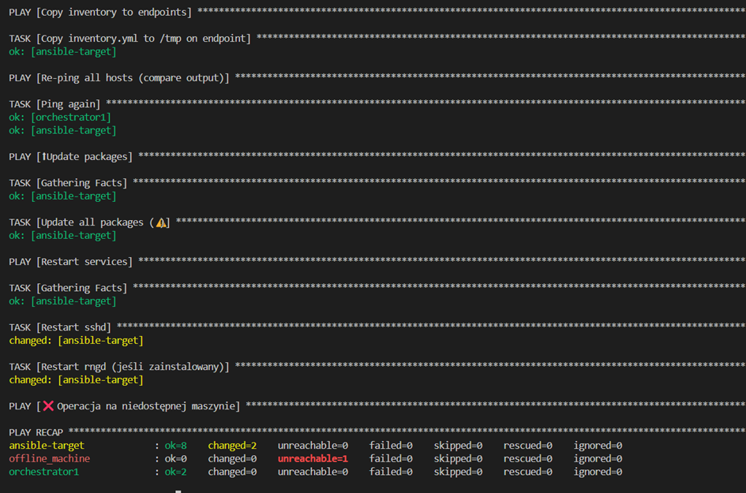

```
- name: Ping all hosts
  hosts: all
  gather_facts: no
  tasks:
    - name: Ping test
      ansible.builtin.ping:

- name: Copy inventory to endpoints
  hosts: endpoints
  gather_facts: no
  tasks:
    - name: Copy inventory.yml to /tmp on endpoint
      copy:
        src: inventory.yml
        dest: /tmp/inventory_copied.yml
        mode: '0644'

- name: Re-ping all hosts (compare output)
  hosts: all
  gather_facts: no
  tasks:
    - name: Ping again
      ansible.builtin.ping:

- name:  Update packages
  hosts: endpoints
  become: yes
  tasks:
    - name: Update all packages
      ansible.builtin.package:
        name: "*"
        state: latest

- name: Restart services
  hosts: endpoints
  become: yes
  tasks:
    - name: Restart sshd
      ansible.builtin.service:
        name: sshd
        state: restarted

    - name: Restart rngd (jeśli zainstalowany)
      ansible.builtin.service:
        name: rngd
        state: restarted
      ignore_errors: yes
```

## Zarządzanie stworzonym artefaktem 

Drugi playbook instaluje wymagane pakiety do Dockera i narzędzia, uruchamia usługę Dockera, pobiera obraz aplikacji  DockerHuba, uruchamia kontener z aplikacją i sprawdza jej dostępność za pomocą curla. 

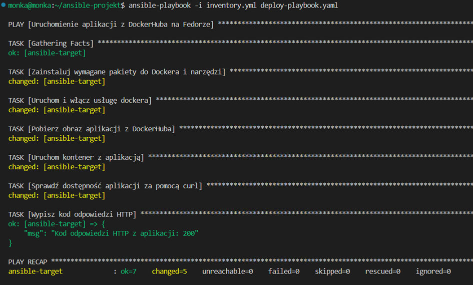

```
---
- name: Uruchomienie aplikacji z DockerHuba na Fedorze
  hosts: endpoints
  become: yes

  tasks:
    - name: Zainstaluj wymagane pakiety do Dockera i narzędzia
      dnf:
        name:
          - docker
          - docker-compose
          - nodejs
          - curl
        state: present
        update_cache: yes

    - name: Uruchom i włącz usługę dockera
      systemd:
        name: docker
        state: started
        enabled: yes

    - name: Pobierz obraz aplikacji z DockerHuba
      docker_image:
        name: monkakrakowska/nodedummy 
        source: pull

    - name: Uruchom kontener z aplikacją
      docker_container:
        name: node_dummy
        image: monkakrakowska/nodedummy 
        state: started
        restart_policy: always
        ports:
          - "3000:3000"  

    - name: Sprawdź dostępność aplikacji za pomocą curl
      shell: curl -s -o /dev/null -w "%{http_code}" http://localhost:3000
      register: curl_result

    - name: Wypisz kod odpowiedzi HTTP
      debug:
        msg: "Kod odpowiedzi HTTP z aplikacji: {{ curl_result.stdout }}"

```


Na koniec za pomocą szkieletowania ansible-galaxy wspomniane kroki zpstały ubrane w role.

Utworzono odpowiednią strukturę katalogowa umożliwiającą sensowne podzielenie kodu. 


## lab 10 i 11 
### Zaopatrzyłam się w implementację stosu k8s

### Przeprowadziłam instalację

### Pobrałam kubectl i dodałam alias

### Uruchomiłam dashboard


### Stworzyłam pojedynczy pod z nginx nasluchujacy na porcie 80


### Po przekierowaniu portu 80 na 8888 i dodaniu portu w vscodzie nginx zwraca strone startowa


### Korzystając z pliku yaml dostępnego na [stronie](https://kubernetes.io/docs/tasks/run-application/run-stateless-application-deployment/) utworzyłam deployment
```yaml
apiVersion: apps/v1
kind: Deployment
metadata:
  name: nginx-deployment
spec:
  selector:
    matchLabels:
      app: nginx
  replicas: 2
  template:
    metadata:
      labels:
        app: nginx
    spec:
      containers:
      - name: nginx
        image: nginx:1.14.2
        ports:
        - containerPort: 80
```


### Na dashboardzie widać że deployment działa


### Po przekierowaniu portu dostajemy stronę startową nginx


### Wzbogaciłam wdrożenie do 4 replik zmieniając plik .yaml
```yaml
  replicas: 4
```


### Wyeksportowałam wdrożenie jako serwis i przekierowałam do niego port

