## lab 10 i 11 
### Zaopatrzyłam się w implementację stosu k8s
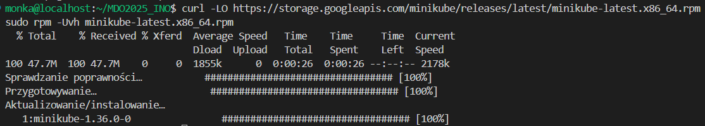
### Przeprowadziłam instalację
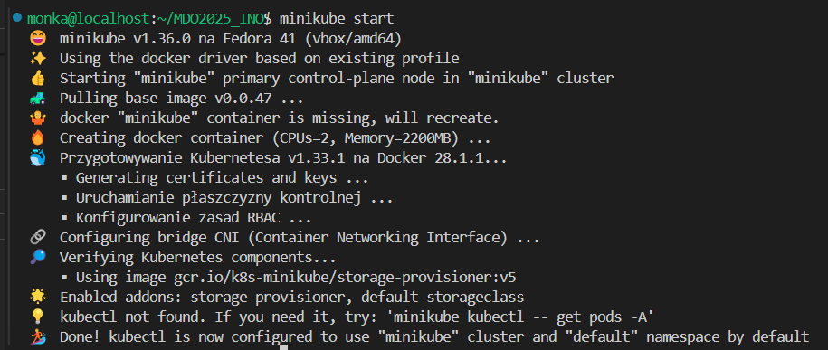
### Pobrałam kubectl i dodałam alias
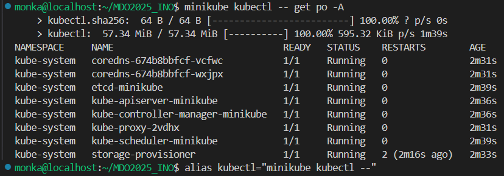
### Uruchomiłam dashboard
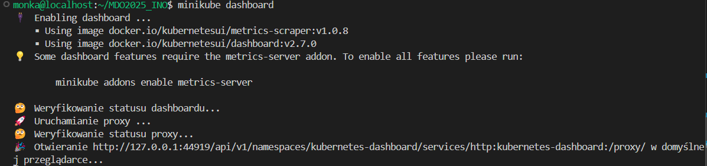
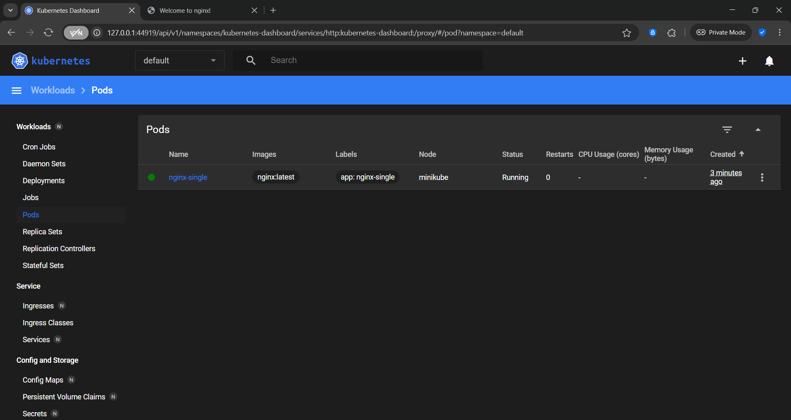

### Stworzyłam pojedynczy pod z nginx nasluchujacy na porcie 80
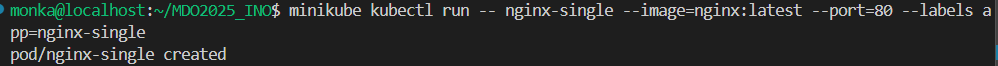

### Po przekierowaniu portu 80 na 8888 i dodaniu portu w vscodzie nginx zwraca strone startowa
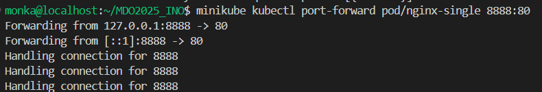
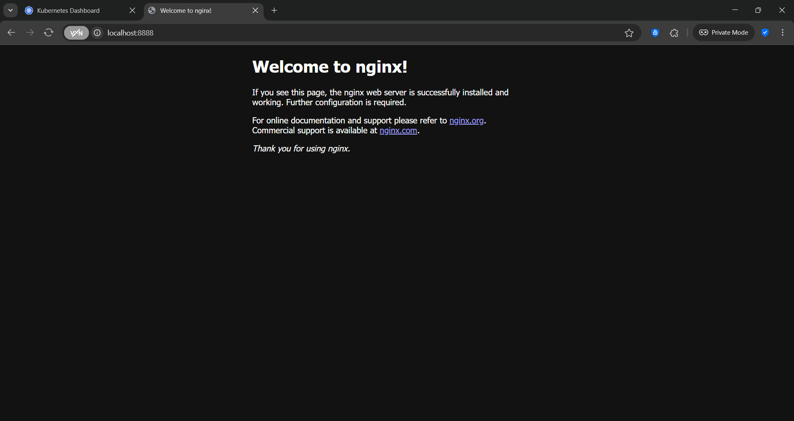

### Korzystając z pliku yaml dostępnego na [stronie](https://kubernetes.io/docs/tasks/run-application/run-stateless-application-deployment/) utworzyłam deployment
```yaml
apiVersion: apps/v1
kind: Deployment
metadata:
  name: nginx-deployment
spec:
  selector:
    matchLabels:
      app: nginx
  replicas: 2
  template:
    metadata:
      labels:
        app: nginx
    spec:
      containers:
      - name: nginx
        image: nginx:1.14.2
        ports:
        - containerPort: 80
```
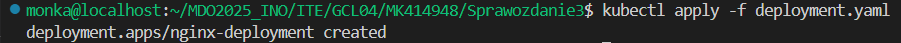

### Na dashboardzie widać że deployment działa
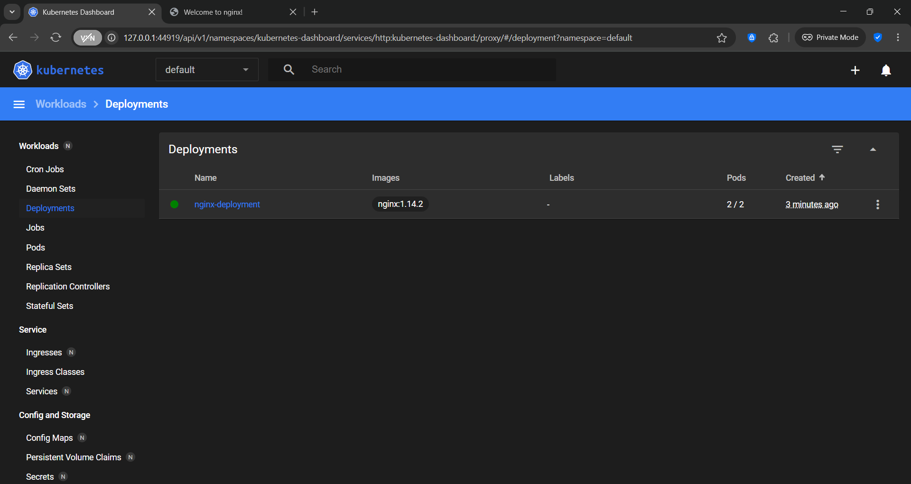

### Po przekierowaniu portu dostajemy stronę startową nginx
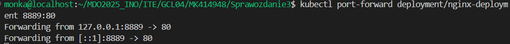
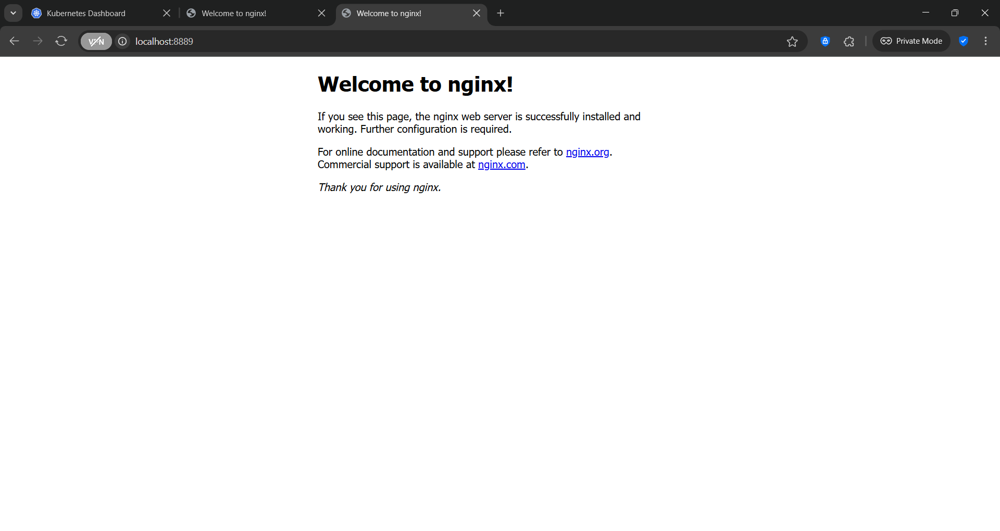

### Wzbogaciłam wdrożenie do 4 replik zmieniając plik .yaml
```yaml
  replicas: 4
```
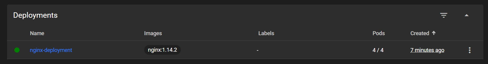

### Wyeksportowałam wdrożenie jako serwis i przekierowałam do niego port
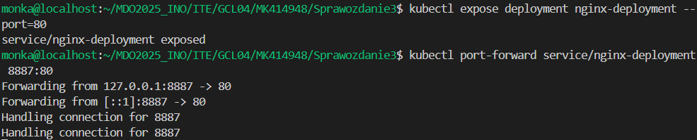
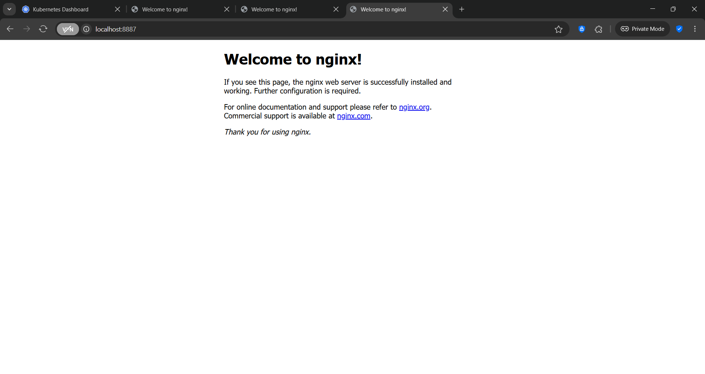