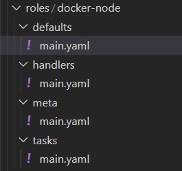
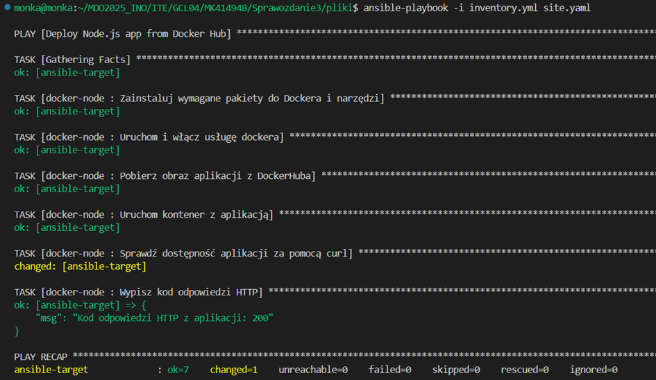
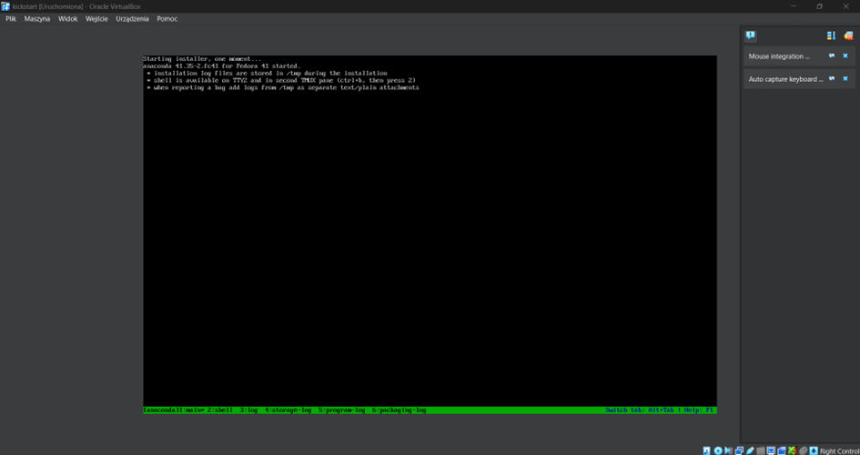
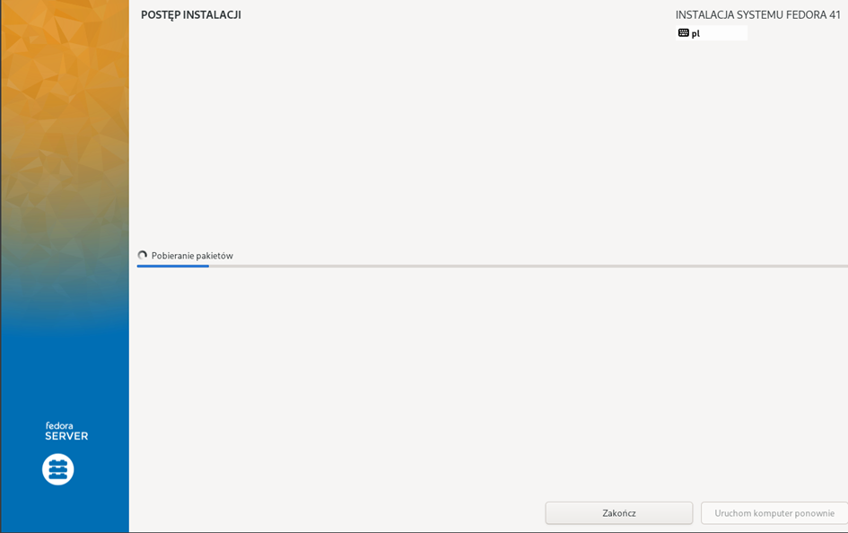
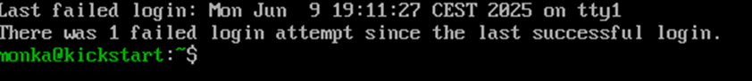
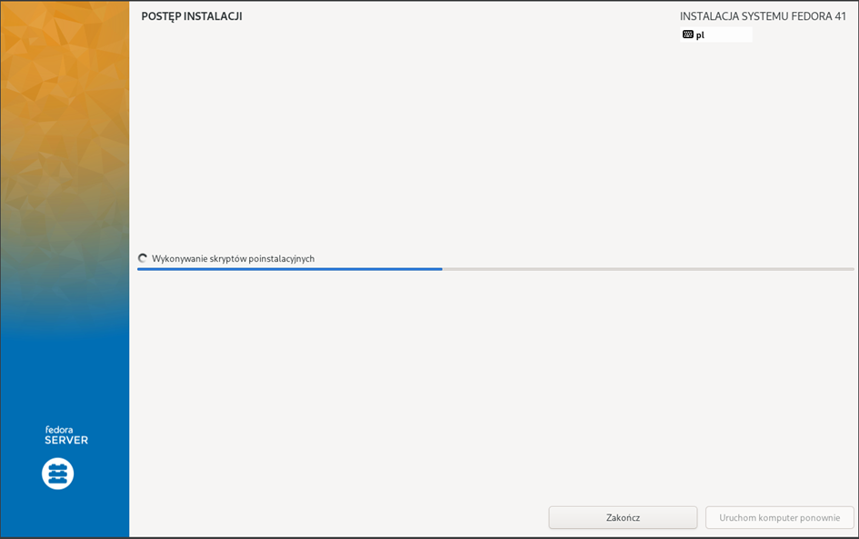
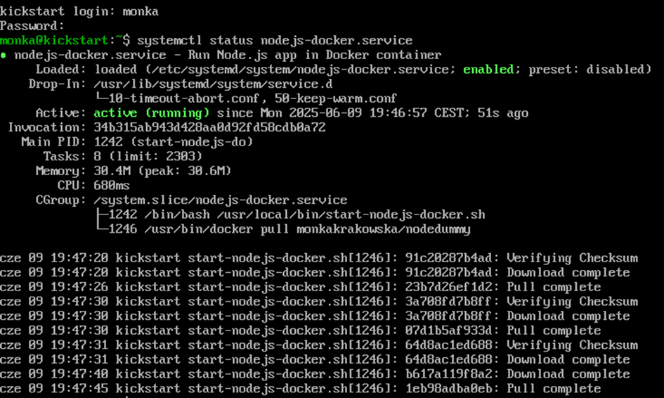
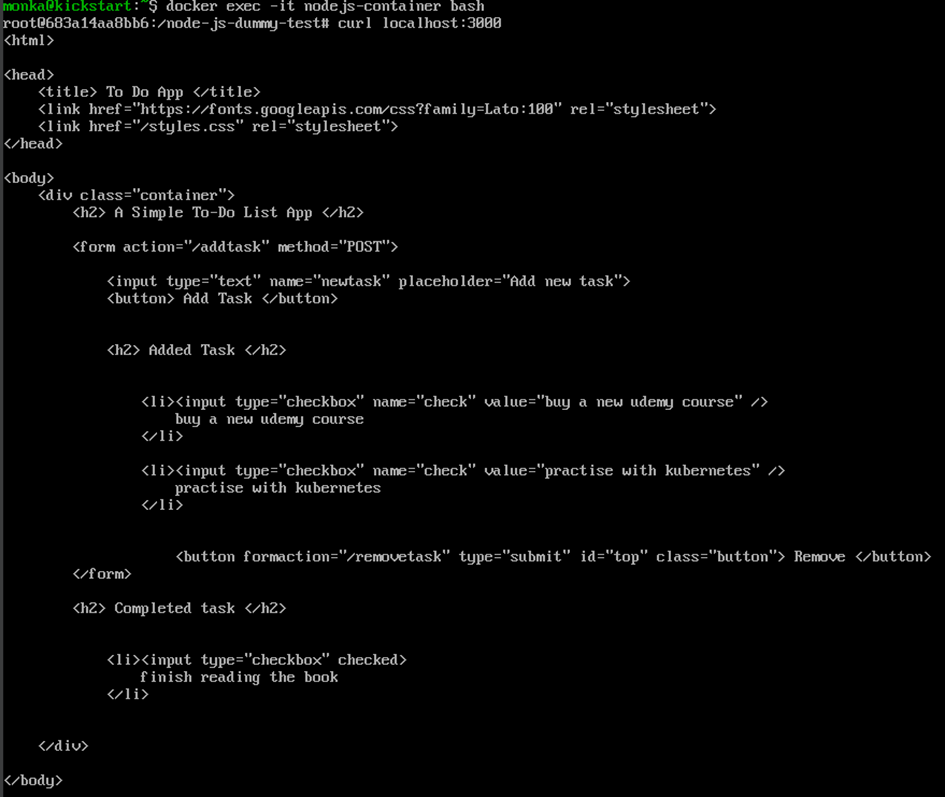

# Sprawozdanie 3

## Laboratorium 8

Zainstalowałam drugą maszynę wirtualną z tym samym systemem operacyjnym co główna. Zmieniłam jej hostname na ansible-target i utworzyłam użytkownika o nazwie ansible. Zrobiłam migawke, sprawdziłam też w jaki sposób przeprowadzić eksport owej maszyny.


Sprawdziłam obecność programu tar i serwera OpenSSH


Na głównej maszynie zainstalowałam ansible.


Wymieniłam klucze ssh i sprawdziłam połączenie bez hasła. 


Następnie przeszłam do połączenia z użyciem nazwy hosta.


## Inwentaryzacja 

Zmieniłam nazwę hosta na glównej maszynie. 


Na durgiej maszynie juz wcześniej zmieniłam ją na ansible-target, dlatego teraz taki pozostanie. Przeprwadziłam konfiguracje nazw dns w pliku /ect/hosts i sprawdziłam łączność:

Stworzyłam plik inwentaryzacji, w którym zawarłam sekcje Orchestrators oraz Endpoints:

```yaml
all:
  children:
    orchestrators:
      hosts:
        orchestrator1:
          ansible_host: 192.168.0.105
          ansible_user: ansible

    endpoints:
      hosts:
        ansible-target:
          ansible_host: 192.168.0.105
          ansible_user: ansible

```


Ping do wszystkich maszy:


Ping jedynie do endpoints:


Wszystkie maszyny odpowiedziały komunikatem pong, co oznacza, że polecenie zostało nawiązane pomyślnie.

Dokonałam wymiany kluczy.


Upewniłam się, że łączność z maszyną jest możliwa bez hasła:


## Zdalne wykonywanie procedur

Stworzyłam playbook Ansible, który wysyła pinga do wszystkich maszyn, kopiuje plik inwentaryzacji na maszynę Endpoints. Ponawia operacje, aktualizuje pakiety, restartuje usługi sshd i rngd.


Operacja wzgłedem masyzny z wyłączonym serwerem ssh, (z odlączona kartą sieciową- proces nigdy się nie kończył):


```yaml
- name: Ping all hosts
  hosts: all
  gather_facts: no
  tasks:
    - name: Ping test
      ansible.builtin.ping:

- name: Copy inventory to endpoints
  hosts: endpoints
  gather_facts: no
  tasks:
    - name: Copy inventory.yml to /tmp on endpoint
      copy:
        src: inventory.yml
        dest: /tmp/inventory_copied.yml
        mode: '0644'

- name: Re-ping all hosts (compare output)
  hosts: all
  gather_facts: no
  tasks:
    - name: Ping again
      ansible.builtin.ping:

- name:  Update packages
  hosts: endpoints
  become: yes
  tasks:
    - name: Update all packages
      ansible.builtin.package:
        name: "*"
        state: latest

- name: Restart services
  hosts: endpoints
  become: yes
  tasks:
    - name: Restart sshd
      ansible.builtin.service:
        name: sshd
        state: restarted

    - name: Restart rngd (jeśli zainstalowany)
      ansible.builtin.service:
        name: rngd
        state: restarted
      ignore_errors: yes
```

## Zarządzanie stworzonym artefaktem 

Drugi playbook instaluje wymagane pakiety do Dockera i narzędzia, uruchamia usługę Dockera, pobiera obraz aplikacji  DockerHuba, uruchamia kontener z aplikacją i sprawdza jej dostępność za pomocą curla. 


```yaml
---
- name: Uruchomienie aplikacji z DockerHuba na Fedorze
  hosts: endpoints
  become: yes

  tasks:
    - name: Zainstaluj wymagane pakiety do Dockera i narzędzia
      dnf:
        name:
          - docker
          - docker-compose
          - nodejs
          - curl
        state: present
        update_cache: yes

    - name: Uruchom i włącz usługę dockera
      systemd:
        name: docker
        state: started
        enabled: yes

    - name: Pobierz obraz aplikacji z DockerHuba
      docker_image:
        name: monkakrakowska/nodedummy 
        source: pull

    - name: Uruchom kontener z aplikacją
      docker_container:
        name: node_dummy
        image: monkakrakowska/nodedummy 
        state: started
        restart_policy: always
        ports:
          - "3000:3000"  

    - name: Sprawdź dostępność aplikacji za pomocą curl
      shell: curl -s -o /dev/null -w "%{http_code}" http://localhost:3000
      register: curl_result

    - name: Wypisz kod odpowiedzi HTTP
      debug:
        msg: "Kod odpowiedzi HTTP z aplikacji: {{ curl_result.stdout }}"

```


Na koniec za pomocą szkieletowania ansible-galaxy wspomniane kroki ubrałam w role.

Utworzono odpowiednią strukturę katalogowa umożliwiającą sensowne podzielenie kodu. 





## Laboratorium 9 

Pracę rozpoczełam od instalacji systemu Fedora. Po zakończonej instalacji, znalazłam wygenerowany automatycznie plik odpowiedzi anaconda-ks.cfg. Zostanie on wykorzystany do stworzenia maszyny wzorcowej, co ułatwi nam proces instalacji.

Nazwa hostname została zmieniona na kickstart, a plik Kickstart został nastepująco zmodyfikowany:

```
# Generated by Anaconda 41.35
# Generated by pykickstart v3.58
#version=DEVEL

# Keyboard layouts
keyboard --vckeymap=pl --xlayouts='pl'
# System language
lang pl_PL.UTF-8

# Network information
network  --bootproto=dhcp --device=enp0s3 --ipv6=auto --activate
network  --hostname=kickstart

%packages
@^server-product-environment

%end

# Run the Setup Agent on first boot
firstboot --enable

url --mirrorlist=http://mirrors.fedoraproject.org/mirrorlist?repo=fedora-41&arch=x86_64
repo --name=update --mirrorlist=http://mirrors.fedoraproject.org/mirrorlist?repo=updates-released-f41&arch=x86_64

# Generated using Blivet version 3.11.0
ignoredisk --only-use=sda
autopart
# Partition clearing information
clearpart --none --initlabel

# System timezone
timezone Europe/Warsaw --utc

#Root password
rootpw root --plaintext
user --groups=wheel --name=monka --password=zaq1@WSX --plaintext --gecos="monka"

reboot
```
Użyłam powyższego pliku odpowiedzi do stworzenia nowej maszyny wirtualnej zgodnie z zapisanymi w niej ustawieniami.  





W drugim kroku stworzyłam nowy plik ks2.cfg, który zautomatyzuje nam uruchomienie aplikacji Node.js w kontenerze Docker na systemie Fedora. Po instalacji systemu tworzony jest skrypt, który czeka na dostępność usługi Docker, pobiera najnowszy obraz monkakrakowska/nodedummy, zatrzymuje ewentualnie działający kontener o tej samej nazwie i uruchamia nowy na porcie 3000. 

```
# Generated by Anaconda 41.35
# Generated by pykickstart v3.58
#version=DEVEL

# Keyboard layouts
keyboard --vckeymap=pl --xlayouts='pl'
# System language
lang pl_PL.UTF-8

# Network information
network  --bootproto=dhcp --device=enp0s3 --ipv6=auto --activate
network  --hostname=kickstart

%packages
@^server-product-environment
docker
curl
%end

# Run the Setup Agent on first boot
firstboot --enable

url --mirrorlist=http://mirrors.fedoraproject.org/mirrorlist?repo=fedora-41&arch=x86_64
repo --name=update --mirrorlist=http://mirrors.fedoraproject.org/mirrorlist?repo=updates-released-f41&arch=x86_64

# Generated using Blivet version 3.11.0
ignoredisk --only-use=sda
autopart
# Partition clearing information
clearpart --none --initlabel

# System timezone
timezone Europe/Warsaw --utc

#Root password
rootpw root --plaintext
user --groups=wheel --name=monka --password=zaq1@WSX --plaintext --gecos="monka"

%post --log=/root/ks-post.log --interpreter=/bin/bash

# docker
systemctl enable docker
usermod -aG docker monka

cat > /usr/local/bin/start-nodejs-docker.sh << 'EOF'
#!/bin/bash
# Czekaj aż docker będzie aktywny
while ! systemctl is-active --quiet docker; do
  sleep 1
done

# Pobierz najnowszy obraz
/usr/bin/docker pull monkakrakowska/nodedummy

# Uruchom kontener (jeśli jest już uruchomiony, zatrzymaj go najpierw)
if /usr/bin/docker ps -q -f name=nodejs-container; then
  /usr/bin/docker stop nodejs-container
fi

/usr/bin/docker run --rm --name nodejs-container -p 3000:3000 monkakrakowska/nodedummy
EOF

# Nadaj uprawnienia wykonywalne
chmod +x /usr/local/bin/start-nodejs-docker.sh

# service
cat > /etc/systemd/system/nodejs-docker.service << 'EOF'
[Unit]
Description=Run Node.js app in Docker container
After=docker.service
Requires=docker.service

[Service]
Restart=always
ExecStart=/usr/local/bin/start-nodejs-docker.sh

[Install]
WantedBy=multi-user.target
EOF

systemctl enable nodejs-docker.service
%end

reboot
```




Udało się.


## Laboratoria 10 i 11 

Rozpoczęłam od zaopatrzenia się w implementację stosu k8s


Przeprowadziłam instalację


Pobrałam kubectl i dodałam alias


 Uruchomiłam dashboard


Stworzyłam pojedynczy pod z nginx nasluchujacy na porcie 80


 Po przekierowaniu portu 80 na 8888 i dodaniu portu w vscodzie nginx zwraca strone startowa


 Korzystając z pliku yaml dostępnego na [stronie](https://kubernetes.io/docs/tasks/run-application/run-stateless-application-deployment/) utworzyłam deployment

```yaml
apiVersion: apps/v1
kind: Deployment
metadata:
  name: nginx-deployment
spec:
  selector:
    matchLabels:
      app: nginx
  replicas: 2
  template:
    metadata:
      labels:
        app: nginx
    spec:
      containers:
      - name: nginx
        image: nginx:1.14.2
        ports:
        - containerPort: 80
```


Na dashboardzie widać że deployment działa


Po przekierowaniu portu dostajemy stronę startową nginx


Wzbogaciłam wdrożenie do 4 replik zmieniając plik .yaml
```yaml
  replicas: 4
```


Wyeksportowałam wdrożenie jako serwis i przekierowałam do niego port


Podczas realizacji ćwiczeń można było nauczyć się praktycznego wykorzystania narzędzi automatyzujących zarządzanie infrastrukturą, takich jak Ansible, Docker i Kubernetes. Sprawdziliśmy, jak konfigurować środowiska wirtualne, zarządzać nimi bezhasłowo, a także automatyzować instalację systemu za pomocą Kickstarta. Całość pozwoliła lepiej zrozumieć zasady działania nowoczesnych procesów DevOps i ich praktyczne zastosowanie.