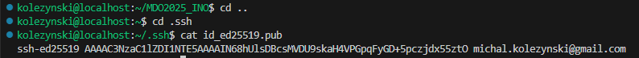

# Zajęcia 1 - Wprowadzenie, Git, Gałęzie, SSH


Na wirtualnej maszynie (VM) obsługującej Fedora 41 Server zainstalowano git oraz obsługę ssh. W tym celu potrzebne są komendy
```sh
sudo dnf install git-all
sudo apt install openssh-server
```
Po wykonaniu komend, można uwierzytelnić, że instalcja zaszła poprawnie, poprzez
```sh
git --version
ssh -V
```


Wygenerowano klucze ssh poprzez
```sh
ssh-keygen -t ed25519 -C "kolezynski@student.agh.edu.pl"
```
po czym zapisano klucze w bezpieczne miejsce, przy czym klucz publiczny znajduje się w plikue id_ed25519.pub.

 

Dodano klucz SSH do github.


Sklonowano repozytorium z wykorzystaniem protokołu ssh poprzez
```sh
git clone git@github.com:InzynieriaOprogramowaniaAGH/MDO2025_INO.git
```
przy czym uwierzytelniono połączenie ssh poprzez zawartość pliku z publicznym kluczem id_ed25519.pub. Tym sposobem sklonowano repozytorium na VM. Dodatkowo, połączono się przez ssh z VM poprzez Visual Studio Code dla ułatwienia pracy. Z pomocą VSC utworzono poprzez branch oraz katalog o nazwie MK415983 (w którym obecnie znajduje się sprawozdanie).


Utworzono git hook [commit-msg](commit-msg), który weryfikuje, że wiadomość commita zaczyna się od MK415983.
```
COMMIT_MSG_FILE=$1
PREFIX="MK415983"

COMMIT_MSG=$(cat "$COMMIT_MSG_FILE")

if [[ ! "$COMMIT_MSG" =~ ^$PREFIX ]]; then
    echo "Error: Commit message must start with '$PREFIX'."
    exit 1
fi

exit 0
```
Wykonano commit z poprawną wiadomością a następnie 
```sh
git push
```


Pull request zostanie wykonany na koniec części drugiej.

# Zajęcia 2 - Git, Docker

Na VM zainstalowano Docker za pomocą
```sh
sudo dnf install docker
```


oraz zarejestrowano się w Docker Hub. Kolejno pobrano obrazy

```
sudo docker pull <nazwa obrazu>
```


Na start włączono kontener obrazu busybox wprost poprzez
```sh
sudo docker run busybox
```
po czym kontener prawie natychmaist kończy pracę. Komendą
```sh
sudo docker pps -a
```
można sprawdzić wszystkie kontenery, a opcja -a również wyświetla kontenery, które ostatnio zakończyły pracę.


Aby kontener natychmiast nie zatrzymał pracy, włączono go w trybie interaktywnym za pomocą
```
sudo docker run --tty --interactive busybox
```

i sprawdzono wersję busybox.


Uruchomiono również Fedora w kontenerze
```sh
sudo docker run --tty --interactive fedora
```
oraz doinstalowano brakujący procps
```sh
dnf install procps -y
```
aby móc wywołać:
```sh
ps
```
Na hoscie procesy dockera to:


podczas gdy procesy w kontenerze to:


PID1 to terminal bash.

Zaktualizowano pakiety Fedora poprzez

```
dnf update -y
```

oraz opuszczono kontener poprzez
```
exit
```
Utworzono prosty [Dockerfile](Dockerfile), który klonuje repozytorium.

```docker
FROM fedora:latest

RUN dnf install -y git && dnf clean all

RUN git clone https://github.com/InzynieriaOprogramowaniaAGH/MDO2025_INO.git

CMD ["/bin/sh"]
```

Stworzono kontener oraz uruchomiono go następująco

```sh
sudo docker build -t moja-fedora .
sudo docker run -it moja-fedora sh 
```

Po wpisaniu komendy `ls` widać, że repozytorium zostało zklonowane do kontenera.


W tym momencie, historia uruchomionych kontenerów wygląda tak:


Jak widać, wszystkie uruchomione kontenery nadal istnieją, mimo że zatrzymały pracę. Aby usunąć na stałe najpierw kontenery, a potem obrazy:

```sh
sudo docker image prune
sudo docker rmi -f $(sudo docker images -aq)
```


