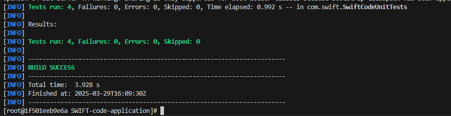
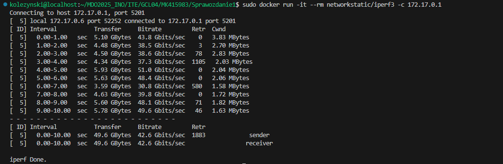

# Zajęcia 1 - Wprowadzenie, Git, Gałęzie, SSH


Na wirtualnej maszynie (VM) obsługującej Fedora 41 Server zainstalowano git oraz obsługę ssh. W tym celu potrzebne są komendy
```sh
sudo dnf install git-all
sudo apt install openssh-server
```
Po wykonaniu komend, można uwierzytelnić, że instalcja zaszła poprawnie, poprzez
```sh
git --version
ssh -V
```


Wygenerowano klucze ssh poprzez
```sh
ssh-keygen -t ed25519 -C "kolezynski@student.agh.edu.pl"
```
po czym zapisano klucze w bezpieczne miejsce, przy czym klucz publiczny znajduje się w plikue id_ed25519.pub.

 

Dodano klucz SSH do github.


Sklonowano repozytorium z wykorzystaniem protokołu ssh poprzez
```sh
git clone git@github.com:InzynieriaOprogramowaniaAGH/MDO2025_INO.git
```
przy czym uwierzytelniono połączenie ssh poprzez zawartość pliku z publicznym kluczem id_ed25519.pub. Tym sposobem sklonowano repozytorium na VM. Dodatkowo, połączono się przez ssh z VM poprzez Visual Studio Code dla ułatwienia pracy. Z pomocą VSC utworzono poprzez branch oraz katalog o nazwie MK415983 (w którym obecnie znajduje się sprawozdanie).


Utworzono git hook [commit-msg](commit-msg), który weryfikuje, że wiadomość commita zaczyna się od MK415983.
```
COMMIT_MSG_FILE=$1
PREFIX="MK415983"

COMMIT_MSG=$(cat "$COMMIT_MSG_FILE")

if [[ ! "$COMMIT_MSG" =~ ^$PREFIX ]]; then
    echo "Error: Commit message must start with '$PREFIX'."
    exit 1
fi

exit 0
```
Wykonano commit z poprawną wiadomością a następnie 
```sh
git push
```


Wykonano pull request na główną gałąź grupy:


# Zajęcia 2 - Git, Docker

Na VM zainstalowano Docker za pomocą
```sh
sudo dnf install docker
```


oraz zarejestrowano się w Docker Hub. Kolejno pobrano obrazy

```
sudo docker pull <nazwa obrazu>
```


Na start włączono kontener obrazu busybox wprost poprzez
```sh
sudo docker run busybox
```
po czym kontener prawie natychmaist kończy pracę. Komendą
```sh
sudo docker pps -a
```
można sprawdzić wszystkie kontenery, a opcja -a również wyświetla kontenery, które ostatnio zakończyły pracę.


Aby kontener natychmiast nie zatrzymał pracy, włączono go w trybie interaktywnym za pomocą
```
sudo docker run --tty --interactive busybox
```

i sprawdzono wersję busybox.


Uruchomiono również Fedora w kontenerze
```sh
sudo docker run --tty --interactive fedora
```
oraz doinstalowano brakujący procps
```sh
dnf install procps -y
```
aby móc wywołać:
```sh
ps
```
Na hoscie procesy dockera to:


podczas gdy procesy w kontenerze to:


PID1 to terminal bash.

Zaktualizowano pakiety Fedora poprzez

```
dnf update -y
```

oraz opuszczono kontener poprzez
```
exit
```
Utworzono prosty [Dockerfile](Dockerfile), który klonuje repozytorium.

```docker
FROM fedora:latest

RUN dnf install -y git && dnf clean all

RUN git clone https://github.com/InzynieriaOprogramowaniaAGH/MDO2025_INO.git

CMD ["/bin/sh"]
```

Stworzono kontener oraz uruchomiono go następująco

```sh
sudo docker build -t moja-fedora .
sudo docker run -it moja-fedora sh 
```

Po wpisaniu komendy `ls` widać, że repozytorium zostało zklonowane do kontenera.


W tym momencie, historia uruchomionych kontenerów wygląda tak:


Jak widać, wszystkie uruchomione kontenery nadal istnieją, mimo że zatrzymały pracę. Aby usunąć na stałe najpierw kontenery, a potem obrazy:

```sh
sudo docker image prune
sudo docker rmi -f $(sudo docker images -aq)
```


# Zajęcia 3 - Dockerfiles, kontener jako definicja etapu

Podczas zajęć zbudowano aplikację wewnątrz kontenera za pomocą Dockerfile'a. W tym celu wykorzystano [własne repozytorium](https://github.com/noel-crimson/SWIFT-code-application) zawierające aplikację maven z testami jednostkowymi. Po sklonowaniu repozytorium za pomocą 

```bash
git clone https://github.com/noel-crimson/SWIFT-code-application.git
```

zainstalować dependencję

```
dnf install mvn
```

po czym należy zbudować aplikację

```bash
mvn clean package -DskipTests 
```


oraz testy.

```bash
mvn test -Dtest=SwiftCodeUnitTests
```


Ponieważ aplikacja zawiera testy integracyjne, a te utrudniają konteryzację, rozpatrywane są tylko testy jednostkowe w aplikacji. Z tego powodu podczas budowania testów należy dodać opcję `-Dtest=SwiftCodeUnitTests` aby tylko skompilować testy jednostkowe.

Następnie aplikacja została zbudowana w kontenerze opartym na obrazie fedora. Należy uruchomić kontener interaktywnie:

```bash
docker pull maven:3.8.8-eclipse-temurin-17
docker run --tty --interactive maven:3.8.8-eclipse-temurin-17 /bin/bash
```

A następnie wewnątrz kontenera powtórzyć kroki powyżej (pobrać git, sklonować repo, budowa). 

```bash
apt update && apt install -y git
git clone https://github.com/noel-crimson/SWIFT-code-application.git
mvn clean package -DskipTests 
mvn test -Dtest=SwiftCodeUnitTests
```




Następnie, aby zautomatyzować budowę stworzono dwa pliki: [Dockerfile.buildswift](Dockerfile.buildswift) do budowy aplikacji 

```docker
FROM maven:3.8.8-eclipse-temurin-17 AS build

WORKDIR /SWIFT-code-application

RUN git clone https://github.com/noel-crimson/SWIFT-code-application.git .

RUN mvn clean package -DskipTests
```

oraz [Dockerfile.buildswifttest](Dockerfile.buildswifttest) do budowy testów.

```docker
FROM buildswift

RUN mvn test -Dtest=SwiftCodeUnitTests
```

Po zbudowaniu kontenerów za pomocą
```bash
docker build -t buildswift -f ./Dockerfile.buildswift .
```


```bash
docker build -t buildswift -f ./Dockerfile.buildswifttest .
```


Kontenery budują się z powodzeniem. Poprawna budowa kontenera buildswifttest wykazuje też, że testy jednostkowe przeszły poprawnie wewnątrz kontenera. Przy uruchomieniu kontenerów nic sie nie dzieje; budowa aplikacji i przejście testów zaszło już przedtem, w trakcie budowy kontenera.

# Zajęcia 4 - Dodatkowa terminologia w konteneryzacji, instancja Jenkins

Celem zajęć jest otrzymać kontener, który zawiera maven i potrafi budować aplikację, ale nie zawiera gita. W tym celu wykorzystany będzie drugi kontener pomocniczny, na którym jest tylko git. Za pomocą wspólnego wolumina `repo-volume` pliki repo zostaną przełożone z kontenera git do kontenera maven. Na koniec, podczas budowy kontener maven pliki wynikowe wstawi na wolumin `build-output`.

Należy stworzyć woluminy:
```bash
docker volume create repo-volume
docker volume create build-output
```

Następnie należy stworzyć kontener oparty na alpine/git (lekki obraz gita). Sklonuje on pliki repo do `repo-volume`.

```bash
docker run --rm -v repo-volume:/repo alpine/git clone https://github.com/noel-crimson/SWIFT-code-application.git /repo
```

Kontener maven jest podpięty pod kontener `repo-volume` aby mieć dostęp do repo, a także do `build-output` żeby dać tam pliki wyjściowe.

```bash
docker run --rm -v repo-volume:/repo -v build-output:/output -w /repo maven:3.8.8-eclipse-temurin-17 sh -c "mvn clean package -DskipTests && mv target /output"
```

Kontener jest ustawiony aby szukać plików do budowy w /repo, ale by pliki końcowe wstawić w /output. 

Można się upewnić że pliki poprawnie trafiły do `build-output` poprzez

```bash
docker run --rm -v build-output:/output fedora ls -l /output
```


Teraz pliki wyjściowe są dalej dostępne po zakończeniu pracy kontenera.

Można zarówno sklonować repo na `repo-volume` z wewnątrz kontenera z gitem za pomocą

```bash
docker run --rm -it -v repo-volume:/repo --entrypoint sh alpine/git
```

po czym w środku

```bash
cd /repo
git clone https://github.com/your/repo.git .
```


W następnej części wykorzystano iperf3 aby połączyć dwa kontenery przez sieć.

Najpierw uruchomiony zostaje server

```bash
docker run -d --name iperf-server -p 5201:5201 networkstatic/iperf3 -s
```

a następnie uruchomić klienta z IP mostku pozyskanym przez `hostname -I`

```bash
sudo docker run -it --rm networkstatic/iperf3 -c 172.17.0.1
```



Widać jak przesyłane są dane między kontenerami. 

Można ten sam efekt uzyskać wykorzystując własną sięć zamiast domyślnej. Utworzono własną sieć mostkową poprzez 

```bash
docker network create --driver bridge custom-bridge
```

oraz uruchomiono ponownie server

```bash
docker run -d --name iperf-serwer --network custom-bridge --hostname iperf-serwer networkstatic/iperf3 -s
```

Aby połączyć się z serwerem, można wykorzystać DNS jeśli połączenie pochodzi z innego kontenera

```bash
sudo docker run -it --rm --network custom-bridge networkstatic/iperf3 -c iperf-serwer
```


Z hosta można połączyć się na serwer postawiony na własnej sieci za pomocą

```bash
iperf3 -c 172.18.0.2
```


Na koniec zajęć zainstalowano na kontenerze Jenkins za pomocą Docker-in-Docker. Utworzono nowy server iperf3 oraz nową sieć

```bash
docker run -d --name iperf-server -p 5201:5201 networkstatic/iperf3 -s
docker network create jenkins-network
```

Uruchomiono kontener docker:dind zgodnie z dokumentacją na stronie Jenkins:

```bash
docker run \
  --name jenkins-docker \
  --rm \
  --detach \
  --privileged \
  --network jenkins-network \
  --network-alias docker \
  --env DOCKER_TLS_CERTDIR=/certs \
  --publish 2376:2376 \
  docker:dind \
```

Podobnie jak uruchomiono Jenkins:

```bash
docker run \
  --name jenkins \
  --network jenkins-network \
  --env DOCKER_HOST=tcp://docker:2376 \
  --env DOCKER_CERT_PATH=/certs/client \
  --env DOCKER_TLS_VERIFY=1 \
  --publish 8080:8080 \
  --publish 50000:50000 \
  jenkins/jenkins:lts
```

Po tym przekierowano port poprzez interface VSC


Po wejściu na `localhost:8080` w przeglądarce, wyświetla się strona logowania:

