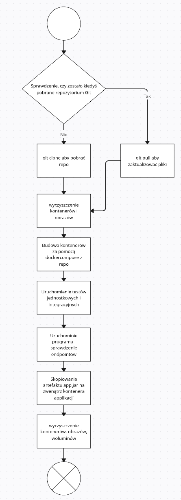
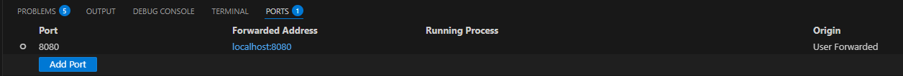
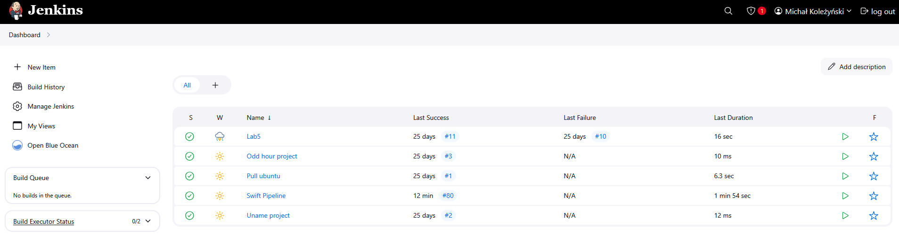
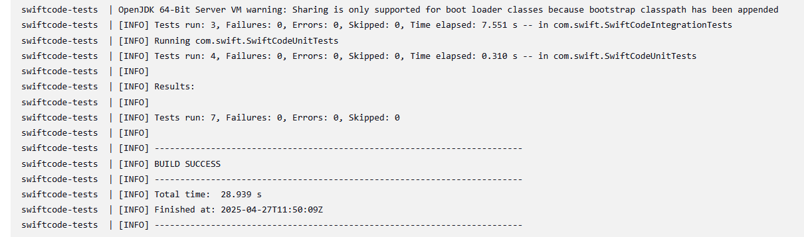
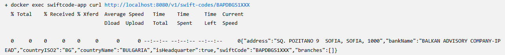
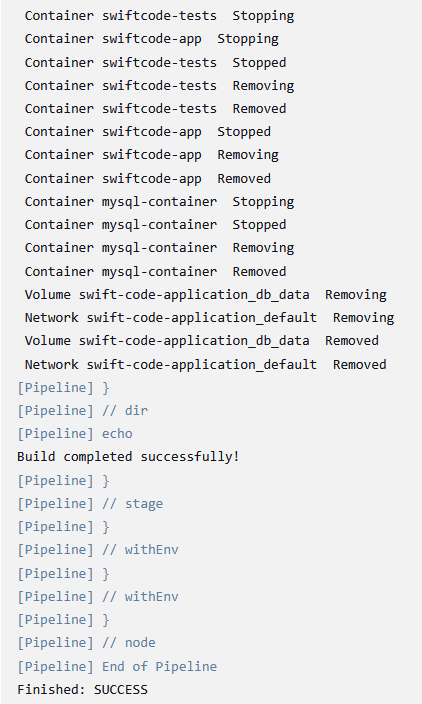

Celem zajęć było wykorzystanie środowiska Jenkins aby przeprowadzenić cały pipeline produkcji aplikacji: budowa, testy, deploy, publish.

Plan operacji przedstawia wykres UML:



# Konfiguracja Jenkins

Zgodnie z dokumentacją jenkinsa, uruchomiono go za pomocą:

- postawienia kontenera Docker in Docker

```bash
docker run \
  --name jenkins-docker \
  --rm \
  --detach \
  --privileged \
  --network jenkins-network \
  --network-alias docker \
  --env DOCKER_TLS_CERTDIR=/certs \
  --volume jenkins-docker-certs:/certs/client \
  --volume jenkins-data:/var/jenkins_home \
  --publish 2376:2376 \
  docker:dind \
  --storage-driver overlay2
```

- postawienia kontenera Jenkinsa 

```bash
docker run \
  --name jenkins-blueocean \
  --restart=on-failure \
  --detach \
  --network jenkins-network \
  --env DOCKER_HOST=tcp://docker:2376 \
  --env DOCKER_CERT_PATH=/certs/client \
  --env DOCKER_TLS_VERIFY=1 \
  --publish 8080:8080 \
  --publish 50000:50000 \
  --volume jenkins-data:/var/jenkins_home \
  --volume jenkins-docker-certs:/certs/client:ro \
  myjenkins-blueocean:2.492.3-1
```

- budowa z [Dockerfile.jenkins](Dockerfile.jenkins)

```bash
docker build -t myjenkins-blueocean:2.492.3-1 -f Dockerfile.jenkins .
```

Oba kontenery są na jednej sieci, jenkins-network. Poprzez środowisko VSC, przekazano port 8080 do Jenkins aby móc się z nim połączyć przez przeglądarkę:





# Wybrany projekt 

Projekt, który będzie budowany przez pipeline to [moja aplikacja Springboot](https://github.com/noel-crimson/SWIFT-code-application) budująca się przez Maven. Zawierała ona pierwotnie [Dockerfile](Dockerfile.swift) odpowiedzialny za budowę aplikacji i publikację artefaktu:

```docker
FROM maven:3.8.8-eclipse-temurin-17 AS build
WORKDIR /app

COPY pom.xml .
COPY src ./src

RUN mvn clean package -DskipTests

FROM openjdk:17-jdk-slim
WORKDIR /app

RUN apt-get update && apt-get install -y curl && \
    rm -rf /var/lib/apt/lists/*

COPY --from=build /app/target/*.jar app.jar

EXPOSE 8080

ENTRYPOINT ["java", "-jar", "app.jar"]
```

Dockerfile pobiera curl aby można było później testować endpointy wewnątrz Jenkins. 

Repo zawiera także [docker-compose](docker-compose.yml):

```docker
version: "3.8"

services:
  db:
    image: mysql:8
    container_name: mysql-container
    restart: always
    environment:
      MYSQL_ROOT_PASSWORD: root
      MYSQL_DATABASE: swiftparserdb
      MYSQL_USER: swiftuser
      MYSQL_PASSWORD: swiftpass
    ports:
      - "3307:3306"
    volumes:
      - db_data:/var/lib/mysql

  app:
    build: .
    container_name: swiftcode-app
    restart: always
    ports:
      - "8080:8080"
    depends_on:
      - db
    volumes:
      - ./swift_codes.csv:/app/swift_codes.csv
    environment:
      SPRING_DATASOURCE_URL: jdbc:mysql://db:3306/swiftparserdb
      SPRING_DATASOURCE_USERNAME: swiftuser
      SPRING_DATASOURCE_PASSWORD: swiftpass

  test:
    image: maven:3.9.5-eclipse-temurin-17
    container_name: swiftcode-tests
    depends_on:
      - db
    volumes:
      - .:/app
    working_dir: /app
    environment:
      SPRING_DATASOURCE_URL: jdbc:mysql://db:3306/swiftparserdb
      SPRING_DATASOURCE_USERNAME: swiftuser
      SPRING_DATASOURCE_PASSWORD: swiftpass
    command: mvn test

volumes:
  db_data:
  ```

Docker-compose tworzy trzy kontenery: 

- swiftcode-app, który wystawia REST'owe endpointy
- mysql-container, który zawiera baze danych MySQL połączoną z głównym kontenerem
- swiftcode-test, który zawiera testy jednostkowe i integracyjne, a po wykonaniu testów zamyka się.

Endpoint, który będzie testowany przez Jenkins to:

```
GET http://localhost:8080/v1/swift-codes/{code}
```

Ten endpoint wypisuje dane o banku z odpowiadającym kodem SWIFT.

Należy wspomnieć, że docker-compose sam w sobie już kopiuje artefakt app.jar na zewnątrz kontenera applikacji:

```docker
COPY --from=build /app/target/*.jar app.jar
```

...toteż odpowiada to kroku Publish, przez co nie będzie on zawarty w jenkinsfile.

# Jenkinsfile

Pipeline w [Jenkinsfile](Jenkinsfile) zawiera następujące etapy:

Cleanup, który przed działaniem aplikacji usuwa nieaktywne kontenery:

```bash
stage('Cleanup') {
            steps {
                sh  """
                    docker container prune -f 
                    docker rm -f swiftcode-app true
                    docker rm -f mysql-container true 
                    docker rm -f swiftcode-tests true 
                """
            }
        }
```

Clone repository, który klonuje repozytorium Git. Jeśli repo zostało już pobrane, wykonuje zamiast tego pull.

```bash
stage('Clone Repository') {
            steps {
                script {
                    if (fileExists("${REPO_DIR}/.git")) {
                        echo "Repository already cloned. Pulling latest changes..."
                        dir("${REPO_DIR}") {
                            sh 'git pull'
                        }
                    } else {
                        echo "Cloning repository..."
                        sh "git clone ${REPO_URL} ${REPO_DIR}"
                    }
                }
            }
        }
```

Build, test, który buduje aplikację i puszcza w shellu kontener test, aby wykazać, że testy przechodzą. Aby Docker Compose działał w przypadku Jenkinsfile, konieczne jest pobranie [wtyczki "Docker Compose Build Step"](https://plugins.jenkins.io/docker-compose-build-step/) do Jenkins.

```bash
 stage('Build, test') {
            steps {
                dir("${REPO_DIR}") {
                    sh 'docker compose up -d --build app db'
                    sh 'docker compose up --build test'
                }
            }
        }
```



Deploy, który czeka na uruchomienie aplikacji, a potem uderza w endpoint GET:
```shell
 stage('Deploy') {
            steps {
                sh '''
                until docker exec swiftcode-app curl -s http://localhost:8080/actuator/health | grep -q '"status":"UP"'; do
                    echo "Waiting for application to start..."
                    sleep 5
                done
                echo "Application is UP!"
            '''
                sh 'docker exec swiftcode-app curl http://localhost:8080/v1/swift-codes/BAPDBGS1XXX'
            }
        }
```



Etap Publish nie jest zawarty w Jenkinsfile, gdyż jak wspomniano wcześniej, docker-compose kopiuje artefakt app.jar na zewnątrz kontenera swiftcode-app.

Na koniec czyszczone jest środowisko pracy i wyświetlony status pipeline'u. Usuwane są obrazy i kontenery:
```bash
post {
         always {
             dir("${REPO_DIR}") {
                 sh 'docker compose down --volumes --remove-orphans'
                 sh 'docker image prune -f'
                 sh 'docker rmi -f swiftcode-app mysql-container swiftcode-tests || true'
             }
        }
        
        success {
            echo 'Build completed successfully!'
        }
        failure {
            echo 'Build failed.'
        }
    }
```



# Wnioski

Pipeline Jenkinsfile pokrywa się z założonym schemat UML. Ponieważ większa część pracy opanowana jest przez istniejący wcześniej docker-compose, jenkinsfile wyszedł krótki. Jenkins pozwala w kontrolowany sposób prowadzić cały pipeline produkcji skonteneryzowanej aplikacji.
