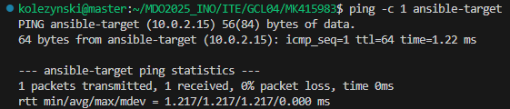
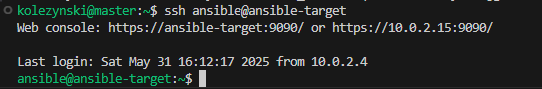
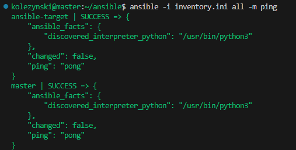
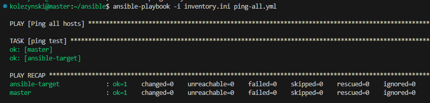
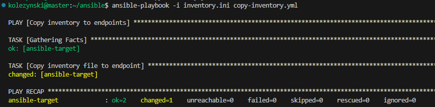
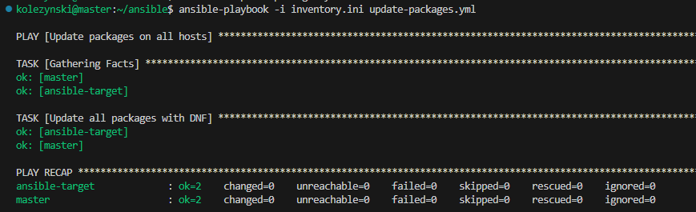
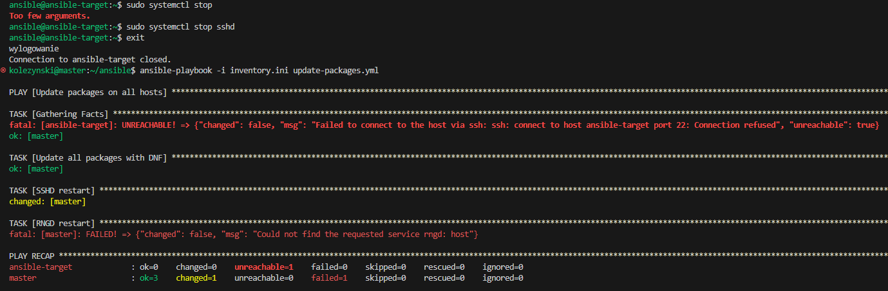

Celem zajęć było opracowanie następujących narzędzi:
- Ansible
- Anaconda Kickstart
- Kubernetes

# Ansible

Na start wykorzystaną ten sam plik .iso zawierający instalację Fedora Server 41 aby utworzyć nową maszynę wirtualną, z użytkownikiem `ansible` i hostname `ansible-target`. 

Aby uprościć odwoływanie się do adresów IP maszyn, wprowadzono nazwy DNS na obie maszyny za pomocą pliku `/etc/hosts`:

```
10.0.2.4    master
10.0.2.15   ansible-target
```

Przez co można wykonać np. ping za pomocą:


Skonfigurowano poprzez ustawienia VBox, aby obie maszyny był na wspólnej sieci NAT. Następnie, klucz SSH wygenerowany na pierwszych zajęciach przekazano wszystkim maszynom za pomocą:

```bash
ssh-copy-id kolezynski@master
ssh-copy-id ansible@ansible-target
```

Dzięki temu można się połączyć z maszyną `ansible` za pomocą ssh bez podawania hasła:



Na głownej maszynie zainstalowano Ansible za pomocą:

```bash
dnf install ansible
```

Oraz uutworzono [plik inwentaryzacji](inventory.ini):

```
[Orchestators]
master ansible_user=kolezynski

[Endpoints]
ansible-target ansible_user=ansible
```

Można wykonać ping wszystkich maszyn poprzez:



Za pomocą playbooka ansible [ping-all.yml](ping-all.yml)

```yml
- name: Ping all 
  hosts: all
  gather_facts: no
  tasks:
    - name: Ping test
      ansible.builtin.ping:
```

 wykonano ping do wszystkich maszyn:

 

 Za pomocą playbooka [copy-inventory.yml](copy-inventory.yml)

 ```yml
 - name: Copy inventory to endpoints
  hosts: Endpoints
  become: yes
  tasks:
    - name: Copy inventory file to endpoint
      ansible.builtin.copy:
        src: inventory.ini
        dest: /home/ansible/inventory.ini
        mode: '0644'
```

Skopiowano plik inwentaryzacji do endpointów:



W celach przyspieszenia pracy zezwoliłem wszystkim maszynom na wykorzystywanie `sudo` bez hasła, co w normalnych warunkach stanowiłoby problem z bezpieczeństwem.

Z playbookiem [update-packages.yml](update-packages.yml)

```yml
- name: Update packages on all hosts
  hosts: all
  become: yes
  tasks:
    - name: Update all packages with DNF
      ansible.builtin.dnf:
        name: "*"
        state: latest
        update_cache: true
      become: true
    - name: SSHD restart
      ansible.builtin.service:
        name: sshd 
        state: restarted 
    - name: RNGD restart 
      ansible.builtin.service: 
        name: rngd 
        state: restarted 
```

zachodzi aktualizacja pakeitów oraz restart ssh daemon i rng daemon:



Udany restart usługi podaje status changed, przez co udany restart SSHD daje w wyniku changed=1. W przypadku nieudanego restartu zwrócony jest status failed - RNG Daemon nie jest na tej maszynie zainstalowany. 

Natomiast z wyłączoną usługą SSH na `ansible-target` otrzymano status `unreachable`:



# Kickstart

Z folderu `/root` na głównej maszynie pozyskano plik [kickstart](anaconda-ks.cfg). Następnie podczas bootu nowej maszyny wirtualnej wykorzystano ten sam obraz, przy czym wykorzystano polecenie

```
inst.ks=https://raw.githubusercontent.com/InzynieriaOprogramowaniaAGH/MDO2025_INO/refs/heads/MK415983/ITE/GCL04/MK415983/Sprawozdanie3/anaconda-ks.cfg
```

any zaciągnąć z repo plik Kickstart (w rzeczywistości wykorzystano link shortener aby łatwiej wkleić link repozytorium do terminala). Tym sposobem otrzymano drugą maszynę wirtualną, skonfigurowaną tak samo jak główna, z automatyzowanym procesem instalacyjnym. 

```
https://raw.githubusercontent.com/InzynieriaOprogramowaniaAGH/MDO2025_INO/MK415983/ITE/GCL04/MK415983/Sprawozdanie3/swiftcode-application.jar
```