Celem zajęć było opracowanie następujących narzędzi:
- Ansible
- Anaconda Kickstart
- Kubernetes

# Ansible

Na start wykorzystaną ten sam plik .iso zawierający instalację Fedora Server 41 aby utworzyć nową maszynę wirtualną, z użytkownikiem `ansible` i hostname `ansible-target`. 

Aby uprościć odwoływanie się do adresów IP maszyn, wprowadzono nazwy DNS na obie maszyny za pomocą pliku `/etc/hosts`:

```
10.0.2.4    master
10.0.2.15   ansible-target
```

Przez co można wykonać np. ping za pomocą:


Skonfigurowano poprzez ustawienia VBox, aby obie maszyny był na wspólnej sieci NAT. Następnie, klucz SSH wygenerowany na pierwszych zajęciach przekazano wszystkim maszynom za pomocą:

```bash
ssh-copy-id kolezynski@master
ssh-copy-id ansible@ansible-target
```

Dzięki temu można się połączyć z maszyną `ansible` za pomocą ssh bez podawania hasła:


Na głownej maszynie zainstalowano Ansible za pomocą:

```bash
dnf install ansible
```

Oraz uutworzono [plik inwentaryzacji](inventory.ini):

```
[Orchestators]
master ansible_user=kolezynski

[Endpoints]
ansible-target ansible_user=ansible
```

Można wykonać ping wszystkich maszyn poprzez:


Za pomocą playbooka ansible [ping-all.yml](ping-all.yml)

```yml
- name: Ping all 
  hosts: all
  gather_facts: no
  tasks:
    - name: Ping test
      ansible.builtin.ping:
```

 wykonano ping do wszystkich maszyn:

 

 Za pomocą playbooka [copy-inventory.yml](copy-inventory.yml)

 ```yml
 - name: Copy inventory to endpoints
  hosts: Endpoints
  become: yes
  tasks:
    - name: Copy inventory file to endpoint
      ansible.builtin.copy:
        src: inventory.ini
        dest: /home/ansible/inventory.ini
        mode: '0644'
```

Skopiowano plik inwentaryzacji do endpointów:


W celach przyspieszenia pracy zezwoliłem wszystkim maszynom na wykorzystywanie `sudo` bez hasła, co w normalnych warunkach stanowiłoby problem z bezpieczeństwem.

Z playbookiem [update-packages.yml](update-packages.yml)

```yml
- name: Update packages on all hosts
  hosts: all
  become: yes
  tasks:
    - name: Update all packages with DNF
      ansible.builtin.dnf:
        name: "*"
        state: latest
        update_cache: true
      become: true
    - name: SSHD restart
      ansible.builtin.service:
        name: sshd 
        state: restarted 
    - name: RNGD restart 
      ansible.builtin.service: 
        name: rngd 
        state: restarted 
```

zachodzi aktualizacja pakeitów oraz restart ssh daemon i rng daemon:


Udany restart usługi podaje status changed, przez co udany restart SSHD daje w wyniku changed=1. W przypadku nieudanego restartu zwrócony jest status failed - RNG Daemon nie jest na tej maszynie zainstalowany. 

Natomiast z wyłączoną usługą SSH na `ansible-target` otrzymano status `unreachable`:


# Kickstart

Z folderu `/root` na głównej maszynie pozyskano plik [kickstart](anaconda-ks.cfg). Następnie podczas bootu nowej maszyny wirtualnej wykorzystano ten sam obraz Fedora Server 41, przy czym wykorzystano polecenie

```
inst.ks=https://raw.githubusercontent.com/InzynieriaOprogramowaniaAGH/MDO2025_INO/refs/heads/MK415983/ITE/GCL04/MK415983/Sprawozdanie3/anaconda-ks.cfg
```

any zaciągnąć z repozytorium przedmiotu plik Kickstart (w rzeczywistości wykorzystano link shortener aby łatwiej wkleić link repozytorium do terminala). Tym sposobem otrzymano drugą maszynę wirtualną, skonfigurowaną tak samo jak główna, z automatyzowanym procesem instalacyjnym. Proces instalacji toczy się automycznie bez wymaganego dodatkowego inputu od użytkownika:

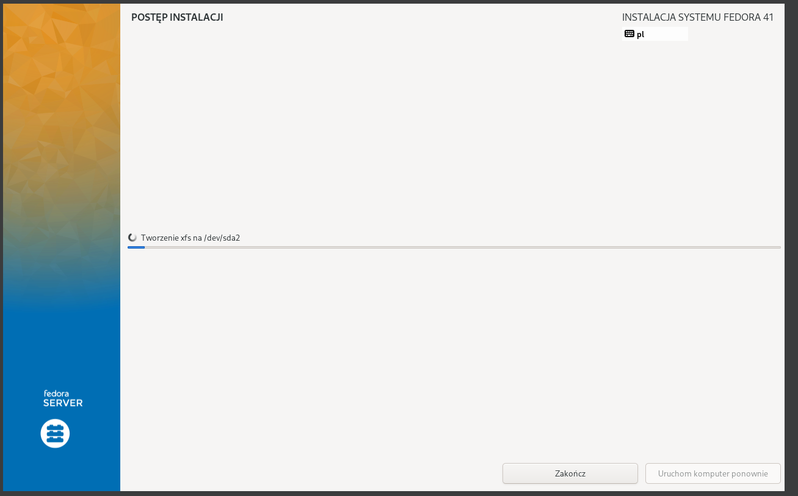

Plik kickstart został zmodyfikowany aby pobrać artefakt pipeline'u Jenkins (którym był plik jar) i uruchomić go automatycznie podczas uruchomienia maszyny. W tym celu kickstart instaluje w sekcji `%post` dodatkowo java jdk17, oraz pobiera artefakt z linku:

```
https://raw.githubusercontent.com/InzynieriaOprogramowaniaAGH/MDO2025_INO/MK415983/ITE/GCL04/MK415983/Sprawozdanie3/swiftcode-application.jar
```

Plik kickstart wygląda następująco:

Ustawiony jest zewntrzny link do repozytorium, z którego można pobrać Java JDK17.

```
#version=DEVEL

repo --name="fedora" --baseurl=https://download.fedoraproject.org/pub/fedora/linux/releases/41/Everything/x86_64/os/
```

Ustawienia systemu, dzięki którym pominięta jest ręczna konfiguracja przy instalacji.

```
# Keyboard layouts
keyboard --vckeymap=pl --xlayouts='pl'
# System language
lang pl_PL.UTF-8

# System timezone
timezone Europe/Warsaw --utc

# Root password
rootpw --iscrypted --allow-ssh $y$j9T$vVs/x/BIvNTzdCNb/XPjlpi1$caolusBjQ.BUSIKXzN7shSyZtKcPlHpcPjmaLbZt4n7
user --groups=wheel --name=kolezynski --gecos="kolezynski"
```

Wymuszenie czyszczenia dysku przed instalacją.

```
ignoredisk --only-use=sda
autopart
clearpart --all --initlabel

firstboot --enable
```

Instalacja paczek. W tym przypadku konieczna jest tylko Java, gdyż program nie zostaje uruchomiony w kontenerze, a do pobrania artefaktu wykorzystywany jest `curl` a nie `wget`.

```
%packages
@^server-product-environment
java-17-openjdk-headless
%end
```

Sekcja `%post`, która odpowiedzialna jest za pobranie pliku .jar oraz uruchiomienie serwisu aplikacji podczas uruchomienia maszyny. 

```
%post --log=/root/post-install.log
mkdir -p /usr/local/bin
curl -L -o /usr/local/bin/swiftcode-application.jar https://raw.githubusercontent.com/InzynieriaOprogramowaniaAGH/MDO2025_INO/MK415983/ITE/GCL04/MK415983/Sprawozdanie3/swiftcode-application.jar
chmod +x /usr/local/bin/swiftcode-application.jar

alternatives --set java /usr/lib/jvm/jre-17-openjdk/bin/java

cat > /etc/systemd/system/myapp.service << EOF
[Unit]
Description=Swiftcode App
After=network-online.target
Wants=network-online.target

[Service]
Type=simple
ExecStart=java -jar /usr/local/bin/swiftcode-application.jar
WorkingDirectory=/usr/local/bin
User=root
Restart=always
RestartSec=5
StandardOutput=tty1
StandardError=tty1

[Install]
WantedBy=multi-user.target
EOF

systemctl daemon-reload
systemctl enable myapp.service
systemctl start myapp.service

# debug
systemctl status myapp.service >> /root/post-install.log
journalctl -u myapp.service >> /root/post-install.log
%end
```

Po instalacji, maszyna zostaje uruchomiona ponownie i program zostaje uruchomiony w tle automatycznie. Jego działanie można podejrzeć np. przez `systemctl status`:

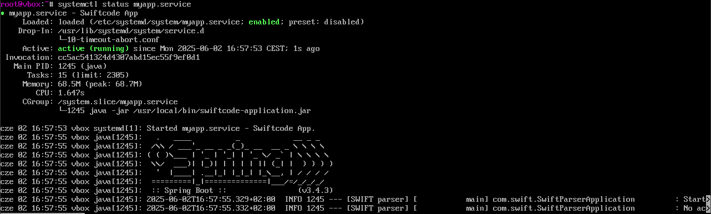

# Kubernetes (zajęcia 1)

Kubernetes stosuje dwa pojęcia: Pod i Deployment. Pod to instancja działającego procesu, i przechowuje jeden lub więcej kontenerów. Deployment to Kubernetesowy controller, który umożliwia nadzorowanie wszystkich podów.

Po pobraniu minikube na maszynę wirtualną, przydatnym krokiem jest ustawienie następującego aliasu:

```
alias kubectl="minikube kubectl --"
```

aby na czas obecnej sesji nie musieć pisać całej komendy `minikube kubectl`. Minikube uruchomiono poprzez `minikube start`:

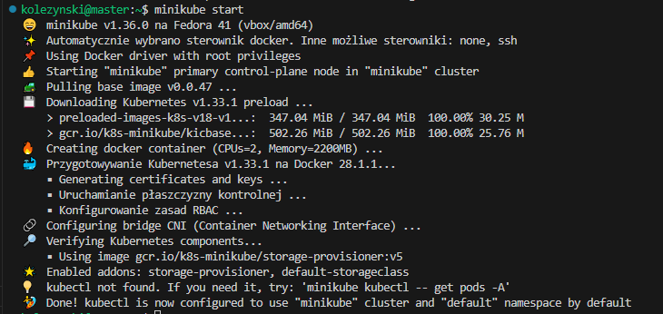


Można zobaczyć obecnie włączone pody i deployment poprzed `minikube dashboard`:

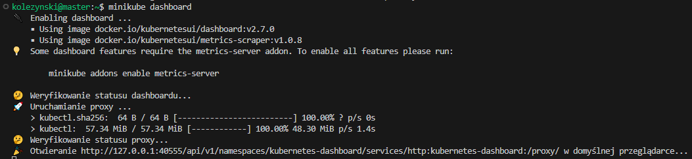

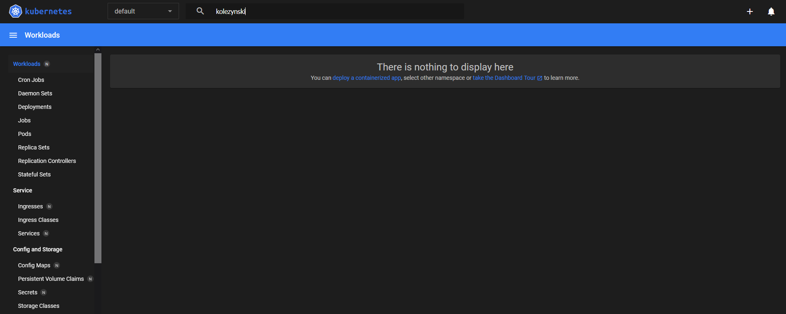

Następnym krokiem było postawienie mojej aplikacji Springboot na Kubernetes. Aby zapewnić pełną funkcjonalność i uderzanie w endpointy musiałem postawić bazę danych oraz samą aplikację równocześnie. Gdyż jest to złożony proces, wykorzystałem LLM aby otrzymać plik [kube-manifests.yaml](kube-manifests.yaml), który to wszystko robi. Analizując ten plik po kolei:

```yaml
# --- Secret for Database Credentials ---
apiVersion: v1
kind: Secret
metadata:
  name: db-credentials
type: Opaque
data:
  MYSQL_ROOT_PASSWORD: "cm9vdA==" # root
  MYSQL_USER: "c3dpZnR1c2Vy"     # swiftuser
  MYSQL_PASSWORD: "c3dpZnRwYXNz"  #swiftpass
  MYSQL_DATABASE_NAME: "c3dpZnRwYXJzZXJkYg==" #swiftparserdb 
```

Powyższy fragment przechowuje zakodowane w base64 wszystkie hasła konieczne do zalogowania się i komunikacji z bazą danych.

```yaml
# --- PersistentVolumeClaim for MySQL Data ---
apiVersion: v1
kind: PersistentVolumeClaim
metadata:
  name: mysql-pvc
spec:
  accessModes:
    - ReadWriteOnce 
  resources:
    requests:
      storage: 1Gi
```

Ten fragment rzerwuje pamięć dyskową dla bazy danych MySQL. 
Następnie są już deploymenty i serwisy.

```yaml
# --- MySQL Deployment (db service) ---
apiVersion: apps/v1
kind: Deployment
metadata:
  name: mysql-deployment
  labels:
    app: mysql
spec:
  replicas: 1
  selector:
    matchLabels:
      app: mysql
  template:
    metadata:
      labels:
        app: mysql
    spec:
      containers:
        - name: mysql
          image: mysql:8
          imagePullPolicy: IfNotPresent
          ports:
            - containerPort: 3306
          env:
            - name: MYSQL_ROOT_PASSWORD
              valueFrom:
                secretKeyRef:
                  name: db-credentials
                  key: MYSQL_ROOT_PASSWORD
            - name: MYSQL_DATABASE
              valueFrom:
                secretKeyRef:
                  name: db-credentials
                  key: MYSQL_DATABASE_NAME
            - name: MYSQL_USER
              valueFrom:
                secretKeyRef:
                  name: db-credentials
                  key: MYSQL_USER
            - name: MYSQL_PASSWORD
              valueFrom:
                secretKeyRef:
                  name: db-credentials
                  key: MYSQL_PASSWORD
          volumeMounts:
            - name: mysql-persistent-storage
              mountPath: /var/lib/mysql
      volumes:
        - name: mysql-persistent-storage
          persistentVolumeClaim:
            claimName: mysql-pvc
```

Ten deployment ciągnie obraz MySQL, rozpoczyna pracę jego, wybiera jego port, podaje mu wszystkie hasła konieczne do korzystania z bazy, oraz wskazuje mu miejsce przechowywania danych (var/lib/mysql). 

```yaml
# --- MySQL Service (db service) ---
apiVersion: v1
kind: Service
metadata:
  name: mysql-service
  labels:
    app: mysql
spec:
  ports:
    - port: 3306
      targetPort: 3306
  selector:
    app: mysql
  type: ClusterIP 
```

Service MySQL pozwala innym aplikacjom w klastrze (`type: ClusterIP`) połączyć się z MySQL poprzez podany port. Jest to konieczne aby moja aplikacja postawiona na minikube mogła rzeczywiście modyfikować jakąś bazę danych.

```yaml
# --- Spring Boot App Deployment (app service) ---
apiVersion: apps/v1
kind: Deployment
metadata:
  name: swiftcode-app-deployment
  labels:
    app: swiftcode-app
spec:
  replicas: 1 
  selector:
    matchLabels:
      app: swiftcode-app
  template:
    metadata:
      labels:
        app: swiftcode-app
    spec:
      containers:
        - name: swiftcode-app-container
          image: swift-code-application-app:latest 
          imagePullPolicy: IfNotPresent
          ports:
            - containerPort: 8080
          env:
            - name: SPRING_DATASOURCE_URL
              value: "jdbc:mysql://mysql-service:3306/swiftparserdb"
            - name: SPRING_DATASOURCE_USERNAME
              valueFrom:
                secretKeyRef:
                  name: db-credentials
                  key: MYSQL_USER
            - name: SPRING_DATASOURCE_PASSWORD
              valueFrom:
                secretKeyRef:
                  name: db-credentials
                  key: MYSQL_PASSWORD
          volumeMounts:
            - name: swift-codes-hostpath-volume
              mountPath: /app/swift_codes.csv 
      volumes:
        - name: swift-codes-hostpath-volume
          hostPath:
            path: /data/swift_codes.csv
            type: File 
```

Deployment aplikacji ciągnie obraz, wystawia ją na port 8080, łączy się z bazą danych na porcie 3306 (jak powyżej), montuje plik lokalny `app/swift_codes.csv` i kopiuje go na kontener minikube. Jest to plik csv, który zawiera dane początkowe dla nowo stworzonej bazy danych.

```yaml
# --- Spring Boot App Service (app service) ---
apiVersion: v1
kind: Service
metadata:
  name: swiftcode-app-service
  labels:
    app: swiftcode-app
spec:
  type: LoadBalancer
  ports:
    - port: 8080
      targetPort: 8080
  selector:
    app: swiftcode-app
```

Serwis aplikacji uruchamia ją na odpowiednim porcie wraz z włączonym LoadBalancer, który nie ma większego znaczenia dla obecnej implementacji z 1 podem, ale w sytuacji bardziej praktycznej pozwala on na skalowalność aplikacji.

Na dashboardzie widać, że pody i deploymenty pracują:

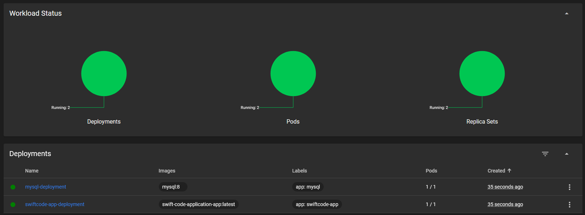

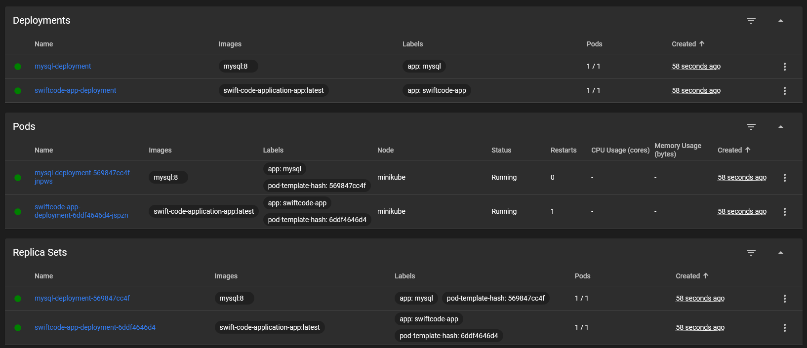

Oraz widać za pomocą polecenia `kubectl rollout status`:

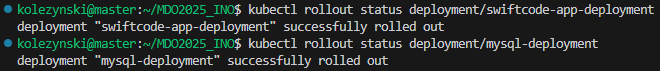

A po przekierowaniu portu za pomocą

```
kubectl port-forward service/swiftcode-app-service 8080:8080
```

można nawet uderzyć w endpoint aplikacji postawionej na Kubernetesie, z mojego hosta:

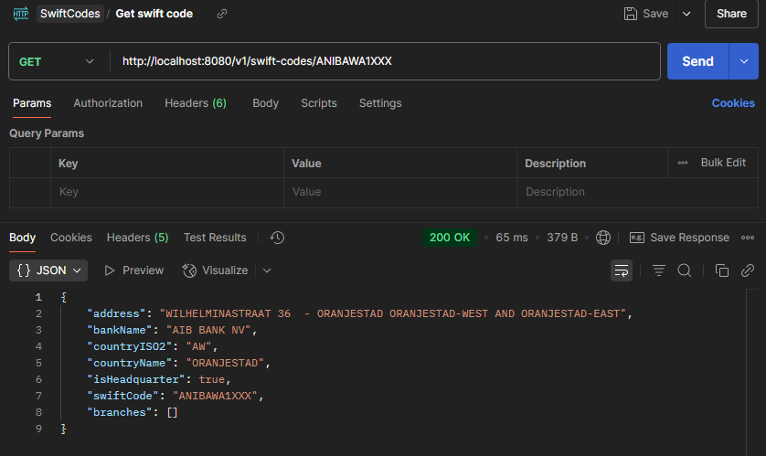

# Kubernetes (zajęcia 2.)

Utworzono dwa nowe obrazy: nową wersję obrazu aplikacji, oraz obraz [failimage](Dockerfile.failimage) którego włączenie kończy się statusem wyjścia 1, czyli niepowodzeniem. Obraz niepowodzenia był stworzony na podstawie następującego Dockerfile:

```docker
FROM alpine
CMD exit 1
```

Nowa wersja aplikacji to ten sam obraz z innym tagiem v2. Gdyż jest to tylko w celach demonstracji pracy Kubernetes, uznałem że to wystarczy.

Utworzone obrazy:

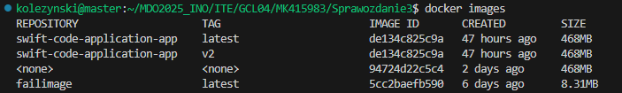

Następnie zmodyfikowano manifest aby zmienić ilość replik. Każdorazowo wykorzystano polecenie

```bash
kubectl apply -f kube-manifests.yaml
```

aby zastosować obecny manifest. Zmieniono ilośc replik na kolejno 8, 1, 0, na końcu 4.

```
# --- Spring Boot App Deployment (app service) ---
apiVersion: apps/v1
kind: Deployment
metadata:
  name: swiftcode-app-deployment
  labels:
    app: swiftcode-app
spec:
  replicas: 8 # albo 1, 0, 4
```

W `minikube dashboard` widać na żywo jak zmienia się ilość podów.

Osiem podów: 

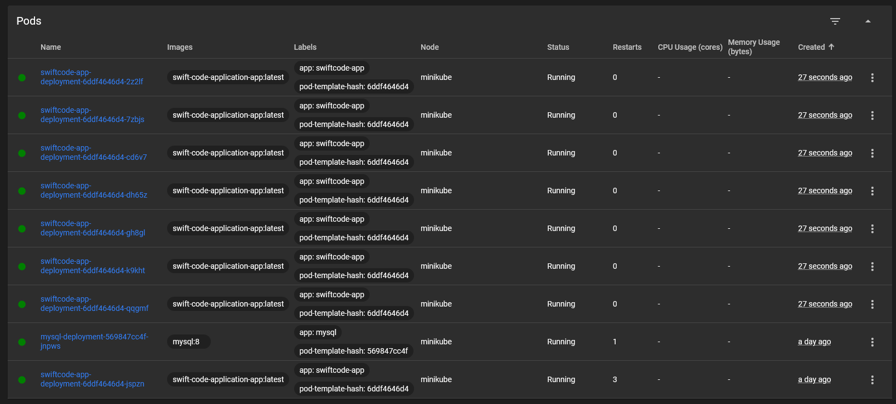

Automatyczne włączanie podów przy zmianie na jeden pod:

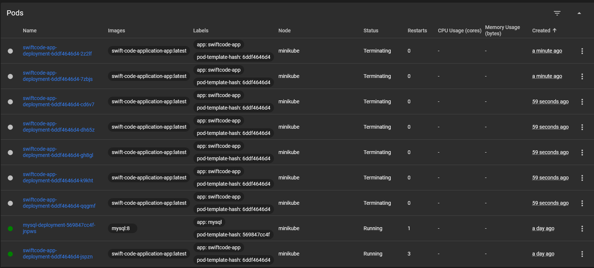

Zero podów:

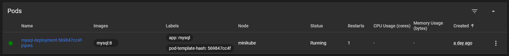

Finalnie, cztery pody:

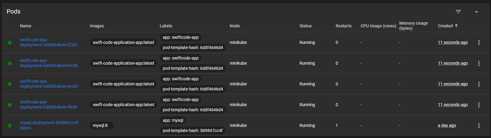

Zmieniano wersję poodów za pomocą fragmentu

```yaml
spec:
      containers:
        - name: swiftcode-app-container
          image: swift-code-application-app:latest # albo swift-code-application-app:v2
          #albo failimage:latest
```

Wersja v2:

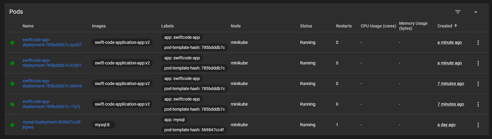

Wersja błędna:

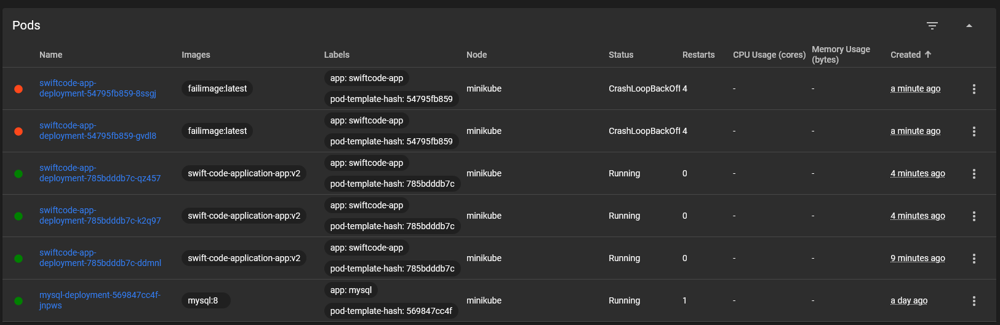

W przypadku wersji błędnej pierwsze dwa kontenery są zawieszone przez CrashLoop, przez co proces podmiany podów jest tam zatrzymany i kolejne pody nie są modyfikowane.


W terminalu można sprawdzić historię deploymentów:

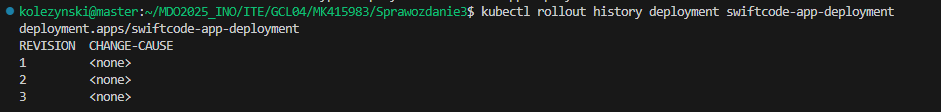

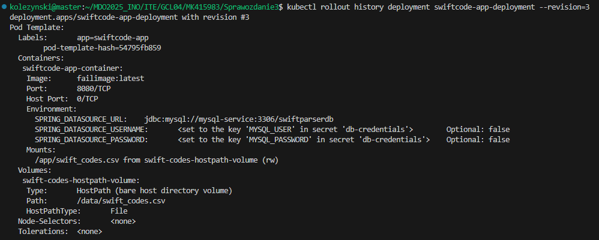

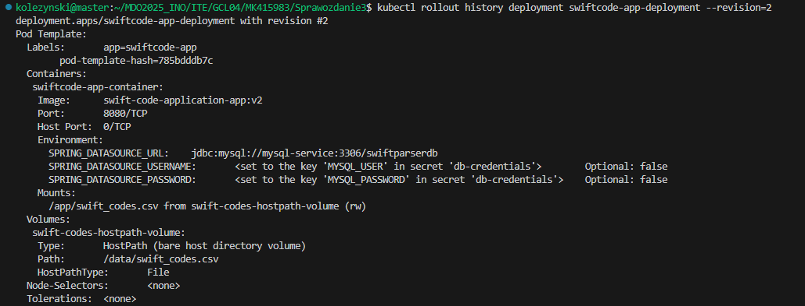

Oraz dokładny opis deploymentu i historię operacji:

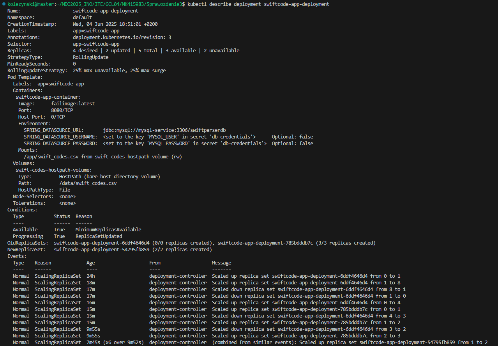

Dla `kubectl describe pod`:

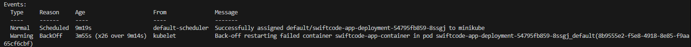

Można również cofnąć deployment do poprzedniego etapu, zgodnie z historią widzianą wyżej. To polecenie sprawiło, że obraz zastosowany wrócił z błędnego obrazu do wersji v2.


Utworzono [skrypt shellowy](verifydeploy.sh), który weryfikuje czy deployment jest już postawiony. Sprawdza co 5 sekund czy status deploymentu jest gotowy, i sprawdza przez 60 sekund do skutku.

```shell
DEPLOYMENT="swiftcode-app-deployment"
NAMESPACE="default"
TIMEOUT=60
SLEEP_INTERVAL=5
ELAPSED=0

echo "Czekam na zakończenie wdrożenia '$DEPLOYMENT' (maks. ${TIMEOUT}s)..."

while true; do
    
    status=$(minikube kubectl -- rollout status deployment/${DEPLOYMENT} --namespace=${NAMESPACE} 2>&1)

    echo "Status: $status"

    if [[ "$status" == *"successfully rolled out"* ]]; then
        echo "Wdrożenie zakończone sukcesem"
        exit 0
    fi

    if [[ $ELAPSED -ge $TIMEOUT ]]; then
        echo "Timeout: wdrożenie nie zakończyło się w ${TIMEOUT} sekund"
        exit 1
    fi

    sleep $SLEEP_INTERVAL
    ELAPSED=$((ELAPSED + SLEEP_INTERVAL))
done
```

Sukces skryptu, w przypadku działącego deploymentu, wygląda następująco:

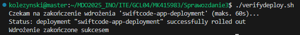

Na koniec zastosowano trzy strategie wdrożeń.

Strategia `Recreate` usuwa wszystkie istniejące pody zanim tworzy nowe. Nie jest to zalecane podejście, gdyż aplikacja jest kompletnie niedostępna podczas zmiany podów.

```yaml
apiVersion: apps/v1
kind: Deployment
metadata:
  name: swiftcode-app-deployment
  labels:
    app: swiftcode-app
spec:
  replicas: 4
  strategy:
    type: Recreate
```

Strategia `RollingUpdate` stopniowo zastępuje pody nowymi. Zmienna `maxUnavailable` oznacza, ile podów równocześnie może być niedostępnych podczas tej operacji, a `maxSurge` oznacza, ile podów może istnieć ponad docelową ilość replik. W moim przypadku pozwalam aby maksymalnie 2 pody były niedostępne, oraz ustawiłem maksymalną nadwyżkę na 30%, czyli w praktyce maksymalnie może istnieć pięć podów podczas wdrożenia. Jest to lepsze podejście niż `Recreate`, gdyż ilość niedostępnych podów jest ograniczona i aplikacja jest nadal dostępna w trakcie wdrożenia.

```yaml
apiVersion: apps/v1
kind: Deployment
metadata:
  name: swiftcode-app-deployment
  labels:
    app: swiftcode-app
spec:
  replicas: 4
  strategy:
    type: RollingUpdate
    rollingUpdate:
      maxUnavailable: 2
      maxSurge: 30%
```

Strategia `Canary Deployment Workload` wdraża nową wersję tylko do małej części podów aby sprawdzić, czy zachodzi to z sukcesem. Dopiero wtedy poszerza zakres wdrożenia i obejmuje resztę podów. Jest to najbezpieczniejsza metoda spośród trzech. Dodano zatem nowy deployment aplikacji o nazwie `canary` z tylko jednym podem. Na obecną chwilę strategię należy przeprowadzić manualnie, uruchamiając deployment kanarkowy i dopiero potem główny.

```yaml
# --- Canary ---
apiVersion: apps/v1
kind: Deployment
metadata:
  name: swiftcode-app-canary
  labels:
    app: swiftcode-app
spec:
  replicas: 1 # dla testów
  strategy:
    type: RollingUpdate
    rollingUpdate:
      maxUnavailable: 2
      maxSurge: 30%
  selector:
    matchLabels:
      app: swiftcode-app
  template:
    metadata:
      labels:
        app: swiftcode-app
    spec:
      containers:
        - name: swiftcode-app-container
          image: swift-code-application-app:v2
          imagePullPolicy: IfNotPresent
          ports:
            - containerPort: 8080
          env:
            - name: SPRING_DATASOURCE_URL
              value: "jdbc:mysql://mysql-service:3306/swiftparserdb"
            - name: SPRING_DATASOURCE_USERNAME
              valueFrom:
                secretKeyRef:
                  name: db-credentials
                  key: MYSQL_USER
            - name: SPRING_DATASOURCE_PASSWORD
              valueFrom:
                secretKeyRef:
                  name: db-credentials
                  key: MYSQL_PASSWORD
          volumeMounts:
            - name: swift-codes-hostpath-volume
              mountPath: /app/swift_codes.csv 
      volumes:
        - name: swift-codes-hostpath-volume
          hostPath:
            path: /data/swift_codes.csv
            type: File
```
