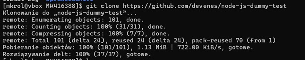
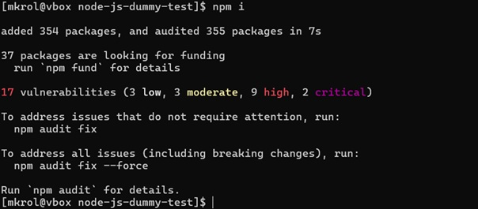
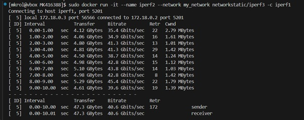

Sprawozdanie nr 1 z Przedmiotu DevOps

Kierunek: Informatyka Techniczna

Grupa 4

Marcin Król


## Zajecia 1

1.Zainstalowałem klienta Git i obsługę kluczy SSH 


2.Utworzono dwa klucze SSH w tym jeden zabezpieczony hasłem hasłem. Skonfigurowano klucz SSH jako metodę dostępu do GitHuba. 


3.Sklonowano repozytorium z wykorzystaniem protokołu SSH 


4.Przełączono się na gałąź main, a następnie na gałąź grupową GCL04 po czym utworzono nową gałąź


5.Przejscie do katalogu z własnymi inicjałami


6.Przygotowałem Git hooka sprawdzającego, czy każdy mój komunikat commita zaczyna się od „inicjały & nr indeksu”.

```
#!/bin/sh

EXPECTED_PREFIX="MK416388"

if [ ! -f "$1" ]; then
    echo "Błąd: Plik $1 nie istnieje!"
    exit 1
fi

COMMIT_MSG=$(cat "$1")

if [[ "$COMMIT_MSG" != $EXPECTED_PREFIX* ]]; then
    echo "Błąd: Commit message musi zaczynać się od $EXPECTED_PREFIX!"
    exit 1
fi

exit 0
```

## Zajecia 2

1.Zainstalowanie Dockera 


2.Zalogowanie się do Docker Hub


3.Pobranie obrazów hello-world, busybox,fedora,ubuntu,mysql z wykorzystaniem docker pull


4.Uruchomienie konteneru z obrazu busybox


5.Podłączenie się do kontenera interaktywnie i wywołanie numeru wersji


6.Uruchomienie konteneru z obrazu ubuntu oraz pokazanie PID1 w kontenerze i procesy


7.Aktualizacja pakietów


8.Stworzony plik Dockerfile
```
FROM ubuntu:latest

RUN apt update && apt install -y git


WORKDIR /app
RUN git clone https://github.com/InzynieriaOprogramowaniaAGH/MDO2025_INO.git

CMD ["/bin/bash"]
```

9.Pokazanie uruchomionych kontenerów


10.Wyczyszczenie obrazów


## Zajecia 3

1.Sklonowanie repozytorium z aplikacją w Node.js 



2.Zainstalowanie zależności



3.Wykonanie testów


4.Pokazanie gotowego obrazu oraz uruchomienie kontenera


5.Sklonowanie repozytorium wewnątrz kontenera


6.Wykonanie testów wewnątrz kontenera


7.Stworzony Dockerfile.build
```
FROM node:latest

RUN git clone https://github.com/devenes/node-js-dummy-test

WORKDIR /node-js-dummy-test

RUN npm i

CMD ["npm", "run", "start"]
```

8.Stworzony Dockerfile.test
```
FROM my_node_build

CMD ["npm", "run", "test"]
```

9.Pokazanie build oraz test


## Zajecia 4

1.Utworzenie woluminów


2.Sklonowanie repozytorium


3.Uruchomienie kontenera z podpiętymi woluminami i skopiowanie plików do środka


4.Przejście do katalogu 


5.Instalacja zależności


6.Kopiowanie zawartości katalogu /mnt/input do /mnt/output


7.Uruchomiono kontener z podpiętym woluminem wyjściowym


8.Tworzenie nastepnego wolumina


9.Startujemy kontener z podłączonym woluminem volume_3 a następnie wchodzimy do katalogu /mnt/app


10.Klonowanie repozytorium


11.Instalacja zaleznosci


12.Żeby uprościć cały proces można użyć Dockerfile do zbudowania obrazu który przy starcie kontenera automatycznie podłączy woluminy


13.Dockerfile
```
FROM node:22

RUN apt-get install -y tzdata && dpkg-reconfigure -f noninteractive tzdata
RUN apt-get update && apt-get install -y git

VOLUME /mnt/input
VOLUME /mnt/output

RUN git clone https://github.com/devenes/node-js-dummy-test.git /mnt/input && \
    cd /mnt/input && npm install && \
    cp -r /mnt/input /mnt/output && \
    echo "output: $(ls /mnt/output)"

CMD ["node", "/mnt/input/src/index.js"]
```


14.Podłączamy się do kontenera i instalujemy iperf3


15.Uruchamiamy iperf3 


16.Powtarzamy proces na drugim


17.Sprawdzamy Ip


18.Sprawdzamy polaczenie miedzy kontenerami 


19.Tworzymy własną sieć  uruchamiamy w niej kontenery i sprawdzamy czy się ze sobą łącza




20.Pobieramy obraz Jenkinsa


21.Wlaczenie kontenera z odpowiednimi flagami 


22.Sprawdzenie czy Jenkins działa


