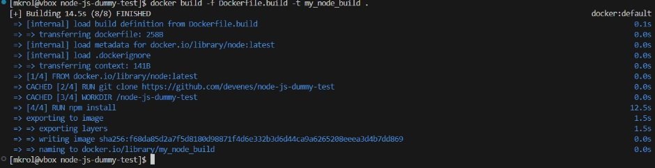
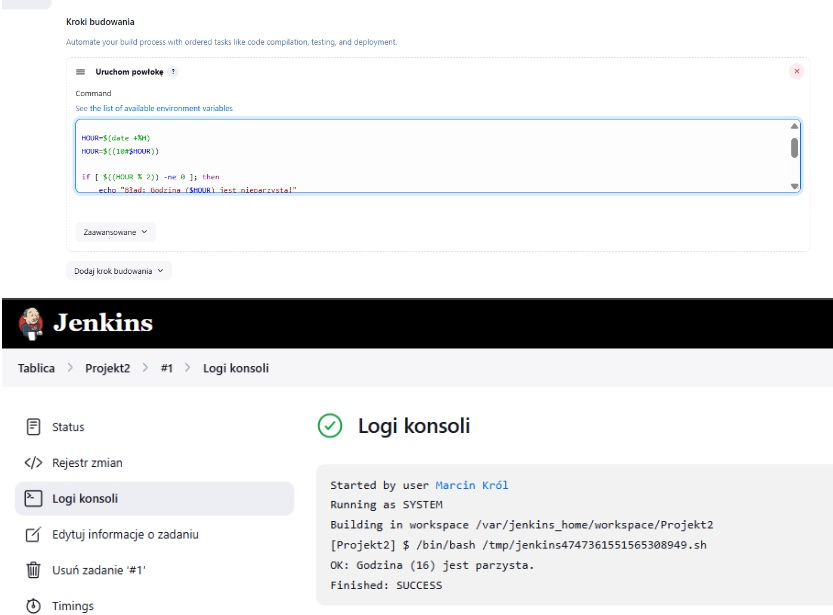
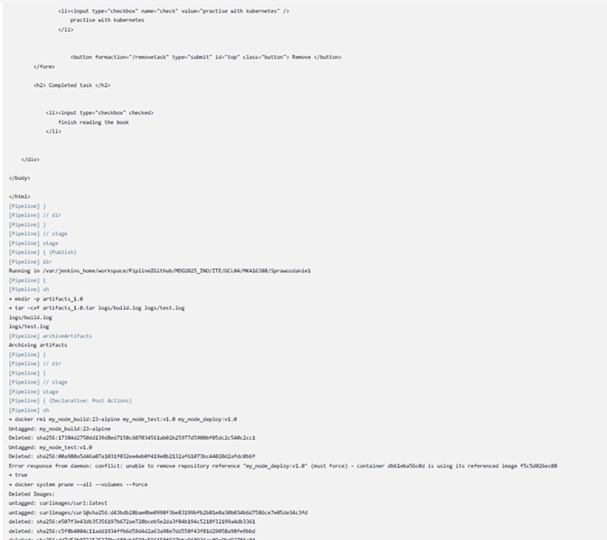

Sprawozdanie nr 2 z Przedmiotu DevOps

Kierunek: Informatyka Techniczna

Grupa 4

Marcin Król

1.Na początku sprawdzilem czy kontenery z poprzednich zajęć działają poprawnie



2.Utworzenie kontenera na podstawie obrazu docker


3.Dockerfile.jenkins
```
FROM jenkins/jenkins:2.492.2-jdk17
USER root
RUN apt-get update && apt-get install -y \
    lsb-release \
    ca-certificates \
    curl \
    apt-transport-https \
    gnupg \
    && curl -fsSL https://download.docker.com/linux/debian/gpg | tee /etc/apt/keyrings/docker.asc \
    && echo "deb [arch=amd64 signed-by=/etc/apt/keyrings/docker.asc] https://download.docker.com/linux/debian $(lsb_release -cs) stable" | tee /etc/apt/sources.list.d/docker.list \
    && apt-get update \
    && apt-get install -y docker-ce docker-ce-cli containerd.io \
    && apt-get clean \
    && rm -rf /var/lib/apt/lists/*
RUN jenkins-plugin-cli --plugins "blueocean docker-workflow"
USER jenkins
EXPOSE 8080
EXPOSE 50000
CMD ["/usr/bin/tini", "--", "/usr/local/bin/jenkins.sh"]
```

4.Uruchomienie Jenkinsa na porcie 8080 oraz utworzenie konta wraz z pobraniem odpowiednich wtyczek


5.Utworzenie projektu który wyświetla uname


6.Projekt który wyświetla błąd jeśli godzina jest nieparzysta

```
#!/bin/bash

HOUR=$(date +%H)
HOUR=$((10#$HOUR))  

if [ $((HOUR % 2)) -ne 0 ]; then
    echo "Błąd: Godzina ($HOUR) jest nieparzysta!"
    exit 1
else
    echo "OK: Godzina ($HOUR) jest parzysta."
    exit 0
fi
```



7.Pobranie obraz kontenera ubuntu za pomoca docker pull


8.Utworzenie projektu Pipline i zrobienie checkoutu dla Dockerfile z poprzedniego sprawozdania

```
pipeline {
    agent any

    stages {
        stage('Checkout') {
            steps {
                sh 'rm -fr MDO2025_INO'
                sh 'git clone https://github.com/InzynieriaOprogramowaniaAGH/MDO2025_INO.git'
                dir("MDO2025_INO"){
                    sh 'git checkout MK416388'
                    sh 'ls -l'  
                }
            }
        }

        stage('Build') {
            steps {
                dir('MDO2025_INO/ITE/GCL04/MK416388/Sprawozdanie1') {
                    sh 'docker rmi -f dummy-builder || true'
                    sh 'docker builder prune --force --all'
                    sh 'docker build -t my_node_build -f Dockerfile.build .'
                }
            }
        }
        
        stage('Test') {
            steps {
                dir('MDO2025_INO/ITE/GCL04/MK416388/Sprawozdanie1') {
                    sh 'docker build -t my_node_test -f Dockerfile.test .'
                }
            }
        }
    }
}
```

9.Logi


10.Pierwsze uruchomienie Pipline 


11.Drugie uruchomienie Pipline 


12.node-js-dummy-test

Repozytorium node-js-dummy-test zostało wybrane ze względu na jego prostotę i lekkość – uruchamia się szybko, ma gotowe pliki Dockerfile i podstawowe testy, co sprawia, że świetnie nadaje się do ćwiczenia procesu CI/CD. Aplikacja działa na Node.js i bez problemu się buduje, dzięki czemu można łatwo zautomatyzować cały proces: od pobrania kodu, przez jego budowę i testowanie, aż po publikację wyników.

13.Diagram aktywności


14.Kompletny Pipline wraz z opisem 

```
pipeline {
    agent any

    environment {
        APP_DIR = 'MDO2025_INO/ITE/GCL04/MK416388/Sprawozdanie1'
        APP_VERSION = '1.0'
        NODE_TAG = '23-alpine'
        BUILD_IMAGE = "my_node_build:${NODE_TAG}"
        TEST_IMAGE = "my_node_test:v${APP_VERSION}"
        DEPLOY_IMAGE = "my_node_deploy:v${APP_VERSION}"
    }

    stages {
        stage('Prepare') {
            steps {
                sh '''
                    rm -fr MDO2025_INO
                    git clone https://github.com/InzynieriaOprogramowaniaAGH/MDO2025_INO.git
                    cd MDO2025_INO
                    git checkout MK416388
                '''
            }
        }
        stage('Logs') {
            steps {
                dir(env.APP_DIR) {
                    sh 'mkdir -p logs'
                }
            }
        }
        stage('Build') {
            steps {
                dir(env.APP_DIR) {
                    sh "docker build -t ${BUILD_IMAGE} -f Dockerfile.build . > logs/build.log 2>&1 || (cat logs/build.log && false)"
                }
            }
        }
        stage('Tests') {
            steps {
                dir(env.APP_DIR) {
                    sh "docker build -t ${TEST_IMAGE} -f Dockerfile.test . > logs/test.log 2>&1 || (cat logs/test.log && false)"
                }
            }
        }
        stage('Deploy') {
            steps {
                sh 'docker network create my_network || true'
                dir(env.APP_DIR) {
                    sh """
                        docker build -t ${DEPLOY_IMAGE} -f Dockerfile.deploy .
                        docker rm -f app || true
                        docker run -d -p 3000:3000 --name app --network my_network ${DEPLOY_IMAGE}
                    """
                }
                sleep(10)
            }
        }
        stage('Test Deployment') {
            steps {
                dir(env.APP_DIR) {
                    sh '''
                        docker run --network my_network --rm curlimages/curl curl -v http://app:3000
                    '''
                }
            }
        }
        stage('Publish') {
            steps {
                dir(env.APP_DIR) {
                    sh """
                        mkdir -p artifacts_${APP_VERSION}
                        tar -cvf artifacts_${APP_VERSION}.tar logs/*.log
                    """
                    archiveArtifacts artifacts: "artifacts_${APP_VERSION}.tar"
                }
            }
        }
    }

    post {
        always {
            sh """
                docker rmi ${BUILD_IMAGE} ${TEST_IMAGE} ${DEPLOY_IMAGE} || true
                docker system prune --all --volumes --force || true
            """
        }
    }
}
```


Pipeline został zaprojektowany z myślą o pełnym cyklu CI/CD: klonowaniu repozytorium, budowaniu aplikacji, testowaniu, wdrażaniu i publikowaniu artefaktów. Wykorzystano kontenerowy Jenkins działający z Docker-in-Docker (DinD), co zapewnia izolację i niezależność środowisk.


**ETAP 1 – Prepare**

Repozytorium jest klonowane z GitHuba na wskazaną gałąź (MK416388)

**Etap 2 – Logs**

Tworzony jest folder logs, w którym zapisywane będą logi z budowania i testowania, umożliwiając analizę ewentualnych błędów

**Etap 3 – Build**

W tym kroku budowany jest obraz my_node_build na podstawie Dockerfile.build

**Etap 4 – Tests**

Budowany jest obraz testowy my_node_test, który zawiera środowisko do uruchomienia testów

**Etap 5 – Deploy**

Budowany jest obraz my_node_deploy, który uruchamiany jest jako kontener app na porcie 3000 w sieci my_network. Dzięki temu możliwa jest komunikacja z innymi kontenerami

**Etap 6 – Test Deployment**

Testowana jest dostępność aplikacji pod adresem http://app:3000

**Etap 7 – Publish**

Plik ten jest publikowany jako wynik działania pipeline’u i może być pobrany z Jenkinsa

**Post – Sprzątanie**

Po zakończeniu działania pipeline’u wszystkie tymczasowe obrazy i dane są usuwane (docker rmi, docker system prune) w celu utrzymania czystości środowiska DinD.


Dockerfile.build

```
FROM node:23-alpine

RUN apk add --no-cache git

RUN git clone https://github.com/devenes/node-js-dummy-test

WORKDIR /node-js-dummy-test

RUN npm install
```

Dockerfile.test

```
FROM my_node_build:23-alpine
WORKDIR /node-js-dummy-test

RUN npm run test

```

Dockerfile.deploy

```
FROM my_node_build:23-alpine

WORKDIR /node-js-dummy-test

CMD ["npm", "start"]
```

**Uruchomienie Pipeline przez Jenkinsfile**

Aby uruchomić pipeline z wykorzystaniem SCM, skonfigurowałem w Jenkinsie nowy projekt typu Pipeline i ustawiłem opcję „Pipeline script from SCM”. Dzięki temu Jenkins automatycznie pobiera skrypt Jenkinsfile bezpośrednio z repozytorium Git, co pozwala na pełną automatyzację procesu – budowanie, testowanie i wdrażanie odbywa się zawsze na aktualnym kodzie, bez potrzeby ręcznego wklejania skryptu do panelu Jenkinsa


**Ukazanie 2 poprawnych uruchomień programu**


**Wyniki z konsoli**





