Sprawozdanie nr 1 z Przedmiotu DevOps

Kierunek: Informatyka Techniczna

Grupa 4

Marcin Król


## Zajecia 8

1.Utworzenie nowej maszyny wirtualnej z użytkownikiem o nazwie:ansible i hostname:ansible-target


2.Utworzenie jak najmniejszego zbioru zainstalowanego oprogramowania


3.Zainstalowanie oprogramowania Ansible na głównej maszynie


4.Reczne zaistalowanie tar i serwera OpenSSH


5.Po utworzeniu drugiej maszyny zmieniamy jej nazwę, a domyślnym użytkownikiem bedzie ansible


6.Zrobienie migawki


7.Na głównej maszynie generujemy klucze RSA potrzebne do połączenia się z drugą maszyną przez SSH


8.Wymieniono klucze SSH pomiędzy użytkownikami na maszynach, aby logowanie przez ssh nie wymagało wpisywania hasła


9.Na maszynie głównej dodajemy odpowiednie rzeczy w pliku /etc/hosts, aby maszyny mogły się nawzajem komunikować za pomocą nazw hostów


10.Podobnie na drugiej maszynie


11.Testujemy połaczenie SSH z kontrolera do targetu


12.Z maszyny głównej pingujemy ansible-target po nazwie


13.To samo na drugiej maszynie


14.Na początek przygotowujemy plik inwentaryzacyjny, który będzie zawierał sekcje orchestrators oraz endpoints

```
[Orchestrators]
vbox ansible_host=10.0.2.15 ansible_user=mkrol 
[Endpoints]
ansible-target ansible_host=192.168.0.188 ansible_user=ansible 
```

15.Na próbę wysyłamy zapytanie ping do wszystkich maszyn


16.Następnie instalujemy narzędzie rngd na obu maszynach


17.Uruchomienie playbooka, który wykonuje polecenia: wysyła ping, aktualizuje pakiety systemowe, restartuje usługi sshd i rngd

```
name: Restarty
  hosts: Endpoints
  become: yes
  tasks:

    - name: Ping do maszyny (test łączności)
      ansible.builtin.ping:

    - name: Skopiuj plik inwentaryzacji na endpointy
      ansible.builtin.copy:
        src: ./inventory.ini
        dest: /home/ansible/inventory.ini
        owner: ansible
        group: ansible
        mode: '0644'

    - name: Zaktualizuj pakiety systemowe
      ansible.builtin.yum:
        name: '*'
        state: latest
      when: ansible_facts['os_family'] == "RedHat"

    - name: Restartuj usługę sshd
      ansible.builtin.systemd:
        name: sshd
        state: restarted
        enabled: yes

    - name: Restartuj usługę rngd
      ansible.builtin.systemd:
        name: rngd
        state: restarted
        enabled: yes
```

18.Uruchomienie powyższego playbooka


19.Uruchomienie playbooka, który instaluje Dockera, pobiera opublikowany obraz z DockerHuba, uruchamia kontener
```
- name: Deploy Docker container on endpoints
  hosts: Endpoints
  become: yes
  tasks:

    - name: Install Docker
      package:
        name: docker
        state: present

    - name: Ensure Docker service is running
      systemd:
        name: docker
        state: started
        enabled: yes

    - name: Pull the Docker image from Docker Hub
      docker_image:
        name: pyonaaa/node-js-dummy-test
        source: pull

    - name: Run the Docker container
      docker_container:
        name: node-js-dummy-test
        image: pyonaaa/node-js-dummy-test:latest
        state: started
        restart_policy: unless-stopped
        ports:
          - "3000:3000"

    - name: Wait for the container to be ready
      wait_for:
        host: localhost
        port: 3000
        delay: 5
        timeout: 30

    - name: Verify that the application is running
      uri:
        url: http://localhost:3000
        method: GET
        status_code: 200

```


20.Podobne uruchomienie, tym razem playbooki są dostosowane do struktury ansible-galaxy

deploy_docker.yml:

```
- name: Deploy Docker container on endpoints
  hosts: Endpoints
  become: yes
  vars:
    docker_image_name: "pyonaaa/node-js-dummy-test"
    docker_image_tag: "latest"
    docker_container_name: "node-js-dummy-test"
    host_port: "3000"
    container_port: "3000"
  roles:
    - deploy_container
```

tasks/main.yml:
```
---
- name: Install Docker
  package:
    name: docker
    state: present

- name: Ensure Docker service is running
  systemd:
    name: docker
    state: started
    enabled: yes

- name: Pull the Docker image from Docker Hub
  docker_image:
    name: "{{ docker_image_name }}"
    source: pull

- name: Run the Docker container
  docker_container:
    name: "{{ docker_container_name }}"
    image: "{{ docker_image_name }}:{{ docker_image_tag }}"
    state: started
    restart_policy: unless-stopped
    ports:
      - "{{ host_port }}:{{ container_port }}"

- name: Wait for the container to be ready
  wait_for:
    host: localhost
    port: "{{ container_port }}"
    delay: 5
    timeout: 30

- name: Verify that the application is running
  uri:
    url: http://localhost:{{ container_port }}
    method: GET
    status_code: 200
 ```

 defaults/main.yml


 ```
 docker_image_name: "pyonaaa/node-js-dummy-test"
docker_image_tag: "latest"
docker_container_name: "node-js-dummy-test"
host_port: "3000"
container_port: "3000"
```


## Zajecia 9

1.Skopiowanie pliku z odpowiedzi na główną maszynę i przypisanie odpowiednich uprawnień do kopii


2.Dodanie wymaganych repozytoriów, skonfigurowanie nowego dysku, zapewnienie jego formatowania oraz ustawienie nazwy hosta


3.Dodanie odpowiednich repozytoriów, skonfigurowanie czystego dysku, zapewnienie formatowania dysku, ustawienie nazwy hosta


4.plik anaconda-ks.cfg
```
# Generated by Anaconda 41.35
# Generated by pykickstart v3.58
#version=DEVEL

# Keyboard layouts
keyboard --vckeymap=us --xlayouts='us'
# System language
lang en_US.UTF-8

repo --name=fedora --baseurl=http://download.fedoraproject.org/pub/fedora/linux/releases/41/Everything/x86_64/os/
repo --name=updates --baseurl=http://download.fedoraproject.org/pub/fedora/linux/updates/41/Everything/x86_64/

%packages
@^server-product-environment

%end

# Run the Setup Agent on first boot
firstboot --enable
skipx

# Generated using Blivet version 3.11.0
ignoredisk --only-use=sda
autopart
# Partition clearing information
clearpart --all  --initlabel
autopart

# System timezone
timezone Europe/Warsaw --utc

network --hostname=non-localhost
rootpw --iscrypted $y$j9T$crVz62v3kzp0Rp3iZuj8c6jt$nse1YNvMC5q.grehgHovKwGQnth8ZHgRt28lvwbhTGA
# User account
user --groups=wheel --name=mkrol --password=$y$j9T$7xQaOvhOAYJEexNAKS4wXH0d$EX6UnztKWwJUE7oQs4d9xZpdbzKwby8G1nbz1cYYj24 --iscrypted --gecos="Marcin Król"
```

5.Plik kickstart dodaje repozytoria, ustawia czysty dysk i zapewnia jego formatowanie przed podziałem na partycje. Zmieniamy nazwę hosta na my_custom_hostname, żeby nie było domyślnego localhost. Na końcu tworzymy użytkownika mkrol z odpowiednimi uprawnieniami i zaszyfrowanym hasłem


6.Uruchomiony system po instalacji, z użytkownikiem i hasłem z pliku odpowiedzi


7.Plik Kickstart instaluje system Fedora, dodaje źródła pakietów, instaluje pakiety takie jak Docker, wget i curl, oraz konfiguruje ustawienia sieciowe. W sekcji %post uruchamia serwis Docker, dodaje użytkownika "mkrol" do grupy Docker, pobiera oraz uruchamia kontener pyonaaa/node-js-dummy-test, tworzy jednostkę systemd, otwiera port 3000 w zaporze sieciowej. Na końcu wykonuje restart systemu i uruchamia środowisko produkcyjne bez potrzeby interakcji użytkownika


```
# Generated by Anaconda 41.35
# Generated by pykickstart v3.58
#version=DEVEL

# Keyboard layouts
keyboard --vckeymap=us --xlayouts='us'
# System language
lang en_US.UTF-8

repo --name=fedora --baseurl=http://download.fedoraproject.org/pub/fedora/linux/releases/41/Everything/x86_64/os/
repo --name=updates --baseurl=http://download.fedoraproject.org/pub/fedora/linux/updates/41/Everything/x86_64/

%packages
@^server-product-environment
docker
%end

# Run the Setup Agent on first boot
firstboot --enable
skipx

# Generated using Blivet version 3.11.0
ignoredisk --only-use=sda
autopart
# Partition clearing information
clearpart --all  --initlabel
autopart

# System timezone
timezone Europe/Warsaw --utc

network --hostname=non-localhost
rootpw --iscrypted $y$j9T$crVz62v3kzp0Rp3iZuj8c6jt$nse1YNvMC5q.grehgHovKwGQnth8ZHgRt28lvwbhTGA
# User account
user --groups=wheel --name=mkrol --password=$y$j9T$7xQaOvhOAYJEexNAKS4wXH0d$EX6UnztKWwJUE7oQs4d9xZpdbzKwby8G1nbz1cYYj24 --iscrypted --gecos="Marcin Król"

%post --log=/root/post-install.log --interpreter=/bin/bash

echo "Docker"
systemctl enable docker
systemctl start docker
usermod -aG docker marcin

echo "Deploy container"
docker pull pyonaaa/node-js-dummy-test:latest

cat <<EOF > /etc/systemd/system/node-js-dummy-test.service
[Unit]
Description=Node.js Application Container
Requires=docker.service
After=docker.service

[Service]
Restart=always
ExecStart=/usr/bin/docker run --rm -p 3000:3000 --name nodeapp pyonaaa/node-js-dummy-test:latest
ExecStop=/usr/bin/docker stop node-js-dummy-test

[Install]
WantedBy=multi-user.target
EOF

systemctl enable node-js-dummy-test.service
firewall-cmd --add-port=3000/tcp --permanent
firewall-cmd --reloadms
```
## Zajecia 10


1.Instalacja Minikube zgodnie z dokumentacją, przy użyciu paczki RPM

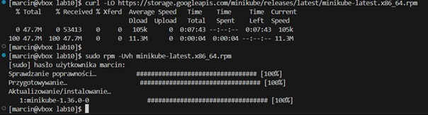

2.Uruchomienie Minikube z konfiguracją sterownika ustawioną na Dockera

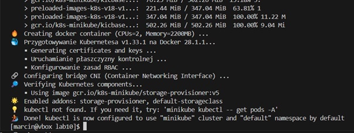

3.Stworzenie aliasu w celu uproszczenia operacji

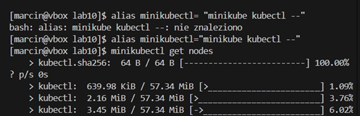

4.Włączenie dashboarda, z automatycznym przekierowaniem portu przez VS Code

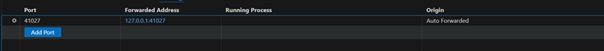

5.Ukazanie działającego Dashboarda

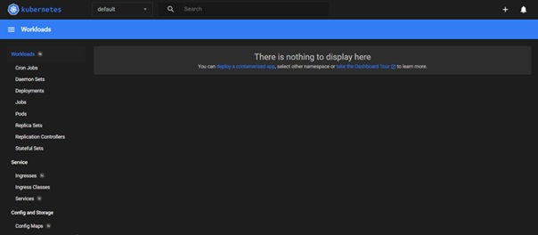

6.Uruchomienie konteneru z obrazu aplikacji 

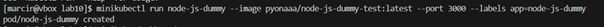

7.Kontener z podem został uruchumiony

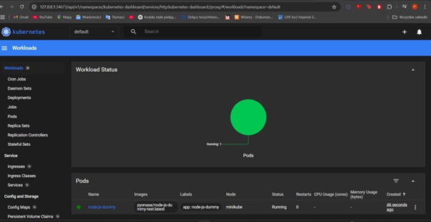

8.Działająca aplikacja

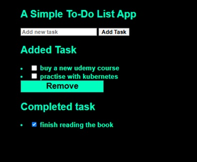

9.deploy.yaml

Plik wdrożenia - deploy.yaml

Ten plik definiuje Deployment dla aplikacji Node.js w Kubernetes. Deployment nosi nazwę node-js-dummy-deployment i składa się z 4 replik podów, które mają etykiety app: node-js-dummy oraz environment: production. Pody działają na obrazie pyonaaa/node-js-dummy-test:latest, nasłuchują na porcie 3000 i ustawiły zmienną środowiskową NODE_ENV na production. Kontenery mają przypisane minimalne zasoby: 64Mi pamięci oraz 250m CPU, a maksymalne limity to 128Mi pamięci i 500m CPU. Polityka restartu została ustawiona na Always, co oznacza, że pody będą automatycznie restartowane, gdy zakończą działanie

```
apiVersion: apps/v1
kind: Deployment
metadata:
  name: node-js-dummy-deployment
  labels:
    app: node-js-dummy
    environment: production

spec:
  replicas: 4
  strategy:
    type: RollingUpdate 
  selector:
    matchLabels:
      app: node-js-dummy-app
  template:
    metadata:
      labels:
        app: node-js-dummy-app
    spec:
      restartPolicy: Always
      containers:
      - name: node-js-dummy-container
        image: pyonaaa/node-js-dummy-test:latest
        ports:
          - containerPort: 3000
            protocol: TCP
        env:
          - name: NODE_ENV
            value: "production"
        resources:
          requests:
            memory: "64Mi"
            cpu: "250m"
          limits:
            memory: "128Mi"
 cpu: "500m"

  ```

 10.Wdrozenie podów 

 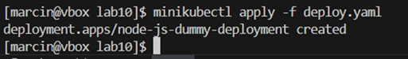

 11.Pody zostały wyświetlone na dashboardzie po uruchomieniu

 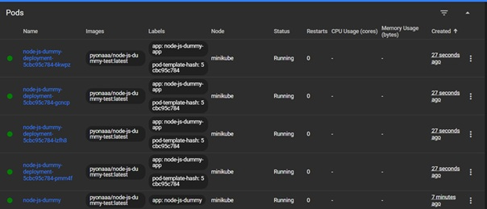

 12.Sprawdzenie statusu

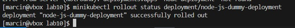

13.wyeksportowanie wdrożenia jako serwis

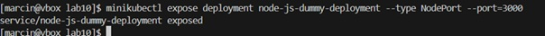

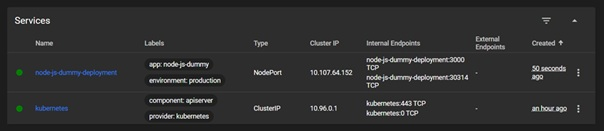

14.Przekierowanie portu do serwisu

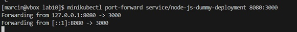


## Zajecia 11

1.wersja latest - z pipeline'u

v2.0 - wadliwa

1.1 - poprawna

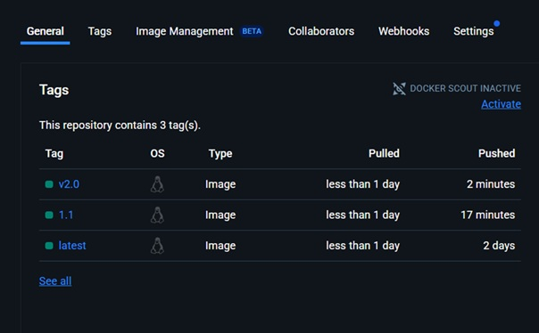

2.Plik deploy.yaml został odpowiednio zmodyfikowany z zajęć 10

3.8 replik

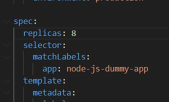

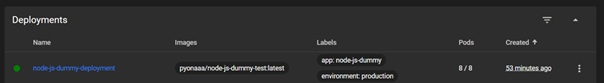

4.1 replika

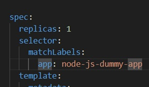

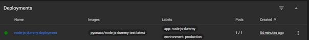

5.0 replik

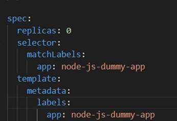

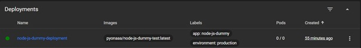

6.4 repliki 

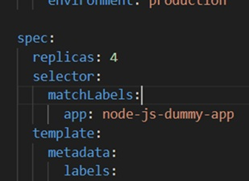

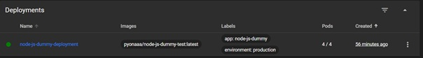

7.Zastosowanie wersji 1.1

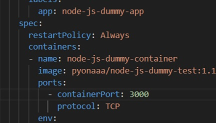

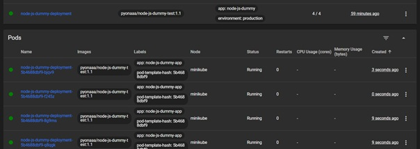

8.Powrót do wczesniejszej wersji obrazu

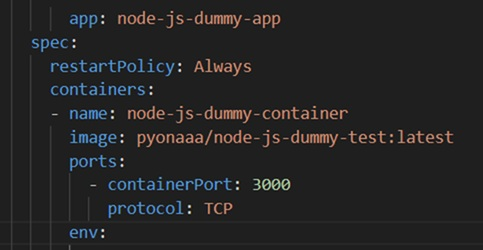

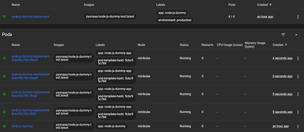

9.Zastosowanie obrazu wadliwego

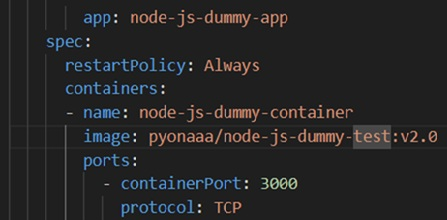

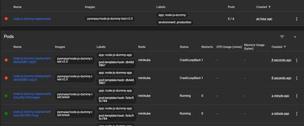

10.Weryfikacja historii wdrożeń dla deploymentu node oraz rollback do poprzedniej wersji

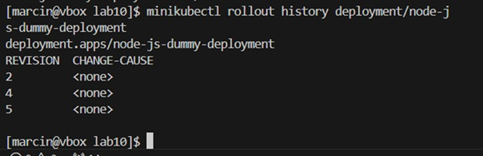


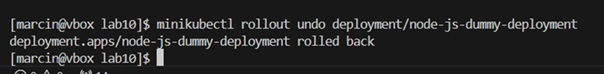


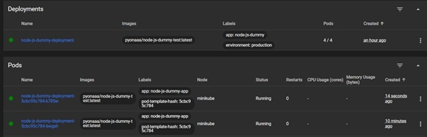

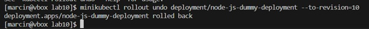

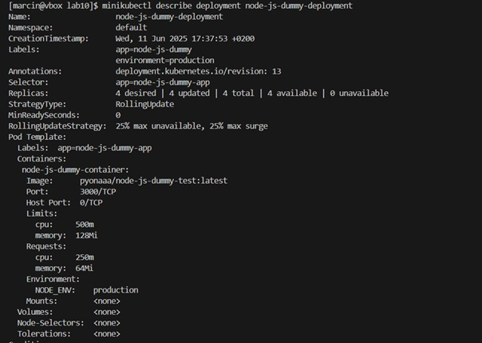

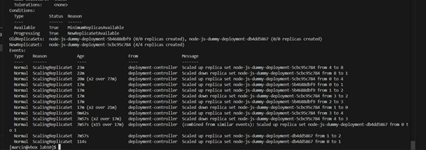

11.Stworzenie skryptu checking.sh, który weryfikuje, czy wdrożenie zakończyło się w ciągu 60 sekund

```
#!/bin/bash

TARGET_DEPLOY="node-deployment"
NS="default"
MAX_WAIT=60
CHECK_INTERVAL=5
ELAPSED_TIME=0

echo "Checking status of deployment: $TARGET_DEPLOY"


while [ $ELAPSED_TIME -lt $MAX_WAIT ]; do
    if minikube kubectl -- rollout status deployment/$TARGET_DEPLOY --namespace $NS --timeout=5s > /dev/null 2>&1; then
        echo "Deployment successful after ${ELAPSED_TIME}s"
        exit 0
    fi

    sleep $CHECK_INTERVAL
    ELAPSED_TIME=$((ELAPSED_TIME + CHECK_INTERVAL))
    echo "Retrying in ${CHECK_INTERVAL}s..."
done

echo "Timeout reached after $MAX_WAIT seconds"
exit 1
```

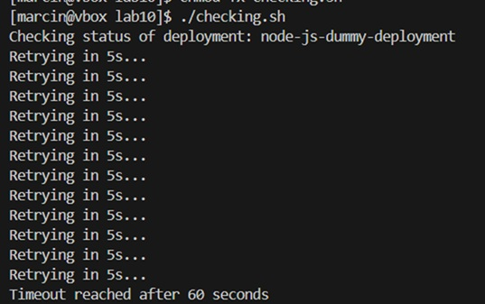

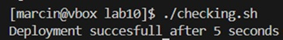

12.Strategia Recreate polega na usunięciu starych podów przed utworzeniem nowych, co skutkuje chwilową niedostępnością aplikacji

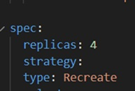

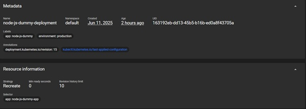

13.Strategia RollingUpdate umożliwia stopniową aktualizację aplikacji, usuwając i tworząc pody jednocześnie, co zapewnia nieprzerwaną dostępność aplikacji

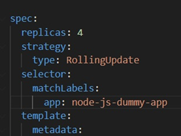

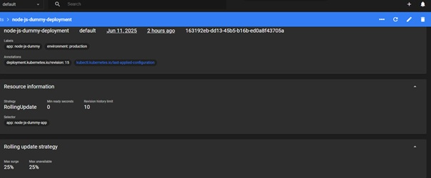

14.Canary Deployment to strategia polegająca na wdrażaniu nowych wersji aplikacji tylko dla części użytkowników, zanim zostaną one udostępnione na całym środowisku produkcyjnym. Umożliwia to testowanie nowej wersji na ograniczonej liczbie podów, co pomaga zminimalizować ryzyko problemów

canary1.yaml

```
apiVersion: apps/v1
kind: Deployment
metadata:
  name: node-js-dummy-deployment
  labels:
    app: node-js-dummy
    environment: production
spec:
  replicas: 1
  selector:
    matchLabels:
      app: node-js-dummy-app
  template:
    metadata:
      labels:
        app: node-js-dummy-app
    spec:
      containers:
        - name: node-js-dummy-container
          image: pyonaaa/node-js-dummy-test:latest
          ports:
          containerPort: 3000  
          

```
canary2.yaml
```
apiVersion: apps/v1
kind: Deployment
metadata:
  name: node-js-dummy-deployment
  labels:
    app: node-js-dummy
    environment: production
spec:
  replicas: 3
  selector:
    matchLabels:
      app: node-js-dummy-app
  template:
    metadata:
      labels:
        app: node-js-dummy-app
    spec:
      containers:
        - name: node-js-dummy-container
          image: pyonaaa/node-js-dummy-test:latest
          ports:
            - containerPort: 3000
```


my_service.yaml

```
apiVersion: v1
kind: Service
metadata:
  name: node-js-dummy-service
spec:
  selector:
    app: node-js-dummy-app
  ports:
    - port: 80
      targetPort: 3000
  type: ClusterIP
```

15.„Plik my_service.yaml tworzy zasób Service dla aplikacji Node.js w Kubernetes. Zasób ten nosi nazwę node-js-dummy-service i używa selektora app: node-js-dummy-app do łączenia z odpowiednimi podami. W sekcji ports określono, że ruch przychodzący na porcie 80 będzie przekierowywany na port 3000 w kontenerach. Typ usługi to ClusterIP, co oznacza, że będzie ona dostępna tylko wewnątrz klastra Kubernete


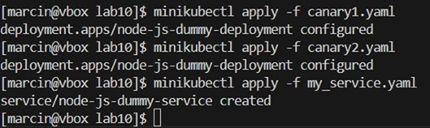

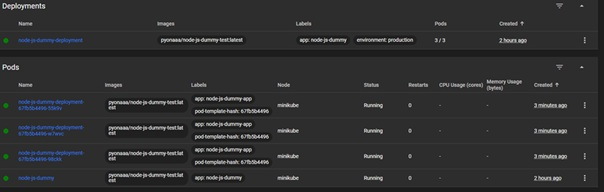
