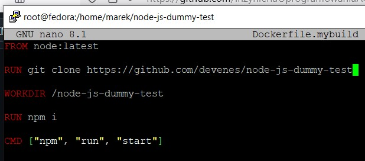
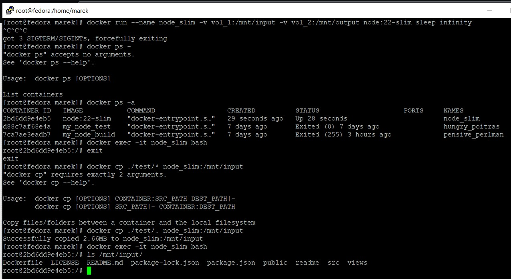

# Sprawozdanie 1

## Lab 1

Instalacja Gita


Sklonowanie repozytorium przez HTTPS


Wygenerowanie klucza SSH


Sklonowanie repozytorium przez SSH


Utworzenie katalogu w odpowiednim branchu


Dodanie skryptu walidującego poprawność nazw commitów do odpowiedniego katalogu z hookami


Jak widać, skrypt działa. Niepoprawna nazwa commita nie jest akceptowana


Poprawny commit


Treść hooka

```bash
#!/bin/bash

INITIALS="MK"
INDEX="416690"

COMMIT_MSG=$(cat "$1")

if ! echo "$COMMIT_MSG" | grep "^$INITIALS & $INDEX"; then
	echo "Blad: Nazwa commitu musi zaczynac sie od $INITIALS & $INDEX"
	exit 1
fi
```
## Lab 2

Poprawnie zainstalowany Docker


Pobrane obrazy z Docker Hub


Uruchomienie kontenera z obrazu busyboxa


Podłączenie się do kontenera i wyświetlenie wersji


Uruchomienie Fedory w kontenerze i pokazanie PID1


Aktualizacja pakietów


Procesy Dockera


Przygotowanie Dockerfile, który będzie tworzył nam kontener z Fedorą, instalował Gita i klonował nasze repozytorium


Zbudowanie obrazu na podstawie Dockerfile


Uruchomienie kontenera z naszego obrazu, jak widać wszystko działa elegancko


Wszystkie kontenery, jak widać uruchomiony i działający jest tylko jeden


Usuwanie wszystkich kontenerów oraz obrazów


## Lab 3

Sklonowanie repozytorium z aplikacją w Node.js (lokalnie, nie w kontenerze)


Zainstalowanie wymaganych zależności


Wykonanie testów jednostkowych


Gotowy obraz Node.js do użycia


Uruchomienie kontenera z obrazu Node i przejście do terminala tegoż kontenera


Sklonowanie repozytorium wewnątrz kontenera, zainstalowanie wymaganych zależności


Wykonanie testów jednostkowych w kontenerze


Dockerfile do zbudowania obrazu naszej aplikacji



```dockerfile
FROM node:latest

RUN git clone https://github.com/devenes/node-js-dummy-test

WORKDIR /node-js-dummy-test

RUN npm i

CMD ["npm", "run", "start"]
```

Dockerfile do zbudowania drugiego obrazu do odpalenia testów jednostkowych aplikacji, który jest budowany na podstawie obrazu stworzonego w poprzednim kroku


```dockerfile
FROM my_node_build

CMD ["npm", "run", "test"]
```

Budowanie pierwszego obrazu z pierwszego Dockerfile


Budowanie drugiego obrazu z drugiego Dockerfile


Uruchomienie kontenerów z obydwu utworzonych przez nas obrazów


## Lab 4

Utworzenie woluminów


Sklonowanie repo


Uruchomienie kontenera z podpiętymi woluminami, skopiowanie poleceniem `docker cp` plików do odpowiedniego katalogu. 
Jak widać, pliki zostały poprawnie skopiowane



Przejście do katalogu, instalacja zależności, skopiowanie do katalogu wyjściowego


Uruchomienie kontenera z podpiętym woluminem wyjściowym, jak widać, znajdują się na nim pliki z poprzedniego kontenera


Tworzymy kolejnym wolumin, podpinamy go do kontenera, w kontenerze klonujemy repo, instalujemy zależności


Podpinamy wolumin 3 do nowego kontenera, jak widać, pliki z poprzedniego kontenera znajdują się na woluminie


Aby uprościć cały ten proces, możemy użyć Dockerfile bo budowania obrazu, który przy uruchamianiu kontenera, będzie podłączał nam woluminy


```dockerfile
FROM node:22

RUN apt-get update && apt-get install -y git

VOLUME /mnt/input
VOLUME /mnt/output

RUN git clone https://github.com/devenes/node-js-dummy-test.git /mnt/input && \
    cd /mnt/input && npm i && cp -r /mnt/input/. /mnt/output && echo "output: $(ls /mnt/output)"

CMD ["node", "/mnt/input/src/index.js"]
```

Jako że woluminy mają trochę słabe nazwy, możemy sobie łatwo sprawdzić gdzie podłączony jest dany wolumin


Podłączamy się do kontenera, instalujemy iperf3


Uruchamiamy serwer iperf3


Na drugim kontenerze też instalujemy iperf3


Sprawdzamy adres IP kontenera z serwerem iperf3


Testujemy połączenie między kontenerami, wszystko fajnie działa


Tworzymy własną sieć, następnie tworzymy kontenery podpięte wyłącznie do tej sieci, testujemy połączenie między nimi, wszystko jest super


Sprawdzamy IP serwera iperf3, łączymy się z nim z hosta, wszystko działa


Pobieramy obraz Jenkinsa, odpalamy kontener z tegoż obrazu z odpowiednimi flagami (zmapowane porty, uprawnienia do uruchomienia Dockera w kontenerze, itp.)


Sprawdzamy domyślny klucz dostępu do Jenkinsa


Logujemy się w przeglądarce uzyskanym kluczem


Instalujemy sugerowane wtyczki


Zakładamy konto admina

