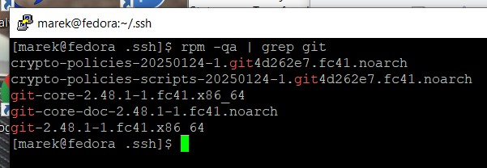
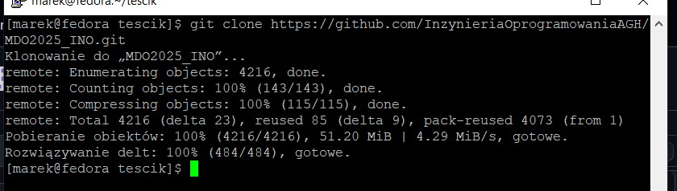
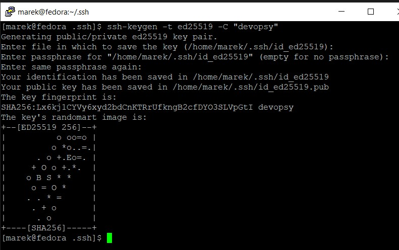
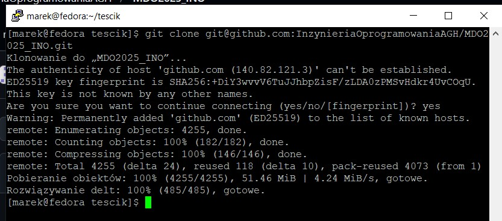
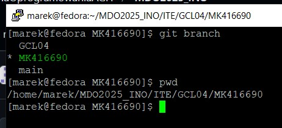
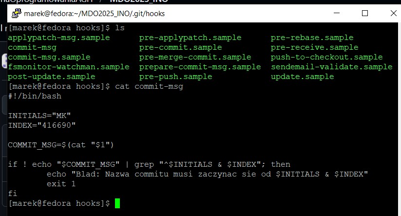
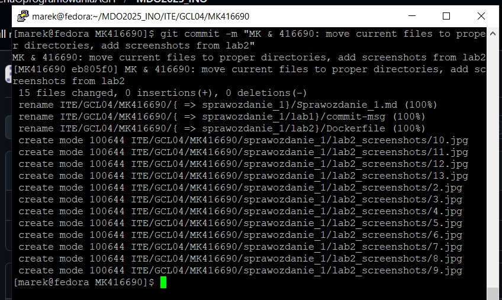
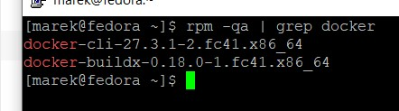
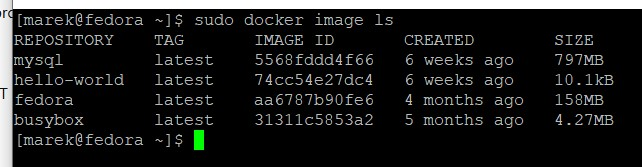
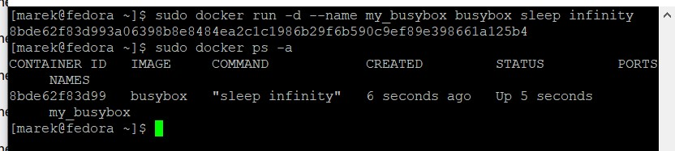

# Sprawozdanie 1

## Lab 1

Instalacja Gita



Sklonowanie repozytorium przez HTTPS



Wygenerowanie klucza SSH



Sklonowanie repozytorium przez SSH



Utworzenie katalogu w odpowiednim branchu



Dodanie skryptu walidującego poprawność nazw commitów do odpowiedniego katalogu z hookami



Jak widać, skrypt działa. Niepoprawna nazwa commita nie jest akceptowana


Poprawny commit



Treść hooka

```bash
#!/bin/bash

INITIALS="MK"
INDEX="416690"

COMMIT_MSG=$(cat "$1")

if ! echo "$COMMIT_MSG" | grep "^$INITIALS & $INDEX"; then
	echo "Blad: Nazwa commitu musi zaczynac sie od $INITIALS & $INDEX"
	exit 1
fi
```
## Lab 2

Poprawnie zainstalowany Docker



Pobrane obrazy z Docker Hub



Uruchomienie kontenera z obrazu busyboxa


