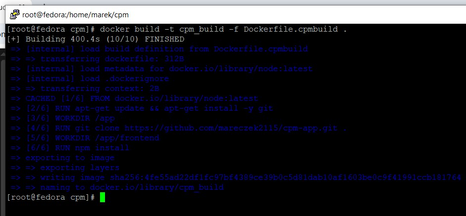
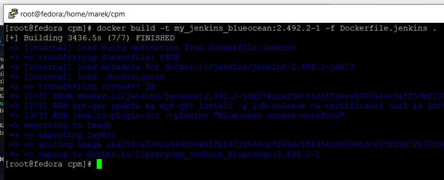
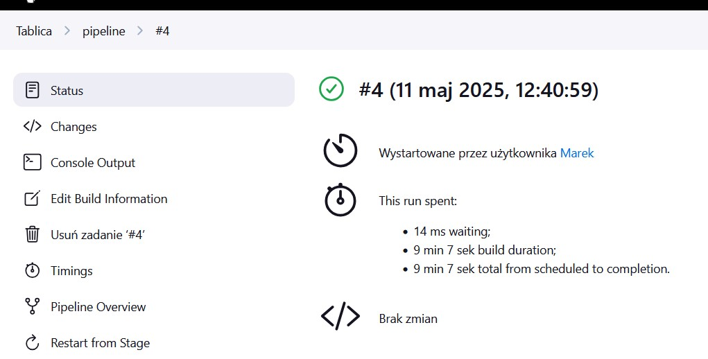

# Sprawozdanie 2

## Lab 5

Z racji zmiany repozytorium użytego do wykonania zadań (wcześniej node-js-dummy-test, teraz własne repozytorium cpm-app), tworzymy nowe Dockerfile i testujemy działanie



Dockerfile.cpmbuild:
```docker
FROM node:latest

RUN apt-get update && apt-get install -y git

WORKDIR /app

RUN git clone https://github.com/mareczek2115/cpm-app.git .

WORKDIR /app/frontend

RUN npm install

CMD ["npm", "run", "dev"]
```


Dockerfile.cpmtest:
```docker
FROM cpm_build

CMD ["npm", "run", "test"]
```


Jak widać, kontenery utworzone ze zbudowanych obrazów działają bez zastrzeżeń


Następnym krokiem jest stworzenie nowej sieci


Pobieramy obraz Docker in Docker (DIND)


Uruchamiamy kontener z pobranego obrazu wraz z odpowiednimi flagami 


Buildujemy obraz Jenkins BlueOcean z odpowiedniego Dockerfile'a



Dockerfile.jenkins
```docker
FROM jenkins/jenkins:2.492.2-jdk17 

USER root

RUN apt-get update && apt-get install -y lsb-release ca-certificates curl && install -m 0755 -d /etc/apt/keyrings && \
    curl -fsSL https://download.docker.com/linux/debian/gpg -o /etc/apt/keyrings/docker.asc && chmod a+r /etc/apt/keyrings/docker.asc && \
    echo "deb [arch=$(dpkg --print-architecture) signed-by=/etc/apt/keyrings/docker.asc] https://download.docker.com/linux/debian \
    $(. /etc/os-release && echo \"$VERSION_CODENAME\") stable" | tee /etc/apt/sources.list.d/docker.list > /dev/null && apt-get update && \
    apt-get install -y docker-ce-cli && apt-get clean && rm -rf /var/lib/apt/lists/*

USER jenkins

RUN jenkins-plugin-cli --plugins "blueocean docker-workflow"
```

Uruchamiamy kontener ze stworzonego przez nas obrazu wraz z odpowiednimi flagami


Uruchamiamy Jenkins w przeglądarce na porcie 8080 dzięki odpowiedniej konfiguracji kontenerów, podajemy defaultowe hasło i instalujemy standardowe pluginy


Wszystko jest ok, mamy dostęp do konsoli Jenkinsa


### Utworzenie i uruchomienie projektów

Wyświetlenie uname


```bash
uname -a
```

Skrypt rzucający błąd jeśli godzina jest nieparzysta


```bash
#!/bin/bash

HOUR=$(date +%H)
HOUR=$((10#$HOUR))  

if [ $((HOUR % 2)) -ne 0 ]; then
    echo "blad: godzina ($HOUR) jest nieparzysta"
    exit 1
else
    echo "ok: godzina ($HOUR) jest parzysta"
    exit 0
fi
```

Pobranie obrazu Ubuntu z Docker Hub


```bash
docker pull ubutu
```

### Utworzenie projektu pipeline'a

```groovy
pipeline {
    agent any

    stages {
        stage('Checkout') {
            steps {
                sh 'rm -rf MDO2025_INO || true'
                
                retry(3) {
                    sh '''
                        git clone --branch MK416690 --depth 1 https://github.com/InzynieriaOprogramowaniaAGH/MDO2025_INO.git
                    '''
                }
            }
        }
        
        stage('Build') {
            steps {
                dir('MDO2025_INO/ITE/GCL04/MK416690/sprawozdanie_2/lab_5') {
                    sh '''
                        docker rmi -f cpm_build || true
                        docker builder prune --force --all || true
                        docker build -t cpm_build -f Dockerfile.cpmbuild .
                    '''
                }
            }
        }
        
        stage('Test') {
            steps {
                dir('MDO2025_INO/ITE/GCL04/MK416690/sprawozdanie_2/lab_5') {
                    sh 'docker build -t cpm_test -f Dockerfile.cpmtest .'
                }
            }
        }
    }
    
    post {
        always {
            sh 'docker system prune --force || true'
        }
    }
}
```

Definiujemy pipeline, który automatyzuje kolejne etapy: pobieranie kodu źródłowego, budowanie oraz testowanie aplikacji. Cały proces jest opisany w jednym pliku konfiguracyjnym, co umożliwia jego powtarzalność i automatyzację.

Pierwszy etap, `Checkout`, usuwa ewentualną istniejącą lokalną kopię repozytorium, a następnie próbuje do trzech razy sklonować wskazaną gałąź MK416690 z repozytorium GitHub, aby zapewnić aktualność kodu.

Następnie w etapie `Build` pipeline przechodzi do określonego katalogu projektu, usuwa lokalny obraz Dockera cpm_build, czyści zalegające dane buildów, a następnie buduje nowy obraz na podstawie pliku Dockerfile.cpmbuild.

Ostatni etap `Test` również działa w tym samym katalogu i buduje obraz testowy na podstawie Dockerfile.cpmtest, który służy do przeprowadzenia testów aplikacji.

W sekcji post zawsze wykonywane jest oczyszczenie środowiska Docker, co pozwala uniknąć zalegających zasobów i zapewnia czystość kolejnych uruchomień pipeline’u.


Uruchomiono pipeline, wszystko przeszło bez żadnych problemów


Stage `Checkout` wykonał się poprawnie


Stage `Build` również wykonał sie poprawnie


Stage `Test` również przeszedł bez problemu


Sekcja post również wykonała się poprawnie


Drugie uruchomienie



## Lab 6 & Lab 7

Do wykonania zadania użyłem mojego repozytorium z lekką aplikacją CPM (wyznaczanie ścieżki krytycznej). Aplikacja działa na Node.js, gdzie automatyzujemy cały proces — od pobrania kodu, przez build i testy, aż do wdrożenia i publikacji.

Pipeline zaczyna się od pobrania najnowszego kodu z wybranej gałęzi repozytorium, dzięki czemu zawsze pracujemy na aktualnych plikach. Następnie budujemy obraz Dockera z aplikacją i robimy testy w osobnym kontenerze, żeby sprawdzić, czy wszystko działa jak trzeba.

W naszym pipeline wykorzystujemy Docker-in-Docker, czyli Docker działa wewnątrz Dockera, co pozwala na izolację i uniknięcie problemów z konfliktami procesów. Minusem jest to, że może być to trochę wolniejsze i trzeba przygotować certyfikaty TLS ze względu na bezpieczeństwo, na plus jednak jest to, że mamy pewność, że środowisko jest czyste i odizolowane. Innym podejściem jest użycie Dockera hosta przez socket, ale na potrzeby tego zadania wybrano podejście z DIND.

### Diagram aktywności


### Diagram wdrożenia


### Opis działania pipeline'u CI/CD dla aplikacji

#### Pipeline

```groovy
pipeline {
    agent any

    environment {
        DOCKER_HOST = "tcp://docker:2376"
        DOCKER_CERT_PATH = "/certs/client"
        DOCKER_TLS_VERIFY = "1"
        APP_DIR = "ITE/GCL04/MK416690/sprawozdanie_2"
        BUILD_IMAGE = "cpm_build"
        TEST_IMAGE = "cpm_test"
        DEPLOY_IMAGE = "cpm_deploy"
    }

    stages {
        stage('Logs') {
            steps {
                dir(env.APP_DIR) {
                    sh 'mkdir -p logs'
                }
            }
        }

        stage('Build') {
            steps {
                dir(env.APP_DIR){
                    script{
                        try{
                            sh "pwd && ls -l"
                            sh "docker build -t ${BUILD_IMAGE} -f Dockerfile.cpmbuild . > logs/build.log 2>&1"
                        } finally{
                            archiveArtifacts artifacts: 'logs/build.log', allowEmptyArchive: true
                        }
                    }
                }
            }
        }

        stage('Test') {
            steps {
                dir(env.APP_DIR) {
                    script{
                        try{
                            sh 'docker build -t ${TEST_IMAGE} -f Dockerfile.cpmtest . > logs/test.log 2>&1'
                            sh 'docker run --rm ${TEST_IMAGE}'
                        } finally{
                            archiveArtifacts artifacts: 'logs/test.log', allowEmptyArchive: true
                        }
                    }
                    
                }
            }
        }

        stage('Deploy') {
            steps {
                dir(env.APP_DIR) {
                    sh """
                        docker build -t ${DEPLOY_IMAGE} -f Dockerfile.cpmdeploy .
                        docker run -d --name cpm_app -p 3000:3000 ${DEPLOY_IMAGE}
                        sleep 5
                    """
                }
            }
        }

        stage('Test Deploy') {
            steps {
                dir(env.APP_DIR) {
                    sh """
                        docker exec cpm_app curl -s http://localhost:3000 || (echo 'Smoke test failed' && false)
                    """  
                }
            }
        }

        stage('Publish') {
            steps {
                dir(env.APP_DIR) {
                    sh """
                        mkdir -p artifacts
                        docker save ${DEPLOY_IMAGE} -o artifacts/cpm_build.tar
                    """
                    archiveArtifacts artifacts: 'artifacts/cpm_build.tar', fingerprint: true
                }
            }
        }
    }

    post {
        always {
            sh "docker container rm -f cpm_app || true"
            sh "docker image rm ${BUILD_IMAGE} ${TEST_IMAGE} || true"
            sh "docker system prune -af || true"
        }
    }
}
```

Pipeline automatatyzuje budowanie, testowanie oraz wdrażanie wybranej aplikacji. Składa się z kilku etapów wykonujących operacje krok po kroku na świeżym kodzie z GitHuba. Wykorzystanie Dockera zapewnia czystość środowiska i powtarzalność działania niezależnie od platformy.

`Logs`

Pierwszy etap tworzy katalog logs, w którym zapisywane są pliki logów z kolejnych kroków — budowania oraz testowania.

`Build`

W etapie budowy pipeline buduje nowy obraz na podstawie pliku Dockerfile.cpmbuild. Cały proces budowania jest zapisywany w pliku build.log, który jest archiwizowany i dostępny do późniejszej analizy.

Dockerfile.cpmbuild:

```docker
FROM node:latest

WORKDIR /app

RUN apt-get update && apt-get install -y git
RUN git clone https://github.com/mareczek2115/cpm-app.git .

WORKDIR /app/frontend

RUN npm ci
RUN npm run build

CMD ["echo", "Build completed"]
```

`Test`

Następnie pipeline tworzy obraz testowy według Dockerfile.cpmtest i uruchamia go, wykonując testy aplikacji. Logi testów trafiają do pliku test.log i również są archiwizowane.

Dockerfile.cpmtest:

```docker
FROM cpm_build as test

WORKDIR /app/frontend

CMD ["npm", "run", "test"]
```

`Deploy`

Po pomyślnym przejściu testów budowany jest obraz produkcyjny z Dockerfile.cpmdeploy, a aplikacja uruchamiana jest w kontenerze cpm_app na porcie 3000. Dodany jest krótki czas oczekiwania, aby dać aplikacji możliwość prawidłowego uruchomienia.

Dockerfile.cpmdeploy:

```docker
FROM node:latest

WORKDIR /app

RUN apt-get update && apt-get install -y curl
RUN npm install -g serve

COPY --from=cpm_build /app/frontend/dist ./dist

CMD ["serve", "-s", "dist"]
```

`Test Deploy`

Pipeline wykonuje test wdrożeniowy (smoke test) za pomocą kontenera curlimages/curl, który wysyła żądanie HTTP do działającej aplikacji i sprawdza odpowiedź.

`Publish`

Na zakończenie pipeline tworzy katalog artifacts, do którego zapisuje obraz buildowy w archiwum cpm_build.tar. Archiwum jest publikowane jako artefakt dostępny do pobrania i dalszej analizy.

`Post – Cleanup`

Bez względu na wynik pipeline’a, wykonywane jest sprzątanie środowiska — usuwane są wszystkie obrazy i kontenery powstałe podczas działania pipeline’a oraz czyszczone są nieużywane zasoby Dockera. Dzięki temu środowisko pozostaje czyste i gotowe do kolejnych uruchomień.


### Uruchomienie pipeline przez Jenkins


Konfigurujemy pipeline w Jenkinsie, wskazując repozytorium Git i konkretną gałąź MK416690 do pobrania kodu. Określamy też dokładną ścieżkę do pliku Jenkinsfile w repozytorium, żeby pipeline uruchamiał się z właściwego podkatalogu.

### Efekt uruchomienia


Jak widać, nasz pipeline zakończył się sukcesem. Wszystkie stage wykonały się pomyślnie, na końcu dostajemy 3 artefakty: naszą zbudowaną aplikację, logi buildowania oraz logi testów.


### Output z konsoli


Poprawne buildowanie aplikacji


Testy aplikacji zakończone sukcesem


Deployment naszej aplikacji


Test deploya: curlem zaciągamy naszą aplikację, poprawnie dostajemy HTMLa


Zapisanie artefaktu w postaci builda naszej aplikacji


Post actions: usunięcie kontenera, czyszczenie obrazów, czyścimy wszystkie pozostałe rzeczy (kontenery, sieci, wolumenty obrazy) które nie są używane

### Logi

### build.log

```bash
#0 building with "default" instance using docker driver

#1 [internal] load build definition from Dockerfile.cpmbuild
#1 transferring dockerfile: 330B done
#1 DONE 0.1s

#2 [internal] load metadata for docker.io/library/node:latest
#2 DONE 1.1s

#3 [internal] load .dockerignore
#3 transferring context: 2B done
#3 DONE 0.1s

#4 [1/7] FROM docker.io/library/node:latest@sha256:c332080545f1de96deb1c407e6fbe9a7bc2be3645e127845fdcce57a7af3cf56
#4 resolve docker.io/library/node:latest@sha256:c332080545f1de96deb1c407e6fbe9a7bc2be3645e127845fdcce57a7af3cf56 0.1s done
#4 sha256:d0c5b0ce15e235be311696e7561f13b75d2ce0b3495dc051e44f890beba293b6 2.49kB / 2.49kB done
#4 sha256:ac646c3c87d58b7162ea45f42d20f37455ade929b81e204904c71ae96596f10c 6.42kB / 6.42kB done
#4 sha256:3e6b9d1a95114e19f12262a4e8a59ad1d1a10ca7b82108adcf0605a200294964 0B / 48.49MB 0.1s
#4 sha256:37927ed901b1b2608b72796c6881bf645480268eca4ac9a37b9219e050bb4d84 0B / 24.02MB 0.1s
#4 sha256:79b2f47ad4443652b9b5cc81a95ede249fd976310efdbee159f29638783778c0 0B / 64.40MB 0.1s
#4 sha256:c332080545f1de96deb1c407e6fbe9a7bc2be3645e127845fdcce57a7af3cf56 5.14kB / 5.14kB done
#4 sha256:3e6b9d1a95114e19f12262a4e8a59ad1d1a10ca7b82108adcf0605a200294964 10.49MB / 48.49MB 0.3s
#4 sha256:3e6b9d1a95114e19f12262a4e8a59ad1d1a10ca7b82108adcf0605a200294964 23.07MB / 48.49MB 0.4s
#4 sha256:3e6b9d1a95114e19f12262a4e8a59ad1d1a10ca7b82108adcf0605a200294964 42.99MB / 48.49MB 0.6s
#4 sha256:37927ed901b1b2608b72796c6881bf645480268eca4ac9a37b9219e050bb4d84 3.15MB / 24.02MB 0.6s
#4 sha256:3e6b9d1a95114e19f12262a4e8a59ad1d1a10ca7b82108adcf0605a200294964 48.23MB / 48.49MB 0.7s
#4 sha256:37927ed901b1b2608b72796c6881bf645480268eca4ac9a37b9219e050bb4d84 7.34MB / 24.02MB 0.7s
#4 sha256:37927ed901b1b2608b72796c6881bf645480268eca4ac9a37b9219e050bb4d84 24.02MB / 24.02MB 0.9s
#4 sha256:79b2f47ad4443652b9b5cc81a95ede249fd976310efdbee159f29638783778c0 4.19MB / 64.40MB 1.0s
#4 sha256:79b2f47ad4443652b9b5cc81a95ede249fd976310efdbee159f29638783778c0 12.58MB / 64.40MB 1.2s
#4 sha256:37927ed901b1b2608b72796c6881bf645480268eca4ac9a37b9219e050bb4d84 24.02MB / 24.02MB 1.2s done
#4 sha256:79b2f47ad4443652b9b5cc81a95ede249fd976310efdbee159f29638783778c0 20.97MB / 64.40MB 1.3s
#4 sha256:3e6b9d1a95114e19f12262a4e8a59ad1d1a10ca7b82108adcf0605a200294964 48.49MB / 48.49MB 1.3s done
#4 sha256:79b2f47ad4443652b9b5cc81a95ede249fd976310efdbee159f29638783778c0 28.31MB / 64.40MB 1.4s
#4 extracting sha256:3e6b9d1a95114e19f12262a4e8a59ad1d1a10ca7b82108adcf0605a200294964 0.1s
#4 sha256:e23f099911d692f62b851cf49a1e93294288a115f5cd2d014180e4d3684d34ab 0B / 211.36MB 1.4s
#4 sha256:2d83ef83188b7c8022436cde9662d9e6a0f00ae0cb4147b3978d45c293b90637 0B / 3.32kB 1.4s
#4 sha256:79b2f47ad4443652b9b5cc81a95ede249fd976310efdbee159f29638783778c0 39.85MB / 64.40MB 1.6s
#4 sha256:e23f099911d692f62b851cf49a1e93294288a115f5cd2d014180e4d3684d34ab 14.68MB / 211.36MB 1.7s
#4 sha256:79b2f47ad4443652b9b5cc81a95ede249fd976310efdbee159f29638783778c0 49.28MB / 64.40MB 1.8s
#4 sha256:79b2f47ad4443652b9b5cc81a95ede249fd976310efdbee159f29638783778c0 56.62MB / 64.40MB 2.0s
#4 sha256:e23f099911d692f62b851cf49a1e93294288a115f5cd2d014180e4d3684d34ab 36.70MB / 211.36MB 2.0s
#4 sha256:2d83ef83188b7c8022436cde9662d9e6a0f00ae0cb4147b3978d45c293b90637 3.32kB / 3.32kB 1.9s done
#4 sha256:45b194cca635afabcd66e22aadca09a6fa106e43b9d4d3ae0336a2e7fad80d80 0B / 58.40MB 2.0s
#4 sha256:79b2f47ad4443652b9b5cc81a95ede249fd976310efdbee159f29638783778c0 62.91MB / 64.40MB 2.1s
#4 sha256:e23f099911d692f62b851cf49a1e93294288a115f5cd2d014180e4d3684d34ab 48.23MB / 211.36MB 2.2s
#4 sha256:45b194cca635afabcd66e22aadca09a6fa106e43b9d4d3ae0336a2e7fad80d80 4.19MB / 58.40MB 2.2s
#4 sha256:45b194cca635afabcd66e22aadca09a6fa106e43b9d4d3ae0336a2e7fad80d80 9.44MB / 58.40MB 2.3s
#4 sha256:45b194cca635afabcd66e22aadca09a6fa106e43b9d4d3ae0336a2e7fad80d80 14.68MB / 58.40MB 2.4s
#4 sha256:e23f099911d692f62b851cf49a1e93294288a115f5cd2d014180e4d3684d34ab 65.01MB / 211.36MB 2.6s
#4 sha256:45b194cca635afabcd66e22aadca09a6fa106e43b9d4d3ae0336a2e7fad80d80 27.26MB / 58.40MB 2.6s
#4 sha256:45b194cca635afabcd66e22aadca09a6fa106e43b9d4d3ae0336a2e7fad80d80 30.41MB / 58.40MB 2.7s
#4 sha256:79b2f47ad4443652b9b5cc81a95ede249fd976310efdbee159f29638783778c0 64.40MB / 64.40MB 2.6s done
#4 sha256:e23f099911d692f62b851cf49a1e93294288a115f5cd2d014180e4d3684d34ab 77.59MB / 211.36MB 3.0s
#4 sha256:45b194cca635afabcd66e22aadca09a6fa106e43b9d4d3ae0336a2e7fad80d80 38.80MB / 58.40MB 3.0s
#4 sha256:db907a11de46da5dcf432fd5791c4eaf810ebab2ae8a6a6f8853c08ad2ac7bba 0B / 1.25MB 3.0s
#4 sha256:45b194cca635afabcd66e22aadca09a6fa106e43b9d4d3ae0336a2e7fad80d80 47.19MB / 58.40MB 3.3s
#4 sha256:e23f099911d692f62b851cf49a1e93294288a115f5cd2d014180e4d3684d34ab 93.32MB / 211.36MB 3.5s
#4 sha256:45b194cca635afabcd66e22aadca09a6fa106e43b9d4d3ae0336a2e7fad80d80 54.53MB / 58.40MB 3.5s
#4 sha256:db907a11de46da5dcf432fd5791c4eaf810ebab2ae8a6a6f8853c08ad2ac7bba 1.25MB / 1.25MB 3.3s done
#4 sha256:52b7ac13fc22156cae8570cd553ce34df03849ad1981878144f4b1c51fb361ac 0B / 447B 3.5s
#4 sha256:52b7ac13fc22156cae8570cd553ce34df03849ad1981878144f4b1c51fb361ac 447B / 447B 3.5s done
#4 sha256:45b194cca635afabcd66e22aadca09a6fa106e43b9d4d3ae0336a2e7fad80d80 58.40MB / 58.40MB 3.7s
#4 sha256:e23f099911d692f62b851cf49a1e93294288a115f5cd2d014180e4d3684d34ab 110.10MB / 211.36MB 3.9s
#4 sha256:45b194cca635afabcd66e22aadca09a6fa106e43b9d4d3ae0336a2e7fad80d80 58.40MB / 58.40MB 3.8s done
#4 sha256:e23f099911d692f62b851cf49a1e93294288a115f5cd2d014180e4d3684d34ab 126.88MB / 211.36MB 4.2s
#4 sha256:e23f099911d692f62b851cf49a1e93294288a115f5cd2d014180e4d3684d34ab 140.51MB / 211.36MB 4.4s
#4 sha256:e23f099911d692f62b851cf49a1e93294288a115f5cd2d014180e4d3684d34ab 159.38MB / 211.36MB 4.6s
#4 sha256:e23f099911d692f62b851cf49a1e93294288a115f5cd2d014180e4d3684d34ab 177.21MB / 211.36MB 4.9s
#4 sha256:e23f099911d692f62b851cf49a1e93294288a115f5cd2d014180e4d3684d34ab 196.08MB / 211.36MB 5.3s
#4 sha256:e23f099911d692f62b851cf49a1e93294288a115f5cd2d014180e4d3684d34ab 211.36MB / 211.36MB 5.9s
#4 sha256:e23f099911d692f62b851cf49a1e93294288a115f5cd2d014180e4d3684d34ab 211.36MB / 211.36MB 5.9s done
#4 extracting sha256:3e6b9d1a95114e19f12262a4e8a59ad1d1a10ca7b82108adcf0605a200294964 4.9s done
#4 extracting sha256:37927ed901b1b2608b72796c6881bf645480268eca4ac9a37b9219e050bb4d84
#4 extracting sha256:37927ed901b1b2608b72796c6881bf645480268eca4ac9a37b9219e050bb4d84 0.8s done
#4 extracting sha256:79b2f47ad4443652b9b5cc81a95ede249fd976310efdbee159f29638783778c0 0.1s
#4 extracting sha256:79b2f47ad4443652b9b5cc81a95ede249fd976310efdbee159f29638783778c0 3.3s done
#4 extracting sha256:e23f099911d692f62b851cf49a1e93294288a115f5cd2d014180e4d3684d34ab
#4 extracting sha256:e23f099911d692f62b851cf49a1e93294288a115f5cd2d014180e4d3684d34ab 5.1s
#4 extracting sha256:e23f099911d692f62b851cf49a1e93294288a115f5cd2d014180e4d3684d34ab 9.0s done
#4 extracting sha256:2d83ef83188b7c8022436cde9662d9e6a0f00ae0cb4147b3978d45c293b90637 done
#4 extracting sha256:45b194cca635afabcd66e22aadca09a6fa106e43b9d4d3ae0336a2e7fad80d80 0.1s
#4 extracting sha256:45b194cca635afabcd66e22aadca09a6fa106e43b9d4d3ae0336a2e7fad80d80 3.2s done
#4 extracting sha256:db907a11de46da5dcf432fd5791c4eaf810ebab2ae8a6a6f8853c08ad2ac7bba 0.0s done
#4 extracting sha256:52b7ac13fc22156cae8570cd553ce34df03849ad1981878144f4b1c51fb361ac done
#4 DONE 23.5s

#5 [2/7] WORKDIR /app
#5 DONE 0.1s

#6 [3/7] RUN apt-get update && apt-get install -y git
#6 0.285 Get:1 http://deb.debian.org/debian bookworm InRelease [151 kB]
#6 0.343 Get:2 http://deb.debian.org/debian bookworm-updates InRelease [55.4 kB]
#6 0.385 Get:3 http://deb.debian.org/debian-security bookworm-security InRelease [48.0 kB]
#6 0.412 Get:4 http://deb.debian.org/debian bookworm/main amd64 Packages [8793 kB]
#6 1.829 Get:5 http://deb.debian.org/debian bookworm-updates/main amd64 Packages [512 B]
#6 1.830 Get:6 http://deb.debian.org/debian-security bookworm-security/main amd64 Packages [265 kB]
#6 2.722 Fetched 9313 kB in 2s (3735 kB/s)
#6 2.722 Reading package lists...
#6 3.219 Reading package lists...
#6 3.697 Building dependency tree...
#6 3.815 Reading state information...
#6 3.976 git is already the newest version (1:2.39.5-0+deb12u2).
#6 3.976 0 upgraded, 0 newly installed, 0 to remove and 3 not upgraded.
#6 DONE 4.5s

#7 [4/7] RUN git clone https://github.com/mareczek2115/cpm-app.git .
#7 0.214 Cloning into '.'...
#7 DONE 1.1s

#8 [5/7] WORKDIR /app/frontend
#8 DONE 0.2s

#9 [6/7] RUN npm ci
#9 2.488 npm warn deprecated rimraf@2.7.1: Rimraf versions prior to v4 are no longer supported
#9 3.061 npm warn deprecated glob@7.2.3: Glob versions prior to v9 are no longer supported
#9 3.195 npm warn deprecated inflight@1.0.6: This module is not supported, and leaks memory. Do not use it. Check out lru-cache if you want a good and tested way to coalesce async requests by a key value, which is much more comprehensive and powerful.
#9 9.671 
#9 9.671 > frontend@0.0.0 postinstall
#9 9.671 > patch-package
#9 9.671 
#9 9.844 patch-package 8.0.0
#9 9.846 Applying patches...
#9 9.851 vue-material-design-icons@5.3.1 ✔
#9 9.864 
#9 9.864 added 362 packages, and audited 363 packages in 10s
#9 9.865 
#9 9.865 109 packages are looking for funding
#9 9.865   run `npm fund` for details
#9 9.867 
#9 9.867 found 0 vulnerabilities
#9 9.869 npm notice
#9 9.869 npm notice New minor version of npm available! 11.3.0 -> 11.4.1
#9 9.869 npm notice Changelog: https://github.com/npm/cli/releases/tag/v11.4.1
#9 9.869 npm notice To update run: npm install -g npm@11.4.1
#9 9.869 npm notice
#9 DONE 10.5s

#10 [7/7] RUN npm run build
#10 0.297 
#10 0.297 > frontend@0.0.0 build
#10 0.297 > vue-tsc -b && vite build
#10 0.297 
#10 3.895 vite v6.3.4 building for production...
#10 4.030 transforming...
#10 5.917 ✓ 199 modules transformed.
#10 6.064 rendering chunks...
#10 6.070 computing gzip size...
#10 6.077 dist/index.html                   0.45 kB │ gzip:  0.30 kB
#10 6.077 dist/assets/index-D2aOO9op.css    3.80 kB │ gzip:  1.33 kB
#10 6.078 dist/assets/index-Db7DlxmW.js   125.55 kB │ gzip: 48.48 kB
#10 6.078 ✓ built in 2.14s
#10 DONE 6.2s

#11 exporting to image
#11 exporting layers
#11 exporting layers 2.4s done
#11 writing image sha256:a44bf9b6f90e7eb7a1da490dd2bd4e2cf68c9b8573fa79102b50bfa1e61b967f done
#11 naming to docker.io/library/cpm_build done
#11 DONE 2.4s
```

### test.log

```bash
#0 building with "default" instance using docker driver

#1 [internal] load build definition from Dockerfile.cpmtest
#1 transferring dockerfile: 179B done
#1 WARN: FromAsCasing: 'as' and 'FROM' keywords' casing do not match (line 1)
#1 DONE 0.1s

#2 [internal] load metadata for docker.io/library/cpm_build:latest
#2 DONE 0.0s

#3 [internal] load .dockerignore
#3 transferring context: 2B done
#3 DONE 0.0s

#4 [1/2] FROM docker.io/library/cpm_build:latest
#4 DONE 0.4s

#5 [2/2] WORKDIR /app/frontend
#5 DONE 0.5s

#6 exporting to image
#6 exporting layers 0.1s done
#6 writing image sha256:6e9a44134b54a97bfcdce21ac81cc3345c8a3fedd473540bcd9f517e6f893829 done
#6 naming to docker.io/library/cpm_test done
#6 DONE 0.1s
```
