# Sprawozdanie 3

## Lab 8

### Instalacja Ansible oraz przygotowanie środowiska

Na początku na głównej maszynie instalowane jest Ansible

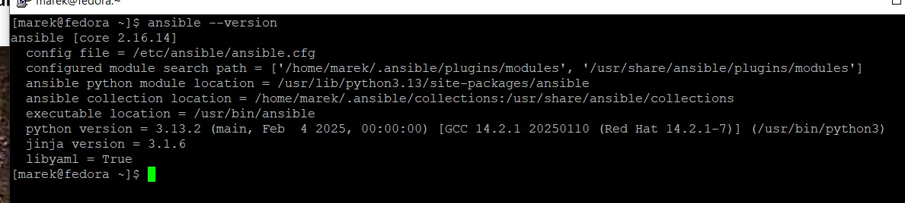

Po stworzeniu drugiej maszyny oraz zainstalowaniu na niej Fedory, zmieniamy nazwę tej maszyny, domyślnym użytkownikiem z którego będziemy korzystać na tej maszynie jest konto `ansible`

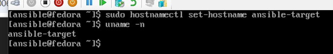

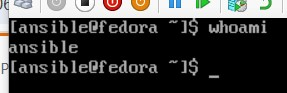

Sprawdzamy aktywność ssh oraz czy zainstalowane jest narzędzie tar

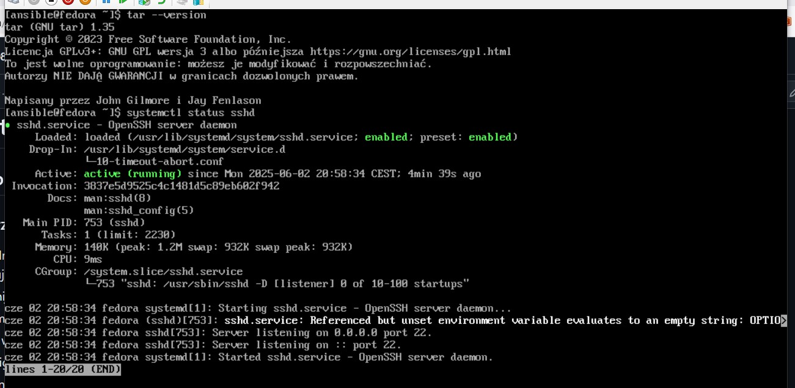

Na głównej maszynie generujemy klucze RSA potrzebne do połączenia się z drugą maszyną przez SSH

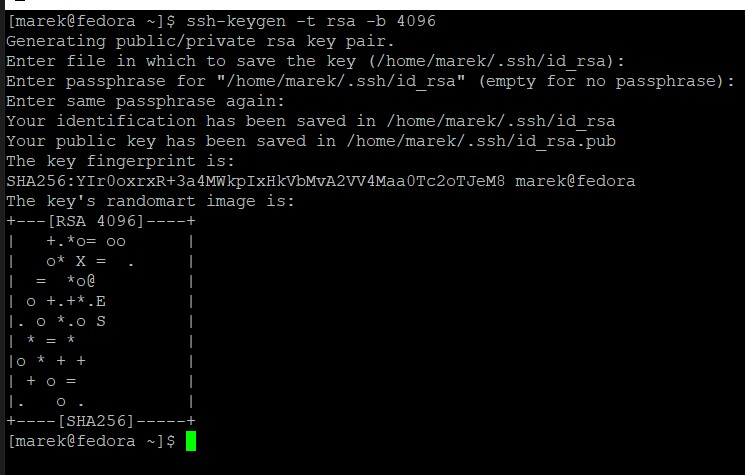

Wymiana kluczy SSH między maszyną kontrolną a maszyną docelową za pomocą narzędzia ssh-copy-id, umożliwia bezhasłowe logowanie SSH

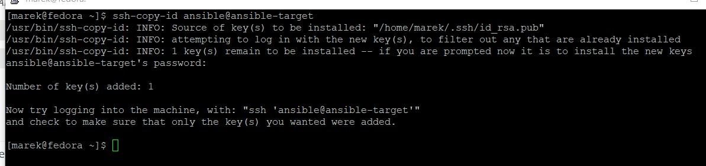

Testujemy połaczenie SSH z kontrolera do targetu, działa bez problemu

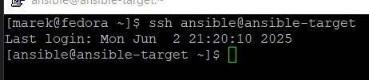

Na maszynie głównej dodajemy odpowiednie wpisy w /etc/hosts, aby maszyny mogły bez problemu komunikować się za pomocą nazw maszyn

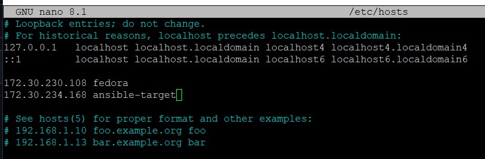

To samo na drugiej maszynie

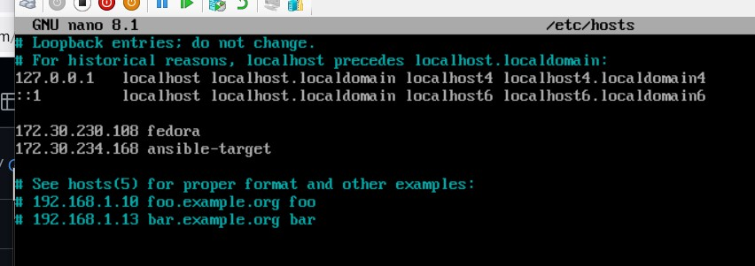

Z maszyny głównej pingujemy `ansible-target` po nazwie, dostajemy poprawną zwrotkę z drugiej maszyny

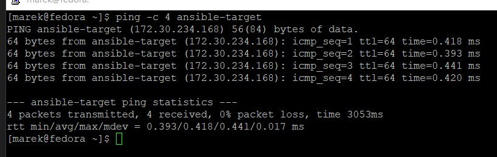

To samo robimy na drugiej maszynie - pingujemy `fedora`, dostajemy poprawne odpowiedzi

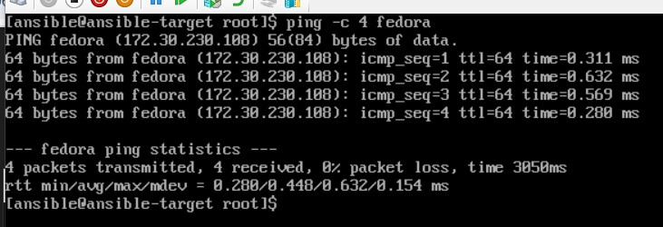

### Inwentaryzacja

Na początku tworzymy plik inwentaryzacji z sekcjami `orchestrators` i `endpoints`

```ini
[orchestrators]
fedora ansible_user=marek

[endpoints]
ansible-target ansible_user=ansible
```

Testowo wysyłamy żądanie `ping` do wszystkich hostów

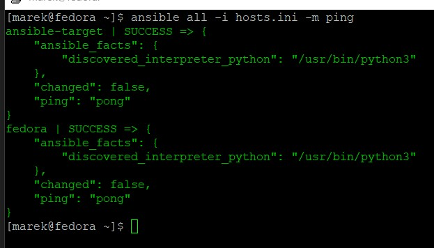

### Zdalne wywołanie procedur

Na początku zainstalowano narzędzie `rngd`, zarówno na głównej maszynie, jak i na targecie 

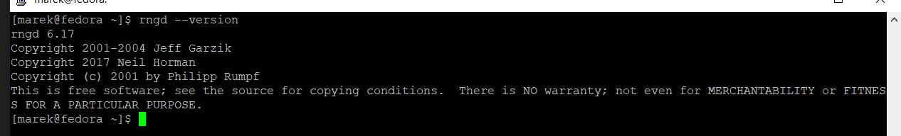

Kolejnym krokiem jest stworzenie playbooka. Playbook wysyła pinga do wszystkich maszyn, kopiuje plik inwentaryzacji na maszynę `ansible-target`, aktualizuje pakiety w systemie oraz restartuje usługi sshd oraz rngd

```yaml
- hosts: all
  become: yes
  tasks:
    - name: Ping machines
      ping:

    - name: Copy files
      copy:
        src: /home/marek/playbook.yml
        dest: /home/ansible/
      when: inventory_hostname == 'ansible-target'

    - name: Update packages
      package:
        name: "*"
        state: latest
    
    - name: Restart sshd
      service:
        name: sshd
        state: restarted

    - name: Restart rngd
      service:
        name: rngd
        state: restarted
```

<!-- 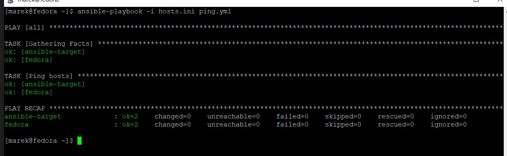

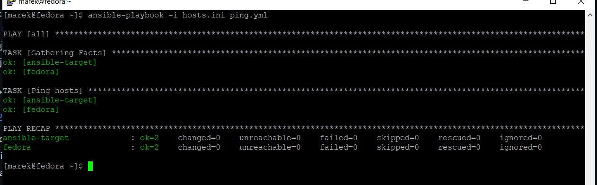 -->

Pierwsze uruchomienie playbooka

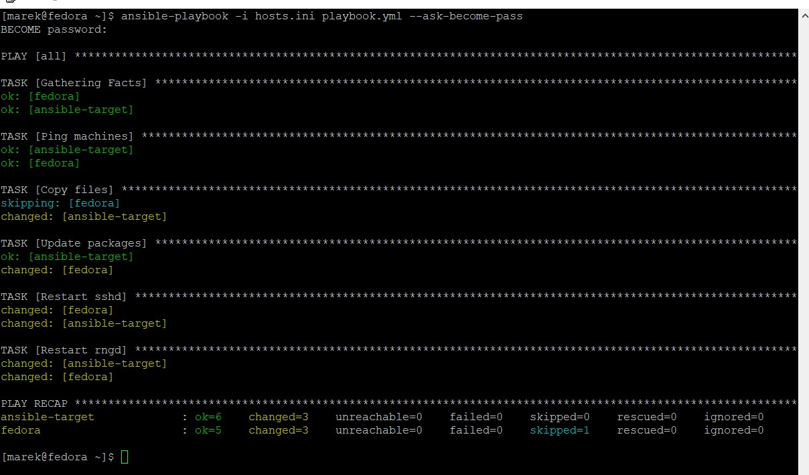

Drugie uruchomienie playbooka

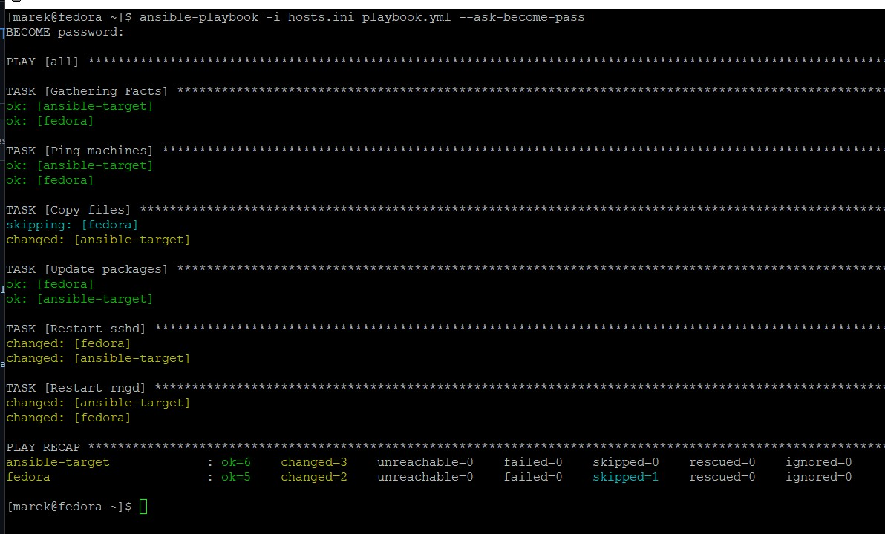

Testowo wyłączamy SSH na `ansible-target`

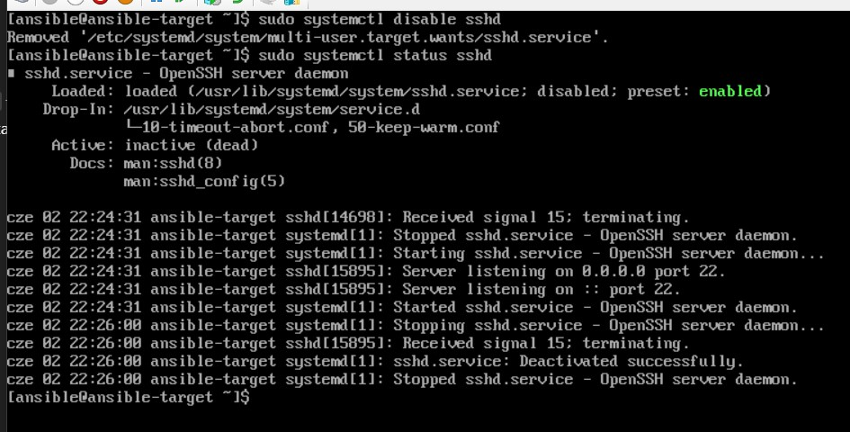

Sprawdzamy kolejne uruchomienie playbooka, jak widać nasza druga maszyna jest unreachable, więc wszystkie zadania wykonują się tylko na głównej maszynie

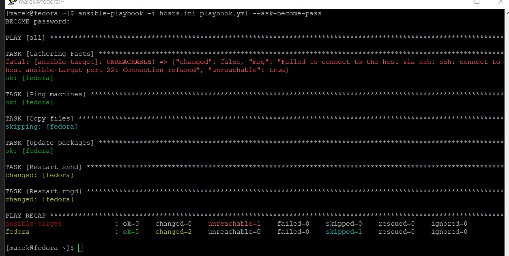

### Zarządzanie stworzony artefaktem

Artefaktem wygenerowanym przez pipeline jest archiwum .tar zawierające kompletny obraz Dockera. Zawiera on wszystkie warstwy, metadane i manifesty potrzebne do odtworzenia obrazu na dowolnej maszynie z Dockerem.

Na początku tworzymy playbooka który zawiera wszystkie potrzebne kroki do odpalenia obrazu na `ansible-target`

```yaml
- name: Deploy prebuilt Docker image and run container
  hosts: endpoints
  vars:
    artifact_local_path: /home/marek/cpm_build.tar
    artifact_remote_path: /home/ansible/cpm_build.tar 
    container_name: cpm_deploy
    image_name: cpm_deploy
    app_port: 3000

  tasks:
    - name: Copy docker image tarball to remote host
      copy:
        src: "{{ artifact_local_path }}"
        dest: "{{ artifact_remote_path }}"

    - name: Remove old container if exists
      docker_container:
        name: "{{ container_name }}"
        state: absent
        force_kill: yes

    - name: Remove old image if exists
      docker_image:
        name: "{{ image_name }}"
        state: absent
        force_absent: yes

    - name: Load docker image from tarball
      command: docker load -i "{{ artifact_remote_path }}"

    - name: Run container
      docker_container:
        name: "{{ container_name }}"
        image: "{{ image_name }}"
        state: started
        ports:
          - "{{ app_port }}:{{ app_port }}"
        pull: no
```

Odpalamy nasz playbook, jak widać wszystkie taski zostały wykonane poprawnie

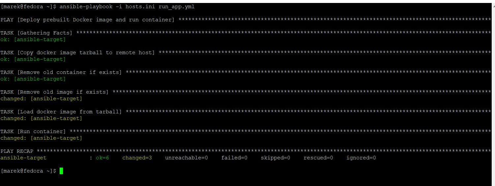

Testowo odpalamy w przeglądarce naszą apkę, wszystko działa bez zarzutu

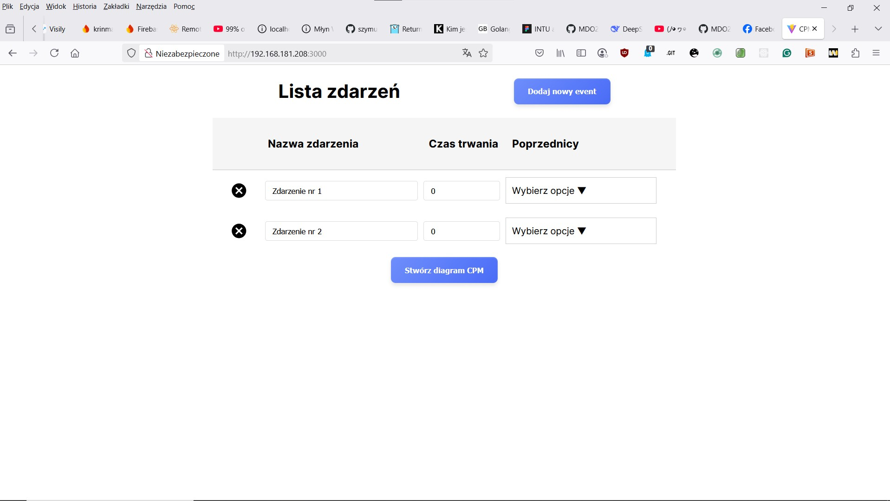

Logi z kontenera zawierającego naszą aplikację

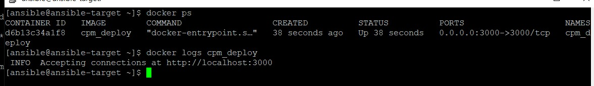

Kolejno stworzono rolę `deploy_cpm_app`, strukturę katalogów i plików dla roli Ansible. 

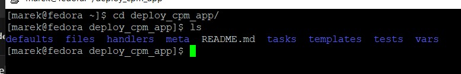

Konfiguracja tego wszystkiego wygląda następująco:

defaults/main.yml

```yaml
artifact_local_path: /home/marek/cpm_build.tar
artifact_remote_path: /home/ansible/cpm_build.tar
container_name: cpm_deploy
image_name: cpm_deploy
app_port: 3000
```

tasks/docker.yml

```yaml
- name: Install dnf-plugins-core
  dnf:
    name: dnf-plugins-core
    state: present

- name: Add Docker CE repo
  command: dnf-3 config-manager --add-repo https://download.docker.com/linux/fedora/docker-ce.repo
  args:
    creates: /etc/yum.repos.d/docker-ce.repo

- name: Install Docker packages
  dnf:
    name:
      - docker-ce
      - docker-ce-cli
      - containerd.io
      - docker-buildx-plugin
      - docker-compose-plugin
    state: present

- name: Enable and start Docker service
  systemd:
    name: docker
    enabled: yes
    state: started
```

tasks/container.yml

```yaml
- name: Copy docker image tarball to remote host
  copy:
    src: "{{ artifact_local_path }}"
    dest: "{{ artifact_remote_path }}"

- name: Remove old container if exists
  docker_container:
    name: "{{ container_name }}"
    state: absent
    force_kill: yes

- name: Remove old image if exists
  docker_image:
    name: "{{ image_name }}"
    state: absent
    force_absent: yes

- name: Load docker image from tarball
  command: docker load -i "{{ artifact_remote_path }}"

- name: Run container
  docker_container:
    name: "{{ container_name }}"
    image: "{{ image_name }}"
    state: started
    ports:
      - "{{ app_port }}:{{ app_port }}"
    pull: no
```

tasks/clean.yml

```yaml
- name: Stop container
  docker_container:
    name: "{{ container_name }}"
    state: stopped
    force_kill: true

- name: Remove container
  docker_container:
    name: "{{ container_name }}"
    state: absent
```

tasks/requests.yml

```yaml
- name: Install pip3
  command: dnf -y install python3-pip
  become: yes


- name: Install requests
  command: pip3 install requests
  become: yes
```

tasks/main.yml

```yaml
- name: Install Docker on target host
  import_tasks: docker.yml

- name: Install python3-requests on target host
  import_tasks: requests.yml

- name: Deploy container from tarball
  import_tasks: container.yml

- name: Clean up container
  import_tasks: clean.yml
```

Obok folderu `roles` zawierającego naszą rolę, stworzono również jeszcze jeden plik:

```yaml
- name: Deploy CPM app container
  hosts: endpoints
  become: yes
  become_method: sudo
  roles:
    - deploy_cpm_app
```

Odpalamy całą tę zautomatyzowaną konfigurację, jak widać wszystko działa elegancko, wszystkie kroki wykonują się poprawnie

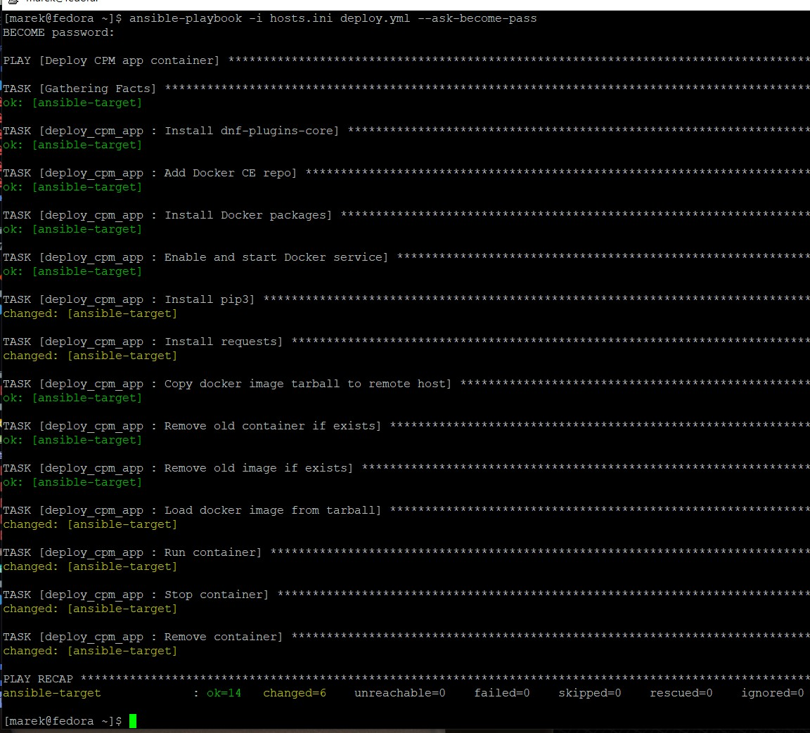

## Lab 9

anaconda-ks.cfg:

```cfg
# Generated by Anaconda 41.35
# Generated by pykickstart v3.58
#version=DEVEL

# Keyboard layouts
keyboard --vckeymap=us --xlayouts='us'
# System language
lang pl_PL.UTF-8

repo --name=fedora --baseurl=http://download.fedoraproject.org/pub/fedora/linux/releases/41/Everything/x86_64/os/
repo --name=updates --baseurl=http://download.fedoraproject.org/pub/fedora/linux/updates/41/Everything/x86_64/


%packages
@^custom-environment

%end

# Run the Setup Agent on first boot
firstboot --enable
# Do not configure the X Window System
skipx

# Generated using Blivet version 3.11.0
ignoredisk --only-use=sda
# System bootloader configuration
bootloader --location=mbr --boot-drive=sda
autopart
# Partition clearing information
clearpart --all --initlabel --drives=sda

# System timezone
timezone Europe/Warsaw --utc

network --hostname=rogal_ddl

# Root password
rootpw --iscrypted $y$j9T$b2DtvHN/QOO96Jm7qeNegaLP$T4zrpEVTg7itvAX6uYuf4/K3ytfS61TZ.4kba5SkUp5
user --groups=wheel --name=marek --password=$y$j9T$Cr2SxBjChaLJAPgF0FBDbMWz$TujpGXLkHO4DXhZ7N0/aaa2zmFfJgxB6Mgcq4ZecEX/ --iscrypted
```

## Lab 10

## Lab 11