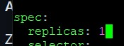
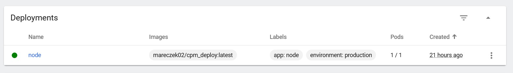

# Sprawozdanie 3

## Lab 8

### Instalacja Ansible oraz przygotowanie środowiska

Na początku na głównej maszynie instalowane jest Ansible


Po stworzeniu drugiej maszyny oraz zainstalowaniu na niej Fedory, zmieniamy nazwę tej maszyny, domyślnym użytkownikiem z którego będziemy korzystać na tej maszynie jest konto `ansible`


Sprawdzamy aktywność ssh oraz czy zainstalowane jest narzędzie tar


Na głównej maszynie generujemy klucze RSA potrzebne do połączenia się z drugą maszyną przez SSH


Wymiana kluczy SSH między maszyną kontrolną a maszyną docelową za pomocą narzędzia ssh-copy-id, umożliwia bezhasłowe logowanie SSH


Testujemy połaczenie SSH z kontrolera do targetu, działa bez problemu


Na maszynie głównej dodajemy odpowiednie wpisy w /etc/hosts, aby maszyny mogły bez problemu komunikować się za pomocą nazw maszyn


To samo na drugiej maszynie


Z maszyny głównej pingujemy `ansible-target` po nazwie, dostajemy poprawną zwrotkę z drugiej maszyny


To samo robimy na drugiej maszynie - pingujemy `fedora`, dostajemy poprawne odpowiedzi


### Inwentaryzacja

Na początku tworzymy plik inwentaryzacji z sekcjami `orchestrators` i `endpoints`

```ini
[orchestrators]
fedora ansible_user=marek

[endpoints]
ansible-target ansible_user=ansible
```

Testowo wysyłamy żądanie `ping` do wszystkich hostów


### Zdalne wywołanie procedur

Na początku zainstalowano narzędzie `rngd`, zarówno na głównej maszynie, jak i na targecie 


Kolejnym krokiem jest stworzenie playbooka. Playbook wysyła pinga do wszystkich maszyn, kopiuje plik inwentaryzacji na maszynę `ansible-target`, aktualizuje pakiety w systemie oraz restartuje usługi sshd oraz rngd

```yaml
- hosts: all
  become: yes
  tasks:
    - name: Ping machines
      ping:

    - name: Copy files
      copy:
        src: /home/marek/playbook.yml
        dest: /home/ansible/
      when: inventory_hostname == 'ansible-target'

    - name: Update packages
      package:
        name: "*"
        state: latest
    
    - name: Restart sshd
      service:
        name: sshd
        state: restarted

    - name: Restart rngd
      service:
        name: rngd
        state: restarted
```

<!-- 

 -->

Pierwsze uruchomienie playbooka


Drugie uruchomienie playbooka


Testowo wyłączamy SSH na `ansible-target`


Sprawdzamy kolejne uruchomienie playbooka, jak widać nasza druga maszyna jest unreachable, więc wszystkie zadania wykonują się tylko na głównej maszynie


### Zarządzanie stworzony artefaktem

Artefaktem wygenerowanym przez pipeline jest archiwum .tar zawierające kompletny obraz Dockera. Zawiera on wszystkie warstwy, metadane i manifesty potrzebne do odtworzenia obrazu na dowolnej maszynie z Dockerem.

Na początku tworzymy playbooka który zawiera wszystkie potrzebne kroki do odpalenia obrazu na `ansible-target`

```yaml
- name: Deploy prebuilt Docker image and run container
  hosts: endpoints
  vars:
    artifact_local_path: /home/marek/cpm_build.tar
    artifact_remote_path: /home/ansible/cpm_build.tar 
    container_name: cpm_deploy
    image_name: cpm_deploy
    app_port: 3000

  tasks:
    - name: Copy docker image tarball to remote host
      copy:
        src: "{{ artifact_local_path }}"
        dest: "{{ artifact_remote_path }}"

    - name: Remove old container if exists
      docker_container:
        name: "{{ container_name }}"
        state: absent
        force_kill: yes

    - name: Remove old image if exists
      docker_image:
        name: "{{ image_name }}"
        state: absent
        force_absent: yes

    - name: Load docker image from tarball
      command: docker load -i "{{ artifact_remote_path }}"

    - name: Run container
      docker_container:
        name: "{{ container_name }}"
        image: "{{ image_name }}"
        state: started
        ports:
          - "{{ app_port }}:{{ app_port }}"
        pull: no
```

Odpalamy nasz playbook, jak widać wszystkie taski zostały wykonane poprawnie


Testowo odpalamy w przeglądarce naszą apkę, wszystko działa bez zarzutu


Logi z kontenera zawierającego naszą aplikację


Kolejno stworzono rolę `deploy_cpm_app`, strukturę katalogów i plików dla roli Ansible. 


Konfiguracja tego wszystkiego wygląda następująco:

defaults/main.yml

```yaml
artifact_local_path: /home/marek/cpm_build.tar
artifact_remote_path: /home/ansible/cpm_build.tar
container_name: cpm_deploy
image_name: cpm_deploy
app_port: 3000
```

tasks/docker.yml

```yaml
- name: Install dnf-plugins-core
  dnf:
    name: dnf-plugins-core
    state: present

- name: Add Docker CE repo
  command: dnf-3 config-manager --add-repo https://download.docker.com/linux/fedora/docker-ce.repo
  args:
    creates: /etc/yum.repos.d/docker-ce.repo

- name: Install Docker packages
  dnf:
    name:
      - docker-ce
      - docker-ce-cli
      - containerd.io
      - docker-buildx-plugin
      - docker-compose-plugin
    state: present

- name: Enable and start Docker service
  systemd:
    name: docker
    enabled: yes
    state: started
```

tasks/container.yml

```yaml
- name: Copy docker image tarball to remote host
  copy:
    src: "{{ artifact_local_path }}"
    dest: "{{ artifact_remote_path }}"

- name: Remove old container if exists
  docker_container:
    name: "{{ container_name }}"
    state: absent
    force_kill: yes

- name: Remove old image if exists
  docker_image:
    name: "{{ image_name }}"
    state: absent
    force_absent: yes

- name: Load docker image from tarball
  command: docker load -i "{{ artifact_remote_path }}"

- name: Run container
  docker_container:
    name: "{{ container_name }}"
    image: "{{ image_name }}"
    state: started
    ports:
      - "{{ app_port }}:{{ app_port }}"
    pull: no
```

tasks/clean.yml

```yaml
- name: Stop container
  docker_container:
    name: "{{ container_name }}"
    state: stopped
    force_kill: true

- name: Remove container
  docker_container:
    name: "{{ container_name }}"
    state: absent
```

tasks/requests.yml

```yaml
- name: Install pip3
  command: dnf -y install python3-pip
  become: yes


- name: Install requests
  command: pip3 install requests
  become: yes
```

tasks/main.yml

```yaml
- name: Install Docker on target host
  import_tasks: docker.yml

- name: Install python3-requests on target host
  import_tasks: requests.yml

- name: Deploy container from tarball
  import_tasks: container.yml

- name: Clean up container
  import_tasks: clean.yml
```

Obok folderu `roles` zawierającego naszą rolę, stworzono również jeszcze jeden plik:

```yaml
- name: Deploy CPM app container
  hosts: endpoints
  become: yes
  become_method: sudo
  roles:
    - deploy_cpm_app
```

Odpalamy całą tę zautomatyzowaną konfigurację, jak widać wszystko działa elegancko, wszystkie kroki wykonują się poprawnie


## Lab 9

Celem ćwiczeń jest stworzenie automatycznego procesu instalacji systemu Fedora za pomocą pliku odpowiedzi, który pozwala na nienadzorowaną instalację. Dodatkowo, po zainstalowaniu systemu, należy uruchomić aplikację lub kontener Docker, aby środowisko testowe było gotowe od razu po uruchomieniu maszyny.

### Plik `anaconda-ks.cfg`

Na początku na starej maszynie skopiowano plik odpowiedzi i nadano mu odpowiednie uprawnienia.


### Edycja pliku odpowiedzi

Po zapoznaniu się z dokumentacją, wykonano szereg działań, które obejmowały dodanie niezbędnych repozytoriów, skonfigurowanie czystego dysku oraz zapewnienie pełnego formatowania całego dysku. Dodatkowo, ustawiono odpowiednią nazwę hosta, aby dostosować środowisko do wymagań projektu.

`anaconda-ks.cfg`:

```cfg
# Generated by Anaconda 41.35
# Generated by pykickstart v3.58
#version=DEVEL

# Keyboard layouts
keyboard --vckeymap=us --xlayouts='us'
# System language
lang pl_PL.UTF-8

repo --name=fedora --baseurl=http://download.fedoraproject.org/pub/fedora/linux/releases/41/Everything/x86_64/os/
repo --name=updates --baseurl=http://download.fedoraproject.org/pub/fedora/linux/updates/41/Everything/x86_64/

%packages
@^server-product-environment
@^desktop-environment

%end

# Run the Setup Agent on first boot
firstboot --enable
# Do not configure the X Window System
skipx

# Generated using Blivet version 3.11.0
ignoredisk --only-use=sda
autopart
# Partition clearing information
clearpart --all  --initlabel
autopart

# System timezone
timezone Europe/Warsaw --utc

network --hostname=rogal-ddl

# Root password
rootpw --iscrypted $y$j9T$b2DtvHN/QOO96Jm7qeNegaLP$T4zrpEVTg7itvAX6uYuf4/K3ytfS61TZ.4kba5SkUp5
user --groups=wheel --name=marek --password=$y$j9T$Cr2SxBjChaLJAPgF0FBDbMWz$TujpGXLkHO4DXhZ7N0/aaa2zmFfJgxB6Mgcq4ZecEX/ --iscrypted
```

### Instalacja

Plik został dodany do zdalnego repozytorium, teraz bierzemy URL do tego pliku i podajemy je w GRUBie jako plik odpowiedzi, który chcemy użyć


Rozpoczynamy instalację


System został zainstalowany


Uruchamiamy świeży system, logujemy się, wszystko działa elegancko


### Rozszerzenie pliku odpowiedzi

Plik Kickstart przeprowadza automatyczną instalację systemu Fedora, dodając wymagane repozytoria, pakiety (Docker, wget, curl) oraz konfigurując sieć. W sekcji %post skrypty uruchamiają Dockera, dodają użytkownika marek do grupy Docker, a także pobierają i uruchamiają kontener cpm_deploy używając obrazu mareczek02/devopsy:latest zaciągnietego z Docker Hub. Tworzony jest serwis systemd, który zapewnia automatyczny start aplikacji po restarcie systemu. Dodatkowo, otwieramy port 3000 w firewallu, aby umożliwić dostęp do aplikacji z zewnątrz. Na końcu system jest restartowany, co kończy całą konfigurację i uruchamia środowisko produkcyjne bez interakcji użytkownika.

`anaconda-ks2.cfg`:

```cfg
# Generated by Anaconda 41.35
# Generated by pykickstart v3.58
#version=DEVEL

# Keyboard layouts
keyboard --vckeymap=us --xlayouts='us'
# System language
lang pl_PL.UTF-8

repo --name=fedora --baseurl=http://download.fedoraproject.org/pub/fedora/linux/releases/41/Everything/x86_64/os/
repo --name=updates --baseurl=http://download.fedoraproject.org/pub/fedora/linux/updates/41/Everything/x86_64/

%packages
@^server-product-environment

wget
curl
docker

%end

# Run the Setup Agent on first boot
firstboot --enable
# Do not configure the X Window System
skipx

# Generated using Blivet version 3.11.0
ignoredisk --only-use=sda
autopart
# Partition clearing information
clearpart --all  --initlabel
autopart

# System timezone
timezone Europe/Warsaw --utc

network --hostname=rogal-ddl

# Root password
rootpw --iscrypted $y$j9T$b2DtvHN/QOO96Jm7qeNegaLP$T4zrpEVTg7itvAX6uYuf4/K3ytfS61TZ.4kba5SkUp5
user --groups=wheel --name=marek --password=$y$j9T$Cr2SxBjChaLJAPgF0FBDbMWz$TujpGXLkHO4DXhZ7N0/aaa2zmFfJgxB6Mgcq4ZecEX/ --iscrypted

%post --log=/root/post-install.log --interpreter=/bin/bash
systemctl enable --now docker
systemctl start docker

usermod -aG docker marek

docker pull mareczek02/devopsy:latest

cat <<EOF > /etc/systemd/system/cpmdeploy.service
[Unit]
Description=Vue Application Docker Container
Requires=docker.service
After=docker.service

[Service]
Restart=always
ExecStart=/usr/bin/docker run --rm -p 3000:3000 --name cpm_deploy mareczek02/devopsy
ExecStop=/usr/bin/docker stop cpm_deploy

[Install]
WantedBy=multi-user.target
EOF

systemctl enable cpmdeploy.service
firewall-cmd --permanent --add-port=3000/tcp
firewall-cmd --reload

%end

reboot
```

Zanim jednak rozpoczniemy instalację systemu z nowym plikiem odpowiedzi, wypchniemy obraz naszej apki, tak aby faktycznie serwis był w stanie zaciągnąć obraz z Docker Huba


Uruchamiamy system po instalacji, logujemy się, jak widać w systemie jest już uruchomiony kontener oraz zpullowany obraz


## Lab 10

Ćwiczenie polegało na zainstalowaniu aplikacji w lokalnym Kubernetesie przez Minikube. Skonfigurowaliśmy środowisko, przygotowaliśmy pliki do deployu, uruchomiliśmy kontenery i sprawdziliśmy usługi.

### Instalacja klastra Kubernetes

Instalujemy Kubernetesa, uruchamiamy go i sprawdzamy status usługi


Dodajemy odpowiedni alias w systemie, aby łatwiej odpalać komendy


Uruchamiamy dashboard


### Uruchomienie oprogramowania

Uruchamiamy kontener z naszego obrazu w Kubernetesie i wystawiamy port 3000, następnie wyświetlamy pod z ich aktualnym stanem


Jak widać w dashboardzie, nasz kontener pracuje


Również widać, że w przeglądarce mamy dostęp do naszej aplikacji bez żadnego problemu


### Plik wdrożenia

```yaml
apiVersion: apps/v1
kind: Deployment
metadata:
  name: node
  labels:
    app: node
    environment: production

spec:
  replicas: 4
  selector:
    matchLabels:
      app: CPM-App
  template:
    metadata:
      labels:
        app: CPM-App
    spec:
      restartPolicy: Always
      containers:
      - name: cpm-app-container
        image: mareczek02/devopsy:latest
        ports:
          - containerPort: 3000
            protocol: TCP
        env:
          - name: NODE_ENV
            value: "production"
        resources:
          requests:
            memory: "64Mi"
            cpu: "250m"
          limits:
            memory: "128Mi"
            cpu: "500m"
```

Ten plik YAML definiuje Deployment w Kubernetes, który odpowiada za uruchomienie i skalowanie aplikacji w kontenerach.
 - apiVersion: apps/v1 określa wersję API, której używamy do tworzenia Deploymentu.
 - kind: Deployment wskazuje, że mamy do czynienia z zasobem, który zarządza replikami podów.
 - Sekcja metadata zawiera podstawowe informacje o Deploymentcie, takie jak jego nazwa (node) oraz etykiety (app: node, environment: production), które pomagają w organizacji zasobów.
 - spec.replicas: 4 oznacza, że będziemy uruchamiać cztery kopie poda.
 - selector.matchLabels wskazuje, jakie etykiety muszą mieć pody, aby były częścią tego Deploymentu (tutaj app: CPM-App).
 - template.metadata.labels to etykiety przypisywane tworzonym podom, które muszą być zgodne z selektorem, żeby wszystko działało poprawnie.
 - template.spec określa szczegóły dotyczące każdego poda:
 - restartPolicy: Always zapewnia, że kontener będzie automatycznie restartowany w razie problemów,
 - containers zawiera listę kontenerów – w tym przypadku mamy jeden:
 - name: cpm-app-container – nazwa kontenera,
 - image: mareczek02/devopsy:latest – obraz Dockera, który uruchamiamy,
 - ports otwiera port 3000 TCP,
 - env ustawia zmienną środowiskową NODE_ENV na production,
 - resources określa minimalne wymagania (requests) oraz limity zużycia CPU i pamięci RAM przez kontener.

Wdrażamy nasze pody za pomocą powyższego pliku wdrożenia


Jak widać, nowe pody zostały uruchomione i pojawiły się w dashboardzie 


Zbadano stan oraz wyeksponowano wdrożenie jako serwis


Przekierowano port do serwisu


## Lab 11

W trakcie wykonywania ćwiczenia utworzono wersje obrazów, testowano skalowanie i aktualizowanie deploymentów, a także sprawdzano strategie takie jak Rolling Update, Recreate i Canary. Do tego ogarnięto automatyczne sprawdzanie, czy wszystko poszło zgodnie z planem.

### Przygotowanie nowego obrazu

Użytko trzech wersji obrazów:
 - :latest – obraz aplikacji z pipeline’u Jenkins
 - :1.0 – druga wersja obrazu, która działa poprawnie
 - :0.9 – wadliwy obraz, w którym w polu command ustawiono wartość ["/bin/false"]


W poprzednich labach użyto obrazu `mareczek02/devopsy:latest`, dlatego w pliku wdrożenia zmieniamy na nasz nowy obraz


Jak widać, kontenery bez problemu zaktualizowały obrazy na których są odpalone


### Zmiany w deploymencie

Zwiększenie replik do 8


Zmniejszenie replik do 1:





Zmniejszenie replik do 0:


Ponowne przeskalowanie do 4 replik:


Zastosowanie obraz z tagiem :1.0 zamiast :latest


Powrót do poprzedniej wersji:


Zastosowanie "wadliwego" obrazu:


Wyświetlenie historii wdrożeń dla deploymentu `node` oraz przywrócenie poprzedniej wersji tego wdrożenia:


Wyświetlenie szczegółów czwartej wersji deploymentu `node`:


Wyświetlenie szczegółów bieżącego deploymentu `node`:


### Kontrola wdrożenia

Skrypt weryfikujący, czy wdrożenie "zdążyło" się wdrożyć w 60 sekund

```sh
#!/bin/bash

TARGET_DEPLOY="node"
NS="default"
MAX_WAIT=60
CHECK_INTERVAL=5
ELAPSED_TIME=0

echo "lecimy z $TARGET_DEPLOY"

while [ $ELAPSED_TIME -lt $MAX_WAIT ]; do
    if minikube kubectl -- rollout status deployment/$TARGET_DEPLOY --namespace $NS --timeout=5s > /dev/null 2>&1; then
        echo "sukces: ${ELAPSED_TIME}s"
        exit 0
    fi

    sleep $CHECK_INTERVAL
    ELAPSED_TIME=$((ELAPSED_TIME + CHECK_INTERVAL))
    echo "ponowne sprawdzenie za ${CHECK_INTERVAL}s"

done

echo "wywalilo sie $MAX_WAIT sekundach"
exit 1
```

Sprawdzenie działania skryptu, tutaj w wersji z wadliwym obrazem


Ponowne sprawdzenie działania skryptu, tym razem używając poprawny obraz


### Strategie wdrożenia

Recreate - polega na tym, że Kubernetes najpierw usuwa wszystkie obecne instancje aplikacji, a następnie uruchamia nowe.


RollingUpdate - strategia, w której nowe wersje aplikacji są wprowadzane stopniowo. Kubernetes aktualizuje jeden pod na raz, aby uniknąć przerwy w dostępności aplikacji.


Canary Deployment - nowa wersja aplikacji jest wdrażana tylko dla małej grupy użytkowników. Jeśli wszystko działa poprawnie, stopniowo zwiększa się liczbę replik z nową wersją, a stare wersje są stopniowo usuwane.

`canary1.yml`:

```yaml
apiVersion: apps/v1
kind: Deployment
metadata:
  name: cpm-1
  labels:
    role: cpm
    stage: canary
spec:
  replicas: 1
  selector:
    matchLabels:
      role: cpm
      stage: canary
  template:
    metadata:
      labels:
        role: cpm
        stage: canary
    spec:
      containers:
        - name: cpm-app
          image: mareczek02/cpm_deploy:latest
          ports:
            - containerPort: 3000
```

Nowe wdrożenie testowe aplikacji. Tworzy jeden pod z obrazem mareczek02/cpm_deploy:latest, oznaczony etykietami role: todo i stage: canary. Dzięki takiej konfiguracji nowa wersja aplikacji jest uruchamiana na ograniczonej liczbie replik, co minimalizuje ryzyko, a jednocześnie pozwala na równoczesne testowanie jej z działającą wersją stabilną.

`canary2.yml`:

```yaml
apiVersion: apps/v1
kind: Deployment
metadata:
  name: cpm-2
  labels:
    role: todo
    stage: stable
spec:
  replicas: 3
  selector:
    matchLabels:
      role: cpm
      stage: stable
  template:
    metadata:
      labels:
        role: cpm
        stage: stable
    spec:
      containers:
        - name: cpm-app
          image: mareczek02/cpm_deploy:1.0
          ports:
            - containerPort: 3000
```

Ten manifest konfiguruje stabilne wdrożenie aplikacji, uruchamiając trzy repliki kontenera z tego samego obrazu co poprzedni plik. Podobnie jak w przypadku canary, pody posiadają etykiety role: todo i stage: stable, co umożliwia rozróżnienie wersji.

`service.yml`:

```yaml
apiVersion: v1
kind: Service
metadata:
  name: cpm-svc
spec:
  selector:
    role: cpm
  ports:
    - port: 80
      targetPort: 3000
  type: ClusterIP
```

Definicja usługi w Kubernetes, która łączy się z podami posiadającymi etykietę role: todo. Usługa nasłuchuje na porcie 80 i kieruje ruch na port 3000 w podach. Typ ClusterIP sprawia, że usługa jest dostępna jedynie wewnątrz klastra, co umożliwia łatwą komunikację pomiędzy poszczególnymi komponentami aplikacji.


