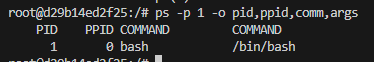

# Sprawozdanie
## Zajęcia 01
### Wprowadzenie, Git, Gałęzie, SSH
1. Zainstaluj klienta Git i obsługę kluczy SSH
```bash
sudo dnf install git
```
2. Sklonuj repozytorium przedmiotowe za pomocą HTTPS
```bash
git clone https://github.com/InzynieriaOprogramowaniaAGH/MDO2025_INO.git
```
3. Upewnij się w kwestii dostępu do repozytorium jako uczestnik i sklonuj je za pomocą utworzonego klucza SSH
```bash
git clone git@github.com:InzynieriaOprogramowaniaAGH/MDO2025_INO.git
```
4. Przełącz się na gałąź ```main```, a potem na gałąź swojej grupy 
```bash
git switch main
git switch GCL04
```
5. Utwórz gałąź o nazwie "inicjały & nr indeksu"
```bash
git checkout ML416494
```
6. Napisz Git hooka
```bash
#!/bin/bash

MESSAGE=$(cat $1) 

if ! [[ $MESSAGE == ML416494* ]]; then
  echo "$MESSAGE"
  echo "Wrong commit message, aborting" 
  exit 1
fi
```
w folderze ```/home/stundeto/MDO2025_INO/.git/hooks```

## Zajęcia 02
### Git, Docker
1. Zainstaluj Docker w systemie linuksowym
```bash
sudo dnf -y install dnf-plugins-core
sudo dnf-3 config-manager --add-repo https://download.docker.com/linux/fedora/docker-ce.repo
sudo dnf install docker-ce docker-ce-cli containerd.io docker-buildx-plugin docker-compose-plugin
```
2. Pobierz obrazy `hello-world`, `busybox`, `ubuntu` lub `fedora`, `mysql`
```bash
sudo docker pull hello-world 
sudo docker pull busybox 
sudo docker pull ubuntu
sudo docker pull mysql
```
3. Uruchom interaktywnie kontener z obrazu `busybox`
   


5. Uruchom "system w kontenerze" (czyli kontener z obrazu `fedora` lub `ubuntu`)
   



7. Stwórz własnoręcznie, zbuduj i uruchom prosty plik `Dockerfile` bazujący na wybranym systemie i sklonuj nasze repo.
```Dockerfile
FROM alpine:lastest@sha256:a8560b36e8b8210634f77d9f7f9efd7ffa463e380b75e2e74aff4511df3ef88c
RUN apk add --no-cache git
RUN git clone https://github.com/InzynieriaOprogramowaniaAGH/MDO2025_INO.git
CMD ["git", "--help", "-a"]
```
6. Pokaż uruchomione ( != "działające" ) kontenery, wyczyść je.
   


8. Wyczyść obrazy
```bash
sudo docker image prune -a
```

## Zajęcia 03
### Dockerfiles, kontener jako definicja etapu
1. Wykonaj kroki `build` i `test` wewnątrz wybranego kontenera bazowego. Tj. wybierz "wystarczający" kontener, np ```ubuntu``` dla aplikacji C lub ```node``` dla Node.js
2. Stwórz dwa pliki `Dockerfile` automatyzujące kroki powyżej, z uwzględnieniem następujących kwestii:
build:
```bash
FROM alpine:lastest@sha256:a8560b36e8b8210634f77d9f7f9efd7ffa463e380b75e2e74aff4511df3ef88c
RUN apk add --no-cache git bash make clang libtool ncurses ncurses-dev
RUN git clone https://github.com/antirez/sds
WORKDIR /sds
RUN ["make"]
```
test:
```bash
FROM sds_build
CMD ["./sds-test"]
```
3. Wykaż, że kontener wdraża się i pracuje poprawnie. Pamiętaj o różnicy między obrazem a kontenerem. Co pracuje w takim kontenerze?
   


## Zajęcia 04
### Dodatkowa terminologia w konteneryzacji, instancja Jenkins

1 Przygotuj woluminy wejściowy i wyjściowy, o dowolnych nazwach, i podłącz je do kontenera bazowego (np. tego, z którego rozpoczynano poprzednio pracę). Kontener bazowy to ten, który umie budować nasz projekt (ma zainstalowane wszystkie dependencje, `git` nią nie jest)
- Uruchom kontener, zainstaluj/upewnij się że istnieją niezbędne wymagania wstępne (jeżeli istnieją), ale *bez gita*

Zrobiłem to używajać konetera z ubuntu + git + podłączeniem woluminu w celu zaciągniecia repozytorium, a następnie podłączyłem ten wolumin do kontenera bez gita w celu zbudowania oprogramowania.


Już zbudowałem wcześniej


2 Eksponowanie portu
```bash
sudo docker network create --driver bridge mynet
```

```bash
docker run --rm -d --name iperf3-server --network mynet networkstatic/iperf3 -s
```

```bash
docker run --rm --name iperf3-client --network mynet networkstatic/iperf3 -c iperf3-server
```


```bash
sudo docker logs iperf3-server
```


3 Przeprowadź instalację skonteneryzowanej instancji Jenkinsa
```bash
sudo docker network create jenkins-net
sudo docker run --name jenkins-docker --rm --detach \
  --privileged --network jenkins --network-alias docker \
  --env DOCKER_TLS_CERTDIR=/certs \
  --volume jenkins-docker-certs:/certs/client \
  --volume jenkins-data:/var/jenkins_home \
  --publish 2376:2376 \
  docker:dind --storage-driver overlay2
```
