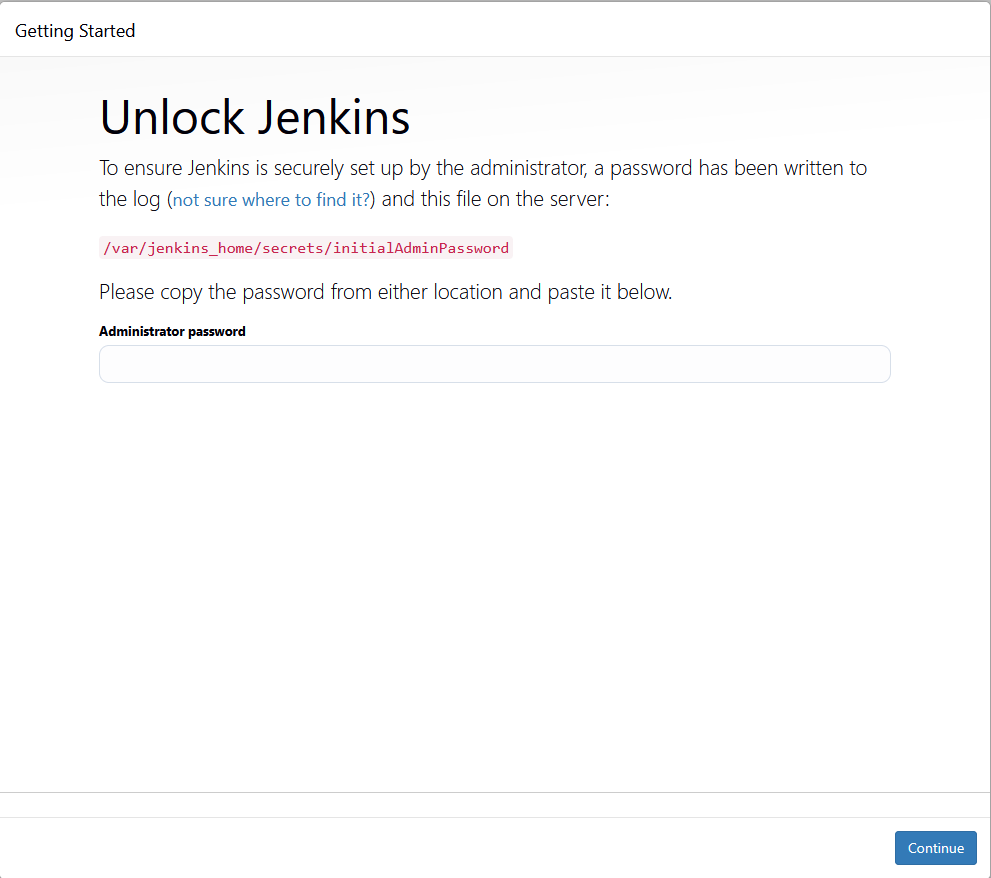

# Sprawozdanie 2

Celem ćwiczeń jest zapoznanie się z platformą Jenkins oraz stworzenie pełnego pipeline z wszytkimi krokami jakie można znaleźć w podstawowych rozwiązaniach komercyjnych.

# Poznawanie Jenkins

Aby rozpocząć pracę nad własnym pipeline należy zapoznać się z możliwościami platformy Jenkins oraz poprawnie uruchumić ją lokalnie na wirtualce.

## Utworzenie instancji Jenkins

### Utworzenie sieci

Aby rozpocząć pracę należy zgodnie z oficjalną instrukcją Jenkins utworzyć sieć dockerową.

```bash
sudo docker network create jenkins
```

### Uruchomienie DIND

Nie jest to wymagany krok jesli nie chcemy mieć możliwości komunikacji Jenkins z portem Docker. Brak tego kroku spowoduje że nie możemy korzystać z komend docker podczas naszych kroków w pipeline. Na potrzeby naszego ćwiczenia więc musimy to uruchomić.

```bash
sudo docker run \
  --name jenkins-docker \
  --rm \
  --detach \
  --privileged \
  --network jenkins \
  --network-alias docker \
  --env DOCKER_TLS_CERTDIR=/certs \
  --volume jenkins-docker-certs:/certs/client \
  --volume jenkins-data:/var/jenkins_home \
  --publish 2376:2376 \
  docker:dind \
  --storage-driver overlay2
```

### Blueocean Dockerfile

Zgodnie z oficjalną instrukcją stworzymy obraz jenkins który będzie hostował naszą webową instancje.

```docker
FROM jenkins/jenkins:2.504.1-jdk21
USER root
RUN apt-get update && apt-get install -y lsb-release
RUN curl -fsSLo /usr/share/keyrings/docker-archive-keyring.asc \
  https://download.docker.com/linux/debian/gpg
RUN echo "deb [arch=$(dpkg --print-architecture) \
  signed-by=/usr/share/keyrings/docker-archive-keyring.asc] \
  https://download.docker.com/linux/debian \
  $(lsb_release -cs) stable" > /etc/apt/sources.list.d/docker.list
RUN apt-get update && apt-get install -y docker-ce-cli
USER jenkins
RUN jenkins-plugin-cli --plugins "blueocean docker-workflow json-path-api"
```

Przypominajka jak zbudować taki obraz.

```bash
sudo docker build -t myjenkins-blueocean:2.504.1-1 .
```

Na końcu należy pamiętać aby uruchomić naszą instancje.

```bash
docker run --name jenkins-blueocean --restart=on-failure --detach \
  --network jenkins --env DOCKER_HOST=tcp://docker:2376 \
  --env DOCKER_CERT_PATH=/certs/client --env DOCKER_TLS_VERIFY=1 \
  --publish 8080:8080 --publish 50000:50000 \
  --volume jenkins-data:/var/jenkins_home \
  --volume jenkins-docker-certs:/certs/client:ro \
  myjenkins-blueocean:2.504.1-1
```

Tutaj co powinniśmy zostać kiedy spróbujemy się połączyć na port 8080. Jako host musimy urzyć adresu IP naszej maszyny wirtualnej.



Hasło możemy znaleźć w taki sposób. Należy to uruchomić na tej samej maszynie na której stoi nasz docker.

```bash
sudo docker exec jenkins-blueocean cat /var/jenkins_home/secrets/initialAdminPassword
```

### Zatrzymanie instancji

```bash
sudo docker stop jenkins-docker
```

## Konfiguracja Jenkins i pierwsze kroki

Ten krok jest zbędny ale warto go wykonać. Jako podstwową konfigurację warto wybrać opcję z zainstalowaniem najpopularniejszych pluginów. 


## Projekt wyświetlający name

Uzyłem do tego projektu typu freestyle.


Jako nasz krok budowania skorzystałem z opcji “Execute shell”


Treść wywołanej komendy

```bash
uname -a
```

Aby sprawdzić wynik naszego budowania możemy wejść w logi konsoli.


Tak powinny prezentować się logi. Widać że program zadziałał poprawnie.

```bash
Started by user admin
Running as SYSTEM
Building in workspace /var/jenkins_home/workspace/Name
[Name] $ /bin/sh -xe /tmp/jenkins2021905113873606619.sh
+ uname -a
Linux a51d3d52b10c 6.13.5-200.fc41.x86_64 #1 SMP PREEMPT_DYNAMIC Thu Feb 27 15:07:31 UTC 2025 x86_64 GNU/Linux
Finished: SUCCESS
```

## Projekt wyświetlający error dla nieparzystej godziny

Znów korzystam z projektu freestyle. Należy pamiętać aby usunąć zera z przodu liczby. Podstawowy shell w Jenkins to sh który nie umie sobie z takimi cyframi poradzić bez obróbki.

```bash
hour=$(date +%H | sed 's/^0*//')
if [ $((hour % 2)) -ne 0 ]; then
  echo "Odd hour detected: $hour"
  exit 1
else
  echo "Even hour: $hour"
fi
```

Wynik dla nieparzytej godziny.


Logi z konsoli dla godziny nieparzystej.

```bash
Started by user admin
Running as SYSTEM
Building in workspace /var/jenkins_home/workspace/fail-odd
[fail-odd] $ /bin/sh -xe /tmp/jenkins763858890000384222.sh
+ date +%H
+ hour=07
+ [ 1 -ne 0 ]
+ echo Odd hour detected: 07
Odd hour detected: 07
+ exit 1
Build step 'Execute shell' marked build as failure
Finished: FAILURE
```

Wynik dla parzystej godziny.


Logi z konsoli dla godziny parzystej.

```bash
Started by user admin
Running as SYSTEM
Building in workspace /var/jenkins_home/workspace/fail-odd
[fail-odd] $ /bin/sh -xe /tmp/jenkins7131205593019765371.sh
+ date +%H
+ sed s/^0*//
+ hour=8
+ [ 0 -ne 0 ]
+ echo Even hour: 8
Even hour: 8
Finished: SUCCESS
```

Jak widać program zadziałał poprawnie.

## Projekt pobierający obraz ubuntu

Zadaniem tego projektu jest sprawdzenie czy docker działa poprawnie jeśli wywołamy go z naszego jenkins. Tworzymy nowy projekt freestyle, ustwiamy Execute shell jako build step i wklejamy poniższą komendę.

```bash
docker pull ubuntu:latest
```

Wynik tej operacji również znajdziemy w logach. Jak widać wszystko działa poprawnie.

```bash
Started by user admin
Running as SYSTEM
Building in workspace /var/jenkins_home/workspace/ubuntu-pull
[ubuntu-pull] $ /bin/sh -xe /tmp/jenkins11838691925621536550.sh
+ docker pull ubuntu
Using default tag: latest
latest: Pulling from library/ubuntu
0622fac788ed: Pulling fs layer
0622fac788ed: Verifying Checksum
0622fac788ed: Download complete
0622fac788ed: Pull complete
Digest: sha256:6015f66923d7afbc53558d7ccffd325d43b4e249f41a6e93eef074c9505d2233
Status: Downloaded newer image for ubuntu:latest
docker.io/library/ubuntu:latest
Finished: SUCCESS
```

## Tworzenie pipeline testowego na bazie wcześniejszych prac

Zaczynamy tworząc nasz pierwszy pipeline.


Na potrzeby tego zadania wpisujemy z palca nasz Jenkinsfile do treści pipeline.

```groovy
pipeline {
    agent any

    stages {
        stage('Klonowanie repo') {
            steps {
                git branch: 'ML416494', url: 'https://github.com/InzynieriaOprogramowaniaAGH/MDO2025_INO'
            }
        }

        stage('Budowanie kontenera') {
            steps {
                dir('ITE/GCL04/ML416494/Sprawozdanie1/lab3') {
                    script {
                        docker.build("sds-builder", "-f Dockerfile.build .")
                    }
                }
            }
        }
    }
}
```

Puszamy nasz build i sprawdzamy wynik.


Tutaj również można sprawdzić logi. Jednak są one znacznie dłuższe więc umieszcze tylko ostatnie linjki kroku budowania.


# Pełny pipeline wybranej aplikacji

Po zapoznaniu się z pipeline oraz samym Jenkins i przetestowaniu czy wszystko działa zabieramy się za docelowe zadanie. Celem zadania jest stworzenie pełnego pipeline dla wybranej aplikacji. Ze względu na to że dużo osób wybrało Redis to też pójdę tą drogą. Pozwoli mi to w razie czego na uzyskanie pomocy od innych i możliwość porównania wyników.

## Przygotowanie SCM

Tym razem zamiast wpisywać Jenkinsfile ręcznie skorzystam z SCM. Sam Jenkins file zamieszczę na mojej branchy w repozytorium przedmiotu.


Tak wygląda względna ścieżka do mojego pliku Jenkins.

```bash
ITE/GCL04/ML416494/Sprawozdanie2/jenkins/Jenkinsfile
```

Treść samego pliku zamieszcam również tutaj aby ułatwić śledzenie tego co się dzieje. Jak widać obecnie brakuje jeszczego kroku publish ale to jest celowe działanie. Nie chce publikować nic przed wcześniejszą weryfikacją.

```groovy
pipeline {
    agent any

    environment {
        IMAGE_NAME = "test"
        VERSION = "v1.0.${BUILD_NUMBER}"
    }

    stages {
        stage('Clone') {
            steps {
                git branch: 'ML416494', url: 'https://github.com/InzynieriaOprogramowaniaAGH/MDO2025_INO'
            }
        }

        stage('Build Redis (Builder)') {
            steps {
                dir('ITE/GCL04/ML416494/Sprawozdanie2/jenkins') {
                    script {
                        docker.build("redis-builder", "-f Dockerfile.build .")
                    }
                }
            }
        }

        stage('Run Tests') {
            steps {
                dir('ITE/GCL04/ML416494/Sprawozdanie2/jenkins') {
                    script {
                        def redisTestImage = docker.build("redis-test", "-f Dockerfile.test .")
                        sh "docker run --rm redis-test"
                    }
                }
            }
        }

        stage('Deploy and Check') {
            steps {
                sh """
                    docker build --no-cache -t ${IMAGE_NAME}:${VERSION} -f ITE/GCL04/ML416494/Sprawozdanie2/jenkins/Dockerfile.deploy .

                    docker network inspect network-testing >/dev/null 2>&1 || docker network create network-testing
                    docker rm -f redis-deploy-test
                    docker run -d --name redis-deploy-test --network network-testing ${IMAGE_NAME}:${VERSION}
                    sleep 10
                    
                    docker run --rm --network network-testing redis redis-cli -h redis-deploy-test PING | grep PONG
                    docker run --rm --network network-testing redis redis-cli -h redis-deploy-test SET testkey "Hello"
                    docker run --rm --network network-testing redis redis-cli -h redis-deploy-test GET testkey | grep Hello

                    docker stop redis-deploy-test
                    docker rm redis-deploy-test
                    docker network rm network-testing
                """
            }
        }
    }
}
```

### Dockerfiles

Dodatkowo zamieszczam ponieżej pliki Docker związane z moim pipeline. Można je również znaleźć w tym samym katalogu co Jenkinsfile na repozytorium.

Dockerfile.build

```docker
FROM ubuntu:latest

ENV DEBIAN_FRONTEND=noninteractive

RUN apt-get update && \
    apt-get install -y \
    git \
    build-essential \
    make \
    tcl \
    libc6-dev \
    libjemalloc-dev \
    && rm -rf /var/lib/apt/lists/*

WORKDIR /app

RUN git clone https://github.com/redis/redis.git

WORKDIR /app/redis

RUN make -j$(nproc)

ENV PATH="/app/redis/src:${PATH}"
```

Dockerfile.test

```docker
FROM redis-builder

WORKDIR /app/redis

CMD ["./runtest", "--single", "unit/type/list"]
```

Dockerfile.deploy

```docker
FROM redis-builder

EXPOSE 6379
COPY --from=redis-builder /app/redis/src/redis-server /usr/local/bin/
COPY --from=redis-builder /app/redis/src/redis-cli /usr/local/bin/

ENTRYPOINT ["redis-server"]
CMD ["--protected-mode", "no"]
```

### Pierwsze próby

Po pierwszym uruchomieniu można zauważyć mojest testy nie przeszły więc krok deply nie został wykonany. Stało się tak ponieważ kroki są od siebie zależne.


Co poszło nie tak? Aby to sprawdzić wszedłem w logi kroku “Run Tests”

```groovy
Found unhandled org.jenkinsci.plugins.scriptsecurity.sandbox.RejectedAccessException exception:Scripts not permitted to use method groovy.lang.GroovyObject invokeMethod java.lang.String java.lang.Object (org.jenkinsci.plugins.docker.workflow.Docker$Image withRun java.lang.String)
```

Z sieci można wyczytać że problem może być rozwiązany jeśli wyłączony zostanie sandbox. Nie brzmi to najlepiej ale można spróbować. Należy więc wejść w zakładkę “Manage Jenkins” z dashboarda, a nastpęnie tutaj.


Spróbujmy więc dać ten approve


Testując teraz mój pipeline widać że już wszystko działa


## Krok publish

Najlepiej zacząć od dodania danych wrażliwych. Korzystam z wbudowanego manager w Jenkins.


Wchodzimy w zakładkę Credentials. A następnie do global credentials. Dodajemy tam nasze wartości.


Należy zapamiętać nadane ID. Ja sobie moje ID nazwałem pass-dockhub.

### Dodawanie kroku

Do naszego Jenkinsfile dodajemy krok publish

```groovy
stage('Publish') {
            steps {
                withCredentials([usernamePassword(credentialsId: 'pass-dockhub', usernameVariable: 'DOCKER_USERNAME', passwordVariable: 'DOCKER_PASSWORD')]) {
                    sh '''
                        echo "$DOCKER_PASSWORD" | docker login -u "$DOCKER_USERNAME" --password-stdin
                        docker tag ${IMAGE_NAME}:${VERSION} $DOCKER_USERNAME/${IMAGE_NAME}:${VERSION}
                        docker push $DOCKER_USERNAME/${IMAGE_NAME}:${VERSION}
                    '''
                }
            }
        }
```

I jak widać wszystko zakończyło się sukcesem


Co również można zobaczyć na moim dockerhub


Sprawdźmy jeszcze powtarzalność tego procesu


Jak widać wszysztko jest okej więc można to odhaczyć jako sukces

# Ostatnie testy

Warto na koniec upewnić się czy na pewno wszystkie kroki zostały wykonane

## Lab 6

- [x]  Aplikacja została wybrana
- [x]  Licencja potwierdza możliwość swobodnego obrotu kodem na potrzeby zadania
- [x]  Wybrany program buduje się
- [x]  Przechodzą dołączone do niego testy
- [x]  Zdecydowano, czy jest potrzebny fork własnej kopii repozytorium
- [ ]  Stworzono diagram UML zawierający planowany pomysł na proces CI/CD
- [x]  Wybrano kontener bazowy lub stworzono odpowiedni kontener wstepny (runtime dependencies)
- [x]  *Build* został wykonany wewnątrz kontenera
- [x]  Testy zostały wykonane wewnątrz kontenera (kolejnego)
- [x]  Kontener testowy jest oparty o kontener build
- [ ]  Logi z procesu są odkładane jako numerowany artefakt, niekoniecznie jawnie
- [x]  Zdefiniowano kontener typu 'deploy' pełniący rolę kontenera, w którym
zostanie uruchomiona aplikacja (niekoniecznie docelowo - może być tylko
integracyjnie)
- [x]  Uzasadniono czy kontener buildowy nadaje się do tej roli/opisano proces stworzenia nowego, specjalnie do tego przeznaczenia
- [x]  Wersjonowany kontener 'deploy' ze zbudowaną aplikacją jest wdrażany na instancję Dockera
- [x]  Następuje weryfikacja, że aplikacja pracuje poprawnie (*smoke test*) poprzez uruchomienie kontenera 'deploy'
- [x]  Zdefiniowano, jaki element ma być publikowany jako artefakt
- [x]  Uzasadniono wybór: kontener z programem, plik binarny, flatpak, archiwum tar.gz, pakiet RPM/DEB
- [x]  Opisano proces wersjonowania artefaktu (można użyć *semantic versioning*)
- [x]  Dostępność artefaktu: publikacja do Rejestru online, artefakt załączony jako rezultat builda w Jenkinsie
- [ ]  Przedstawiono sposób na zidentyfikowanie pochodzenia artefaktu
- [x]  Pliki Dockerfile i Jenkinsfile dostępne w sprawozdaniu w kopiowalnej postaci oraz obok sprawozdania, jako osobne pliki
- [ ]  Zweryfikowano potencjalną rozbieżność między zaplanowanym UML a otrzymanym efektem

## Lab 7

- [x]  Przepis dostarczany z SCM, a nie wklejony w Jenkinsa lub sprawozdanie (co załatwia nam `clone` )
- [x]  Posprzątaliśmy i wiemy, że odbyło się to skutecznie - mamy pewność, że pracujemy na najnowszym (a nie *cache'owanym* kodzie)
- [x]  Etap `Build` dysponuje repozytorium i plikami `Dockerfile`
- [x]  Etap `Build` tworzy obraz buildowy, np. `BLDR`
- [x]  Etap `Build` (krok w tym etapie) lub oddzielny etap (o innej nazwie), przygotowuje artefakt - **jeżeli docelowy kontener ma być odmienny**, tj. nie wywodzimy `Deploy` z obrazu `BLDR`
- [x]  Etap `Test` przeprowadza testy
- [x]  Etap `Deploy` przygotowuje **obraz lub artefakt** pod wdrożenie. W przypadku aplikacji pracującej jako kontener, powinien to być obraz z odpowiednim entrypointem. W przypadku buildu tworzącego
artefakt niekoniecznie pracujący jako kontener (np. interaktywna
aplikacja desktopowa), należy przesłać i uruchomić artefakt w środowisku docelowym.
- [x]  Etap `Deploy` przeprowadza wdrożenie (start kontenera docelowego lub uruchomienie
aplikacji na przeznaczonym do tego celu kontenerze sandboxowym)
- [x]  Etap `Publish` wysyła obraz docelowy do Rejestru i/lub dodaje artefakt do historii builda
- [x]  Ponowne uruchomienie naszego *pipeline'u* powinno zapewniać, że pracujemy na najnowszym (a nie *cache'owanym*) kodzie. Innymi słowy, *pipeline* musi zadziałać więcej niż jeden raz 😎
