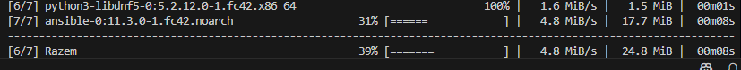

# Sprawozdanie 3

# Lab 8

### Dodanie użytkownika:

```bash
sudo adduser ansible
```

### Instalacja Ansible na maszynie głównej

```bash
sudo dnf install -y ansible
```



### Tworzenie nowego klucza


### Ustawienie hostname


### Edytuj /etc/hosts na obu maszynach

```bash
# Loopback entries; do not change.
# For historical reasons, localhost precedes localhost.localdomain:
127.0.0.1   localhost localhost.localdomain localhost4 localhost4.localdomain4
::1         localhost localhost.localdomain localhost6 localhost6.localdomain6
# See hosts(5) for proper format and other examples:
# 192.168.1.10 foo.example.org foo
# 192.168.1.13 bar.example.org bar
192.168.1.114 ansible-master
192.168.1.115 ansible-target
```

### Test połączenia


### Wymiana kluczy

```bash
ssh-copy-id ansible@ansible-target
```


### Test ssh

```bash
ssh ansible@ansible-target hostname
ansible-target
```

### Stworzenie pliku inwentaryzacji

```bash
[Orchestrators]
ansible-master ansible_connection=local

[Endpoints]
ansible-target ansible_user=ansible
```

### Test ansible

```bash
ansible -i inventory.ini all -m ping
```


### Playbook ping

```yaml
- name: Ping all hosts
  hosts: all
  tasks:
    - name: Ping test
      ansible.builtin.ping:

```


### Playbook kopiowania

```yaml
- name: Copy inventory
  hosts: Endpoints
  tasks:
    - name: Copy inventory.ini
      ansible.builtin.copy:
        src: inventory.ini
        dest: /tmp/inventory.ini
```


### Brak odpowiednich praw

Kolejne playbooki nie zadziała jeśli użytkownik ansible na target nie ma praw sudo dlatego dodajemy permisje używając:

```yaml
sudo visudo
ansible ALL=(ALL) NOPASSWD: ALL
```

### Playbook restartu

```yaml
- name: Update Fedora packages and restart services
  hosts: Endpoints
  become: true
  tasks:
    - name: Update packages
      dnf:
        name: '*'
        state: latest

    - name: Restart sshd
      service:
        name: sshd
        state: restarted

```


### Instalacja docker playbookiem

```yaml
- name: Install Docker on Fedora
  hosts: Endpoints
  become: true
  tasks:
    - name: Install required packages
      dnf:
        name:
          - dnf-plugins-core
          - device-mapper
          - device-mapper-persistent-data
          - lvm2
        state: present

    - name: Add Docker repo
      command: dnf config-manager addrepo --from-repofile=https://download.docker.com/linux/fedora/docker-ce.repo

    - name: Install Docker Engine
      dnf:
        name:
          - docker-ce
          - docker-ce-cli
          - containerd.io
        state: latest

    - name: Enable and start Docker
      service:
        name: docker
        state: started
        enabled: true

```


### Operacja na kontenerze

Test dockera

```yaml
     - name: Pull Docker image
      community.docker.docker_image:
        name: stundeto/test
        source: pull

```

Pełna operacja na opublikowanym docker

```yaml
---
- name: Pull and run stundeto/test image
  hosts: Endpoints
  become: true
  tasks:
    - name: Ensure Docker is installed
      dnf:
        name:
          - docker-ce
          - docker-ce-cli
          - containerd.io
        state: present
      ignore_errors: true 

    - name: Ensure Docker is running
      service:
        name: docker
        state: started
        enabled: true

    - name: Pull stundeto/test image from Docker Hub
      community.docker.docker_image:
        name: stundeto/test:v1.0.18
        source: pull

    - name: Run stundeto/test container
      community.docker.docker_container:
        name: stundeto-test
        image: stundeto/test:v1.0.18
        state: started
        restart_policy: always

```


# Lab 9

### Anaconada-ks

Wprowadzaone zmiany

```yaml
clearpart --none --initlabel → clearpart --all --initlabel
```

Dodano

```yaml
url --mirrorlist=http://mirrors.fedoraproject.org/mirrorlist?repo=fedora-38&arch=x86_64
repo --name=update --mirrorlist=http://mirrors.fedoraproject.org/mirrorlist?repo=updates-released-f38&arch=x86_64
network --hostname=fedora-unattended
```

Ustawiam pakiety

```yaml
%packages
@core
wget
curl
docker
%end
```

Dodaje post

```yaml
%post
echo "Włączam Docker i pobieram kontener..."
systemctl enable docker

# Stwórz skrypt startowy (np. z Twoim programem)
cat <<EOF > /etc/systemd/system/myapp.service
[Unit]
Description=Start my containerized app
After=network.target docker.service
Requires=docker.service

[Service]
ExecStart=/usr/bin/docker run --rm --name myapp -p 8080:80 stundeto/test
Restart=always

[Install]
WantedBy=multi-user.target
EOF

systemctl enable myapp

%end

```

Ustawiam nazwę na fedora-unattended.ks.cfg 

Aby udostępnić ten plik lokalnie korzystam z serwa http przez moduł python.

```yaml
python3 -m http.server 8000

```


Dodaje prametry 


# Lab 10

### Instalacja cubectl oraz minikube

```bash
curl -LO https://dl.k8s.io/release/v1.33.0/bin/linux/amd64/kubectl
sudo install -o root -g root -m 0755 kubectl /usr/local/bin/kubect
curl -LO https://github.com/kubernetes/minikube/releases/latest/download/minikube-linux-amd64
sudo install minikube-linux-amd64 /usr/local/bin/minikube && rm minikube-linux-amd64l
```

### Start klastra

```bash
minikube start
```


### Test klastra

```bash
kubectl get nodes
```


### Uruchomienie ngnix

```bash
kubectl run nginx-test \
  --image=nginx \
  --port=80 \
  --labels app=nginx-test
```

```bash
kubectl get pods
```


### Wystawienie portu

```bash
kubectl port-forward pod/nginx-test 8080:80
```

Efekty można sprawdzić używając przeglądarki


### Załączenie dashboard

```bash
minikube dashboard --url
```


### Wdrożenie z użyciem YAML

Zapisuje do `nginx-deployment.yaml`:

```yaml
apiVersion: apps/v1
kind: Deployment
metadata:
  name: nginx-deployment
spec:
  replicas: 4
  selector:
    matchLabels:
      app: nginx
  template:
    metadata:
      labels:
        app: nginx
    spec:
      containers:
      - name: nginx
        image: nginx
        ports:
        - containerPort: 80

```

```yaml
kubectl apply -f nginx-deployment.yaml
```


### Utworzenie serwisu

```yaml
kubectl expose deployment nginx-deployment --type=NodePort --port=80
```


Test można przeprowadzić w następujący sposób:

```yaml
kubectl get svc
```


Przekierowanie

```yaml
kubectl port-forward svc/nginx-deployment 8080:80
```

```yaml
minikube service nginx-deployment --url
```

# LAB 11

### Wersje dockerfile

Wersja 1

```docker
FROM httpd:2.4
RUN echo "Wersja 1 serwera od stundeto" > /usr/local/apache2/htdocs/index.html
```

```docker
docker build -f Dockerfile.v1 -t stundeto/httpd:custom-v1 .
docker push stundeto/httpd:custom-v1
```


Wersja 2

```docker
FROM httpd:2.4
RUN echo "Wersja 2 serwera od stundeto" > /usr/local/apache2/htdocs/index.html
```


Wersja błędna

```docker
FROM httpd:2.4
RUN rm -rf /usr/local/apache2/htdocs
```


### Plik deploy

```yaml
apiVersion: apps/v1
kind: Deployment
metadata:
  name: httpd-deployment
spec:
  replicas: 2
  selector:
    matchLabels:
      app: httpd
  strategy:
    type: RollingUpdate
    rollingUpdate:
      maxUnavailable: 1
      maxSurge: 1
  template:
    metadata:
      labels:
        app: httpd
    spec:
      containers:
      - name: httpd
        image: stundeto/httpd:custom-v1
        ports:
        - containerPort: 80

```

Zastosowanie:

```yaml
kubectl apply -f httpd-deployment.yaml
```

Plik serwisu:

```yaml
apiVersion: v1
kind: Service
metadata:
  name: httpd-service
spec:
  selector:
    app: httpd
  ports:
    - protocol: TCP
      port: 80
      targetPort: 80
  type: NodePort

```

Skrypt weryfikujący wdrożenie

```bash
#!/bin/bash

DEPLOY_NAME=$1
TIMEOUT=60

echo "Waiting for deployment $DEPLOY_NAME to be ready..."
minikube kubectl -- wait --for=condition=available --timeout=${TIMEOUT}s deployment/${DEPLOY_NAME}
if [ $? -ne 0 ]; then
    echo "Deployment $DEPLOY_NAME did not become available within ${TIMEOUT} seconds."
    exit 1
fi
echo "Deployment $DEPLOY_NAME is now available."
```
