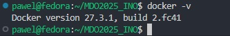
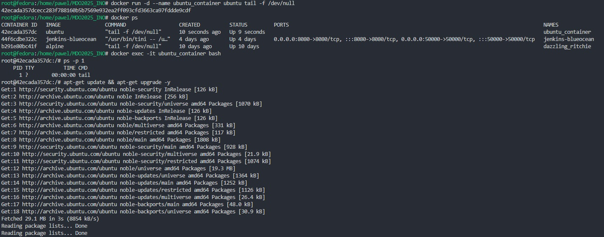
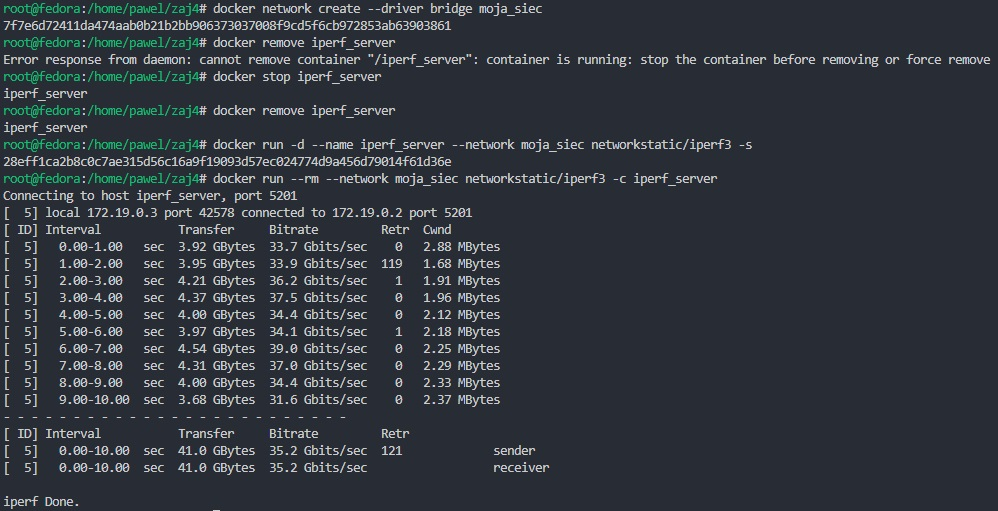

## Laboratorium 1

Wygenerowanie kluczy SSH, skonfigurowanie kluczy jako metodę dostępu do GitHuba

Pokazanie kluczy publicznych


Sklonowanie repozytorium za pomocą SSH


Utworzenie i przełączenie się na odpowiedniego brancha


Napisanie GitHooka i umieszczenie go w odpowiednim miejscu


## Laboratorium 2

Zainstalowanie Dockera




"Zaciągnięcie" odpowiednich obrazów


Przykładowy efekt uruchomienia kontenera busybox z poleceniem echo


Interaktywne podłączenie się do kontenera i sprawdzenie wersji busyboxa


Uruchomienia kontenera z poleceniem tail, aby sobie cały czas działał, wyświetlenie procesów Dockera,
podłączenie się do kontenera w sposób interaktywny za pomocą basha, zaprezentowanie pid1 w kontenerze czym będzie
program inicjujący kontener z systemem czyli tail, aktualizaja pakietów systemu w kontenerze



Stworzenie Dockerfile.repo zbudowanie i uruchomienie, weryfikacja klonowania
```
FROM ubuntu:20.04
RUN apt-get update && apt-get install -y git

RUN git clone https://github.com/InzynieriaOprogramowaniaAGH/MDO2025_INO.git
WORKDIR /MDO2025_INO
CMD ["bash"]
```


Wyświetlono obrazy, uruchomione są te, które mają status UP


Wyczyszczenie obrazów


## Laboratorium 3

Sklonowanie wybranego repozytorium, wykonanie buildu i testów


Stworzenie Dockerfile.nodebld służacego do klonowania aplikacji i instalowania pakietów potrzebnych do działania

```
FROM node

RUN git clone https://github.com/devenes/node-js-dummy-test
WORKDIR /node-js-dummy-test
RUN npm i
```

Zbudowanie obrazu za pomocą stworzonego Dockefile'a


Uruchomienie kontenera i sprawdzenie czy repozytorium sie sklonowało i czy zawiera folder node_modules


Stworzono Dockerfile.nodetest, który bazuje na kontenerze budującym i wykonuje testy

```
FROM nodebld
CMD ["npm", "test"]
```

Zbudowanie obrazu z testami


Drugi przykład dla aplikacji Irssi

Zrobienie builda i uruchomienie testów


Stworzenie Dockerfile'ów i zbudowanie obrazów do budowania i testowania aplikacji


## Laboratorium 4

Stowrzenie woluminów wejściowego i wyjściowego, uruchomienie z podpiętymi woluminami kontenera bez git'a


Uruchomienie kontenera pomocniczego z git'em i podpiętym woluminem wejściowym, sklonowanie repozytorium, użycie komendy docker cp
do bezpiecznego przeniesienia plików do folderu, do którego jest powiązany wolumin wejściowy


Ponowne uruchomienie kontenera bez git'a z woluminami (na woluminie wejściowym jest sklonowane repozytorium),
zbudowanie aplikacji


Skopiowanie node_modules do wolumina wyjsciowego


Uruchomienie innego kontenera z podpietym woluminem wyjściowym i weryfikacja zawartości


Uruchomienie kontenera serwera iperf3, połączenie się z serwerem iperf3 z drugiego kontenera, zbadanie ruchu


Powienie kroku z własną dedykowaną siecią mostkową "moja_siec"




Połaczenie się z hosta i zbadanie ruchu


Instalacja Jenkinsa - stworzenie sieci i uruchomienie konteneru Docker in Docker


Uruchomienie obrazu Jenkinsa


Odnalezienie hasła potrzebnego do zrobienia konta, hasło znajduje się w logach kontenera


