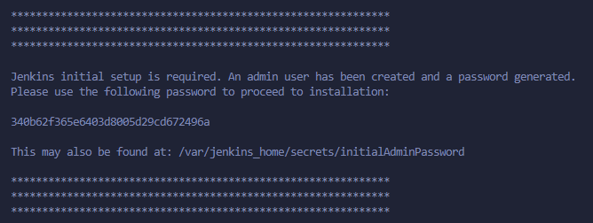
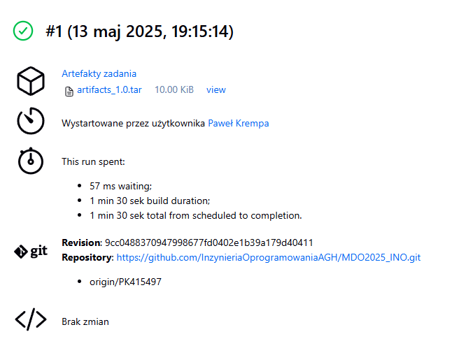

# Laboratoria 05
## Przygotowanie


Test uprzednio utworzonych kontenerów: budującego i testującego.


Sieć istnieje, spullowanie DIND, zbudowanie obraz Jenkins przy użyciu Dockerfile
```sh
FROM jenkins/jenkins:2.504.1-jdk21
USER root
RUN apt-get update && apt-get install -y lsb-release ca-certificates curl && \
    install -m 0755 -d /etc/apt/keyrings && \
    curl -fsSL https://download.docker.com/linux/debian/gpg -o /etc/apt/keyrings/docker.asc && \
    chmod a+r /etc/apt/keyrings/docker.asc && \
    echo "deb [arch=$(dpkg --print-architecture) signed-by=/etc/apt/keyrings/docker.asc] \
    https://download.docker.com/linux/debian $(. /etc/os-release && echo \"$VERSION_CODENAME\") stable" \
    | tee /etc/apt/sources.list.d/docker.list > /dev/null && \
    apt-get update && apt-get install -y docker-ce-cli && \
    apt-get clean && rm -rf /var/lib/apt/lists/*
USER jenkins
RUN jenkins-plugin-cli --plugins "blueocean docker-workflow json-path-api"
```




Odblokowanie Jenkinsa, kodem znajdującym się w logach kontenera z Jenkinsem


Napisanie Pipeline wyświetlającego uname
```sh
uname -a
```


Pipeline pobierający kontener ubuntu
```sh
docker pull ubuntu
```


Pipeline ze skryptem shell sprawdzającym godzinę, jeśli nieparzyste zwraca error

```sh
#!/bin/bash

HOUR=$(date +%H)
HOUR=$((10#$HOUR))  

if [ $((HOUR % 2)) -ne 0 ]; then
    echo "Godzina ($HOUR) jest nieparzysta"
    exit 1
else
    echo "Godzina ($HOUR) jest parzysta"
    exit 0
fi
```

## Utworzenie projektu typu pipeline:
```sh 
pipeline {
    agent any

    stages {
        stage('Checkout') {
            steps {
                sh 'rm -fr MDO2025_INO'
                sh 'git clone https://github.com/InzynieriaOprogramowaniaAGH/MDO2025_INO.git'
                dir("MDO2025_INO"){
                    sh 'git checkout PK415497'
                }
            }
        }

        stage('Build') {
            steps {
                dir('MDO2025_INO/ITE/GCL04/PK415497/Sprawozdanie1/pliki') {
                    sh 'docker rmi -f nodebld || true'
                    sh 'docker builder prune --force --all'
                    sh 'docker build -t nodebld -f Dockerfile.nodebld .'
                }
            }
        }
        
        stage('Test') {
            steps {
                dir('MDO2025_INO/ITE/GCL04/PK415497/Sprawozdanie1/pliki') {
                    sh 'docker build -t nodetest -f Dockerfile.nodetest .'
                }
            }
        }
    }
}

```


Pipeline to zautomatyzowany proces budowania, testowania i wdrażania aplikacji zapisany w jednym pliku konfiguracyjnym. Na początku klonowane jest repozytorium Git, a następnie przechodzi się na odpowiednią gałąź projektu. Pipeline usuwa ewentualny lokalny obraz Dockera oraz czyści zaległe dane i cache buildów, aby uniknąć konfliktów.
Po przygotowaniu środowiska pipeline buduje pierwszy obraz na podstawie Dockerfile.nodebld, a następnie drugi, używając Dockerfile.nodetest, do przeprowadzenia testów aplikacji.

# Laboratoria 06


Diagram UML, opisującymi proces CI

Pipeline:
```sh
pipeline {
    agent any

    environment {
        APP_DIR = 'MDO2025_INO/ITE/GCL04/PK415497/Sprawozdanie1/pliki'
        APP_VERSION = '1.0'
        NODE_TAG = '23-alpine'
        BUILD_IMAGE = "nodebld:${NODE_TAG}"
        TEST_IMAGE = "nodetest:v${APP_VERSION}"
        DEPLOY_IMAGE = "nodedeploy:v${APP_VERSION}"
    }

    stages {
        stage('Prepare') {
            steps {
                sh '''
                    rm -fr MDO2025_INO
                    git clone https://github.com/InzynieriaOprogramowaniaAGH/MDO2025_INO.git
                    cd MDO2025_INO
                    git checkout PK415497
                '''
            }
        }

        stage('Logs') {
            steps {
                dir(env.APP_DIR) {
                    sh 'mkdir -p logs'
                }
            }
        }

        stage('Build') {
            steps {
                dir(env.APP_DIR) {
                    sh "docker build -t ${BUILD_IMAGE} -f Dockerfile.nodebld . > logs/build.log 2>&1 || (cat logs/build.log && false)"
                }
            }
        }

        stage('Tests') {
            steps {
                dir(env.APP_DIR) {
                    sh "docker build -t ${TEST_IMAGE} -f Dockerfile.nodetest . > logs/test.log 2>&1 || (cat logs/test.log && false)"
                }
            }
        }

        stage('Deploy') {
            steps {
                sh 'docker network create project_network || true'
                dir(env.APP_DIR) {
                    sh """
                        docker build -t ${DEPLOY_IMAGE} -f Dockerfile.nodedeploy .
                        docker rm -f app || true
                        docker run -d -p 3000:3000 --name app --network project_network ${DEPLOY_IMAGE}
                    """
                }
                sleep(10)
            }
        }

        stage('Test Deployment') {
            steps {
                dir(env.APP_DIR) {
                    sh '''
                        docker run --network project_network --rm curlimages/curl curl -v http://app:3000
                    '''
                }
            }
        }

        stage('Publish') {
            steps {
                dir(env.APP_DIR) {
                    sh """
                        mkdir -p artifacts_${APP_VERSION}
                        tar -cvf artifacts_${APP_VERSION}.tar logs/*.log
                    """
                    archiveArtifacts artifacts: "artifacts_${APP_VERSION}.tar"
                }
            }
        }
    }

    post {
        always {
            sh """
                docker rmi ${BUILD_IMAGE} ${TEST_IMAGE} ${DEPLOY_IMAGE} || true
                docker system prune --all --volumes --force || true
            """
        }
    }
}
```

Opis stagów:

Prepare - Usuwa ewentualnie istniejące repozytorium MDO2025_INO, klonuje repozytorium z GitHub i przechodzi na gałąź PK415497.

Logs - Tworzy folder logs w katalogu roboczym, aby przechować logi z procesu budowania, testowania i wdrażania.

Build - Buduje obraz Docker na podstawie Dockerfile.nodebld, zapisując logi budowania do pliku logs/build.log.

Tests - Buduje obraz Docker na podstawie Dockerfile.nodetest i uruchamia testy aplikacji, zapisując logi do logs/test.log.

Deploy - Tworzy sieć Docker project_network (jeśli jeszcze nie istnieje), buduje obraz na podstawie Dockerfile.nodedeploy i uruchamia aplikację w kontenerze app na porcie 3000.

Test Deployment - Uruchamia kontener curlimages/curl, aby sprawdzić, czy aplikacja działa poprawnie, wysyłając zapytanie HTTP do aplikacji uruchomionej w kontenerze.

Publish - Pakuje logi z procesu budowania i testowania do pliku artifacts_${APP_VERSION}.tar i archiwizuje go jako artefakt pipeline.

Post - Po zakończeniu pipeline usuwa obrazy Docker nodebld, nodetest, nodedeploy i przeprowadza czyszczenie systemu Docker.





Uruchomienie Pipeline przez Jenkinsfile, przez SCM, podanie url do repozytorium MDO2025, w którym na moim branchu, który podałem znajduje się folder z Jenkinsfilem. 

build.log
```sh 
#0 building with "default" instance using docker driver

#1 [internal] load build definition from Dockerfile.nodebld
#1 transferring dockerfile:
#1 transferring dockerfile: 253B done
#1 DONE 0.2s

#2 [internal] load metadata for docker.io/library/node:23-alpine
#2 DONE 1.8s

#3 [internal] load .dockerignore
#3 transferring context: 2B done
#3 DONE 0.1s

#4 [1/5] FROM docker.io/library/node:23-alpine@sha256:86703151a18fcd06258e013073508c4afea8e19cd7ed451554221dd00aea83fc
#4 resolve docker.io/library/node:23-alpine@sha256:86703151a18fcd06258e013073508c4afea8e19cd7ed451554221dd00aea83fc 0.1s done
#4 sha256:86703151a18fcd06258e013073508c4afea8e19cd7ed451554221dd00aea83fc 6.41kB / 6.41kB done
#4 sha256:0d468be7d2997dd2f6a3cda45e121a6b5140eb7ba3eba299a215030dbb0fb1ca 1.72kB / 1.72kB done
#4 sha256:2b99bc550caad6f10cf0fd4ad72f86a14cc9818a05a66cc72d1997a4e8ee5c77 6.18kB / 6.18kB done
#4 DONE 0.5s

#5 [2/5] RUN apk add --no-cache git
#5 0.286 fetch https://dl-cdn.alpinelinux.org/alpine/v3.21/main/x86_64/APKINDEX.tar.gz
#5 0.578 fetch https://dl-cdn.alpinelinux.org/alpine/v3.21/community/x86_64/APKINDEX.tar.gz
#5 0.903 (1/12) Installing brotli-libs (1.1.0-r2)
#5 0.995 (2/12) Installing c-ares (1.34.5-r0)
#5 1.037 (3/12) Installing libunistring (1.2-r0)
#5 1.091 (4/12) Installing libidn2 (2.3.7-r0)
#5 1.133 (5/12) Installing nghttp2-libs (1.64.0-r0)
#5 1.173 (6/12) Installing libpsl (0.21.5-r3)
#5 1.214 (7/12) Installing zstd-libs (1.5.6-r2)
#5 1.263 (8/12) Installing libcurl (8.12.1-r1)
#5 1.309 (9/12) Installing libexpat (2.7.0-r0)
#5 1.350 (10/12) Installing pcre2 (10.43-r0)
#5 1.396 (11/12) Installing git (2.47.2-r0)
#5 1.533 (12/12) Installing git-init-template (2.47.2-r0)
#5 1.575 Executing busybox-1.37.0-r12.trigger
#5 1.593 OK: 21 MiB in 29 packages
#5 DONE 2.1s

#6 [3/5] RUN git clone https://github.com/devenes/node-js-dummy-test
#6 0.300 Cloning into 'node-js-dummy-test'...
#6 DONE 1.3s

#7 [4/5] WORKDIR /node-js-dummy-test
#7 DONE 0.3s

#8 [5/5] RUN npm i
#8 5.635 
#8 5.635 added 354 packages, and audited 355 packages in 5s
#8 5.636 
#8 5.636 37 packages are looking for funding
#8 5.636   run `npm fund` for details
#8 5.644 
#8 5.644 17 vulnerabilities (3 low, 3 moderate, 9 high, 2 critical)
#8 5.644 
#8 5.644 To address issues that do not require attention, run:
#8 5.644   npm audit fix
#8 5.644 
#8 5.644 To address all issues (including breaking changes), run:
#8 5.644   npm audit fix --force
#8 5.644 
#8 5.644 Run `npm audit` for details.
#8 5.645 npm notice
#8 5.645 npm notice New major version of npm available! 10.9.2 -> 11.3.0
#8 5.645 npm notice Changelog: https://github.com/npm/cli/releases/tag/v11.3.0
#8 5.645 npm notice To update run: npm install -g npm@11.3.0
#8 5.645 npm notice
#8 DONE 6.4s

#9 exporting to image
#9 exporting layers
#9 exporting layers 0.8s done
#9 writing image sha256:b218a301d8db3e987c39ed59e6084b23c1d1ae984008de5bf85fe32b42c4f17f done
#9 naming to docker.io/library/nodebld:23-alpine 0.1s done
#9 DONE 1.0s

```

test.log

```sh
#0 building with "default" instance using docker driver

#1 [internal] load build definition from Dockerfile.nodetest
#1 transferring dockerfile: 148B done
#1 DONE 0.0s

#2 [internal] load metadata for docker.io/library/nodebld:23-alpine
#2 DONE 0.0s

#3 [internal] load .dockerignore
#3 transferring context: 2B done
#3 DONE 0.1s

#4 [1/1] FROM docker.io/library/nodebld:23-alpine
#4 DONE 0.3s

#5 exporting to image
#5 exporting layers done
#5 writing image sha256:fc84b99fa64702df25323f809651164e3152ceaefef5531038cbeffc5b0fac5c done
#5 naming to docker.io/library/nodetest:v1.0 done
#5 DONE 0.1s

```

Logi znajdujące się w folderze w artefakcie zapakowanym do tar'a