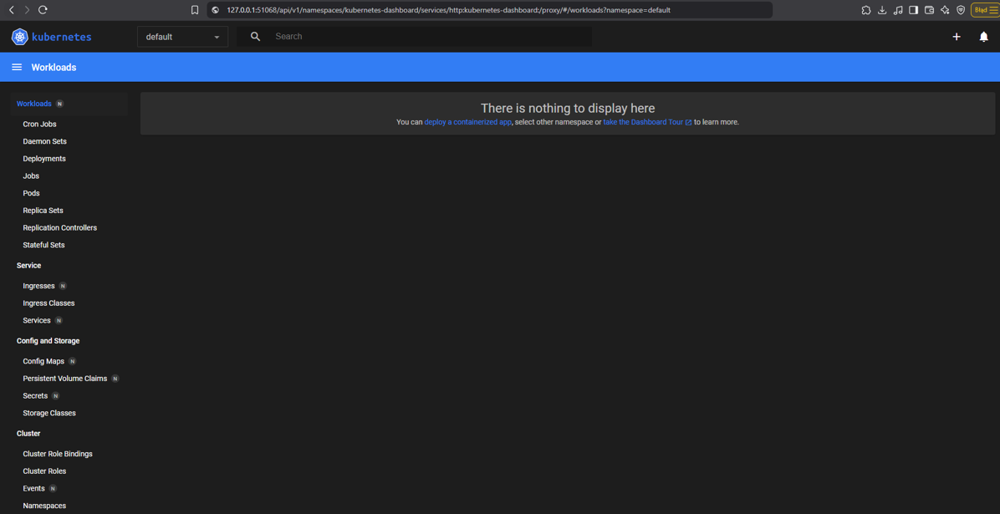
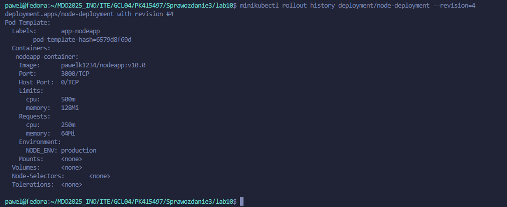
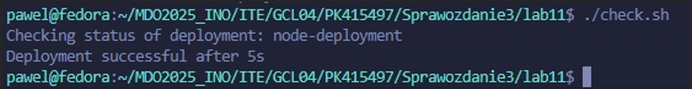

## Laboratorium 8

Stworzenie nowej maszyny, ustawienie podanej nazwy użytkownika oraz nazwy hosta podczas instalacji


Instalacja Ansible


Wystartowanie serwera SSH


Ponowana instalacja i ponowienie powyższych kroków ze względu na to, że obie maszyny miały ten sam adres IP,
zmienienie karty sieciowej na mostkowaną kartę sieciową dla maszyny ansible-target


Dodanie do pliku /etc/hosts na głównej maszynie IP maszyny ansible-target i aliasu, połączenie się do maszyny przez SSH bez podawania IP


Wyeksportowanie maszyny


Ustalenie przewidywalnych nazw komputerów


Wysłanie pingu do wszystkich maszyn za pomocą stworzonego pliku inwentaryzacji
```
Orchestrators:
  hosts:
    master:
      ansible_user: pawel
      ansible_connection: local

Endpoints:
  hosts:
    ansible-target:
      ansible_user: ansible
```


Uruchomienie playbooka, który wykonuje polecenia: wysyła ping, aktualizuje pakiety systemowe, restartuje usługi sshd i rngd 
```
---
- name: Restarty
  hosts: Endpoints
  become: yes
  tasks:

    - name: Ping do maszyny (test łączności)
      ansible.builtin.ping:

    - name: Skopiuj plik inwentaryzacji na endpointy
      ansible.builtin.copy:
        src: ./inventory.yml
        dest: /home/ansible/inventory.yml
        owner: ansible
        group: ansible
        mode: '0644'

    - name: Zaktualizuj pakiety systemowe
      ansible.builtin.yum:
        name: '*'
        state: latest
      when: ansible_facts['os_family'] == "RedHat"

    - name: Restartuj usługę sshd
      ansible.builtin.systemd:
        name: sshd
        state: restarted
        enabled: yes

    - name: Restartuj usługę rngd
      ansible.builtin.systemd:
        name: rngd
        state: restarted
        enabled: yes

```


Uruchomienie playbooka, który instaluje Dockera, pobiera opublikowany obraz z DockerHuba, uruchamia kontener, a następnie go zatrzymuje oraz usuwa

```
---
- name: Deploy Docker container on endpoints
  hosts: Endpoints
  become: yes
  tasks:

    - name: Install Docker
      package:
        name: docker
        state: present

    - name: Ensure Docker service is running
      systemd:
        name: docker
        state: started
        enabled: yes


    - name: Pull the Docker image from Docker Hub
      docker_image:
        name: pawelk1234/nodeapp
        source: pull


    - name: Run the Docker container
      docker_container:
        name: nodeapp
        image: pawelk1234/nodeapp:latest
        state: started
        restart_policy: unless-stopped
        ports:
          - "3000:3000"


    - name: Wait for the container to be ready
      wait_for:
        host: localhost
        port: 3000
        delay: 5
        timeout: 30

    - name: Verify that the application is running
      uri:
        url: http://localhost:3000
        method: GET
        status_code: 200


    - name: Stop and remove the container
      docker_container:
        name: nodeapp
        state: absent

```


Analogiczne uruchomienie, tym razem playbooki są zgodne z architekturą ansible-galaxy

deploy_docker.yml:
```
- name: Deploy Docker container on endpoints
  hosts: Endpoints
  become: yes
  vars:
    docker_image_name: "pawelk1234/nodeapp"
    docker_image_tag: "latest"
    docker_container_name: "nodeapp"
    host_port: "3000"
    container_port: "3000"
  roles:
    - deploy_container
```

tasks/main.yml:
```
---
- name: Install Docker
  package:
    name: docker
    state: present

- name: Ensure Docker service is running
  systemd:
    name: docker
    state: started
    enabled: yes

- name: Pull the Docker image from Docker Hub
  docker_image:
    name: "{{ docker_image_name }}"
    source: pull

- name: Run the Docker container
  docker_container:
    name: "{{ docker_container_name }}"
    image: "{{ docker_image_name }}:{{ docker_image_tag }}"
    state: started
    restart_policy: unless-stopped
    ports:
      - "{{ host_port }}:{{ container_port }}"

- name: Wait for the container to be ready
  wait_for:
    host: localhost
    port: "{{ container_port }}"
    delay: 5
    timeout: 30

- name: Verify that the application is running
  uri:
    url: http://localhost:{{ container_port }}
    method: GET
    status_code: 200

- name: Stop and remove the container
  docker_container:
    name: "{{ docker_container_name }}"
    state: absent
```

defaults/main.yml:
```
defaults/main.yml:
docker_image_name: "pawelk1234/nodeapp"
docker_image_tag: "latest"
docker_container_name: "nodeapp"
host_port: "3000"
container_port: "3000"
```


## Laboratorium 9

Skopiowanie pliku odpowiedzi na głownej maszynie i nadanie kopii odpowiendich uprawnień


Dodanie odpowiednich repozytoriów, skonfigurowanie czystego dysku, zapewnienie formatowania dysku, ustawienie nazwy hosta


Po wprowadzeniu ISO dokonanie modyfikacji parametrów startowych w GRUB poprzez dodanie odpowiedniego parametru ks, wskazującego na plik odpowiedzi, plik został wypchnięty wcześniej na zdalne repozytorium


Uruchomiony system po instalacji, z użytkownikiem i hasłem z pliku odpowiedzi


Plik Kickstart instaluje Fedorę, dodaje repozytoria, pakiety Docker, wget, curl, konfiguruje sieć. W sekcji %post uruchamia Dockera, dodaje użytkownika"pawel" do grupy Docker, pobiera i uruchamia kontener pawelk1234/nodeapp:latest, tworzy serwis systemd, otwiera port 3000 w firewallu. Na koniec restartuje system i uruchamia środowisko produkcyjne bez interakcji.

```
# Generated by Anaconda 41.35
# Generated by pykickstart v3.58
#version=DEVEL

# Keyboard layouts
keyboard --vckeymap=us --xlayouts='us'
# System language
lang en_US.UTF-8

repo --name=fedora --baseurl=http://download.fedoraproject.org/pub/fedora/linux/releases/41/Everything/x86_64/os/
repo --name=updates --baseurl=http://download.fedoraproject.org/pub/fedora/linux/updates/41/Everything/x86_64/

%packages
@^server-product-environment
wget
curl
docker

%end

# Run the Setup Agent on first boot
firstboot --enable
skipx

# Generated using Blivet version 3.11.0
ignoredisk --only-use=sda
autopart
# Partition clearing information
clearpart --all  --initlabel
autopart

# System timezone
timezone Europe/Warsaw --utc

network --hostname=non-localhost

# Root password
rootpw --iscrypted --allow-ssh $y$j9T$rCIkYXX7i./4tV/vedaVXS3p$70lp/BwTtk4OAqfOGIrW6hna6E9CfdzaN35gqPhWBbB
user --groups=wheel --name=pawel --password=$y$j9T$k2.Yr0rehrIUuR5kCz/50aYl$Gg46.NQ49JSWjF6mx/g5PF5GjP2fxzzeE4lTJzR4YL. --iscrypted --gecos="pawel"


%post --log=/root/post-install.log --interpreter=/bin/bash

echo "Docker"
systemctl enable docker
systemctl start docker
usermod -aG docker pawel

echo "Deploy container"
docker pull pawelk1234/nodeapp:latest

cat <<EOF > /etc/systemd/system/nodeapp.service
[Unit]
Description=Node.js Application Container
Requires=docker.service
After=docker.service

[Service]
Restart=always
ExecStart=/usr/bin/docker run --rm -p 3000:3000 --name nodeapp pawelk1234/nodeapp:latest
ExecStop=/usr/bin/docker stop nodeapp

[Install]
WantedBy=multi-user.target
EOF

systemctl enable nodeapp.service
firewall-cmd --add-port=3000/tcp --permanent
firewall-cmd --reload

echo "deployment complete."
%end

reboot
```


## Laboratorium 10

Instalacja minikube zgodnie z dokumentacją, za pomocą RPM


Uruchomienie minikube z ustawioną opcją driver na Dockera


Dodanie aliasu dla ułatwienia


Uruchomienie dashboarda, vscode automatycznie robi forwarding portu




Uruchomienie konteneru z obrazu naszej apki, wyświetlenie poda i jego statusu


Pod z kontenerem jest uruchomiony


Aplikacja działająca na porcie 3000


### Plik wdrożenia - deploy.yaml
Plik yaml definiuje Deployment dla aplikacji Node.js w Kubernetes. Deployment nazywa się node-deployment i ma 4 repliki podów, które mają etykiety app: nodeapp i stage: production. Pody używają obrazu pawelk1234/nodeapp:latest, nasłuchują na porcie 3000 oraz ustawiają zmienną środowiskową NODE_ENV na production. Kontenery mają zdefiniowane minimalne zasoby 64Mi pamięci, 250m CPU oraz maksymalne limity 128Mi pamięci, 500m CPU. Polityka restartu jest ustawiona na Always, co oznacza, że pody będą zawsze restartowane po zakończeniu pracy.
```
apiVersion: apps/v1
kind: Deployment
metadata:
  name: node-deployment
  labels:
    app: node
    environment: production

spec:
  replicas: 4
  selector:
    matchLabels:
      app: nodeapp
  template:
    metadata:
      labels:
        app: nodeapp
    spec:
      restartPolicy: Always
      containers:
      - name: nodeapp-container
        image: pawelk1234/nodeapp:latest
        ports:
          - containerPort: 3000
            protocol: TCP
        env:
          - name: NODE_ENV
            value: "production"
        resources:
          requests:
            memory: "64Mi"
            cpu: "250m"
          limits:
            memory: "128Mi"
            cpu: "500m"
```
Wdrożenie podów za pomocą naszego pliku


Uruchomione pody pojawiły się na dashboardzie


Sprawdzenie statusu i wyeksportowanie wdrożenia jako serwis


Przekierowanie portu do serwisu


## Laboratorium 11

### Nowy obraz
wersja latest - z pipeline'u

:v2.0 - druga wersja, poprawna

:v10.0 - wadliwy obraz, w którym w polu command ustawiono ["/bin/false"]


Zaktualizowano odpowiednio plik deploy.yaml z poprzednich labów

Zwiększenie liczby replik do 8


Zmniejszenie liczby replik do 1


Zmniejszenie liczby replik do 0


Przeskalowanie do 4 replik


Zastosowanie wersji obrazu :v2.0


Powrót do starszej wersji obrazu


Zastosowanie obrazu wadliwego :v10.0


Sprawdzenie historii wdrożeń dla deploymentu node oraz przywrócenie poprzedniej wersji tego deploymentu





Napisanie skryptu check.sh sprawdzającego czy wdrożyło się w czasie 60 sekund
```
#!/bin/bash

TARGET_DEPLOY="node-deployment"
NS="default"
MAX_WAIT=60
CHECK_INTERVAL=5
ELAPSED_TIME=0

echo "Checking status of deployment: $TARGET_DEPLOY"


while [ $ELAPSED_TIME -lt $MAX_WAIT ]; do
    if minikube kubectl -- rollout status deployment/$TARGET_DEPLOY --namespace $NS --timeout=5s > /dev/null 2>&1; then
        echo "Deployment successful after ${ELAPSED_TIME}s"
        exit 0
    fi

    sleep $CHECK_INTERVAL
    ELAPSED_TIME=$((ELAPSED_TIME + CHECK_INTERVAL))
    echo "Retrying in ${CHECK_INTERVAL}s..."
done

echo "Timeout reached after $MAX_WAIT seconds"
exit 1

```

Weryfikacja działania skryptu




### Recreate, Rolling update

Strategia Recreate polega na usunięciu istniejących podów przed utworzeniem nowych, co powoduje przerwę w dostępności aplikacji


Strategia RollingUpdate pozwala na stopniowe aktualizowanie aplikacji, usuwając i tworząc pody równocześnie, zapewniając ciągłość działania aplikacji


Canary Deployment to strategia, która polega na wprowadzaniu nowych wersji aplikacji do małej części użytkowników, zanim zostaną wdrożone na całym środowisku produkcyjnym. Dzięki temu, można testować nową wersję na ograniczonej liczbie podów, minimalizując ryzyko wystąpienia problemów. 

canary1.yaml:
```
apiVersion: apps/v1
kind: Deployment
metadata:
  name: nodeapp-canary
  labels:
    role: nodeapp
    stage: canary
spec:
  replicas: 1
  selector:
    matchLabels:
      role: nodeapp
      stage: canary
  template:
    metadata:
      labels:
        role: nodeapp
        stage: canary
    spec:
      containers:
        - name: nodeapp-container
          image: pawelk1234/nodeapp:latest
          ports:
            - containerPort: 3000
```


canary2.yaml:
```
apiVersion: apps/v1
kind: Deployment
metadata:
  name: nodeapp-production
  labels:
    role: nodeapp
    stage: stable
spec:
  replicas: 3
  selector:
    matchLabels:
      role: nodeapp
      stage: stable
  template:
    metadata:
      labels:
        role: nodeapp
        stage: stable
    spec:
      containers:
        - name: nodeapp-container
          image: pawelk1234/nodeapp:v2.0
          ports:
            - containerPort: 3000
```

Ten manifest definiuje stabilne wdrożenie aplikacji, uruchamiając trzy repliki kontenera nodeapp:v2.0. Pody są oznaczone etykietami role: nodeapp i stage: stable, co pozwala łatwo rozróżnić wersje. Stabilna wersja obsługuje główny ruch, zapewniając ciągłość działania aplikacji, podczas gdy testowa wersja działa na ograniczonej liczbie replik, minimalizując ryzyko.

my_service.yaml:
```
apiVersion: v1
kind: Service
metadata:
  name: nodeapp-service
spec:
  selector:
    role: nodeapp
  ports:
    - port: 80
      targetPort: 3000
  type: ClusterIP
```
Plik my_service.yaml definiuje zasób Service dla aplikacji Node.js w Kubernetes. Zasób ten nazywa się nodeapp-service i będzie wykorzystywał selektor role: nodeapp, aby dopasować odpowiednie pody. W sekcji ports definiowane są porty: ruch przychodzący na porcie 80 jest przekierowywany na port 3000 kontenerów. Typ usługi to ClusterIP, co oznacza, że usługa będzie dostępna tylko wewnątrz klastra Kubernetes.


