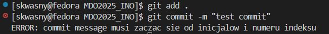
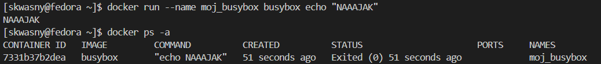
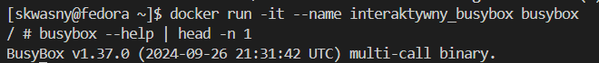

# Lab 1
## Git hook commit-msg:
Treść:
```
#!/bin/bash

PREFIX="SK417309"

COMMIT_MSG_FILE=$1
COMMIT_MSG=$(head -n 1 "COMMIT_MSG_FILE")

if [[ ! "$COMMIT_MSG" =~ ^$PREFIX ]];
  echo "ERROR: commit message musi zaczac sie od inicjalow i numeru indeksu"
  exit 1
fi

exit 0
```
Sprawdzenie działania:


# Lab 2
## Kontener z obrazu busybox'a

Efekt uruchomienia:


Numer wersji busyboxa:



