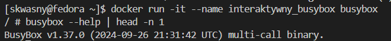

# Sprawozdanie 1
|Imię | Nazwisko | Numer indeksu | Kierunek | Grupa | Data |
| --------| -----| -----| ------| -----| ------|
|Szczepan | Kwaśny | 417309 | ITE | 4 | 31.03.2025|
## Lab 1
### Przygotowanie maszyny wirtualnej
Przed pierwszymi zajęciami pobrałem przygotowany przez prowadzącego obraz dystrubucji Linuxa - Fedora. Instalację przeprowadziłem w środowisku graficznym programu Oracle VirtualBox, z uwagi na brak Hyper-V w zainstalowanej na moim komputerze dystrybucji Windowsa 11 - Home.  
Następnie, już podczas konfiguracji Fedory, wybrałem ustawienia dla serwera - bez interfejsu graficznego i z zainstalowanym protokołem Secure Shell. Po zalogowaniu się na stworzonego użytkownika, sprawdziłem działanie ssh:
  
Utworzyłem dwa klucze, innego typu niż RSA:
  
Uruchomiłem agenta ssh i dodałem utworzone klucze:

Następnie klucz publiczny dodałem do GitHuba, żebym mógł się łączyć bezpośrednio z serwera poprzez ssh i sprawdziłem jego poprawność:

Sklonowałem repozytorium przedmiotowe za pomocą klucza SSH. Następnie z gałęźi dla mojej grupy 'GCL04', utworzyłem własną gałąź, o nazwie odpowiadającej założeniom inicjałów i numeru indeksu: 'SK417309' za pomocą polecania:
`git checkout -b 'SK417309'`


### Git hook commit-msg:
Na mojej gałęzi utworzyłem skrypt gita, który weryfikuje, żeby każdy commit rozpoczynał się od moich inicjałów i numeru indeksu (SK417309):

Treść:
```
#!/bin/bash

PREFIX="SK417309"

COMMIT_MSG_FILE=$1
COMMIT_MSG=$(head -n 1 "COMMIT_MSG_FILE")

if [[ ! "$COMMIT_MSG" =~ ^$PREFIX ]];
  echo "ERROR: commit message musi zaczac sie od inicjalow i numeru indeksu"
  exit 1
fi

exit 0
```
Sprawdzenie działania:


## Lab 2
### Przygotowanie Docker'a
Zainstalowałem oprogramowanie Docker na serwerze za pomocą komendy:  
`sudo dnf install -y docker`  
Pobrałem obrazy: hello-world, busybox, ubuntu, mysql. Każdy za pomocą   
`docker pull [nazwa obrazu]`
### Kontener z obrazu busybox'a

Efekt uruchomienia:


Numer wersji busyboxa:


### System w kontenerze
Wybrałem obraz Ubuntu do stworzenia "systemu w kontenerze".  Uruchomiłem kontener w trybie interaktywnym i sprawdziłem procesy:  

Następnie próbowałem wyświetlić procesy Docker'a na serwerze, ale przy użyciu znanych mi opcji komendy `ps`, nie mogłem się dostać do żadnego powiązanego z Dockerem. Wysłałem zapytanie do modelu OpenAI, ChatGPT 4o odnośnie tego problemu. Dokładny prompt: "Jak wyświetlić procesy Dockera na hoście?", po którym dostałem podobną odpowiedź do moich wcześniejszych prób, więc napisałem kolejny prompt: "ps aux nie zwrócił żadnych, a Docker na pewno działa. Jak to rozwiązać?". W odpowiedzi dostałem próbę komendy `ps -ef`, więc sprawdizłem w dokumentacji Linuxa, tę opcję i postanowiłem z niej skorzystać. To co dostałem po odfiltrowaniu procesów:

Następnie zaaktualizowałem pakiety i wyszedłem z kontenera.   

### Własny Dockerfile

Stwórzyłem własny Dockerfile na podstawie dobrych praktyk. Aby mieć pewność, że obraz będzie miał zainstalowanego git-a, wybrałem obraz Ubuntu, który testował prowadzący na zajęciach. Poniżej treść pliku Dockerfile:
```
FROM ubuntu:latest

# Ustawienie autora obrazu (dobra praktyka)
LABEL maintainer="skwasny@student.agh.edu.pl"

RUN apt update && apt upgrade -y && apt install -y git

WORKDIR /app

RUN git clone https://github.com/InzynieriaOprogramowaniaAGH/MDO2025_INO.git /app/repo

CMD ["/bin/bash"]
```

Uruchomiłem Dockerfile i sprawdziłem czy repozytorium zostało pobrane:

Następnie sprawdziłem wszystkie uruchomione obrazy Dockera i wszystkie wyczyściłem:


## Lab 3
### Wybór oprogramowania
Do pracy na zajęciach wybrałem własne repozytorium z aplikacją napisaną w języku Java (wersja 17+) wraz z jej środowiskiem Makefile, którym w tym przypadku jest Maven. Sklonowałem to repozytorium, a następnie przeprowadziłem build oraz test programu za pomocą komend  
`mvn clean package`  
`mvn test`.

### Przeprowadzenie buildu w kontenerze
Kolejnym krokiem była automatyzacja budowania oraz testowania za pomocą przygotowania Dockerfile'a z odpowiednimi krokami.  
Do zbudowania własnego obrazu wykorzystałem eclipse-temurin-17, który zawiera OpenJDK oraz Gita. Następnie ustawiłem katalog roboczy na '/app', sklonowałem wybrane repozytorium oraz wykonuje komendę `mvn clean package` do zbudowania projektu.  
Treść Dockerfile.build:
```
FROM maven:3.9-eclipse-temurin-17 AS build

WORKDIR /app

RUN git clone https://github.com/sauer515/teacher-management.git .

RUN mvn clean package

CMD ["bash"]
```

Efekt uruchomienia Dockerfile.build:
  

Do zbudowania obrazu dla testów uzyłem jako bazy obrazu do budowania. Po ustawieniu katalogu roboczego, uruchamiane są testy za pomocą komendy `mvn test`.
Treść Dockerfile.test:
```
FROM myapp-build AS test

WORKDIR /app

CMD ["mvn", "test"]
```
Efekt uruchomienia Dockerfile.test:


Raport z testów:


Dodatkowo ująłem oba Dockerfile w kompozycję za pomocą docker-compose.yml:
```
services:
  build:
    container_name: build-container
    build:
      context: .
      dockerfile: Dockerfile.build
    tty: true

  test:
    container_name: test-container
    build:
      context: .
      dockerfile: Dockerfile.test
    depends_on:
      - build
    tty: true
```

## Lab 4

### Przygotowanie wolumenów
Najpierw stworzyłem dwa puste woluminy na dane wejściowe i wyjściowe:


Następnie wykorzystałem tymczasowy kontener pomocniczy, na którym jest zainstalowany git.


Następnie przygotowałem Dockerfile do budowy kontenera na podstawie lekkiej wersji eclipse-temurin-alpine, która nie ma zainstalowanego gita. Aby móc na nim pracować, pobrałem na niego środowisko Makefile maven. Uruchomiłem kontener w trybie interaktywnym, sprawdziłem zawartość oraz czy maven się poprawnie zainstalował:

Na kontener skopiowałem repozytorium z woluminu wejściowego, a paczkę JAR skopiowałem na wolumin wyjściowy.


### Serwer iperf

Następnie uruchomiłem kontener, który będzie służyć jako serwer iperf3 za pomocą komendy `docker run -dit --rm --name iperf-server -p 5201:5201 networkstatic/iperf3 -s`, która ustawia domyślny port na 5201 i uruchamia kontener jako serwer '-s'.

Uruchomiłem klienta na innym kontenerze, jednak były one na innej sieci, więc operacja nie powiodła się. Stworzyłem sieć mostkową za pomocą komendy: `docker network create --driver bridge sk417309_default` i uruchomiłem na niej obrazy. Połączyłem się za pomocą nazwy:

Sprawdizłem połączenie do hosta:


### Instancja Jenkins
Stworzyłem sieć do komunikacji z Jenkinsem: `docker network create jenkins`.
Następnie uruchomiłem kontener DIND: `docker run --rm -d \
  --name dind \
  --privileged \
  --network jenkins \
  -v dind-storage:/var/lib/docker \
  docker:dind`
  Gdzie --privileged daje pełny dostęp do systemu dla Dockera, --network ustawia sieć komunikacyjną na stworzony jenkins, a wolumin -v dind-storage przechowuje dane po restarcie.  
  Następnie uruchomiłem kontener i otworzyłem UI Jenkinsa na porcie 8080. Pobrałem dane do logowania: `docker logs jenkins | grep "Initial Admin Password"`
  Następnie wszedłem w przeglądarce na odpowiedni przekierowany port i udało mi się dostać do UI Jenkinsa:
  

