# Sprawozdanie 2
|Imię | Nazwisko | Numer indeksu | Kierunek | Grupa | Data |
| --------| -----| -----| ------| -----| ------|
|Szczepan | Kwaśny | 417309 | ITE | 4 | 31.03.2025|
## Lab 5
### Przygotowanie Jenkinsa
Po zapoznaniu się z dokumentacją Jenkinsa stworzyłem sieć 'jenkins' do komunikacji i przygotowałem obraz Blueocean na podstawie Jenkinsa oraz Docker-In-Docker, za pomocą komend zdefiniowanych w dokumentacji. Do utworzenia obrazu Blueocean, najpierw utworzyłem plik Dockerfile:
```
FROM jenkins/jenkins:2.492.3-jdk21
USER root
RUN apt-get update && apt-get install -y lsb-release ca-certificates curl && \
    install -m 0755 -d /etc/apt/keyrings && \
    curl -fsSL https://download.docker.com/linux/debian/gpg -o /etc/apt/keyrings/docker.asc && \
    chmod a+r /etc/apt/keyrings/docker.asc && \
    echo "deb [arch=$(dpkg --print-architecture) signed-by=/etc/apt/keyrings/docker.asc] \
    https://download.docker.com/linux/debian $(. /etc/os-release && echo \"$VERSION_CODENAME\") stable" \
    | tee /etc/apt/sources.list.d/docker.list > /dev/null && \
    apt-get update && apt-get install -y docker-ce-cli && \
    apt-get clean && rm -rf /var/lib/apt/lists/*
USER jenkins
RUN jenkins-plugin-cli --plugins "blueocean docker-workflow"
```
A następnie zbudowałem go komendą:
```
docker run \
  --name jenkins-blueocean \
  --restart=on-failure \
  --detach \
  --network jenkins \
  --env DOCKER_HOST=tcp://docker:2376 \
  --env DOCKER_CERT_PATH=/certs/client \
  --env DOCKER_TLS_VERIFY=1 \
  --publish 8080:8080 \
  --publish 50000:50000 \
  --volume jenkins-data:/var/jenkins_home \
  --volume jenkins-docker-certs:/certs/client:ro \
  myjenkins-blueocean:2.492.3-1 
```
* --name jenkins-blueocean  
Nadaje kontenerowi  nazwę, dzięki czemu łatwiej będzie nim zarządzać (start/stop/logs).

* --restart=on-failure  
Automatycznie restartuje kontener tylko w przypadku awarii (wyjście z kodem różnym od zera).

* --detach (-d)  
Uruchamia kontener w tle, zwracając od razu kontrolę nad terminalem.

* --network jenkins  
Dołącza kontener do stworzonej wcześniej sieci "jenkins", co umożliwia mu komunikację z kontenerem DIND.

* --env DOCKER_HOST=tcp://docker:2376  
Ustawia zmienną środowiskową wskazującą na adres demona Docker (w naszym przypadku kontener „docker” w sieci jenkins).

* --env DOCKER_CERT_PATH=/certs/client  
Wskazuje ścieżkę w kontenerze do certyfikatów TLS, używanych do bezpiecznego połączenia z demonem.

* --env DOCKER_TLS_VERIFY=1  
Włącza weryfikację certyfikatów TLS przy łączeniu z demona Dockera.

* --publish 8080:8080 (-p)  
Mapuje port 8080 wewnątrz kontenera (interfejs webowy Jenkins) na port 8080 hosta.

* --publish 50000:50000  
Mapuje port 50000 wewnątrz kontenera (port komunikacji z agentami Jenkins) na port 50000 hosta.

* --volume jenkins-data:/var/jenkins_home  
Tworzy trwały wolumen jenkins-data i montuje go jako katalog domowy Jenkins (/var/jenkins_home), co zabezpiecza dane przed utratą po restarcie kontenera.

* --volume jenkins-docker-certs:/certs/client:ro  
Montuje wolumen z certyfikatami TLS w trybie tylko do odczytu (ro), potrzebnymi do zabezpieczenia połączenia z demonem Docker.

* myjenkins-blueocean:2.492.3-1  
Nazwa obrazu, na podstawie którego uruchamiamy kontener (nasz własny build Jenkins + Blue Ocean + Docker‑in‑Docker CLI).

Kontener DIND uruchomiłem za pomocą komendy z dokumentacji:
```
docker run \
  --name jenkins-docker \
  --rm \
  --detach \
  --privileged \
  --network jenkins \
  --network-alias docker \
  --env DOCKER_TLS_CERTDIR=/certs \
  --volume jenkins-docker-certs:/certs/client \
  --volume jenkins-data:/var/jenkins_home \
  --publish 2376:2376 \
  docker:dind \
  --storage-driver overlay2
  ```
  * --publish 2376:2376  
   Mapuje port na wcześniej zdefiniowany do komunikacji z kontenerem Jenkinsa

   Po włączeniu obu kontenerów wszedłem na interfejs webowy Jenkinsa na porcie 8080:
   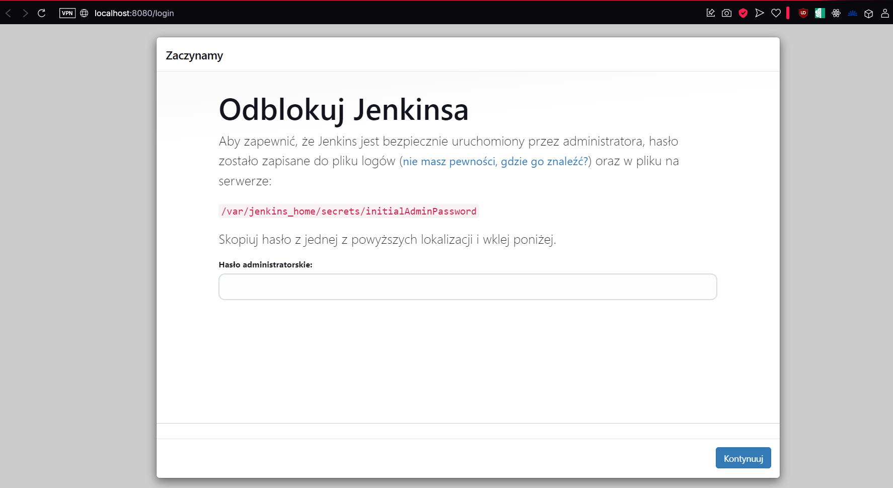
   Aby się zalogować, znalazłem w logach hasło za pomocą `docker logs jenkins | grep "Initial Admin Password"`. Następnie przeprowadziłem instalację odpowiednich wtyczek i utworzyłem użytkownika.
   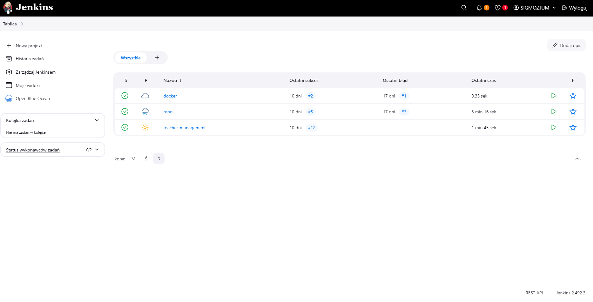
   ### Zadania wstępne
   * Projekt z `uname`
    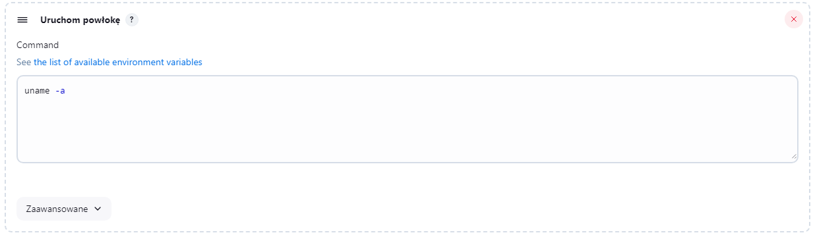
    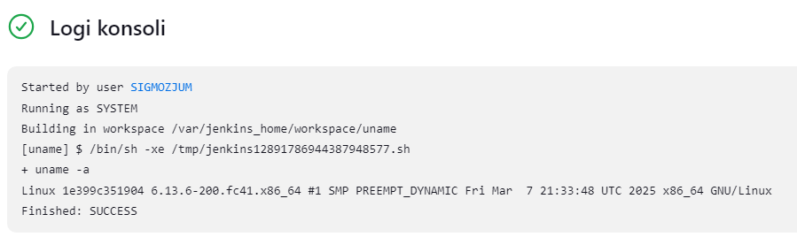
   * Skrypt do zwracania błędu, jeśli godzina jest nieparzysta:
   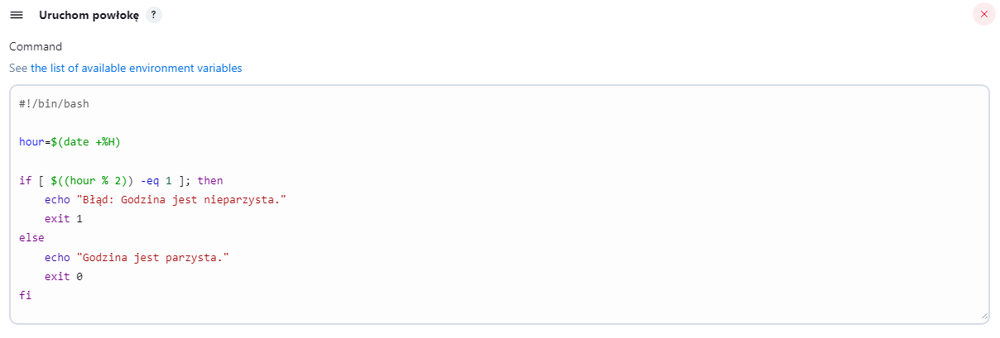
   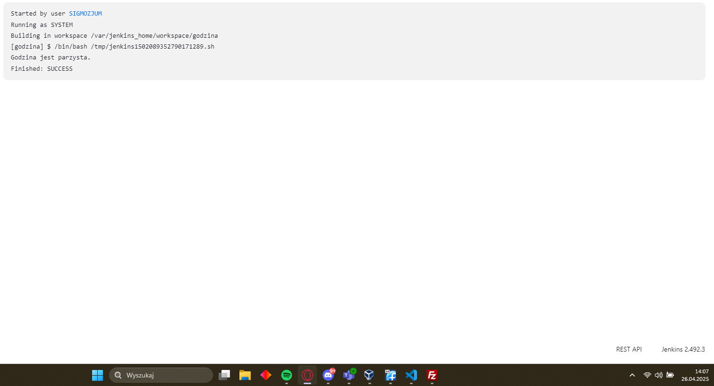
   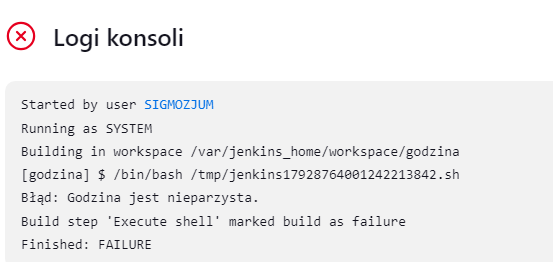
   * Obiektu typu pipeline bez SCM, który miał sklonować repozytorium przedmiotowe, a następnie przeprowadzić checkout do mojego pliku Dockerfile na własnej gałęzi:
   ```
   pipeline {
    agent any

    stages {
        stage('clone') {
            steps {
                sh 'rm -rf MDO2025_INO'
                sh 'git clone https://github.com/InzynieriaOprogramowaniaAGH/MDO2025_INO.git MDO2025_INO'
            }
        }
        stage('checkout') {
            steps {
                sh '''
                    cd MDO2025_INO
                    git checkout SK417309
                    cd ITE/GCL04/SK417309
                '''
            }
        }
        stage('build docker') {
            steps {
                sh '''
                    cd MDO2025_INO/ITE/GCL04/SK417309
                    docker build -f Dockerfile.build -t moj-builder .
                '''
            }
        }
    }
}
```
Aby zagwarantować czyste środowisko i powtarzalność dla tego pipeline'a, trzebo go rozpocząć od wyczyszczenia ewentualnych pozostałości w folderze, do którego pozniej kopiuje repozytorium. Następnie przeprowadzam w jednym bloku checkout na moją gałąź `SK417309` i przechodzę do folderu z Dockerfile'm do budowy mojego projektu. 
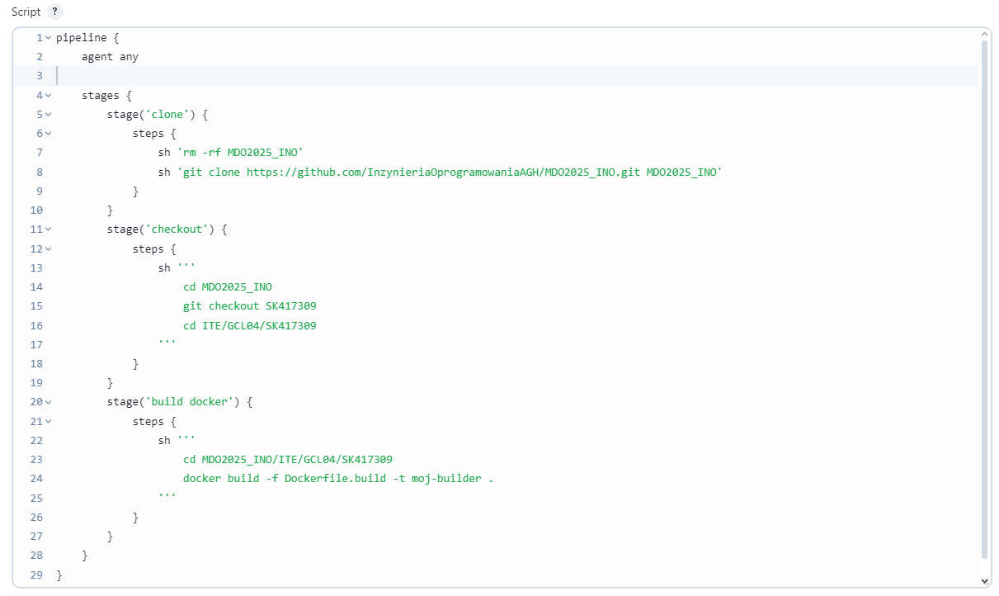
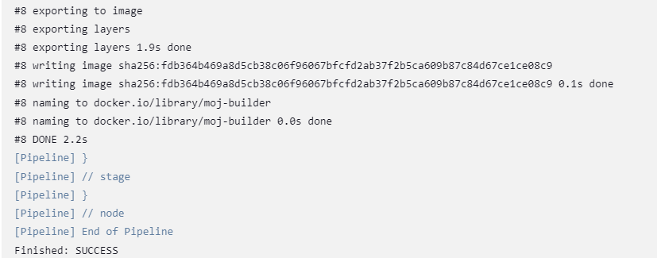

### Jenkinsfile do projektu
Następnym zadanie było przygotowanie pipeline'u do wybranego projektu. Do tego kroku wybrałem swoją aplikację napisaną w Javie (wersja 17+). Do omówienie tego puntku posłużę się listą kontrolną przygotowaną przez prowadzącego przedmiot:
* Licencja, jako iż to moja aplikacja, zezwala na korzystanie w dowolny sposób.
* Program wybrany przeze mnie buduje się, co potwierdza screen użyty w poprzednim sprawozdaniu:
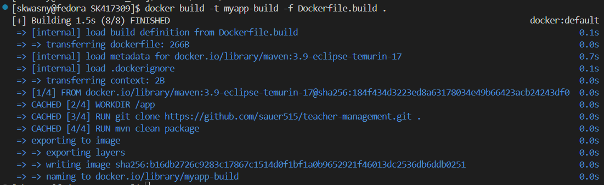  
* Przechodzą dołączone do niego testy:
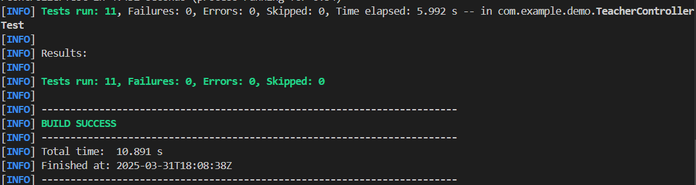
* Fork w tym przypadku nie jest potrzebny, ponieważ pracuję nad własnym projektem, w osobnej gałęzi, bezpośrednio na oryginalnym repo (SK417309), zamiast kopi w innym miejscu.
* UML TO DO
* Wybrałem odpowiedni kontener bazowy zawierający wszystkie potrzebne zależności do zbudowania aplikacji - eclipse-temurin. 
* Wykonałem build wewnątrz wersjonowanego kontenera zdefiniowanego na podstawie `Dockerfile.build`. 